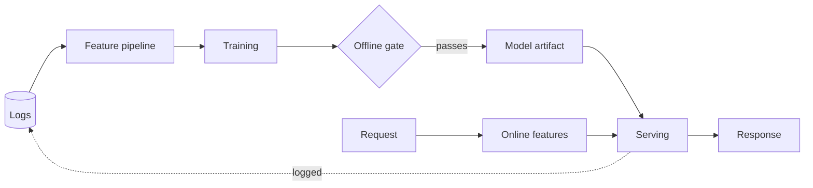

# NN - Topic title

<!--
  Copy to topics/NN-your-slug.md, then delete every HTML comment in this file.
  NN is the next free two-digit number; keep it in the filename and the H1.
  Target length is 400 to 900 lines. Nine sections, in this order, no others:
  an interviewer follows this arc, and the repo's value is that every topic
  answers in the same shape.
-->

**The question, as an interviewer poses it:** "..."

<!--
  Write it the way it is actually said out loud, symptom first: "our GPU bills are
  climbing and p99 is bad under load, walk me through it." Not "explain the KV
  cache." The whole topic is the answer to this one sentence.
-->

One paragraph on what makes this question hard, and the entry point that makes the
rest of the answer follow. Name the one quantity everything else derives from.

## 1. Clarify and scope

<!--
  Four to eight questions. Each one either removes work or changes the design; if
  the answer changes nothing, cut the question. Give the answer you will design
  against so the rest of the topic has fixed numbers to use.
-->

- **Question?** Assumed answer, and what it rules out.

## 2. Requirements

**Functional**

- ...

**Non-functional** (the ones with numbers: latency target, QPS, corpus size, budget)

- ...

**Out of scope**

- ...

## 3. High-level data flow

Two paths, always both. Almost every failure in this book lives in the seam between
them, so draw them separately before you draw anything else.

### Offline (training) path

Where the labels come from, how the features are built, what the training set is, and
what gates the model before it ships.

### Online (serving) path

What happens per request, in what latency budget, reading which features from where.

**The one thing to state explicitly:** the features on both paths are built by the same
logic, or the model serves on a distribution it never trained on.

<!-- Mermaid line breaks are  , never \n. Quote any label containing a comma. -->

## 4. Deep dives

<!--
  Three to five subsections, one per component that carries real signal. This is
  where the topic earns its length. Each subsection: what the component does, the
  one formula or number that governs it, the options, and what each option costs.
-->

### 4.1 Component

The governing arithmetic, with units:

$$
\text{cost} = \text{something} \times \text{something}
$$

<!--
  Math renders through GitHub's KaTeX: use \ast not *, \lt not <, \text{} not
  \operatorname{}, and escape a literal dollar amount as \$5,000 so it does not
  pair with a real inline-math delimiter.
-->

| Option | When to use | What it costs |
|---|---|---|
| | | |

## 5. Bottlenecks and scaling

What breaks first as load grows, and the order in which you would fix it. Give the
number at which each becomes the bottleneck.

## 6. Failure modes, safety, and eval

How it fails, how you would know, and what you measure to prove it works. Prefer
metrics that can be computed online without labels.

## 7. Likely follow-ups

- **"..."** The short answer, with the tradeoff named.

## Seen in production

<!--
  First-party engineering writeups only, and each bullet in exactly this shape, or
  tools/build.mjs cannot parse it into the case indexes:

  - **Company** [Title of the writeup](https://url) - what it illustrates.

  After adding one, run `node tools/build.mjs`.
-->

- **Company** [Title](https://example.com) - what this one illustrates.

## Trace the architectures

<!--
  Link the relevant model as a live graph rather than a picture, if one applies.
  The set lives at https://github.com/neurarch-ai/awesome-llm-model-zoo and includes
  the recsys and tabular architectures (DLRM, DeepFM, SASRec, BERT4Rec, GraphSAGE).
-->

## Related deep-dive drills

Rapid-fire questions that probe what is underneath this topic, from
[deep-dives.md](../deep-dives.md):

- [Section name](../deep-dives.md#section-anchor)
