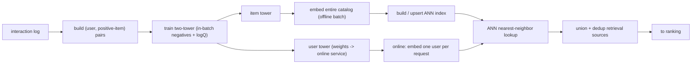
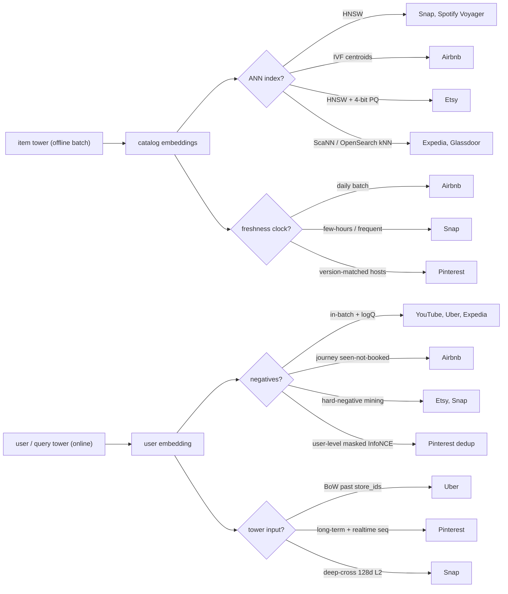
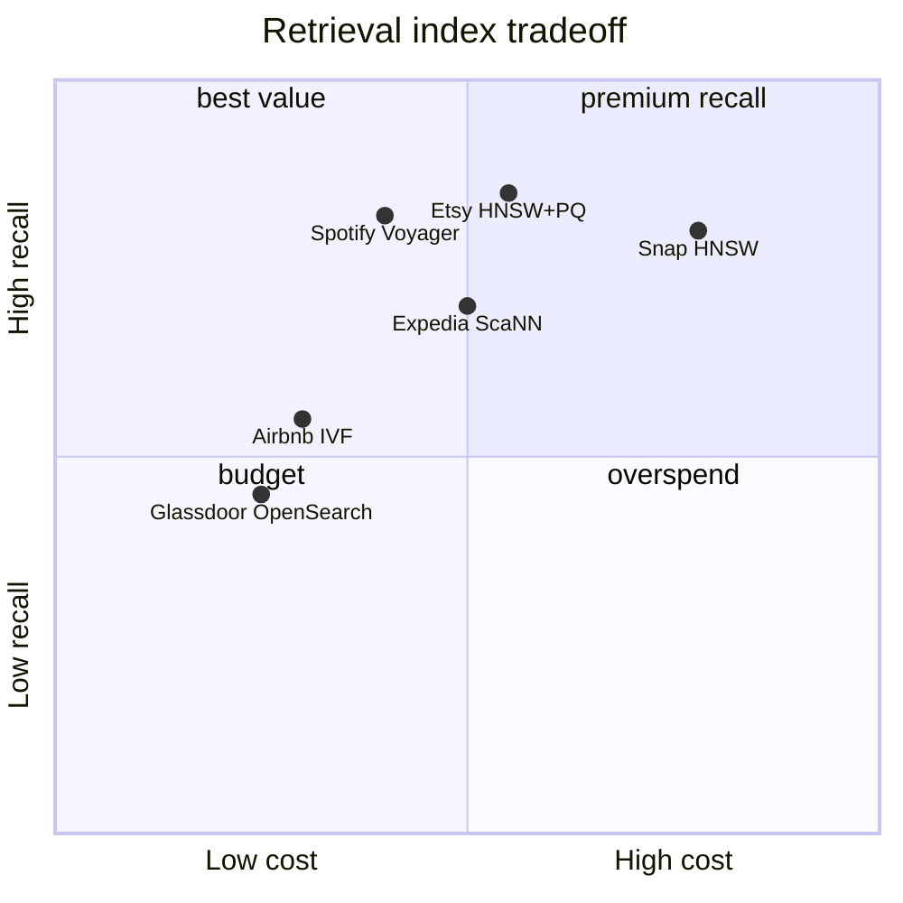

**What they share.** Every system is one two-tower skeleton: an offline item tower embeds the whole catalog into an ANN index, and only the user/query tower runs online, emitting one vector for a single nearest-neighbor lookup before ranking. The real budget goes to two choices: which negatives to train against, and how to keep the index fresh and fast.

**The reference pipeline.** Strip away the product differences and every writeup here walks the same nine stages, from mining pairs out of the log to unioning candidate sources before ranking. The two-tower training loop and the offline-embed / online-lookup split are fixed; the systems below differ only in what they plug into the shaded stages.

**Reading the diagram.** The pipeline starts at the interaction log, where you mine (user, positive-item) pairs, and the first real decision is which co-occurrences count as a positive: Airbnb treats a seen-not-booked listing inside a search journey as the informative signal rather than any random impression. Those pairs feed the two-tower training loop, whose central failure mode is popularity bias from in-batch negatives, which YouTube and Expedia correct with a logQ term subtracted from the logits so the head is not unfairly penalized. Training then forks into two towers: the item tower runs offline to embed the entire catalog as a batch job and upserts those vectors into an ANN index, while the user tower's weights ship to the online service to embed one user per request. The index-build stage is where most of the systems engineering lives, since choosing HNSW (Snap, Spotify Voyager), IVF centroids (Airbnb), or HNSW with 4-bit product quantization (Etsy) trades recall against memory and rebuild cost under each catalog's churn rate. At serving time the single online user vector meets the offline catalog index at the ANN nearest-neighbor lookup, the one place the two towers finally join, which is exactly why any early feature crossing is forbidden upstream. The freshness clock is the quiet leverage point: a new item stays invisible until it is re-embedded and the index is upserted, so Airbnb's daily batch versus Snap's few-hours refresh are product decisions about item churn, not implementation trivia. Finally the union-and-dedup stage blends the personalized tower with popularity and fresh-item sources before ranking, a reminder that retrieval is a recall-maximizing ensemble whose leverage sits in the negatives and the index, not in the tower architecture everyone already shares.

**The choices, side by side.**

| Decision | Options (who chooses each) | What decides it |
| --- | --- | --- |
| Negative sampling | `in-batch+logQ` (YouTube, Uber, Expedia) vs `journey seen-not-booked` (Airbnb) vs `hard-neg` (Etsy, Snap) vs `masked InfoNCE` (Pinterest) vs `random+mixed` (Glassdoor, Twitter) | Popularity bias vs boundary sharpness |
| ANN index | `HNSW` (Snap, Spotify) vs `IVF` (Airbnb) vs `HNSW+4-bit PQ` (Etsy) vs `ScaNN/OpenSearch` (Expedia, Glassdoor) | Update rate, filters, memory budget |
| Freshness / serving | `daily batch` (Airbnb) vs `few-hours split services` (Snap) vs `versioned hosts` (Pinterest) vs `stateless in-memory K8s` (Spotify) | Item churn vs deploy safety |
| Tower input | `BoW past store_ids` (Uber) vs `PinnerSage + realtime seq` (Pinterest) vs `deep-cross 128d L2` (Snap) vs `unified graph+text+term` (Etsy) | Cold-start, model size, intent recency |

**The math that separates them.**

**In-batch softmax loss**
$$L = -\frac{1}{B}\sum_{i=1}^{B} \log \frac{e^{ s(x_i,y_i)}}{\sum_{j=1}^{B} e^{ s(x_i,y_j)}}$$

**logQ-corrected logit (YouTube, Expedia)**
$$s^{c}(x_i,y_j) = u(x_i)^{\top} v(y_j) - \log Q(y_j)$$

**Temperature-scaled cosine InfoNCE (Snap)**
$$\cos(u,v) = \frac{u^{\top} v}{\lVert u\rVert \lVert v\rVert}, \qquad L = -\frac{1}{B}\sum_{i=1}^{B} \log \frac{e^{\cos(u_i,v_i)/\tau}}{\sum_{j=1}^{B} e^{\cos(u_i,v_j)/\tau}}$$

**User-level masked InfoNCE (Pinterest dedup)**
$$L_i = -\log \frac{e^{s(x_i,y_i)}}{e^{s(x_i,y_i)} + \sum_{j \in \mathcal{N}_i} e^{s(x_i,y_j)}}, \qquad \mathcal{N}_i = \lbrace j : u_j \neq u_i \rbrace$$

**Dot vs Euclidean, magnitude matters (Airbnb)**
$$u^{\top}v = \lVert u\rVert \lVert v\rVert\cos\theta, \qquad \lVert u-v\rVert^{2} = \lVert u\rVert^{2} + \lVert v\rVert^{2} - 2 u^{\top}v$$

**IVF scan cost, the recall/latency knob (Airbnb)**
$$C_{\text{scan}} \approx \text{nprobe} \cdot \frac{N}{n_{\text{cells}}}, \qquad \text{recall and latency both rise with nprobe}$$

**Index bytes, full vs 4-bit PQ (Etsy)**
$$\text{bytes}_{\text{full}} = N d\cdot 4, \qquad \text{bytes}_{\text{PQ}} = N m\cdot\tfrac{4}{8}$$

**When to use which.** Match the negative-sampling loss and the index to the catalog, not to a default:

| Reach for | When | Instead of |
|---|---|---|
| In-batch softmax with logQ correction (YouTube, Expedia) | Catalog is popularity-skewed and you want the embedding space itself unbiased | Raw in-batch negatives that penalize head items |
| Journey seen-not-booked positives (Airbnb) | The log has intent-rich sessions where a skip is a real signal | Random impressions treated as positives |
| Hard-negative mining (Etsy, Snap) | Easy negatives stopped teaching and boundary cases decide quality | Only in-batch negatives |
| User-level masked InfoNCE (Pinterest) | Request-sorted or user-concentrated batches push the false-negative rate toward 30% | Plain softmax that scores a user's own items as negatives |
| Temperature-scaled cosine InfoNCE (Snap) | Embedding magnitudes vary and you want angle-only similarity | Raw dot product where the norm leaks into the score |
| HNSW index (Snap, Spotify) | Catalog is stable, memory is available, and top recall per latency matters | IVF when you have no hard filters or heavy churn |
| IVF centroids (Airbnb) | Items churn on price and availability and geo filters must run cheap (recall and latency both rise with nprobe) | HNSW whose rebuild cost cannot absorb the updates |
| HNSW with 4-bit product quantization (Etsy) | The index must fit memory at large N (PQ bytes are a fraction of full-precision) | Full-precision vectors that blow the memory budget |
| Daily batch freshness (Airbnb) | Item churn is slow and deploy safety beats minutes-old vectors | Few-hours or streaming refresh (Snap) you do not need |

**Interview watch-outs.**

- **Do the towers share weights?** The reflex answer is "yes, to save parameters." Wrong: users and items have different feature distributions, so the towers stay separate; the only thing they share is the output embedding space, enforced by the dot-product loss. Uber sharing a UUID embedding layer is the deliberate exception, not the rule.
- **Where does the logQ correction go?** People say "rerank the ANN results by subtracting log popularity at serving." Wrong: logQ is subtracted from the logits during training so the embedding space itself is unbiased; serving stays a plain dot-product / cosine lookup with no correction term.
- **Why not add cross features for accuracy?** Candidates reach for "concatenate user and item early and push through an MLP." Wrong for retrieval: any early crossing makes the score depend on the user, which kills offline precompute and ANN. Early crossing is ranking's job (NCF, cross networks); retrieval must keep the join at a final dot product.
- **Is high offline recall enough to ship?** The trap is treating recall@k as the decision metric. Right answer: retrieval recall@k is a ceiling on everything downstream, so you measure it in isolation, but offline recall and online engagement do not always move together (Glassdoor saw 40-60% offline versus +5% online), so you gate on an A/B test too.
- **Bigger batch means more free negatives, so always scale it?** Wrong: request-sorted or user-concentrated batches push the in-batch false-negative rate from near 0% to about 30% (Pinterest), because a user's own engaged items show up as "negatives." The fix is user-level masking of same-user candidates, not simply more batch.
- **Is HNSW always the right index?** Candidates default to "HNSW, best recall/latency." Wrong when the catalog churns hard or needs filters: Airbnb chose IVF because HNSW's rebuild cost could not absorb price/availability updates and geo filters ran poorly over graph traversal; IVF turns a filter into cheap cluster selection. Match the index to update rate, filtering, and memory, not to a default.
