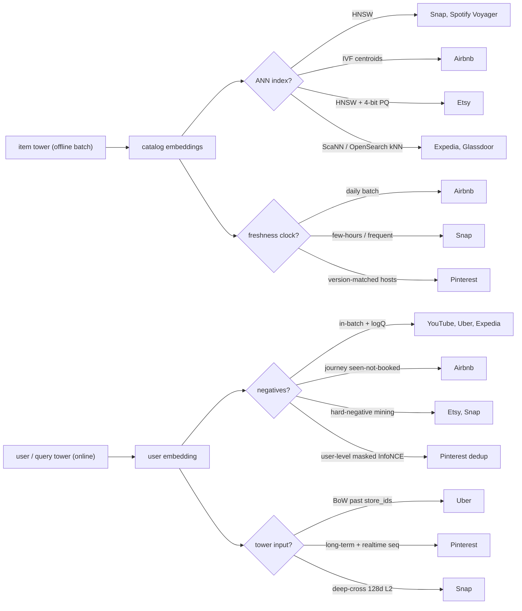
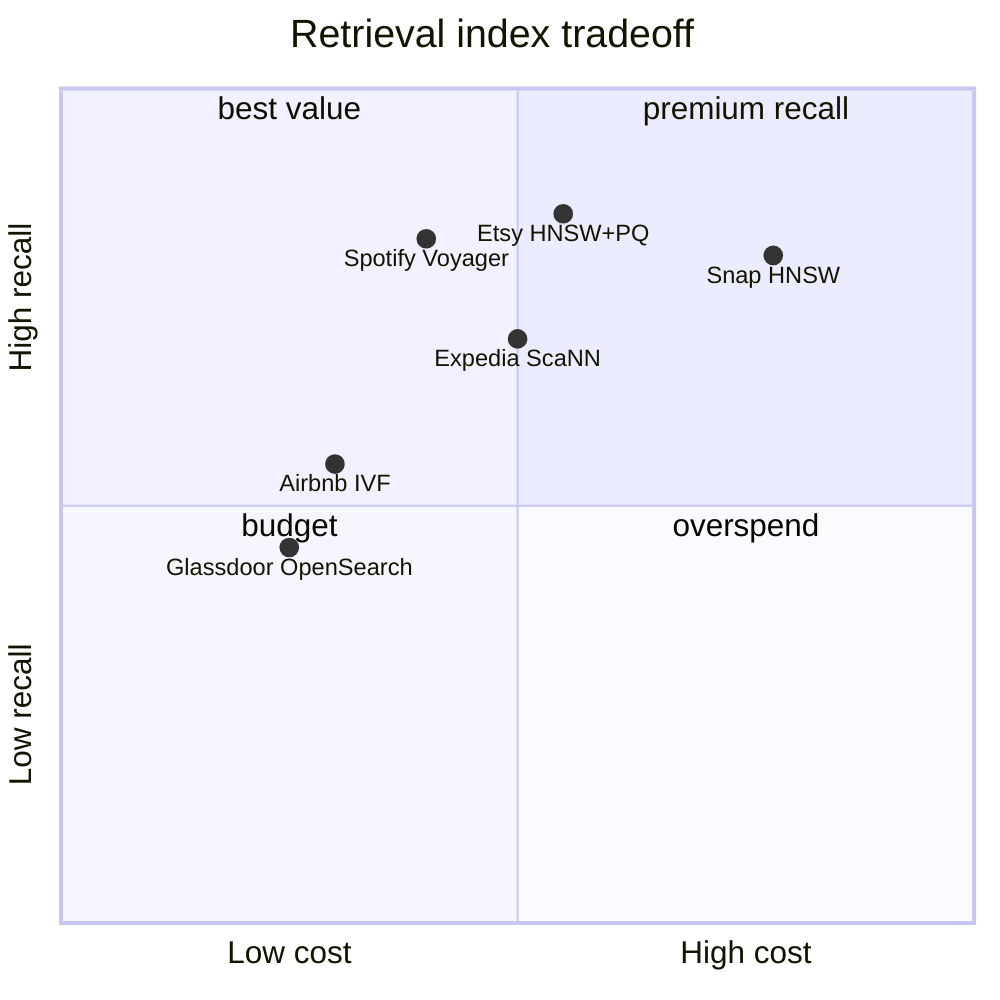

**What they share.** Every system is one two-tower skeleton: an offline item tower embeds the whole catalog into an ANN index, and only the user/query tower runs online, emitting one vector for a single nearest-neighbor lookup before ranking. The real budget goes to two choices: which negatives to train against, and how to keep the index fresh and fast.

**The choices, side by side.**

| Decision | Options (who chooses each) | What decides it |
| --- | --- | --- |
| Negative sampling | `in-batch+logQ` (YouTube, Uber, Expedia) vs `journey seen-not-booked` (Airbnb) vs `hard-neg` (Etsy, Snap) vs `masked InfoNCE` (Pinterest) vs `random+mixed` (Glassdoor, Twitter) | Popularity bias vs boundary sharpness |
| ANN index | `HNSW` (Snap, Spotify) vs `IVF` (Airbnb) vs `HNSW+4-bit PQ` (Etsy) vs `ScaNN/OpenSearch` (Expedia, Glassdoor) | Update rate, filters, memory budget |
| Freshness / serving | `daily batch` (Airbnb) vs `few-hours split services` (Snap) vs `versioned hosts` (Pinterest) vs `stateless in-memory K8s` (Spotify) | Item churn vs deploy safety |
| Tower input | `BoW past store_ids` (Uber) vs `PinnerSage + realtime seq` (Pinterest) vs `deep-cross 128d L2` (Snap) vs `unified graph+text+term` (Etsy) | Cold-start, model size, intent recency |

**The math that separates them.**

**In-batch softmax loss**
$$L = -\frac{1}{B}\sum_{i=1}^{B} \log \frac{e^{ s(x_i,y_i)}}{\sum_{j=1}^{B} e^{ s(x_i,y_j)}}$$

**logQ-corrected logit (YouTube, Expedia)**
$$s^{c}(x_i,y_j) = u(x_i)^{\top} v(y_j) - \log Q(y_j)$$

**Dot vs Euclidean, magnitude matters (Airbnb)**
$$u^{\top}v = \lVert u\rVert \lVert v\rVert\cos\theta, \qquad \lVert u-v\rVert^{2} = \lVert u\rVert^{2} + \lVert v\rVert^{2} - 2 u^{\top}v$$

**Index bytes, full vs 4-bit PQ (Etsy)**
$$\text{bytes}_{\text{full}} = N d\cdot 4, \qquad \text{bytes}_{\text{PQ}} = N m\cdot\tfrac{4}{8}$$

