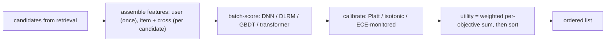
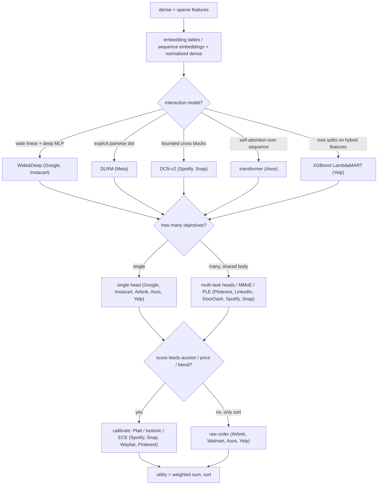
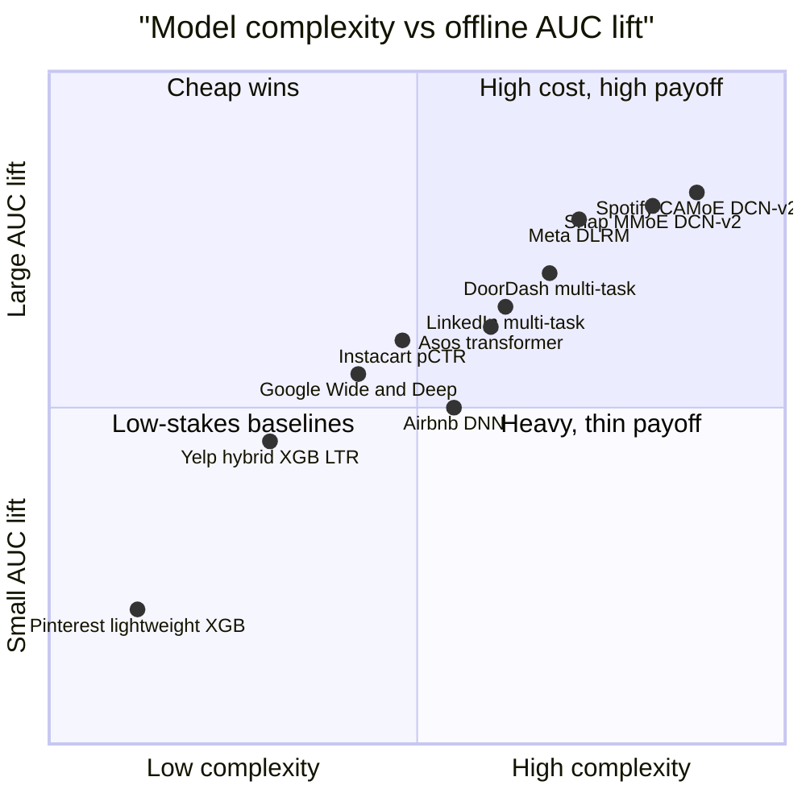

**What they share.** Every ranker assembles dense numeric features beside sparse ids that pass through embeddings (or a sequence of item embeddings), scores candidates inside a hard latency budget, then either calibrates and blends per-objective scores into a utility or sorts on raw order. What differs is only how interactions are modeled, how many objectives are optimized, and whether the score feeds an auction.

**The reference pipeline.** Strip the branding and every system runs the same skeleton: retrieval hands over a few hundred candidates, features are assembled once for the shared user context and per candidate for item and cross signals, one model batch-scores the set, a post-hoc step calibrates the raw outputs, and a utility combination sorts the list. The interesting engineering is only where each system spends its compute along this spine.

**The choices, side by side.**

| Decision | Options (who) | What decides it |
| --- | --- | --- |
| interaction model | `DLRM` (Meta) vs `DeepFM`/`FM` (Instacart) vs `DCN-v2` (Spotify, Snap) vs `Wide&Deep` (Google) vs `self-attention transformer` (Asos) vs `GBDT LambdaMART` (Yelp) vs `MLP` (Pinterest, LinkedIn, DoorDash, Airbnb) | Cross structure and signal shape: explicit dot products when sparse ids dominate, bounded cross blocks to skip hand-crafting, self-attention when order and session context carry the signal, trees when hybrid content plus interaction features must combine for tail coverage |
| multi-task | `single` (Google, Instacart, Airbnb, Asos, Yelp) vs `shared-bottom` (Pinterest, LinkedIn, DoorDash) vs `MMoE/PLE` (Spotify, Snap) | Count of distinct outcomes and how negatively correlated they are; gating and towers hedge task conflict, single head fits one objective |
| calibration | `implicit/none` (Google, DLRM, Airbnb, LinkedIn, Walmart, Asos, Yelp) vs `Platt/logistic per head` (Pinterest, Snap) vs `isotonic/monotonic` (Wayfair, Snap) vs `ECE-monitored` (Spotify) | Whether a raw score feeds an auction, price, or cross-task blend; if it only sorts, order is enough and calibration is skipped |
| model-family path | `native DNN` (Meta, Google, Snap) vs `GBDT then DNN` (Airbnb) vs `tree then MT-DNN` (DoorDash) vs `leaves into DNN` (LinkedIn) vs `MF then transformer` (Asos) vs `MF then GBDT LTR` (Yelp) vs `lightweight XGBoost early` (Pinterest) | Maturity of the prior baseline and funnel position; migrate off matrix factorization when tail coverage or sequence signal is left on the table, bridge trees via leaves, or stay light at the top of the funnel |

**The math that separates them.**

$$z = \text{concat}\Big(x_{dense},\ \lbrace \ \langle e_i,\ e_j\rangle\ :\ i<j\ \rbrace \Big)$$

$$x_{l+1} = x_0 \odot (W_l x_l + b_l) + x_l$$

$$\mathrm{Attention}(Q,K,V) = \text{softmax}\Big(\frac{Q K^{\top}}{\sqrt{d_k}}\Big) V, \qquad U = \sum_{t} w_t \hat p_t$$

$$\mathrm{ECE} = \sum_{b=1}^{B} \frac{n_b}{N} \big| \mathrm{acc}(b) - \mathrm{conf}(b) \big|, \qquad \mathrm{bid} = v \cdot \hat p$$

The multi-task body optimizes a weighted sum of per-head log losses, so one gradient signal trains every objective and the head weights $w_k$ trade off how much each outcome counts:

$$L = \sum_{k=1}^{K} w_k \Big( -\frac{1}{N} \sum_{i=1}^{N} \big[ y_{ik} \log \hat p_{ik} + (1 - y_{ik}) \log (1 - \hat p_{ik}) \big] \Big)$$

The learning-to-rank systems (Airbnb, Yelp) do not minimize per-item loss at all; the LambdaMART gradient between a more-relevant item $i$ and a less-relevant item $j$ is scaled by the ranking-metric change from swapping them, so pairs that move NDCG most get the largest pull:

$$\lambda_{ij} = \frac{-\sigma}{1 + \exp\big(\sigma (s_i - s_j)\big)} \big| \Delta \mathrm{NDCG}_{ij} \big|$$

The MMoE/PLE rankers (Spotify, Snap) route a shared expert pool through per-task softmax gates, so each objective $k$ mixes the experts $f_i$ its own way before its tower $h_k$, which is what softens conflict between negatively correlated tasks:

$$g^k(x) = \text{softmax}(W_k x), \qquad y_k = h_k\Big( \sum_{i=1}^{n} g^k(x)_i f_i(x) \Big)$$

**Interview watch-outs.** The traps that sink ranking answers, with the wrong reflex and the correction:

- **Where the interaction sits.** Trap: "the deep MLP will learn the crosses." Wrong answer: feed concatenated embeddings straight into a top MLP and call it DLRM. Right answer: take explicit pairwise dot products after the embeddings and bottom MLP, before the top MLP; that structured second-order layer is the whole point, and the bottom MLP output width must equal the embedding dimension or the dot products are undefined.

- **Offline up, online flat.** Trap: treating a higher AUC as a ship signal. Wrong answer: promote the model because the offline metric moved. Right answer: suspect the training-to-serving seam first (feature skew, label leakage via non-point-in-time joins, position bias, or an offline metric that does not match the online objective), then gate on an A/B test on the business metric.

- **Calibration versus ordering.** Trap: assuming a good ranker gives good probabilities. Wrong answer: send raw scores into an auction or a cross-task blend. Right answer: ordering is enough only when you just sort; the moment a score feeds a bid, a threshold, or a weighted utility, add a post-hoc Platt or isotonic step and monitor ECE, because negative sampling and stratified training both distort the base rate.

- **Multi-task as a free win.** Trap: adding heads always helps. Wrong answer: share one body across weakly or negatively correlated objectives and expect every task to improve. Right answer: shared representation helps correlated tasks, but conflict can let one drown another, so split towers or use MMoE/PLE gating and watch per-task metrics; and keep the utility weights outside the loss so the business can retune without retraining.

- **Id embeddings everywhere.** Trap: an embedding table for every categorical, including item id. Wrong answer: learn per-listing id embeddings when each id has a handful of labels (Airbnb: a listing books at most about 365 times a year). Right answer: id embeddings need dense repeated exposure; for sparse-per-id or churning-vocabulary settings, lean on content, context, and hashing, and warm-start often so fresh ids do not go out-of-vocabulary.

- **Latency treated as an afterthought.** Trap: pick the architecture, then worry about serving. Wrong answer: score each candidate through a full monolithic tower. Right answer: state the budget out loud (say 500 candidates in about 20 ms, well under 0.1 ms each) and design backward: batch the forward pass, compute the shared user tower once and reuse it across candidates, and keep the per-candidate cost flat as candidate count grows.
