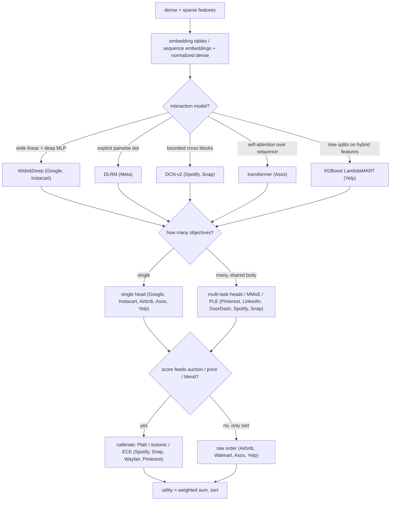
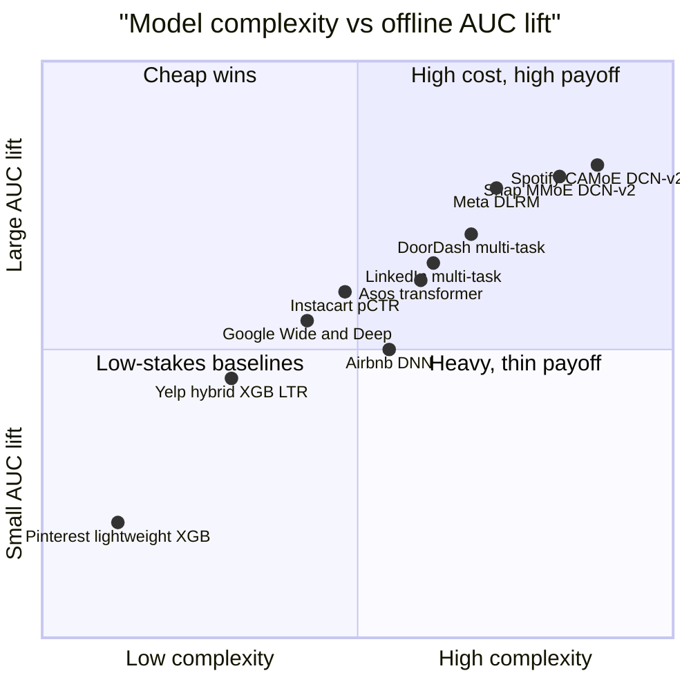

**What they share.** Every ranker assembles dense numeric features beside sparse ids that pass through embeddings (or a sequence of item embeddings), scores candidates inside a hard latency budget, then either calibrates and blends per-objective scores into a utility or sorts on raw order. What differs is only how interactions are modeled, how many objectives are optimized, and whether the score feeds an auction.

**The choices, side by side.**

| Decision | Options (who) | What decides it |
| --- | --- | --- |
| interaction model | `DLRM` (Meta) vs `DeepFM`/`FM` (Instacart) vs `DCN-v2` (Spotify, Snap) vs `Wide&Deep` (Google) vs `self-attention transformer` (Asos) vs `GBDT LambdaMART` (Yelp) vs `MLP` (Pinterest, LinkedIn, DoorDash, Airbnb) | Cross structure and signal shape: explicit dot products when sparse ids dominate, bounded cross blocks to skip hand-crafting, self-attention when order and session context carry the signal, trees when hybrid content plus interaction features must combine for tail coverage |
| multi-task | `single` (Google, Instacart, Airbnb, Asos, Yelp) vs `shared-bottom` (Pinterest, LinkedIn, DoorDash) vs `MMoE/PLE` (Spotify, Snap) | Count of distinct outcomes and how negatively correlated they are; gating and towers hedge task conflict, single head fits one objective |
| calibration | `implicit/none` (Google, DLRM, Airbnb, LinkedIn, Walmart, Asos, Yelp) vs `Platt/logistic per head` (Pinterest, Snap) vs `isotonic/monotonic` (Wayfair, Snap) vs `ECE-monitored` (Spotify) | Whether a raw score feeds an auction, price, or cross-task blend; if it only sorts, order is enough and calibration is skipped |
| model-family path | `native DNN` (Meta, Google, Snap) vs `GBDT then DNN` (Airbnb) vs `tree then MT-DNN` (DoorDash) vs `leaves into DNN` (LinkedIn) vs `MF then transformer` (Asos) vs `MF then GBDT LTR` (Yelp) vs `lightweight XGBoost early` (Pinterest) | Maturity of the prior baseline and funnel position; migrate off matrix factorization when tail coverage or sequence signal is left on the table, bridge trees via leaves, or stay light at the top of the funnel |

**The math that separates them.**

$$z = \text{concat}\Big(x_{dense},\ \{\ \langle e_i,\ e_j\rangle\ :\ i<j\ \}\Big)$$

$$x_{l+1} = x_0 \odot (W_l\, x_l + b_l) + x_l$$

$$\mathrm{Attention}(Q,K,V) = \text{softmax}\!\Big(\frac{Q K^{\top}}{\sqrt{d_k}}\Big) V, \qquad U = \sum_{t} w_t\, \hat p_t$$

$$\mathrm{ECE} = \sum_{b=1}^{B} \frac{n_b}{N}\,\big|\,\mathrm{acc}(b) - \mathrm{conf}(b)\,\big|, \qquad \mathrm{bid} = v \cdot \hat p$$

