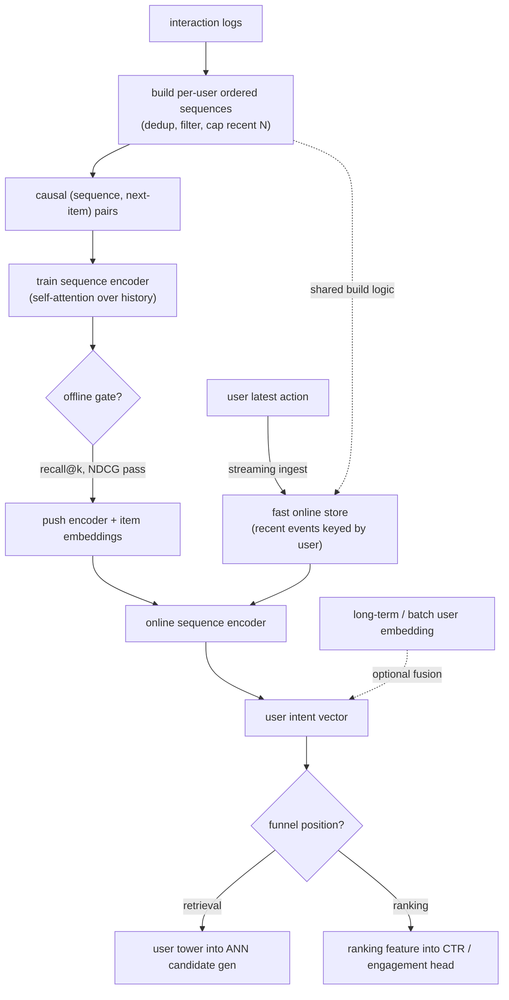
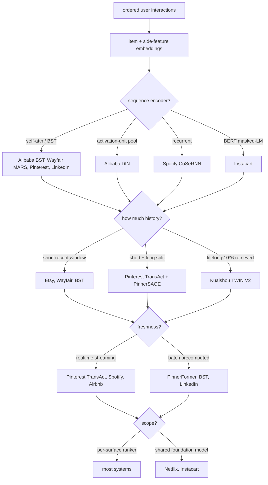
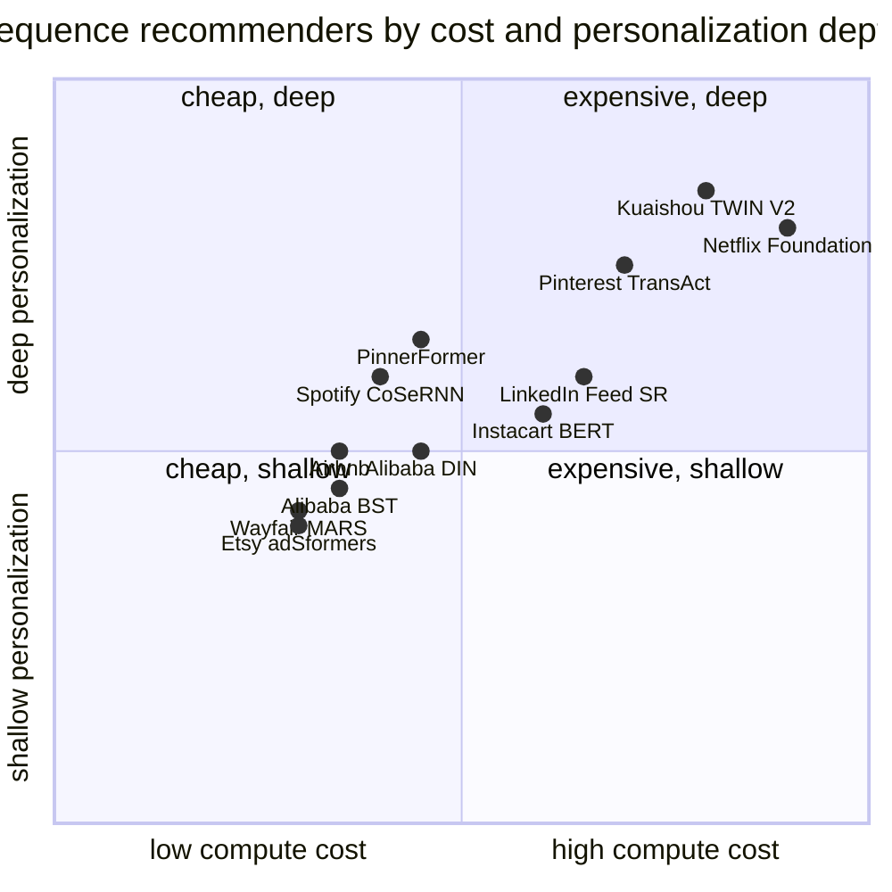

**What they share.** Every system turns an ordered list of user interactions into item plus side-feature embeddings, runs a sequence model that weighs which past actions matter now, and pools the result into one user-intent vector that feeds a ranking head or retrieval tower. They diverge on the encoder, how much history they carry, how fresh the user state is, and whether the model is per-surface or a shared foundation.

**The reference pipeline.** Before the divergence, here is the canonical sequential-recsys skeleton every one of these systems is a variation on: an offline path that builds causal sequences and trains the encoder, and an online path that keeps the sequence fresh through streaming ingest and encodes it per request. The one non-negotiable is that both paths build the sequence with identical logic, or the model serves on a distribution it never trained on.

**Reading the diagram.** Start top-left: raw interaction logs become per-user ordered sequences, where dedup, filtering, and a recent-N cap decide what counts as a user's history, and any inconsistency here is the classic training-serving skew, since the exact same build logic has to feed both the offline pairs and the online store. Those sequences turn into causal (sequence, next-item) pairs and train the self-attention encoder, whose job is to weigh which past actions matter right now instead of averaging them flat, the way Alibaba BST and Pinterest TransAct do. An offline gate on recall-at-k and NDCG decides whether the encoder plus item embeddings ship, so a model that just memorizes popularity rather than intent never reaches serving. On the online side the user's latest action streams into a fast per-user store, and the deployed encoder reads that fresh sequence per request to emit a user intent vector, optionally fused with a slower batch or long-term embedding the way Pinterest splits short and long history. The final fork is funnel position: the same vector either becomes a user tower into ANN candidate generation for retrieval, or a ranking feature into a CTR head, and picking the wrong branch quietly wastes the whole pipeline because the latency budget and the loss differ across the two. The design leverage in this skeleton is freshness under budget, so you cap the sequence, cache the encoded state, and keep one shared sequence-build path, or the deep-history and realtime gains cancel each other out.

**The choices, side by side.**

| Decision | Options (who) | What decides it |
| --- | --- | --- |
| sequence encoder | `self-attn/BST` (Alibaba/Pinterest) vs `DIN pool` vs `RNN/CoSeRNN` vs `BERT` (Instacart) | Whether order matters (attention), whether interest depends on the candidate (DIN pool), whether per-session context dominates (RNN), or whether one bidirectional model must serve many surfaces (BERT) |
| history length | `short window` vs `lifelong TWIN` (Kuaishou) vs `short+long split` (Pinterest) | How much signal lives in the deep past versus the last few actions, traded against the per-request encode budget |
| freshness | `realtime` vs `batch` | Whether same-session reaction is the product value (realtime streaming) or a daily batch vector with an all-action loss recovers most of it cheaply |
| scope | `per-surface` vs `foundation model` | Whether one team owns one ranker, or many surfaces amortize a shared pretrained sequence model (Netflix, Instacart) |

**The math that separates them.**

$$\textbf{attention over history:}\quad z = \sum_{t=1}^{N} \text{softmax}_t\left(\frac{Q K_t^\top}{\sqrt{d}}\right) V_t$$

$$\textbf{time-aware score (recency, not just order):}\quad \alpha_t = \text{softmax}_t\left(\frac{Q K_t^\top}{\sqrt{d}} + \phi(\Delta_t)\right)$$

$$\textbf{target-attn (DIN pool):}\quad v_u(c) = \sum_{t=1}^{N} a(e_t, c)\, e_t \quad\text{(no softmax norm)}$$

$$\textbf{lifelong two-stage (TWIN):}\quad z = \text{ESU}\left(\text{GSU}(c, \lbrace C_k\rbrace ), c\right),\quad \Vert seq \Vert \sim 10^{6}$$

$$\textbf{sampled-softmax retrieval:}\quad \mathcal{L} = -\log \frac{\exp(u^\top v_{+})}{\exp(u^\top v_{+}) + \sum_{j \in \mathcal{N}} \exp(u^\top v_{j})}$$

$$\textbf{all-action loss (PinnerFormer):}\quad \mathcal{L} = \frac{1}{\Vert W \Vert}\sum_{f \in W} \ell(u, v_{f}) \quad\text{(window of future actions, not just t+1)}$$

$$\textbf{NDCG at k:}\quad \text{NDCG}@k = \frac{1}{Z}\sum_{i=1}^{k} \frac{2^{rel_i}-1}{\log_2(i+1)}$$

**Interview watch-outs.**

- **Aggregates lose the signal.** The classic wrong answer is a bag of lifetime category counts, which erases order and recency, the two things that carry intent. A user who just switched from cooking to travel looks identical to a steady cooking fan under counts. Instacart found that shuffling sequence order drops recall 10 to 45%, which is the direct evidence that order is the signal.
- **Attention vs RNN, and why.** Interviewers expect you to justify self-attention over recurrence: it weighs arbitrary past actions directly and parallelizes, without the sequential bottleneck of an RNN. Naming that bottleneck (and that Spotify CoSeRNN accepts it because it only reacts at session granularity) is the point.
- **Position is not time.** Injecting a plain positional index (1st, 2nd, 3rd action) is only half right. Two actions a second apart differ from two a month apart, so strong answers encode the actual time gaps between events so recency is weighted, not just order. This is the single detail most candidates skip.
- **Training-serving skew is the headline failure mode.** The user sequence is built by a batch pipeline offline and a streaming pipeline online; if their dedup, filtering, or tie-ordering of simultaneous events differ, the model serves on a distribution it never trained on. Say explicitly that the construction logic must be shared code, not two implementations.
- **DIN is not a sequence model.** DIN's activation pool deliberately has no softmax normalization (it preserves interest intensity) and ignores order entirely; BST is what adds order. Claiming DIN models sequence order, or that its attention is normalized, is a common and telling miss.
- **Cold start is degradation, not a second model.** A new user degrades down the same model: session-only sequence, then content features over id embeddings, then popularity and context fallback. Also cap sequence length for tail latency on power users, and watch a diversity guardrail for the recency filter-bubble, since that failure never shows up in offline recall.
