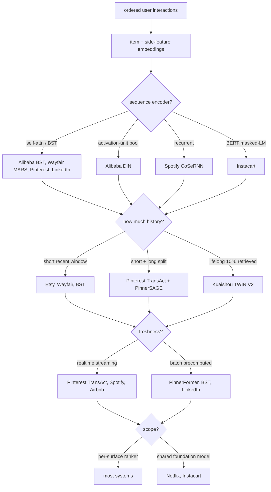
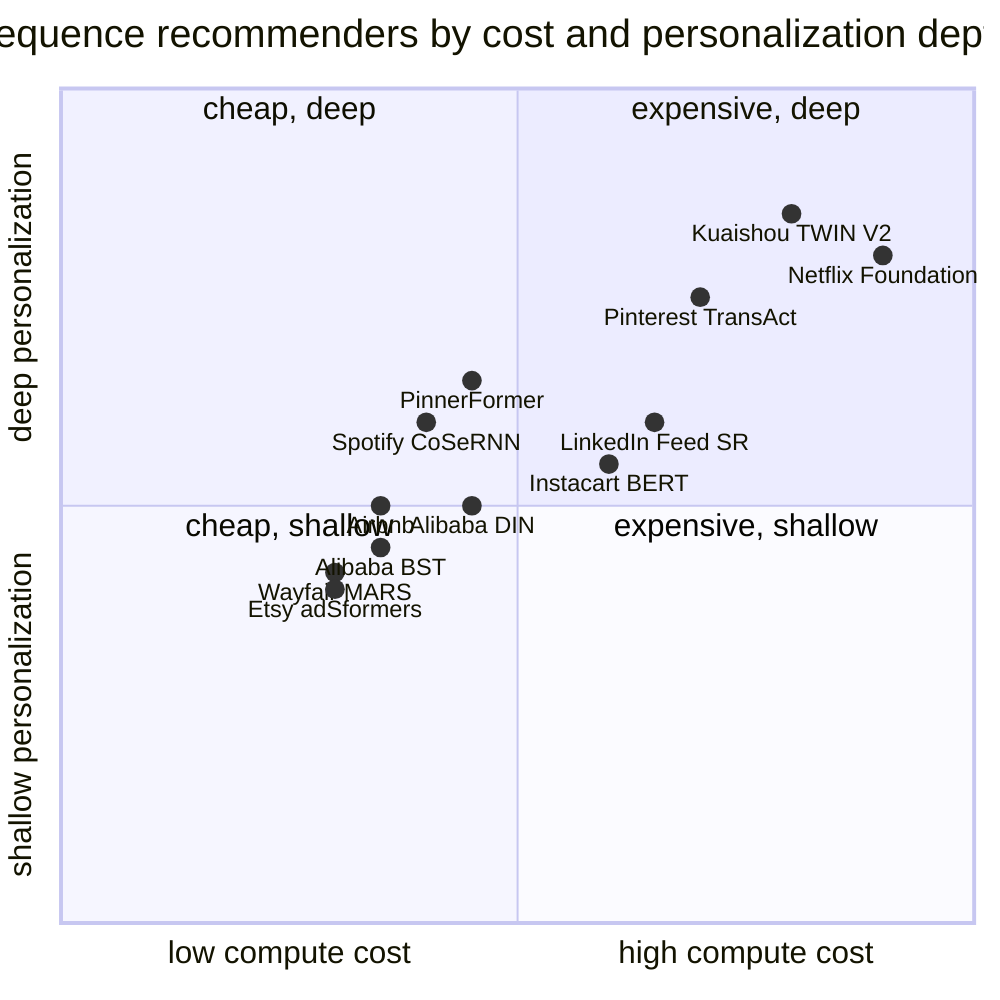

**What they share.** Every system turns an ordered list of user interactions into item plus side-feature embeddings, runs a sequence model that weighs which past actions matter now, and pools the result into one user-intent vector that feeds a ranking head or retrieval tower. They diverge on the encoder, how much history they carry, how fresh the user state is, and whether the model is per-surface or a shared foundation.

**The choices, side by side.**

| Decision | Options (who) | What decides it |
| --- | --- | --- |
| sequence encoder | `self-attn/BST` (Alibaba/Pinterest) vs `DIN pool` vs `RNN/CoSeRNN` vs `BERT` (Instacart) | Whether order matters (attention), whether interest depends on the candidate (DIN pool), whether per-session context dominates (RNN), or whether one bidirectional model must serve many surfaces (BERT) |
| history length | `short window` vs `lifelong TWIN` (Kuaishou) vs `short+long split` (Pinterest) | How much signal lives in the deep past versus the last few actions, traded against the per-request encode budget |
| freshness | `realtime` vs `batch` | Whether same-session reaction is the product value (realtime streaming) or a daily batch vector with an all-action loss recovers most of it cheaply |
| scope | `per-surface` vs `foundation model` | Whether one team owns one ranker, or many surfaces amortize a shared pretrained sequence model (Netflix, Instacart) |

**The math that separates them.**

$$\textbf{attention over history:}\quad z = \sum_{t=1}^{N} \text{softmax}_t\left(\frac{Q K_t^\top}{\sqrt{d}}\right) V_t$$

$$\textbf{target-attn (DIN pool):}\quad v_u(c) = \sum_{t=1}^{N} a(e_t, c) e_t \quad\text{(no softmax norm)}$$

$$\textbf{lifelong two-stage (TWIN):}\quad z = \text{ESU}\left(\text{GSU}(c, \lbrace C_k\rbrace ), c\right),\quad |seq| \sim 10^{6}$$

$$\textbf{NDCG at k:}\quad \text{NDCG}@k = \frac{1}{Z}\sum_{i=1}^{k} \frac{2^{rel_i}-1}{\log_2(i+1)}$$

