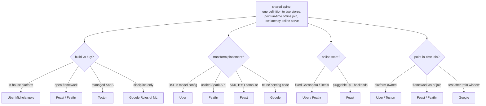
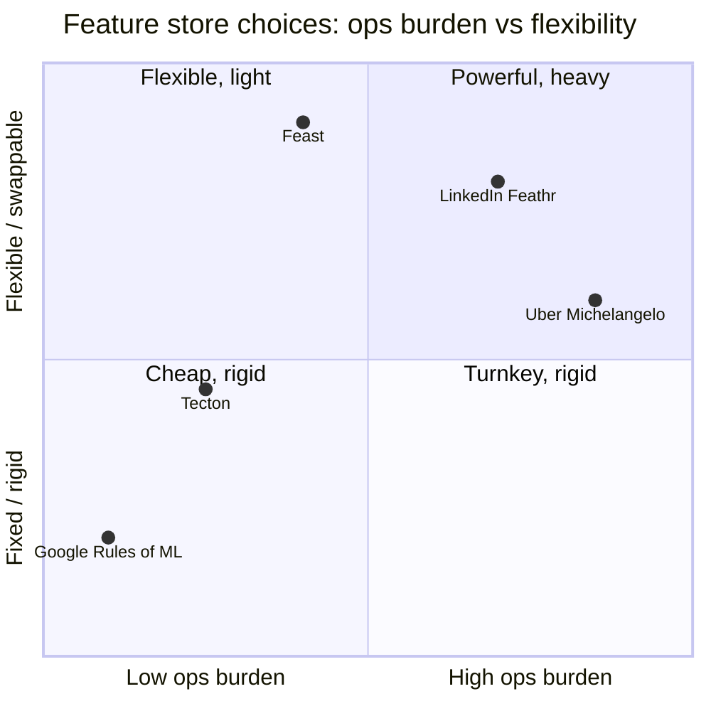

**What they share.** Every system drives two stores from one feature definition: an offline store keeping timestamped history for point-in-time joins, and a low-latency online store keeping the latest value per entity. One shared computation is the mechanism that kills code skew.

**The choices, side by side.**

| Decision | Options (who) | What decides it |
| --- | --- | --- |
| build vs buy | `in-house` (Uber Michelangelo) vs `open-source` (Feast / Feathr) vs `managed` (Tecton) vs `discipline` (Google Rules of ML) | How many teams reuse features and how much infra you can staff and operate |
| transform placement | `DSL in model config` (Uber) vs `unified Spark API` (Feathr) vs `Python SDK, BYO compute` (Feast) vs `reuse serving code plus log` (Google) | Whether one definition must compile to batch, streaming, and online without drift |
| online store | `fixed` (Uber Cassandra, Feathr Redis / Cosmos) vs `pluggable` (Feast: Redis, DynamoDB, Bigtable, Postgres, 20+) | Latency budget, existing infra, and backend lock-in you accept |
| point-in-time join | `platform-owned` (Uber, Tecton managed) vs `framework as-of join` (Feast, Feathr) vs `test-after-train-window` (Google) | Whether you keep timestamped history to reconstruct values as of event time |

**The math that separates them.**

$$\hat{x}_i \;=\; x\!\left(e_i,\; \max\{\, t : t \le T_i \,\}\right) \quad\textbf{as-of point-in-time join}$$

$$\tilde{y}_c \;=\; \frac{n_c\,\bar{y}_c \;+\; m\,\bar{y}}{\,n_c + m\,} \quad\textbf{OOF target-encoding smoothing}$$

$$\mathrm{PSI} \;=\; \sum_{b} \left(p_b - q_b\right)\,\ln\!\frac{p_b}{q_b} \quad\textbf{train vs serve skew score}$$

