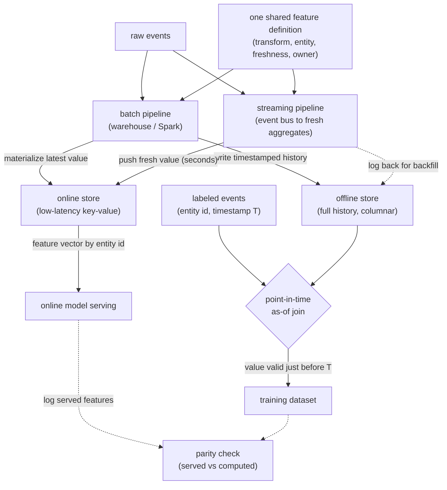
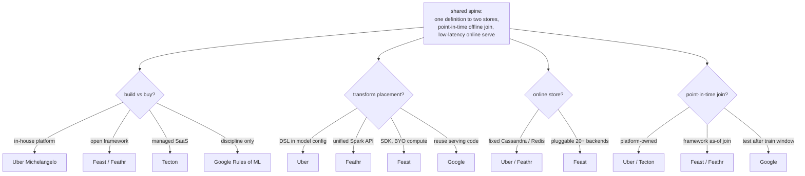
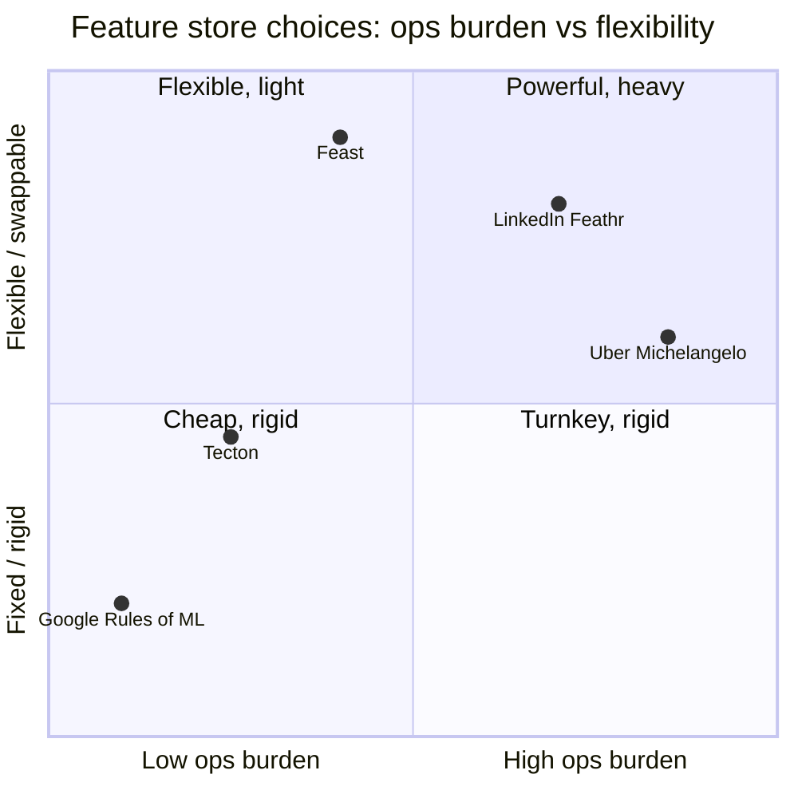

**What they share.** Every system drives two stores from one feature definition: an offline store keeping timestamped history for point-in-time joins, and a low-latency online store keeping the latest value per entity. One shared computation is the mechanism that kills code skew.

**The reference pipeline.** Strip the vendors away and the same skeleton remains. Raw events fan into a batch pipeline (warehouse or Spark) and a streaming pipeline (event bus to fresh aggregates); both compile from one shared definition so the aggregate is identical on either path. The batch side writes timestamped history to the offline store and materializes the latest value to the online store; the streaming side pushes fresh values straight to the online store. Training rows are built by an as-of join that reaches back to the feature value valid just before each label's timestamp, while serving reads a single feature vector by entity id. The offline-to-online materialization plus the point-in-time join are the two seams where skew is either killed or created.

**Reading the diagram.** Start at the top: raw events fan out to a batch pipeline (warehouse or Spark) and a streaming pipeline (event bus to fresh aggregates), and the crucial move is that both compile from one shared feature definition, so the aggregate is the same number on either path and code skew never gets a foothold. Those pipelines feed the two stores that give the pattern its name: the batch side writes timestamped history to the offline store and materializes the latest value to the online store, while the streaming side pushes fresh values (seconds old) straight to the online store for real-time freshness. The offline store, holding full history, is read by the point-in-time as-of join, which for each labeled event reaches back to the feature value valid just before that label's timestamp; get this wrong (join today's value onto an old label) and you leak the future, and offline metrics glow while production flops. The online store, holding one value per entity, is read by a single low-latency lookup by entity id at serving time. The two seams to watch are the offline-to-online materialization (where the batch and streaming numbers must agree, or data skew creeps back in) and the point-in-time join (where time skew is either killed by correct as-of history or created by sloppy timestamps). The design leverage is that one definition drives both stores, so the value a model trains on and the value it serves are the same computation, which is the entire reason the platform exists.

**The divergence.** From that shared spine, four axes split the field.

**The choices, side by side.**

| Decision | Options (who) | What decides it |
| --- | --- | --- |
| build vs buy | `in-house` (Uber Michelangelo) vs `open-source` (Feast / Feathr) vs `managed` (Tecton) vs `discipline` (Google Rules of ML) | How many teams reuse features and how much infra you can staff and operate |
| transform placement | `DSL in model config` (Uber) vs `unified Spark API` (Feathr) vs `Python SDK, BYO compute` (Feast) vs `reuse serving code plus log` (Google) | Whether one definition must compile to batch, streaming, and online without drift |
| online store | `fixed` (Uber Cassandra, Feathr Redis / Cosmos) vs `pluggable` (Feast: Redis, DynamoDB, Bigtable, Postgres, 20+) | Latency budget, existing infra, and backend lock-in you accept |
| point-in-time join | `platform-owned` (Uber, Tecton managed) vs `framework as-of join` (Feast, Feathr) vs `test-after-train-window` (Google) | Whether you keep timestamped history to reconstruct values as of event time |

**The math that separates them.**

$$\hat{x}_i \ =\ x\left(e_i,\ \max\lbrace t : t \le T_i \rbrace \right) \quad\textbf{as-of point-in-time join}$$

$$\tilde{y}_c \ =\ \frac{n_c \bar{y}_c \ +\ m \bar{y}}{ n_c + m } \quad\textbf{OOF target-encoding smoothing}$$

$$\mathrm{PSI} \ =\ \sum_{b} \left(p_b - q_b\right) \ln\frac{p_b}{q_b} \quad\textbf{train vs serve skew score}$$

$$a_i(T) \ =\ \sum_{t \, \le \, T} y_t \ e^{-\lambda \left(T - t\right)} \quad\textbf{time-decayed streaming window aggregate}$$

$$s_i(T) \ =\ T \ -\ \max\lbrace t : \mathrm{materialized}\left(e_i, t\right) \rbrace \ \le\ \mathrm{SLA} \quad\textbf{online freshness staleness bound}$$

$$\mathrm{parity} \ =\ \frac{1}{N} \sum_{i \, = \, 1}^{N} \mathbf{1}\left[\ \left\lvert x^{\mathrm{serve}}_i - x^{\mathrm{train}}_i \right\rvert \ \le\ \varepsilon\ \right] \quad\textbf{served vs computed match rate}$$

**Interview watch-outs.**

- **Joining current values onto past labels.** The classic time-leak: you compute a lifetime aggregate today and stamp it onto a six-month-old event. Offline metrics look amazing, production flops. Always reach for the as-of value valid just before the label timestamp, which means the offline store must keep timestamped history, not just the latest snapshot.
- **Two code paths for one feature.** A SQL query builds it offline and handwritten service code serves it online; they drift the instant either is edited. Name code skew and insist on one shared definition that compiles to both, or (Google's fallback) log the exact features served and train on those.
- **Streaming and batch computing different aggregates.** The streaming materialization and the offline backfill must produce the identical number, or you reintroduce data skew at the seam. Interviewers probe whether your windowing, filtering, and late-event handling match on both paths.
- **Backfilling with today's logic but historical timestamps.** Recomputing a new feature over old data with current code, then stamping it as historical, silently leaks the future. A new feature is not trainable until it is backfilled with correct as-of logic and timestamps.
- **Unpinned external tables.** A dimension table joined into features mutates between train and serve, so the same event yields different features on each side. Snapshot it or log at serving time; do not join live external state blindly.
- **Validating only offline accuracy.** There is no single accuracy number for a store: watch served-vs-computed parity, freshness SLAs, and the three sequential skew gaps (train vs holdout, holdout vs next-day, next-day vs live). A silent materialization stall freezes a feature and the model degrades with no offline signal at all.
