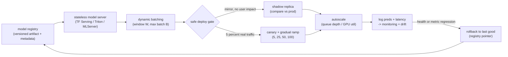
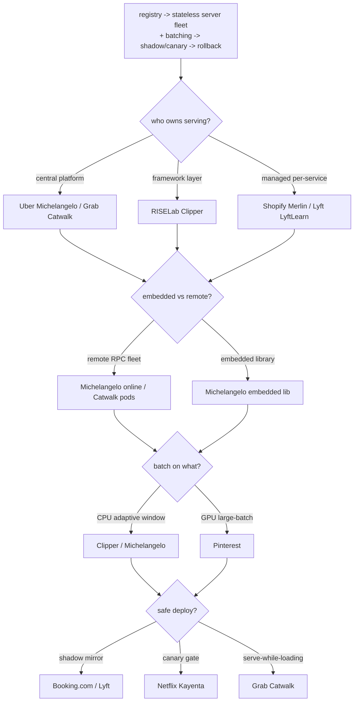
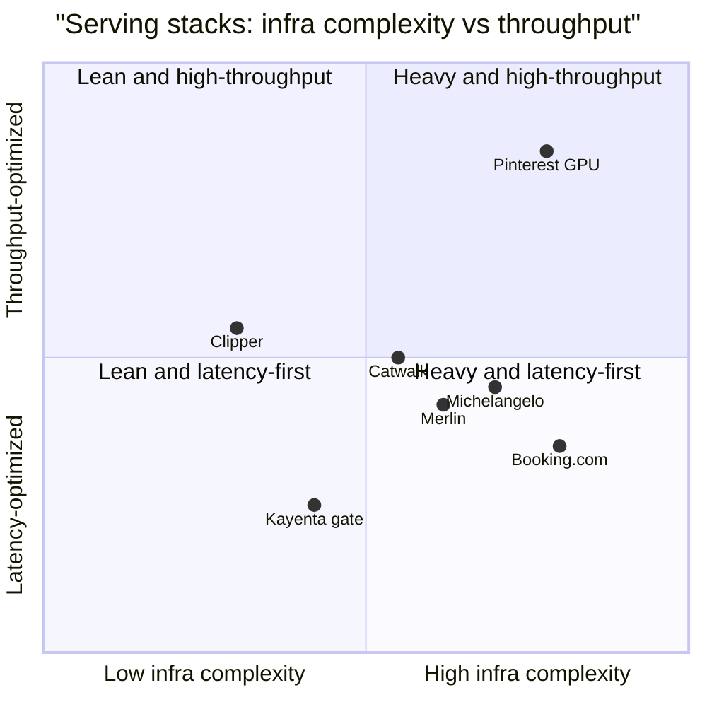

**What they share.** Every system separates the model artifact from the server that runs it, loads versioned artifacts by pointer from a registry into stateless replicas, and stages a candidate through shadow or canary before it widens. They diverge on who owns the stack, where inference runs, how batches form, and how a deploy is made safe.

**The reference pipeline.** Strip away the vendor names and every stack here is the same skeleton: a versioned artifact leaves the registry, loads into a stateless server that batches requests, a candidate is proven through shadow or canary before it widens, autoscaling tracks a serving-specific signal, and everything served is logged so monitoring can trip a rollback that is a pointer move, not a rebuild.

**Reading the diagram.** Start at the registry: it holds the immutable, versioned artifact plus metadata, so "which model is live" is a pointer and a deploy is reproducible, not a file copy anyone can lose track of. That artifact loads into a stateless model server (TF Serving, Triton, MLServer), and because the server carries no per-user state you can add, drop, or hot-swap replicas freely; the failure mode to watch is a replica taking traffic before it has warmed. Dynamic batching sits inside the server, collecting requests inside a short window before running them as one pass to fill the accelerator, and the core decision is that a wider window and larger batch raise throughput but eat into the tail latency budget, so you size them backward from the p99 target, not for peak throughput on idle hardware. The safe-deploy gate is where a candidate is proven before it widens: shadow mirrors live traffic and throws the output away so it proves no breakage at zero user risk (Booking.com, Lyft), while canary routes a small real slice and ramps in steps so it measures actual user impact on a bounded blast radius (Netflix Kayenta), and Grab Catwalk serves while loading for a gapless swap. Autoscaling then tracks a serving-specific signal such as queue depth or GPU utilization rather than CPU, keeping cold-start headroom so a spike does not hit half-loaded replicas. Finally everything served is logged so monitoring can trip a rollback that is just a registry pointer move back to the last good version, ideally fired automatically off a health or metric regression; the leverage of the whole shape is that every stage is decoupled through the registry, so shipping and reverting are seconds-long pointer changes instead of rebuilds.

The divergence starts once you ask who owns that skeleton and how each stage is implemented.

**The choices, side by side.**

| Decision | Options (who) | What decides it |
| --- | --- | --- |
| serving ownership | `central platform` (Uber Michelangelo / Grab Catwalk) vs `framework` (Clipper) vs `managed` (Shopify Merlin) | How many teams and models share one stack. A central platform amortizes ops but must fit every team; a per-use-case service isolates blast radius at the cost of duplicated fleets and cold-start. |
| embedded vs remote | `remote RPC fleet` (Michelangelo online, Catwalk pods, Merlin Ray) vs `embedded library` (Michelangelo offline lib) | Whether inference sits on the caller's critical path. Remote decouples redeploys, standardizes metrics, enables tag-swap; embedded skips a network hop when latency is tight or the path is batch. |
| batching | `CPU adaptive` (Clipper SLO window, Michelangelo batched RPC) vs `GPU large-batch` (Pinterest) | Hardware latency curve. CPU cost grows with batch, so size the window backward from the SLO; GPU scales sub-linearly, so batch larger to fill the accelerator (Pinterest 77x model, P50 10ms to sub-1ms). |
| safe deploy | `shadow` (Booking.com, Lyft) vs `canary` (Netflix Kayenta) vs `serve-while-loading` (Grab Catwalk) | Whether you need zero-risk proof-of-no-breakage (shadow, p999), real user-impact on a small slice (automated canary gate), or a gapless hot-swap where the new version warms before the old stops (Catwalk). |

**The math that separates them.**

$$\textbf{Batching latency and rate:}\quad L_{\text{batch}} \ = \ W \ + \ \frac{B}{\text{tput}(B)}, \qquad \text{QPS} \ = \ \frac{B}{W}$$

$$\textbf{p99 budget must cover:}\quad T_{p99} \ \geq \ L_{\text{net}} \ + \ L_{\text{feat}} \ + \ W \ + \ L_{\text{model}}(B)$$

$$\textbf{CPU vs GPU cost curve:}\quad L_{\text{CPU}}(B) \ \approx \ c_0 \ + \ c_1 B, \qquad L_{\text{GPU}}(B) \ \approx \ g_0 \ + \ g_1 B^{\alpha}, \quad \alpha \ < \ 1$$

$$\textbf{Little's law replica count:}\quad N_{\text{replicas}} \ = \ \left\lceil \frac{\lambda \cdot L_{\text{batch}}}{B_{\max}} \right\rceil$$

$$\textbf{Little's law, queue form:}\quad \bar{Q} \ = \ \lambda \cdot \bar{W}_{\text{queue}}, \qquad \rho \ = \ \frac{\lambda}{N_{\text{replicas}} \cdot \mu} \ < \ 1$$

$$\textbf{Batch fill efficiency:}\quad \eta \ = \ \frac{\mathbb{E}[B]}{B_{\max}} \ = \ \frac{\min(\lambda W, \ B_{\max})}{B_{\max}}$$

$$\textbf{Shadow and blue-green cost:}\quad \text{Cost}_{\text{deploy}} \ = \ \text{Cost}_{\text{prod}} \cdot (1 \ + \ f_{\text{mirror}}), \qquad f_{\text{mirror}} \in [0, 1]$$

$$\textbf{Autoscale headroom for cold start:}\quad N_{\text{provisioned}} \ = \ \left\lceil (1 \ + \ h) \cdot \frac{\lambda_{\text{peak}}}{\mu} \right\rceil, \qquad h \ \gtrsim \ \frac{T_{\text{coldstart}}}{T_{\text{scale-interval}}}$$

Read them together: the p99 budget is the hard ceiling, batching latency and fill efficiency are the throughput knob that eats into it, Little's law (both forms) sizes the fleet so utilization $\rho$ stays under 1, and the headroom and mirror-cost terms are what safe-but-slow rollout and cold-start protection actually cost.

**Interview watch-outs.**

- Quote p99 and p999, never the average. A healthy mean hides the fat tail that breaches the SLA, and search-time fan-out systems (Booking.com) hold to p999 precisely because tail requests dominate at scale.
- Name the batching tradeoff both ways. A longer window W and larger max batch raise throughput and raise tail latency; size them backward from the p99 budget, not for peak throughput on idle hardware.
- Do not autoscale on CPU for an inference service. The bottleneck is GPU memory bandwidth or queue depth, so scale on a serving-specific signal (queue length, batch latency, GPU utilization) and keep cold-start headroom so a spike does not hit half-loaded replicas.
- Keep shadow and canary distinct. Shadow proves no breakage at zero user risk but cannot measure user impact (no one sees its output); canary measures real effect on a small blast radius. "Great in shadow, tanked in canary" is expected, not a paradox.
- Make rollback a pointer change, not a rebuild. The registry holds the last good version; wire an automated trigger off a health or metric regression so reverting takes seconds. A deploy you cannot reverse in seconds is not a safe deploy.
- Push work off the critical path when freshness allows. Not everything needs live serving; precompute stable predictions in batch (LinkedIn Pensieve nearline) and reserve online serving for what depends on real-time context.
