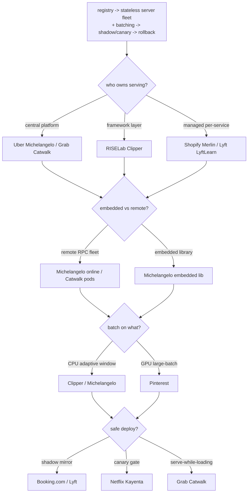
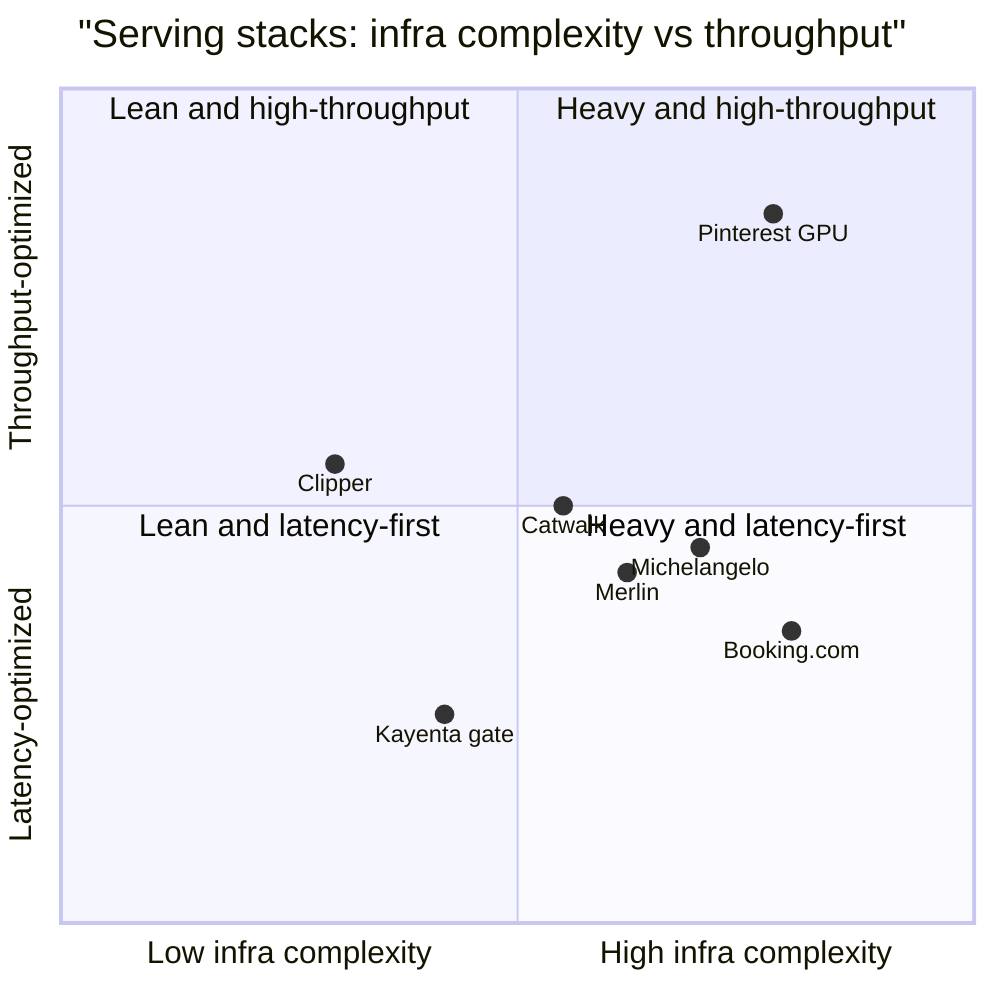

**What they share.** Every system separates the model artifact from the server that runs it, loads versioned artifacts by pointer from a registry into stateless replicas, and stages a candidate through shadow or canary before it widens. They diverge on who owns the stack, where inference runs, how batches form, and how a deploy is made safe.

**The choices, side by side.**

| Decision | Options (who) | What decides it |
| --- | --- | --- |
| serving ownership | `central platform` (Uber Michelangelo / Grab Catwalk) vs `framework` (Clipper) vs `managed` (Shopify Merlin) | How many teams and models share one stack. A central platform amortizes ops but must fit every team; a per-use-case service isolates blast radius at the cost of duplicated fleets and cold-start. |
| embedded vs remote | `remote RPC fleet` (Michelangelo online, Catwalk pods, Merlin Ray) vs `embedded library` (Michelangelo offline lib) | Whether inference sits on the caller's critical path. Remote decouples redeploys, standardizes metrics, enables tag-swap; embedded skips a network hop when latency is tight or the path is batch. |
| batching | `CPU adaptive` (Clipper SLO window, Michelangelo batched RPC) vs `GPU large-batch` (Pinterest) | Hardware latency curve. CPU cost grows with batch, so size the window backward from the SLO; GPU scales sub-linearly, so batch larger to fill the accelerator (Pinterest 77x model, P50 10ms to sub-1ms). |
| safe deploy | `shadow` (Booking.com, Lyft) vs `canary` (Netflix Kayenta) vs `serve-while-loading` (Grab Catwalk) | Whether you need zero-risk proof-of-no-breakage (shadow, p999), real user-impact on a small slice (automated canary gate), or a gapless hot-swap where the new version warms before the old stops (Catwalk). |

**The math that separates them.**

$$\textbf{Batching latency and rate:}\quad L_{\text{batch}} = W + \frac{B}{\text{tput}(B)}, \qquad \text{QPS} = \frac{B}{W}$$

$$\textbf{p99 budget must cover:}\quad T_{p99} \ \geq\ L_{\text{net}} + L_{\text{feat}} + W + L_{\text{model}}(B)$$

$$\textbf{CPU vs GPU cost curve:}\quad L_{\text{CPU}}(B) \approx c_0 + c_1 B, \qquad L_{\text{GPU}}(B) \approx g_0 + g_1 B^{\alpha},\ \alpha < 1$$

$$\textbf{Little's law replica count:}\quad N_{\text{replicas}} = \left\lceil \frac{\lambda \cdot L_{\text{batch}}}{B_{\max}} \right\rceil$$

