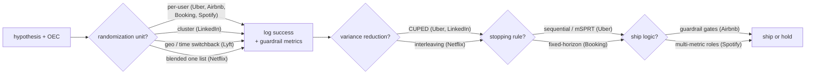
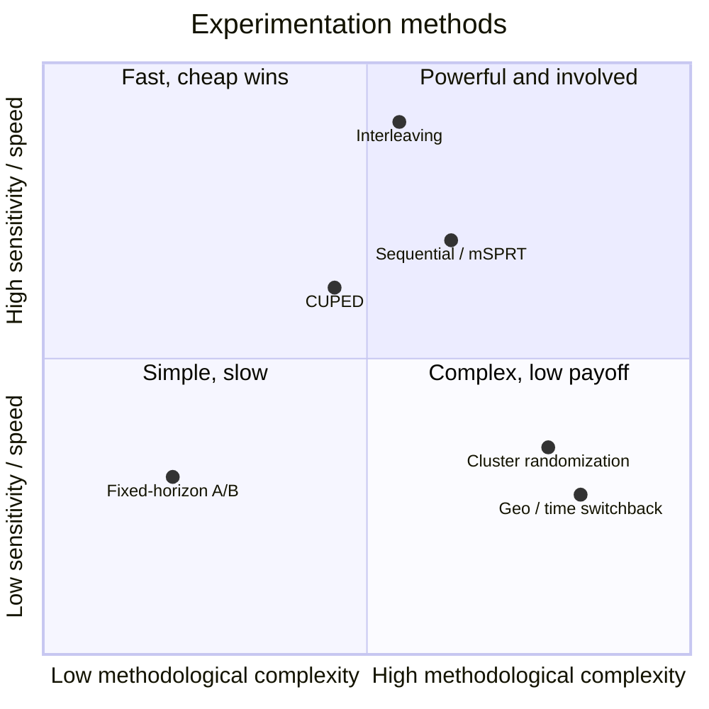

**What they share.** Every platform runs one spine: hash a diversion unit into stable arms, log a pre-declared success metric next to guardrails, squeeze variance, then decide ship-or-hold. All divergence lives in how they cut variance, contain interference, and pull the trigger.

**The choices, side by side.**

| Decision | Options (who) | What decides it |
| --- | --- | --- |
| variance reduction | `CUPED` (Uber/LinkedIn) vs `interleaving` (Netflix) | CUPED when a pre-period covariate correlates with the outcome; interleaving when the change is ranked-list only and traffic is scarce (~100x cheaper, but rank preference only) |
| randomization unit | `per-user` vs `cluster` (LinkedIn) vs `geo/time switchback` (Lyft) | whether treatment leaks across users; per-user is simplest and highest-power, cluster/switchback pay power for interference safety in social and marketplace products |
| stopping | `sequential/mSPRT` (Uber) vs `fixed-horizon` (Booking) | need for continuous early looks without peeking inflation (sequential) vs a pre-registered planned duration that removes the temptation (fixed) |
| ship logic | `guardrail gates` (Airbnb) vs `multi-metric roles` (Spotify) vs `quality-as-KPI` (Booking) | Airbnb escalates on impact/power/statsig-negative; Spotify requires superiority plus non-inferiority across metric roles; Booking grades protocol adherence, not effect size |

**The math that separates them.**

$$\textbf{CUPED variance reduction: } \text{Var}(\bar{Y}_{cv}) = \text{Var}(\bar{Y})\,(1 - \rho^2), \quad \theta = \frac{\text{Cov}(Y, X)}{\text{Var}(X)}$$

$$\textbf{Type I, type II, and power: } \alpha = P(\text{reject} \mid H_0), \quad \beta = P(\text{accept} \mid H_1), \quad \text{power} = 1 - \beta$$

$$\textbf{Sample size vs MDE: } n \propto \frac{\sigma^2\,(z_{1-\alpha/2} + z_{1-\beta})^2}{\text{MDE}^2}$$

$$\textbf{Spotify joint-power correction: } \beta^{*} = \frac{\beta}{G + 1}, \quad G = \text{guardrail metric count}$$

