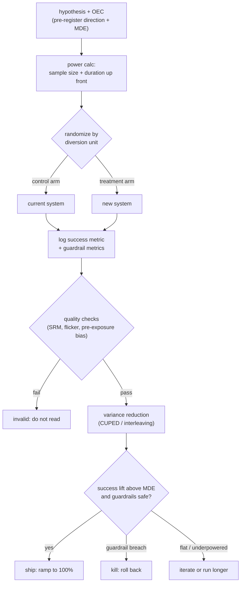
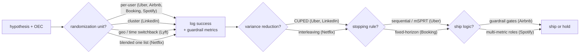
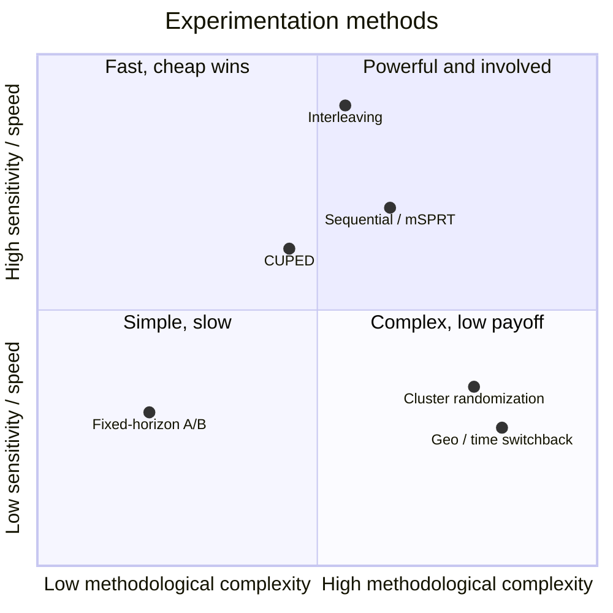

**What they share.** Every platform runs one spine: hash a diversion unit into stable arms, log a pre-declared success metric next to guardrails, squeeze variance, then decide ship-or-hold. All divergence lives in how they cut variance, contain interference, and pull the trigger.

**The reference pipeline.** Strip away the vendor-specific tricks and one canonical experiment loop remains: state a hypothesis with an Overall Evaluation Criterion, randomize a diversion unit into stable arms, log the success metric beside its guardrails, then make an explicit ship / hold / iterate call. Every system below is a specialization of this loop.

**Reading the diagram.** The loop starts with a hypothesis plus an Overall Evaluation Criterion, where you pre-register the direction of the expected win and the minimum detectable effect, then run a power calc so sample size and duration are fixed up front rather than discovered by peeking. Randomization by diversion unit is the load-bearing decision: hash each unit into a stable arm, and the choice of unit (user, cluster, geo, or time switchback) trades statistical power against interference safety, since a per-user split leaks whenever treatment spills across users. Both arms then log the success metric next to its guardrails, after which quality checks (sample ratio mismatch, flicker, pre-exposure bias) act as a hard gate that voids the read if randomization or logging is broken, no matter how strong the result looks. Variance reduction (CUPED against a correlated pre-period covariate, or interleaving for ranked lists) buys sensitivity without more traffic, which is the leverage that lets you detect a smaller lift in the same window. The analyze step asks whether the lift clears the minimum detectable effect with guardrails safe, and the stopping rule here is where tests go wrong: fixed-horizon looks once, while sequential or mSPRT methods permit continuous early looks without inflating false positives. The final call is an explicit three-way branch, ship and ramp to 100 percent, kill and roll back on a guardrail breach, or iterate and run longer when the effect is flat or underpowered, so the same skeleton absorbs every vendor variation downstream by tuning just the unit, the variance trick, and the stopping rule.

**Where they diverge.**

**The choices, side by side.**

| Decision | Options (who) | What decides it |
| --- | --- | --- |
| variance reduction | `CUPED` (Uber/LinkedIn) vs `interleaving` (Netflix) | CUPED when a pre-period covariate correlates with the outcome; interleaving when the change is ranked-list only and traffic is scarce (~100x cheaper, but rank preference only) |
| randomization unit | `per-user` vs `cluster` (LinkedIn) vs `geo/time switchback` (Lyft) | whether treatment leaks across users; per-user is simplest and highest-power, cluster/switchback pay power for interference safety in social and marketplace products |
| stopping | `sequential/mSPRT` (Uber) vs `fixed-horizon` (Booking) | need for continuous early looks without peeking inflation (sequential) vs a pre-registered planned duration that removes the temptation (fixed) |
| ship logic | `guardrail gates` (Airbnb) vs `multi-metric roles` (Spotify) vs `quality-as-KPI` (Booking) | Airbnb escalates on impact/power/statsig-negative; Spotify requires superiority plus non-inferiority across metric roles; Booking grades protocol adherence, not effect size |

**The math that separates them.**

$$\textbf{CUPED variance reduction: } \mathrm{Var}(\bar{Y}_{cv}) = \mathrm{Var}(\bar{Y}) \cdot (1 - \rho^{2}), \quad \theta = \frac{\mathrm{Cov}(Y, X)}{\mathrm{Var}(X)}$$

where the adjusted metric is $Y_{cv} = Y - \theta \cdot (X - \mathbb{E}[X])$, the covariate $X$ is a pre-experiment measurement, and $\rho$ is the correlation between $X$ and $Y$. A correlation of $\rho = 0.7$ removes about half the variance; $\rho \approx 0$ removes nothing.

$$\textbf{Type I, type II, and power: } \alpha = P(\text{reject } H_0 \mid H_0 \text{ true}), \quad \beta = P(\text{fail to reject } H_0 \mid H_1 \text{ true}), \quad \text{power} = 1 - \beta$$

$\alpha$ is the false-positive rate (ship a change that does nothing, commonly set to $0.05$); $\beta$ is the false-negative rate (miss a real win); power is the chance of catching a true effect (commonly targeted at $0.80$).

$$\textbf{Sample size vs MDE (per arm, difference of means): } n \approx \frac{2 \cdot \sigma^{2} \cdot (z_{1 - \alpha/2} + z_{1 - \beta})^{2}}{\mathrm{MDE}^{2}}$$

where $\sigma^{2}$ is the per-unit metric variance, $\mathrm{MDE}$ is the smallest effect worth shipping, and $z_{q}$ is the standard-normal quantile at probability $q$. Because $n$ scales as $1 / \mathrm{MDE}^{2}$, halving the effect you want to detect roughly quadruples the required traffic and duration.

$$\textbf{Spotify joint-power correction: } \beta^{*} = \frac{\beta}{G + 1}, \quad G = \text{number of guardrail metrics}$$

requiring all $G$ guardrails to pass plus one success metric erodes joint power, so each individual metric is powered at the tighter $\beta^{*}$ to hit the intended overall $\beta$. False-positive rates are not corrected across guardrails, because requiring all of them to pass does not compound $\alpha$ the way independent tests would.

**Interview watch-outs.**

- **Peeking.** Checking a fixed-horizon test daily and stopping the moment it crosses $\alpha = 0.05$ inflates the real false-positive rate far above the stated level. Fix the sample size and look once, or switch to a method built for continuous looks (sequential testing, mSPRT, always-valid p-values, group-sequential boundaries).
- **Interference (SUTVA violation).** Per-user splits assume one unit's outcome does not depend on another's assignment. That breaks in marketplaces (shared inventory sells out and hurts the control arm) and social graphs (treatment leaks across connections). Recognize it, say the naive split is biased, then name cluster, geo, or switchback randomization; LinkedIn's dual-design check detects it.
- **Novelty and primacy effects.** Users click anything new (novelty spike that decays) or resist anything new (primacy dip that recovers), so an early significant reading can be an artifact. Plot the daily treatment effect, not just the cumulative number, and run whole multiples of a week to absorb weekly seasonality.
- **Guardrails need non-inferiority, not "not significant."** A guardrail that fails to reach significance is not proven safe; it may just be underpowered. Use non-inferiority tests with an explicit margin (Airbnb, Spotify), and separate ordinary guardrails from deterioration metrics where harm is unacceptable.
- **Sample ratio mismatch (SRM).** If you asked for a 50/50 split and observe 50.8/49.2 at scale, randomization or logging is broken and the whole experiment is invalid no matter how good the result looks. Chi-squared test the observed ratio against intended on every readout and refuse to read on failure; Uber also excludes flicker (arm-switching) users.
- **Within-unit correlation and multiple comparisons.** Diverting by user but analyzing request-level rows as independent makes confidence intervals too narrow and manufactures false winners; cluster or bootstrap variance at the diversion unit. Testing many metrics at $\alpha$ each expects roughly one false positive by chance, so pre-declare one primary metric and correct the rest (Bonferroni, Benjamini-Hochberg FDR).
