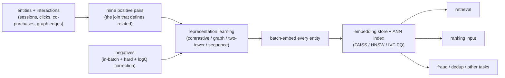
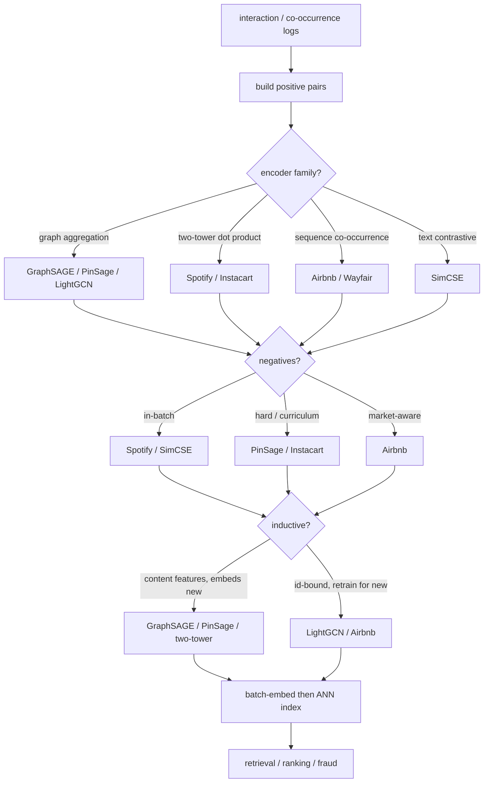
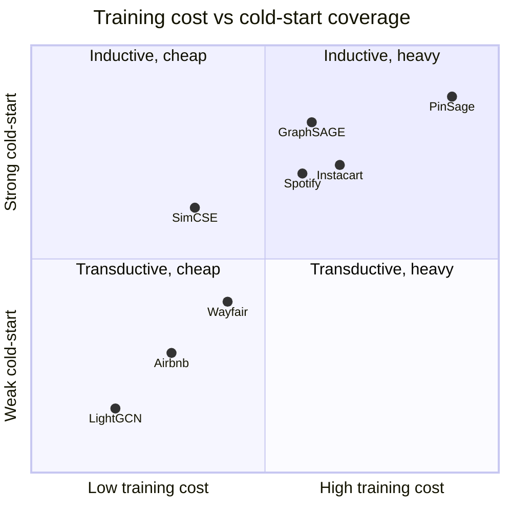

**What they share.** Every system runs the same skeleton: mine positive pairs from behavioral logs, contrast them against negatives to train an encoder, batch-embed the entity set, and load the vectors into an ANN index that retrieval, ranking, and other tasks reuse. What varies is only the join that defines "related" and whether the encoder is inductive or transductive. The store-and-reuse tail is common, and that reuse is the economic point: learn the space once, then serve retrieval, ranking, and fraud from the same vectors.

**The reference pipeline.** Read left to right, this is the canonical path every one of these systems collapses to: raw interaction signal becomes a trained representation, the representation is materialized into an ANN index once, and many downstream tasks read from that one index. The offline encoder job is the throughput bottleneck; the index is the reuse point.

**Where they diverge.** Same skeleton, four decision points. This branches the reference pipeline by the choices each system actually made.

**The choices, side by side.**

| Decision | Options (who) | What decides it |
| --- | --- | --- |
| encoder family | `graph GraphSAGE/PinSage/LightGCN` vs `two-tower Spotify/Instacart` vs `text SimCSE` vs `sequence Airbnb/Wayfair` | Whether relatedness is a graph edge, a query-vs-item pair, plain text, or session order, and what features each entity carries |
| contrastive negatives | `in-batch (Spotify/SimCSE)` vs `hard/curriculum (PinSage/Instacart)` vs `same-market (Airbnb)` vs `NLI hard (SimCSE-sup)` | In-batch is free but easy and popularity-biased; hard negatives sharpen the boundary but risk false negatives and instability |
| dimensionality/cold-start | `inductive (GraphSAGE/PinSage/two-tower)` vs `transductive (LightGCN/Airbnb ids)` | Content features let a new entity map to a point with zero history; id-only vectors have nothing until retrain, so they need a fallback |
| index/freshness | `HNSW/FAISS (Instacart/Spotify)` vs `IVF-PQ at scale` vs `MapReduce batch (PinSage)` vs `hourly feature store (Wayfair)` | Catalog size, memory budget, and how fast a new entity or new behavior must become queryable |

**The math that separates them.**

$$\mathcal{L}_{\text{InfoNCE}} = -\log \frac{\exp(\mathrm{sim}(z_i, z_i^{+}) / \tau)}{\exp(\mathrm{sim}(z_i, z_i^{+}) / \tau) + \sum_{j} \exp(\mathrm{sim}(z_i, z_j^{-}) / \tau)} \qquad \textbf{InfoNCE with temperature } \tau$$

The temperature $\tau$ is the sharpness knob: small $\tau$ makes the softmax peaky, so the loss concentrates on the hardest negatives and the boundary tightens; large $\tau$ flattens it and the gradient spreads over easy negatives.

$$s'(x, y) = s(x, y) - \log Q(y) \qquad \textbf{logQ popularity correction}$$

Here $Q(y)$ is the sampling probability of item $y$. Subtracting $\log Q(y)$ from the logit undoes the fact that popular items appear as in-batch negatives more often, so the in-batch softmax estimates the true full-corpus softmax instead of a popularity-skewed one.

$$\mathrm{sim}(u, v) = \frac{u \cdot v}{\lVert u \rVert \, \lVert v \rVert} = \cos(\theta_{u,v}) \qquad \textbf{cosine relatedness score}$$

Cosine reads relatedness off the angle only, discarding magnitude, which is why encoders that score with cosine usually L2-normalize the output vectors before indexing so ANN distance and training score agree.

$$\mathcal{L}_{\text{triplet}} = \max\big(0,\ d(a, p) - d(a, n) + m\big) \qquad \textbf{max-margin triplet loss}$$

$$\ell_{\text{align}} = \mathbb{E}_{(x, x^{+})} \big\lVert f(x) - f(x^{+}) \big\rVert^{2}, \qquad \ell_{\text{unif}} = \log \, \mathbb{E}_{x, y} \, e^{-2 \lVert f(x) - f(y) \rVert^{2}} \qquad \textbf{alignment and uniformity diagnostics}$$

Alignment (positives land close) and uniformity (the space is spread, not collapsed) are the two diagnostics to track directly; a space can score fine on a cosine probe while quietly collapsing, and only uniformity catches that.

**Interview watch-outs.**

- Name the negatives before the encoder. When asked to make embeddings "better," the honest lever is almost always better negatives (hard mining plus logQ correction), not a bigger model. Reaching for architecture first is the common tell.
- Do not conflate the two clocks. Embedding freshness (a new entity needs a vector) is inductive-vs-transductive; space drift (retraining moves the axes) forces an atomic full reindex because vectors across model versions are not comparable. Upserting new-model vectors into an old index is a classic mistake.
- Hard negatives cut both ways. They sharpen the boundary but some are unlabeled positives (false negatives) that teach the wrong thing, and too many destabilize training. The defensible recipe is mostly in-batch negatives with a small, tuned hard fraction.
- Cold start is structural, not a patch. If the encoder consumes content features (text, category, graph neighbors), a brand-new entity maps to a sensible point with zero history; id-only embeddings (LightGCN, matrix factorization) have no vector at all and need a fallback until interactions accrue. Say which side you are on.
- There is no single accuracy number. Evaluate an embedding by what it powers: recall@k of the retrieval it feeds, plus NDCG or MRR on a probe set, and measure tail recall separately from head so popularity bias cannot hide. Confirm end to end with an online A/B test.
- Watch for representation collapse. A weak loss or too-easy negatives can map everything into a narrow region where all similarities look high and ranking is meaningless; track embedding-norm spread and pairwise similarity, not just downstream accuracy.
