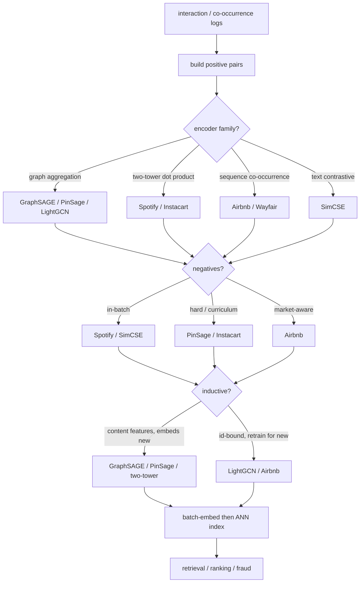
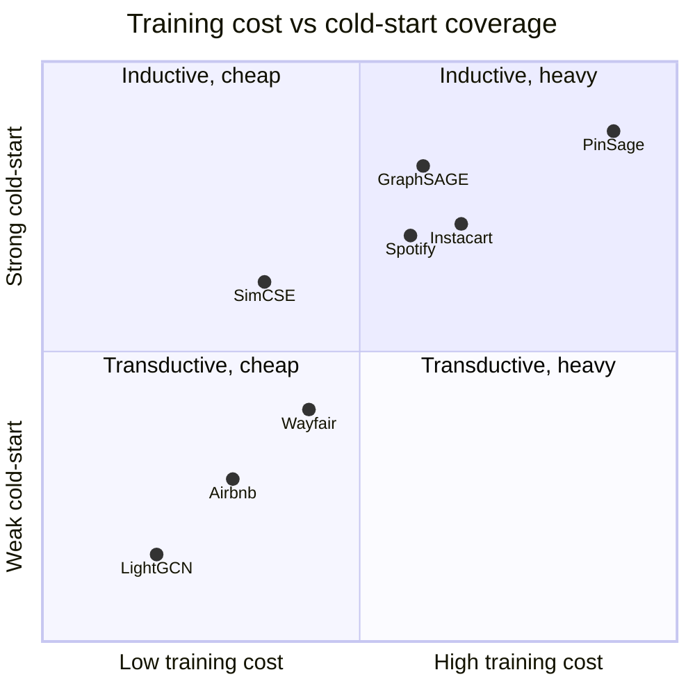

**What they share.** Every system runs the same skeleton: mine positive pairs from behavioral logs, contrast them against negatives to train an encoder, batch-embed the entity set, and load the vectors into an ANN index that retrieval, ranking, and other tasks reuse. What varies is only the join that defines "related" and whether the encoder is inductive or transductive.

**The choices, side by side.**

| Decision | Options (who) | What decides it |
| --- | --- | --- |
| encoder family | `graph GraphSAGE/PinSage/LightGCN` vs `two-tower Spotify/Instacart` vs `text SimCSE` vs `sequence Airbnb/Wayfair` | Whether relatedness is a graph edge, a query-vs-item pair, plain text, or session order, and what features each entity carries |
| contrastive negatives | `in-batch (Spotify/SimCSE)` vs `hard/curriculum (PinSage/Instacart)` vs `same-market (Airbnb)` vs `NLI hard (SimCSE-sup)` | In-batch is free but easy and popularity-biased; hard negatives sharpen the boundary but risk false negatives and instability |
| dimensionality/cold-start | `inductive (GraphSAGE/PinSage/two-tower)` vs `transductive (LightGCN/Airbnb ids)` | Content features let a new entity map to a point with zero history; id-only vectors have nothing until retrain, so they need a fallback |
| index/freshness | `HNSW/FAISS (Instacart/Spotify)` vs `IVF-PQ at scale` vs `MapReduce batch (PinSage)` vs `hourly feature store (Wayfair)` | Catalog size, memory budget, and how fast a new entity or new behavior must become queryable |

**The math that separates them.**

$$\mathcal{L}_{\text{InfoNCE}} = -\log \frac{\exp(\mathrm{sim}(z_i, z_i^{+}) / \tau)}{\sum_{j} \exp(\mathrm{sim}(z_i, z_j) / \tau)} \qquad \textbf{InfoNCE with temperature}$$

$$s'(x, y) = s(x, y) - \log Q(y) \qquad \textbf{logQ popularity correction}$$

$$\mathrm{sim}(u, v) = \frac{u \cdot v}{\lVert u \rVert \lVert v \rVert} \qquad \textbf{cosine relatedness score}$$

$$\mathcal{L}_{\text{triplet}} = \max\big(0,\ d(a, p) - d(a, n) + m\big) \qquad \textbf{max-margin triplet loss}$$

