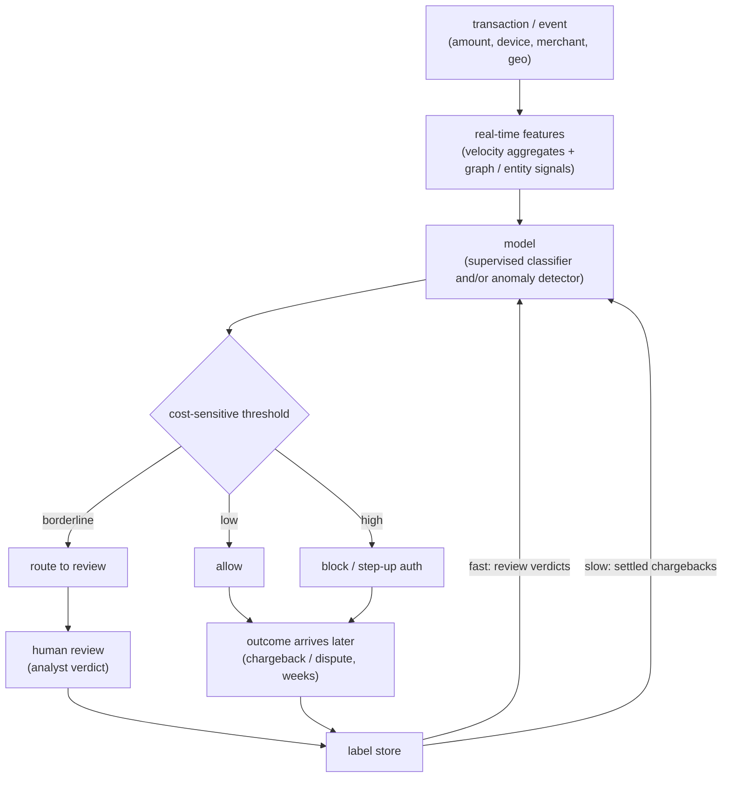
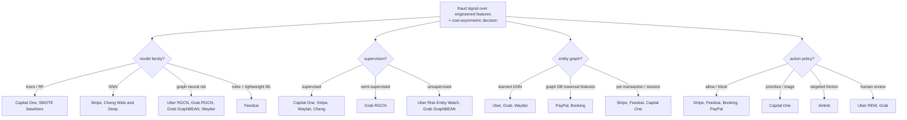
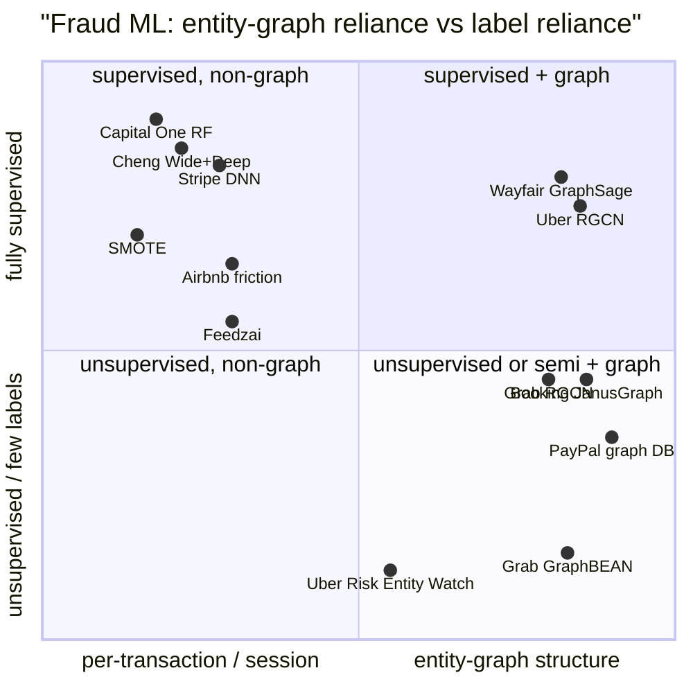

**What they share.** Every team scores a rare-positive fraud signal over engineered features and then acts under a cost-asymmetric threshold. They diverge on model family, how much they lean on labels, whether they reason over an entity graph, and what action the score triggers.

**The reference pipeline.** Strip the branding and every system is the same funnel: an event lands, real-time features (velocity aggregates plus graph and entity signals over shared devices, cards, and addresses) are assembled, a model scores it, a cost-sensitive threshold turns the score into allow, block, or route-to-review, analysts work the borderline queue, and their verdicts plus settled outcomes flow back as labels. The only fast feedback is the human queue; the ground-truth chargeback label closes the loop weeks later.

**Reading the diagram.** Follow the funnel top to bottom: a raw transaction event (amount, device, merchant, geo) enters and is joined against real-time features, where velocity aggregates plus graph and entity signals over shared devices, cards, and addresses surface a coordinated ring that any single event hides. The model box (a supervised classifier, an unsupervised anomaly detector like Grab GraphBEAN, or both) turns that feature vector into a fraud score, and the whole design tension is that positives sit near a fraction of a percent, so accuracy is a lie and you handle the skew with class weights or focal loss and read PR-AUC. The cost-sensitive threshold is the actual product: rather than a default cutoff at one half, you block when the calibrated fraud probability clears c_FP divided by the sum of c_FP and c_FN, which drops well below one half when a missed fraud costs far more than a blocked good user, and it splits into an allow band, a block or step-up band, and a borderline band routed to analysts. Human review does triple duty, catching what the model is unsure about, generating the only fast labels you get, and feeding both model paths, while allowed and blocked events wait on settled outcomes. The failure mode baked into the loop is label delay: analyst verdicts return in minutes as a leading indicator, but the ground-truth chargeback lands weeks later, so you respect a maturation window, never treat unmatured recent data as legitimate, and remember you only see chargebacks on transactions you allowed, which is why teams like Stripe and PayPal lean on frequent retrains and a small randomized allow-through hold-out. The design leverage is that every box is swappable (model family, graph reliance, and threshold branches) but the funnel shape and the two-speed label loop stay fixed.

The teardowns below are variations on this skeleton: they swap the model box, decide how much of the feature box is graph versus per-transaction, and change what the threshold branches into.

**The choices, side by side.**

| Decision | Options (who) | What decides it |
| --- | --- | --- |
| Model family | Random forest (Capital One) vs deep net (Stripe, Cheng) vs GNN (Uber, Grab, Wayfair) vs rules plus lightweight ML (Feedzai) | Explainability and audit needs push to trees; scale and raw signal push to DNN; ring or collusion structure pushes to GNN; latency at high rps pushes to lightweight stacks |
| Supervision | Supervised (Capital One, Stripe, Wayfair, Cheng) vs semi-supervised (Grab RGCN) vs unsupervised (Uber REW, Grab GraphBEAN) | Label availability and maturity; novel adversarial fraud with no labels forces anomaly or reconstruction methods |
| Graph / entity | Learned GNN over entities (Uber, Grab, Wayfair) vs graph-DB traversal features (PayPal, Booking) vs per-transaction or session (Stripe, Feedzai, Capital One) | Whether fraud is coordinated (shared cards, devices, addresses) vs a lone risky event; inline-latency budget for traversal |
| Action policy | Allow or block (Stripe, Feedzai, Booking, PayPal) vs prioritize or triage (Capital One) vs targeted friction (Airbnb) vs human review (Uber REW, Grab) | Cost of a false positive on a good user, and whether a human or a challenge step sits between score and outcome |

**The math that separates them.**

**Cost-asymmetric operating point (shared by all).** Choose the threshold that minimizes expected cost, not error rate:

$$L(\tau) = c_{FP} \cdot \mathrm{FP}(\tau) + c_{FN} \cdot \mathrm{FN}(\tau), \qquad \tau^{\star} = \arg\min_{\tau} L(\tau)$$

**Cost-optimal threshold in closed form (why 0.5 is wrong).** For a calibrated probability, block when the expected cost of allowing exceeds the expected cost of blocking, which reduces to a fixed probability cutoff:

$$\text{block when } p(\text{fraud} \mid x) \; \ge \; \frac{c_{FP}}{c_{FP} + c_{FN}}, \qquad \tau^{\star} = \frac{c_{FP}}{c_{FP} + c_{FN}}$$

When a missed fraud costs far more than a blocked good user (large $c_{FN}$), the cutoff drops well below 0.5 and the system catches more at the price of more false alarms.

**PR-AUC (average precision), the metric that survives a 0.2 percent base rate.** Summarize the precision-recall curve as a recall-weighted sum of precision, which ROC-AUC cannot do once the true-negative mass dwarfs the positives:

$$\mathrm{AP} = \sum_{k} \left( R_k - R_{k-1} \right) \cdot P_k, \qquad P_k = \frac{\mathrm{TP}_k}{\mathrm{TP}_k + \mathrm{FP}_k}, \quad R_k = \frac{\mathrm{TP}_k}{\mathrm{TP}_k + \mathrm{FN}_k}$$

**Focal loss (down-weight the easy legit majority).** An alternative to resampling that shrinks the loss on well-classified examples so the rare fraud class dominates the gradient:

$$\mathrm{FL}(p_t) = -\, \alpha_t \, \left( 1 - p_t \right)^{\gamma} \log(p_t), \qquad p_t = \begin{cases} p & y = 1 \\ 1 - p & y = 0 \end{cases}$$

The modulating factor $(1 - p_t)^{\gamma}$ goes to zero for confident correct predictions, so an easy legitimate transaction contributes almost nothing while a hard or misclassified fraud keeps full weight.

**Airbnb three-action loss (friction as a middle option).** A friction term recovers good users that a hard block would have lost:

$$L = \mathrm{FP}\cdot G \cdot V + \mathrm{FN}\cdot C + \mathrm{TP}\cdot(1-F)\cdot C$$

**RGCN relation-specific message passing (Uber, Grab).** Each edge type gets its own transform, so a shared device and a shared city carry different weight:

$$h_i^{(l+1)} = \sigma\left(W_0^{(l)} h_i^{(l)} + \sum_{r \in R}\sum_{j \in N_i^{r}} \frac{1}{|N_i^{r}|} W_r^{(l)} h_j^{(l)}\right)$$

**GraphBEAN reconstruction anomaly (Grab, unsupervised).** Score is reconstruction error over node and edge attributes plus structure, so the rare reconstructs poorly:

$$s(v) = \lVert x_v - \hat{x}_v \rVert^2 + \sum_{e \ni v}\lVert a_e - \hat{a}_e \rVert^2 + \mathrm{BCE}(A, \hat{A})$$

**When to use which.** Pick the model, the loss, and the operating point from label maturity, fraud structure, and cost asymmetry.

| Reach for | When | Instead of |
|---|---|---|
| Random forest (Capital One) | you need explainability and audit trails on per-transaction signal | a GNN, when fraud is coordinated rings rather than lone events |
| GNN or RGCN (Uber, Grab) | fraud is a ring over shared cards, devices, and addresses | per-transaction models (Stripe, Feedzai), which miss collusion structure |
| Graph-DB traversal features (PayPal, Booking) | you want ring signal without training and serving a GNN inline | a learned GNN, when the inline latency budget allows one |
| Unsupervised GraphBEAN reconstruction (Grab) | novel adversarial fraud with no labels yet | a supervised classifier, which needs matured chargeback labels |
| PR-AUC (average precision) | positives sit near a fraction of a percent and true negatives dominate | ROC-AUC or accuracy, which a never-fraud model games at 99.8 percent |
| Focal loss or class weights | you want to fix skew inside the loss, on the true base rate | SMOTE resampling, which distorts calibration and the base rate |
| Cost-optimal cutoff c_FP/(c_FP+c_FN) | the score is a calibrated probability and costs are asymmetric | a default 0.5 threshold, which ignores the miss-vs-false-alarm gap |
| Targeted friction, Airbnb three-action loss | a hard block on a good user is too costly to accept | binary allow or block, when a step-up challenge can recover the user |

**Interview watch-outs.** The traps that separate a leaderboard answer from a systems answer:

- **Imbalance kills accuracy.** At a 0.2 percent base rate a "never fraud" model scores 99.8 percent and catches nothing. Lead with PR-AUC plus precision and recall at the operating point, handle the skew with class weights or focal loss before reaching for SMOTE, and always evaluate on the true base rate, never on a rebalanced set.
- **Label delay poisons train and eval.** Chargebacks land 30 to 120 days late, so recent transactions have no mature label. Respect a maturation window, treat fast review verdicts as a leading indicator, reconcile against settled labels, and never treat unmatured recent data as legitimate.
- **The adversary makes drift the default.** Fraud shifts on purpose the moment a tactic stops working, so a great model decays as steady state. Expect short retrain cadence, input and score-distribution drift alarms as a safety system, and an anomaly path for attacks with no labels yet.
- **Calibration gates the threshold.** The cost-optimal cutoff $c_{FP}/(c_{FP}+c_{FN})$ only holds if the score is a true probability. Joint logits (wide-and-deep), tree ensembles, and resampled training all distort calibration, so calibrate before you threshold on cost.
- **The block-side blind spot.** You only see chargebacks on transactions you allowed; blocked-good transactions never generate a label, so the model can never learn it was wrong to block. Mitigate with a small randomized allow-through hold-out and lean on review verdicts.
- **Graph edges carry noise.** Shared-attribute edges expose rings but incidental shared identifiers (public Wi-Fi, a recycled IP) inflate false links. Prune high-degree nodes, bound traversal depth for the p99 budget, and keep node features in rather than trusting topology alone.
