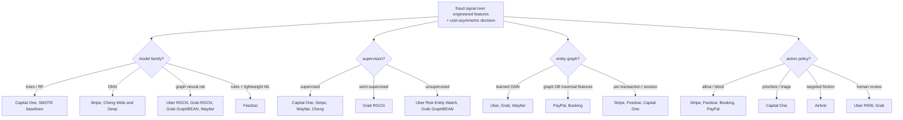
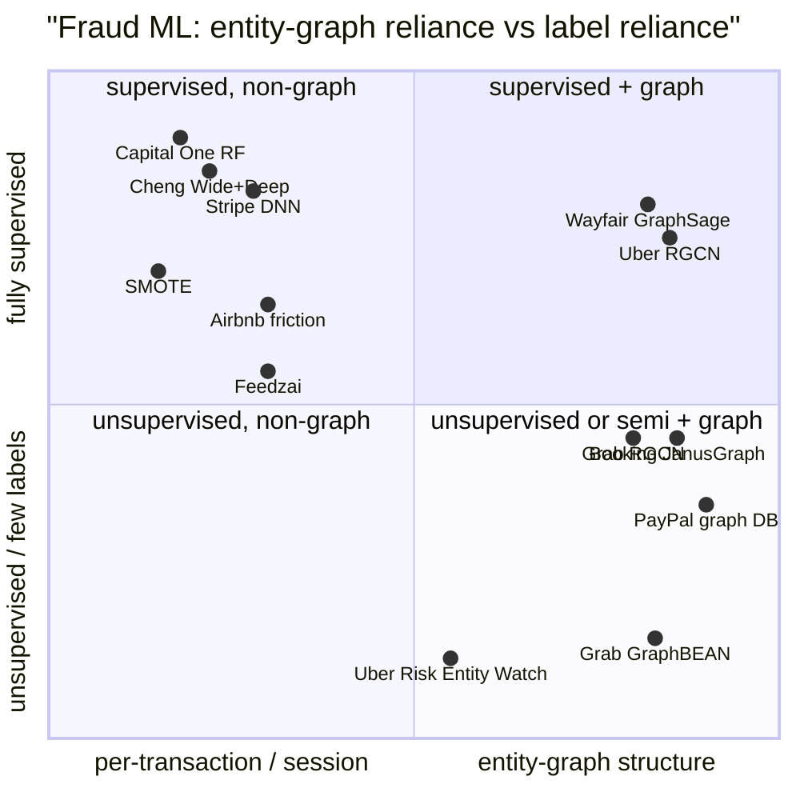

**What they share.** Every team scores a rare-positive fraud signal over engineered features and then acts under a cost-asymmetric threshold. They diverge on model family, how much they lean on labels, whether they reason over an entity graph, and what action the score triggers.

**The choices, side by side.**

| Decision | Options (who) | What decides it |
| --- | --- | --- |
| Model family | Random forest (Capital One) vs deep net (Stripe, Cheng) vs GNN (Uber, Grab, Wayfair) vs rules plus lightweight ML (Feedzai) | Explainability and audit needs push to trees; scale and raw signal push to DNN; ring or collusion structure pushes to GNN; latency at high rps pushes to lightweight stacks |
| Supervision | Supervised (Capital One, Stripe, Wayfair, Cheng) vs semi-supervised (Grab RGCN) vs unsupervised (Uber REW, Grab GraphBEAN) | Label availability and maturity; novel adversarial fraud with no labels forces anomaly or reconstruction methods |
| Graph / entity | Learned GNN over entities (Uber, Grab, Wayfair) vs graph-DB traversal features (PayPal, Booking) vs per-transaction or session (Stripe, Feedzai, Capital One) | Whether fraud is coordinated (shared cards, devices, addresses) vs a lone risky event; inline-latency budget for traversal |
| Action policy | Allow or block (Stripe, Feedzai, Booking, PayPal) vs prioritize or triage (Capital One) vs targeted friction (Airbnb) vs human review (Uber REW, Grab) | Cost of a false positive on a good user, and whether a human or a challenge step sits between score and outcome |

**The math that separates them.**

**Cost-asymmetric operating point (shared by all).** Choose the threshold that minimizes expected cost, not error rate:

$$L(\tau) = c_{FP}\,\mathrm{FP}(\tau) + c_{FN}\,\mathrm{FN}(\tau), \qquad \tau^{\star} = \arg\min_{\tau} L(\tau)$$

**Airbnb three-action loss (friction as a middle option).** A friction term recovers good users that a hard block would have lost:

$$L = \mathrm{FP}\cdot G \cdot V + \mathrm{FN}\cdot C + \mathrm{TP}\cdot(1-F)\cdot C$$

**RGCN relation-specific message passing (Uber, Grab).** Each edge type gets its own transform, so a shared device and a shared city carry different weight:

$$h_i^{(l+1)} = \sigma\!\left(W_0^{(l)} h_i^{(l)} + \sum_{r \in R}\sum_{j \in N_i^{r}} \frac{1}{|N_i^{r}|} W_r^{(l)} h_j^{(l)}\right)$$

**GraphBEAN reconstruction anomaly (Grab, unsupervised).** Score is reconstruction error over node and edge attributes plus structure, so the rare reconstructs poorly:

$$s(v) = \lVert x_v - \hat{x}_v \rVert^2 + \sum_{e \ni v}\lVert a_e - \hat{a}_e \rVert^2 + \mathrm{BCE}(A, \hat{A})$$

