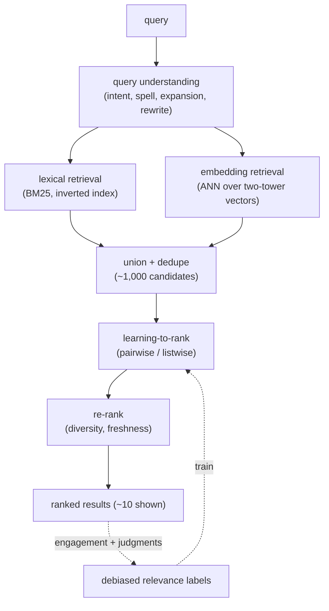
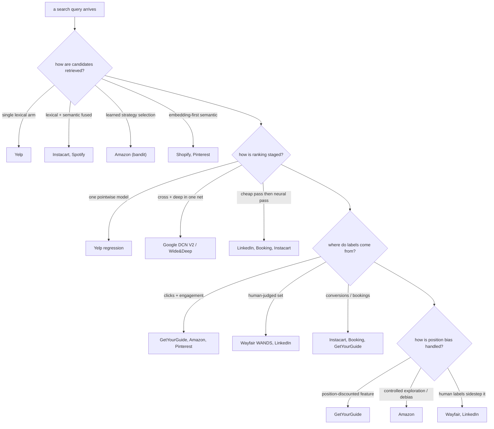
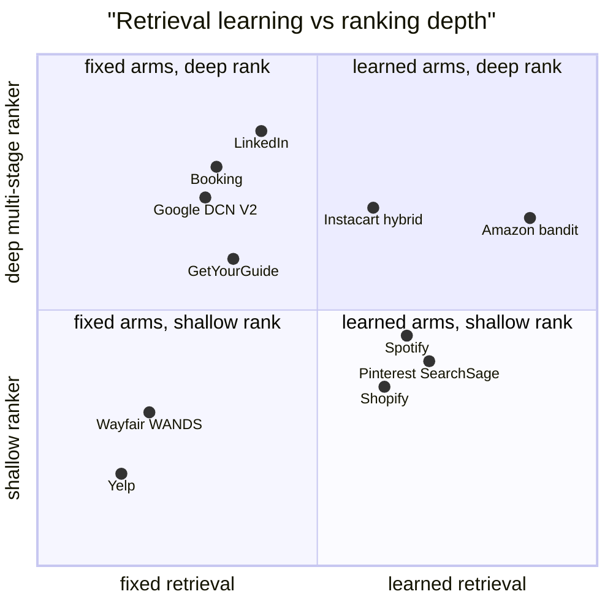

## Search ranking, side by side

**What they share.** Every system splits search into a cheap retrieval stage that fetches candidates and a learned ranking stage that orders them, and all struggle with the same core problem: the training labels (clicks, bookings) are biased by where a result was shown, so relevance and exposure get tangled. Underneath the product-specific detail they run one skeleton: understand the query, retrieve with a lexical arm and an embedding arm, then score the survivors with a learning-to-rank model trained on fused human judgments plus debiased engagement.

**The reference pipeline.** The canonical search stack is four stages in sequence. A raw query is first understood (intent, spelling, expansion, rewrites), which drives two retrieval arms in parallel (BM25 over an inverted index and ANN over embeddings). The arms are unioned and deduped into roughly a thousand candidates, a learning-to-rank model orders them, and an optional re-rank pass adds diversity and freshness before the top results render. Engagement plus human judgments flow back as labels that retrain the ranker.

Where teams diverge is which arm dominates and where the labeling budget goes, not the shape.

**The choices, side by side.**

| Decision | Options (who) | What decides it |
| --- | --- | --- |
| Retrieval arm | Single lexical (Yelp); lexical + semantic fusion (Instacart, Spotify); learned strategy selection via bandit (Amazon); pure embedding / two-tower (Shopify, Pinterest) | Catalog size and query variety: exact-match domains lean lexical, intent-heavy or multilingual domains add semantic towers, and heterogeneous intent pushes toward learned arm selection |
| LTR objective | Pointwise regression (Yelp); explicit cross plus deep interaction net (Google DCN V2, Wide and Deep); multi-stage recall-then-precision (LinkedIn, Booking, Instacart, GetYourGuide) | Whether the task is match-or-not (pointwise) versus ordering many candidates cheaply then precisely (multi-stage) under a latency budget |
| Label source | Clicks and engagement (GetYourGuide, Pinterest, Amazon); human-judged relevance (Wayfair WANDS, LinkedIn); conversions and bookings (Instacart, Booking, GetYourGuide) | The business outcome you are willing to trust: engagement is abundant but biased, human labels are clean but expensive, conversions are sparse but truthful |
| Position bias | Position-discounted feature (GetYourGuide); controlled exploration and debiasing (Amazon); human labels that sidestep exposure bias (Wayfair, LinkedIn); implicit or unaddressed (Shopify, Spotify semantic-first) | How much of your signal is logged clicks: the more you train on exposure-driven engagement, the more explicit debiasing you must buy |

**The math that separates them.** Pointwise learning-to-rank (Yelp) fits each candidate independently against a graded label:

$$L_{point} = \sum_{i} \left( f(x_i) - y_i \right)^{2}$$

A two-tower retrieval model (Spotify, Pinterest) with in-batch negatives maximizes the softmax over batch positives, so a batch of size $B$ supplies $B^{2} - B$ negatives for free:

$$L_{tower} = -\frac{1}{B}\sum_{i=1}^{B} \log \frac{\exp\left(\text{sim}(q_i, d_i)/\tau\right)}{\sum_{j=1}^{B} \exp\left(\text{sim}(q_i, d_j)/\tau\right)}$$

DCN V2 (Google) stacks explicit feature crosses where each layer multiplies against the original input, so interaction order grows with depth $l$:

$$x_{l+1} = x_0 \odot \left(W_l x_l + b_l\right) + x_l$$

The lexical arm scores documents with BM25, which rewards term frequency $f(t, D)$ with saturation and discounts common terms by inverse document frequency, normalized by document length $|D|$ against the average $L_{avg}$:

$$\text{BM25}(Q, D) = \sum_{t \in Q} \text{IDF}(t) \cdot \frac{f(t, D) \cdot (k_1 + 1)}{f(t, D) + k_1 \cdot \left(1 - b + b \cdot \frac{|D|}{L_{avg}}\right)}$$

When the two retrieval arms are fused without comparable score scales (Instacart), reciprocal rank fusion combines them by rank alone, where $r_a(d)$ is the rank of document $d$ in arm $a$ and $k$ (often $60$) damps the top slots:

$$\text{RRF}(d) = \sum_{a \in \{\text{lex}, \text{sem}\}} \frac{1}{k + r_a(d)}$$

The graded, position-weighted offline metric is NDCG, where DCG discounts each graded relevance $rel_i$ by the log of its position and IDCG is the DCG of the ideal ordering, so the ratio lands in $[0, 1]$:

$$\text{DCG@}K = \sum_{i=1}^{K} \frac{2^{rel_i} - 1}{\log_{2}(i + 1)}, \qquad \text{NDCG@}K = \frac{\text{DCG@}K}{\text{IDCG@}K}$$

Position-debiased training (GetYourGuide, Amazon) weights each logged label by the inverse propensity $p(\text{rank}_i)$ of its slot, decoupling relevance from exposure:

$$L_{IPW} = \sum_{i} \frac{y_i}{p(\text{rank}_i)} \, \ell\left(f(x_i), y_i\right)$$

**Interview watch-outs.**

- **Position bias is the headline trap.** Naive click training teaches the model to predict rank, not relevance, and locks in whatever order you already shipped. Reach for inverse-propensity weighting or position-as-a-train-time-feature (fixed at serving), and inject a little randomization so you can keep estimating propensities. GetYourGuide bakes it into a position-discounted feature; Amazon uses controlled exploration.
- **Name your label source and its bias.** Clicks are abundant but exposure-biased, human judgments are clean but scarce and slow, conversions and bookings are truthful but sparse and optimize buying rather than relevance. The strong answer fuses them: human judgments anchor and validate, engagement provides volume and freshness.
- **Offline NDCG can lie.** It is computed against labels that are themselves biased clicks plus a thin layer of human judgments, so a lift there routinely fails to survive online. Wire NDCG as a fast offline pre-gate and make the ship decision an interleaving experiment or an A/B test on engagement and reformulation rate.
- **Point-in-time correctness is load-bearing.** Bookings and clicks happen after the ranking event, so a join by key alone leaks future labels into features. Assemble the training set with point-in-time joins (GetYourGuide, LinkedIn both flag this) or the offline metric is inflated.
- **Match the loss to the metric.** Pointwise regression optimizes absolute scores everywhere, including deep in the list where it does not matter; the metric is about order and is position-weighted, so pairwise (RankNet) or listwise (LambdaMART targets NDCG directly) is the senior default. Yelp gets away with pointwise only because its task is essentially match-or-not per candidate.
- **Neither retrieval arm is optional.** Lexical alone misses synonyms and paraphrases (the vocabulary gap); semantic alone drifts on rare terms, exact strings, and product codes. Fuse both, and normalize scores or fuse by rank (RRF) before the ranker sees a mixed set.
