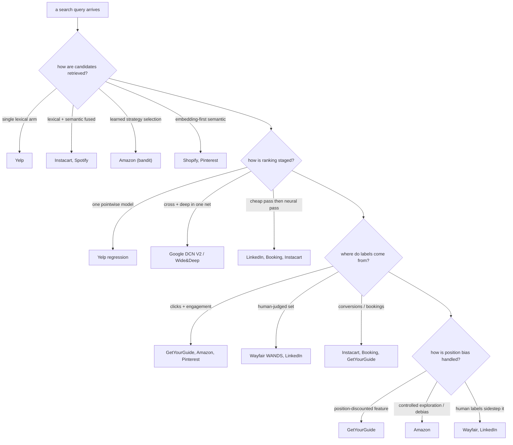
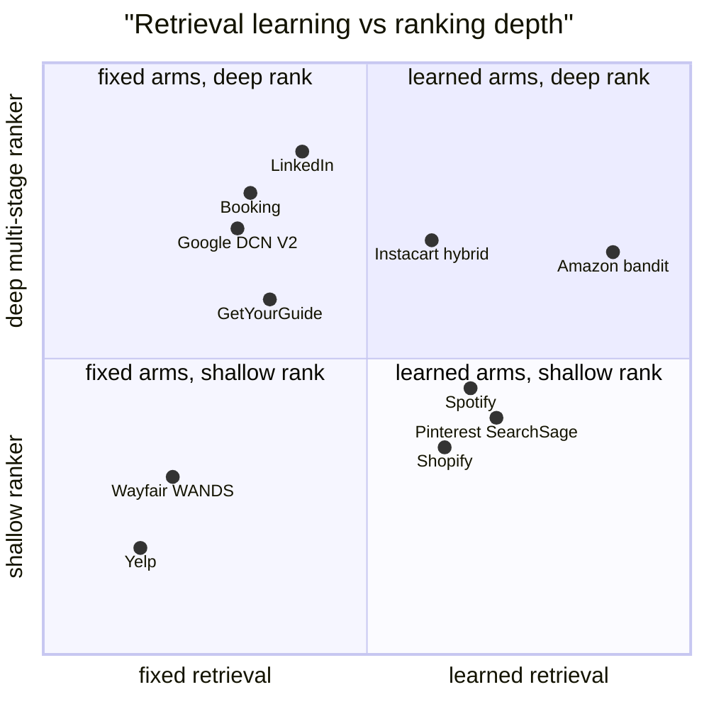

## Search ranking, side by side

**What they share.** Every system splits search into a cheap retrieval stage that fetches candidates and a learned ranking stage that orders them, and all struggle with the same core problem: the training labels (clicks, bookings) are biased by where a result was shown, so relevance and exposure get tangled.

**The choices, side by side.**

| Decision | Options (who) | What decides it |
| --- | --- | --- |
| Retrieval arm | Single lexical (Yelp); lexical + semantic fusion (Instacart, Spotify); learned strategy selection via bandit (Amazon); pure embedding / two-tower (Shopify, Pinterest) | Catalog size and query variety: exact-match domains lean lexical, intent-heavy or multilingual domains add semantic towers, and heterogeneous intent pushes toward learned arm selection |
| LTR objective | Pointwise regression (Yelp); explicit cross plus deep interaction net (Google DCN V2, Wide and Deep); multi-stage recall-then-precision (LinkedIn, Booking, Instacart, GetYourGuide) | Whether the task is match-or-not (pointwise) versus ordering many candidates cheaply then precisely (multi-stage) under a latency budget |
| Label source | Clicks and engagement (GetYourGuide, Pinterest, Amazon); human-judged relevance (Wayfair WANDS, LinkedIn); conversions and bookings (Instacart, Booking, GetYourGuide) | The business outcome you are willing to trust: engagement is abundant but biased, human labels are clean but expensive, conversions are sparse but truthful |
| Position bias | Position-discounted feature (GetYourGuide); controlled exploration and debiasing (Amazon); human labels that sidestep exposure bias (Wayfair, LinkedIn); implicit or unaddressed (Shopify, Spotify semantic-first) | How much of your signal is logged clicks: the more you train on exposure-driven engagement, the more explicit debiasing you must buy |

**The math that separates them.** Pointwise learning-to-rank (Yelp) fits each candidate independently against a graded label:

$$L_{point} = \sum_{i} \left( f(x_i) - y_i \right)^2$$

A two-tower retrieval model (Spotify, Pinterest) with in-batch negatives maximizes the softmax over batch positives, so a batch of size $B$ supplies $B^2 - B$ negatives for free:

$$L_{tower} = -\frac{1}{B}\sum_{i=1}^{B} \log \frac{\exp(\text{sim}(q_i, d_i)/\tau)}{\sum_{j=1}^{B} \exp(\text{sim}(q_i, d_j)/\tau)}$$

DCN V2 (Google) stacks explicit feature crosses where each layer multiplies against the original input, so interaction order grows with depth $l$:

$$x_{l+1} = x_0 \odot (W_l x_l + b_l) + x_l$$

Position-debiased training (GetYourGuide, Amazon) weights each logged label by the inverse propensity of its slot, decoupling relevance from exposure:

$$L_{IPS} = \sum_{i} \frac{y_i}{p(\text{rank}_i)} \ell\big(f(x_i), y_i\big)$$

