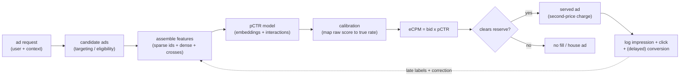
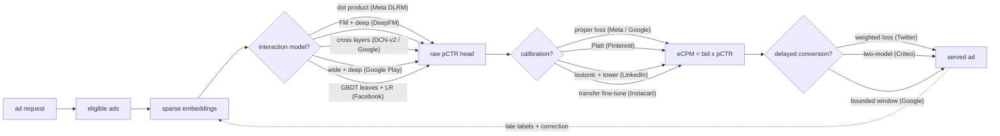
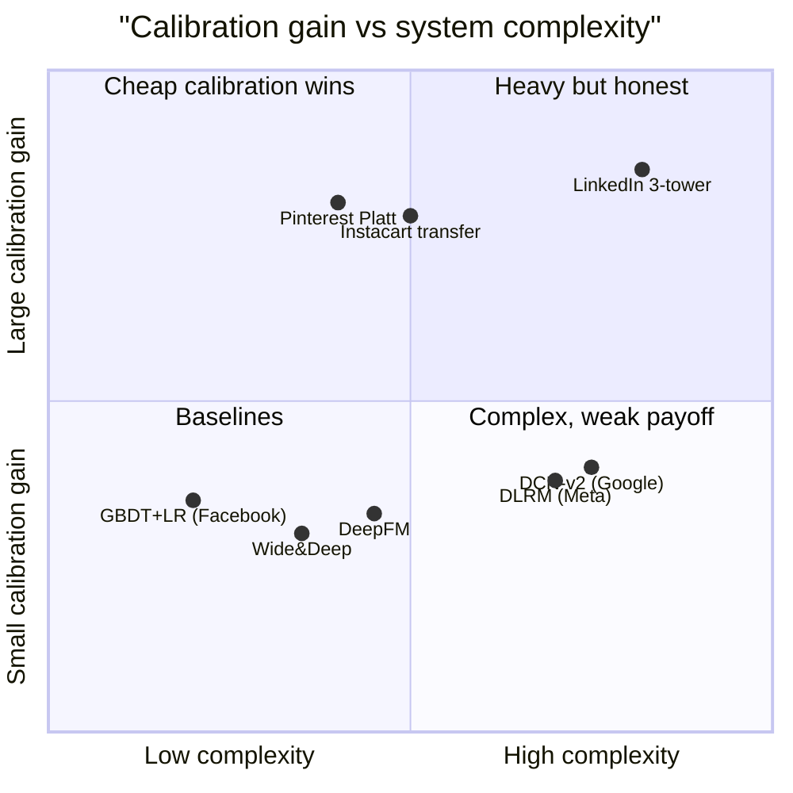

**What they share.** Every system pulls eligible ads, scores each with a sparse-embedding model into a calibrated pCTR, and feeds `eCPM = bid x pCTR` into the auction; they diverge only on how feature interactions are carried and how calibration is defended as labels drift and conversions land late.

**The reference pipeline.** Strip away the model-family and calibration choices and every one of these systems is the same skeleton: a request resolves a candidate set, a sparse-embedding net produces a raw pCTR, a calibration step maps that score onto true rates, and the auction turns the calibrated probability into money via eCPM. Delayed conversions and the show-only-what-you-scored logging policy feed the next training cycle.

**Reading the diagram.** Read it left to right as the life of one ad slot. The ad request arrives with user plus context, and targeting and eligibility narrow the whole inventory to a candidate set of tens to a few hundred ads that are actually allowed to serve. Feature assembly then stitches together sparse ids (user, ad, advertiser, creative), dense signals, and crosses, and this is a point-in-time read from the feature store, so training-serving skew here quietly poisons everything downstream. The pCTR model (DLRM at Meta, DCN-v2 at Google, GBDT plus LR in the classic Facebook recipe) embeds those sparse ids and models interactions to emit a raw score, but that score is not yet a probability, which is why the calibration step (proper loss, Platt at Pinterest, isotonic at LinkedIn) maps it onto true rates before it can price anything. Calibration feeds the auction directly: eCPM = bid times pCTR ranks the candidates and the second-price charge is derived from that number, so a raw head that is off by 20 percent mis-prices every slot even at identical AUC, which is the single sharpest failure mode of the pipeline. The served impression, click, and (days-later) delayed conversion flow into the log, and the dashed edge back to features is the trap: you only ever log outcomes for ads you chose to show, so today's policy shapes tomorrow's training data and a not-yet-converted click is an unresolved label, not a confirmed negative. The design leverage lives at exactly two joints, the calibration layer (recalibrate hourly on a light tower while the heavy net retrains daily, monitor sliced ECE) and the logging loop (exploration, inverse-propensity weighting, delay-aware loss), because those are where honest probabilities and unbiased labels are won or lost.

**The choices, side by side.**

| Decision | Options (who) | What decides it |
| --- | --- | --- |
| interaction model | `DLRM` (Meta) vs `DeepFM` vs `DCN-v2` vs `Wide&Deep` vs `GBDT+LR` (Facebook) | how sparse the space is and whether pairwise dot products, learned FM crosses, bounded-degree cross layers, memorize-plus-generalize branches, or tree-discovered crosses carry the signal; trees cap out at billions of ids |
| calibration | `proper-loss` vs `Platt` (Pinterest) vs `isotonic` (LinkedIn) vs transfer fine-tune (Instacart) | how far the raw head drifts from true rates under negative sampling and exposure bias, and whether you must recalibrate hourly while the heavy net retrains daily |
| delayed conversion | `weighted loss` (Twitter) vs `two-model` (Criteo) vs windows (Google) | the conversion delay distribution and whether a not-yet-converted click can be treated as a confirmed negative inside the attribution window |
| feature/embedding scale | row-per-id (small space) vs feature hashing + sharding (billions of ids: DLRM, Google) | id-space cardinality and memory budget; hashing trades controlled collisions for a bounded, shardable table, and model-parallel embeddings plus data-parallel MLP for DLRM |

**The math that separates them.**

$$\textbf{eCPM = bid times pCTR} : \quad \text{eCPM} = 1000 \cdot b \cdot \hat{p}(\text{click})$$

$$\textbf{log loss, a proper score} : \quad \mathcal{L} = -\frac{1}{N}\sum_{i=1}^{N} \big[ y_i \log \hat{p}_i + (1-y_i)\log(1-\hat{p}_i) \big]$$

$$\textbf{expected calibration error} : \quad \text{ECE} = \sum_{b=1}^{B} \frac{n_b}{N} \big| \text{acc}(b) - \text{conf}(b) \big|$$

$$\textbf{fake-negative weighted loss} : \quad \mathcal{L}_w = -\frac{1}{N}\sum_{i=1}^{N} w_i \big[ y_i \log \hat{p}_i + (1-y_i)\log(1-\hat{p}_i) \big]$$

$$\textbf{second-price charge} : \quad \text{price} = \frac{\text{eCPM}_{\text{runner up}}}{1000 \cdot \hat{p}(\text{click})}$$

$$\textbf{Platt-scaled calibration} : \quad q = \sigma(a \cdot s + b) = \frac{1}{1 + e^{-(a s + b)}}$$

$$\textbf{delayed-feedback observed positive} : \quad \Pr(\text{convert by elapsed } e) = p(x)\big(1 - e^{-\lambda(x) e}\big)$$

**When to use which.** Pick the interaction model, the calibration layer, and the loss from id-space size, how far the raw head drifts, and how late conversions land.

| Reach for | When | Instead of |
|---|---|---|
| GBDT plus LR (Facebook) | id space is modest and tree-discovered crosses carry the signal | DLRM, when the space runs to billions of sparse ids trees cannot hold |
| DLRM (Meta) or DCN-v2 (Google) | billions of sparse ids and explicit crosses drive pCTR | GBDT, when the id space is small enough to enumerate |
| Feature hashing plus sharding | id cardinality is open-ended and you are memory-bound | a row-per-id table, which is fine only for a small closed space |
| Platt or isotonic recalibration (Pinterest, LinkedIn) | the raw head drifts under negative sampling and must track hourly | a full DNN retrain, which is too slow and costly to chase drift |
| Log loss as the objective | you need honest probabilities the auction can price off | an AUC-only objective, which reads order but not absolute rate |
| Sliced ECE monitoring | you must catch calibration rot per segment | one global calibration number, which hides local mis-pricing |
| Delay-aware or fake-negative weighted loss (Twitter, Criteo) | conversions land days after the click inside the attribution window | labeling a not-yet-converted click a confirmed negative, biasing pCVR |
| Second-price charge off calibrated pCTR | pricing the winning bid from a true-rate probability | an uncalibrated raw score, which mis-prices every slot at equal AUC |

**Interview watch-outs.** The traps that separate a passing answer from a stalled one, each as trap, the wrong reflex, and the right move.

- **Calibration vs ranking quality.** Trap: the interviewer notes AUC went up but revenue fell. Wrong: chase a fancier interaction model to lift AUC further. Right: suspect calibration first, because AUC only reads order while the auction prices off the absolute pCTR, so a shifted probability distribution mis-prices every eCPM even at identical AUC.
- **Where the parameters live.** Trap: asked to size and shard the model. Wrong: fixate on the top MLP FLOPs and dense-layer parallelism. Right: name the embedding tables as the billions-of-parameters bottleneck, put model parallelism on the tables and data parallelism on the MLP, and bound the open-ended id space with feature hashing plus accepted collisions.
- **Delayed conversions as negatives.** Trap: a purchase lands three days after the click. Wrong: label every not-yet-converted click as a confirmed negative and train immediately. Right: treat it as an unresolved label, use a delay-aware or fake-negative weighted loss (or a bounded attribution window with a tail correction), since counting it negative biases pCVR down and under-bids real value.
- **The logging feedback loop.** Trap: asked whether training on your own served clicks is circular. Wrong: wave it away because AUC on the logged set looks healthy. Right: acknowledge the loop, since the model only ever sees outcomes for ads it chose to show, and break it with exploration (off-policy or randomized traffic), inverse-propensity weighting, and position-bias correction.
- **Naming the interaction models apart.** Trap: DeepFM vs DCN vs DLRM vs Wide-and-Deep. Wrong: call them interchangeable deep CTR models. Right: distinguish them by how interactions are carried, FM-plus-deep in parallel over shared embeddings (DeepFM), explicit bounded-degree cross layers (DCN), explicit pairwise dot products before a top MLP (DLRM), linear memorization plus deep generalization branches (Wide-and-Deep).
- **Calibration cadence vs retrain cadence.** Trap: campaigns and demand shift hourly but the heavy net retrains daily. Wrong: retrain the whole DNN more often to chase freshness. Right: decouple the two, recalibrate with a lightweight layer (Platt, isotonic, or a shallow tower) on a fast cadence and partially refresh id embeddings, so calibration tracks drift without the cost of a full retrain, and monitor sliced ECE not one global number.
