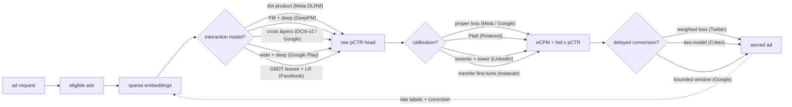
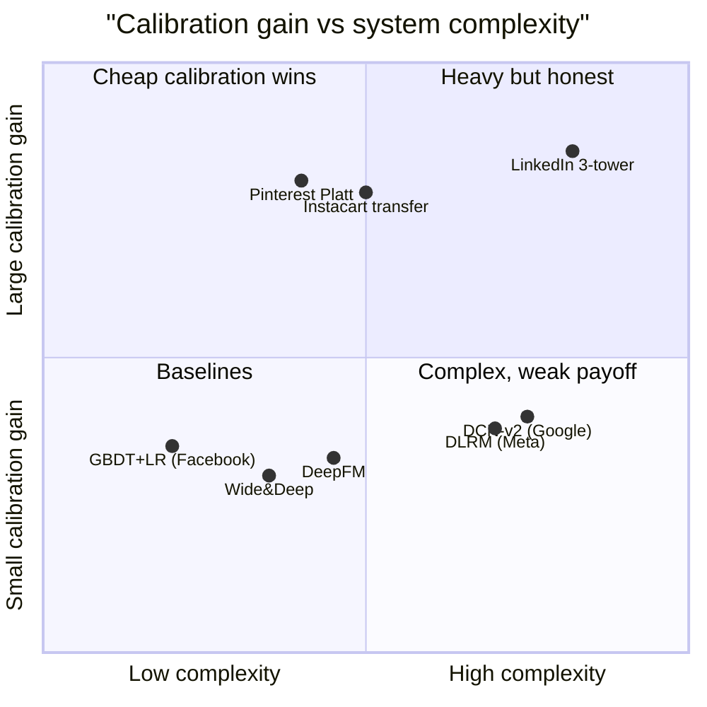

**What they share.** Every system pulls eligible ads, scores each with a sparse-embedding model into a calibrated pCTR, and feeds `eCPM = bid x pCTR` into the auction; they diverge only on how feature interactions are carried and how calibration is defended as labels drift and conversions land late.

**The choices, side by side.**

| Decision | Options (who) | What decides it |
| --- | --- | --- |
| interaction model | `DLRM` (Meta) vs `DeepFM` vs `DCN-v2` vs `Wide&Deep` vs `GBDT+LR` (Facebook) | how sparse the space is and whether pairwise dot products, learned FM crosses, bounded-degree cross layers, memorize-plus-generalize branches, or tree-discovered crosses carry the signal; trees cap out at billions of ids |
| calibration | `proper-loss` vs `Platt` (Pinterest) vs `isotonic` (LinkedIn) vs transfer fine-tune (Instacart) | how far the raw head drifts from true rates under negative sampling and exposure bias, and whether you must recalibrate hourly while the heavy net retrains daily |
| delayed conversion | `weighted loss` (Twitter) vs `two-model` (Criteo) vs windows (Google) | the conversion delay distribution and whether a not-yet-converted click can be treated as a confirmed negative inside the attribution window |
| feature/embedding scale | row-per-id (small space) vs feature hashing + sharding (billions of ids: DLRM, Google) | id-space cardinality and memory budget; hashing trades controlled collisions for a bounded, shardable table, and model-parallel embeddings plus data-parallel MLP for DLRM |

**The math that separates them.**

$$\textbf{eCPM = bid times pCTR} : \quad \text{eCPM} = 1000 \cdot b \cdot \hat{p}(\text{click})$$

$$\textbf{log loss, a proper score} : \quad \mathcal{L} = -\frac{1}{N}\sum_{i=1}^{N} \big[\, y_i \log \hat{p}_i + (1-y_i)\log(1-\hat{p}_i)\,\big]$$

$$\textbf{expected calibration error} : \quad \text{ECE} = \sum_{b=1}^{B} \frac{n_b}{N}\,\big|\,\text{acc}(b) - \text{conf}(b)\,\big|$$

$$\textbf{fake-negative weighted loss} : \quad \mathcal{L}_w = -\frac{1}{N}\sum_{i=1}^{N} w_i \big[\, y_i \log \hat{p}_i + (1-y_i)\log(1-\hat{p}_i)\,\big]$$

