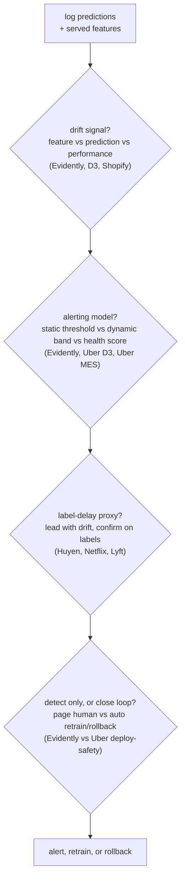
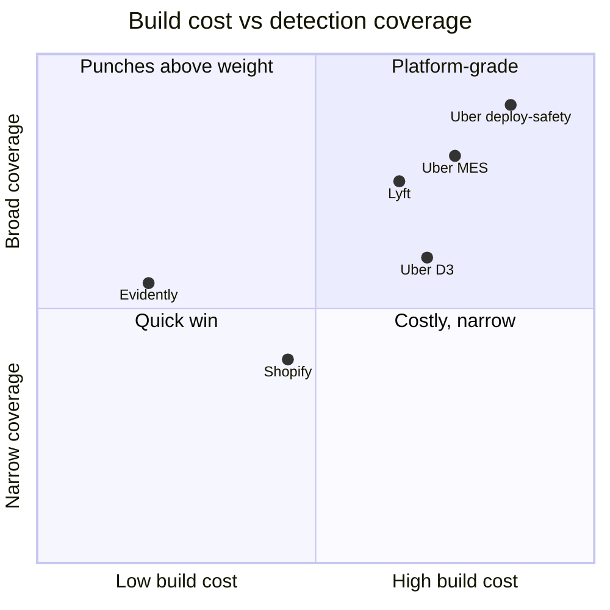

**What they share.** Every system logs production predictions alongside the exact features that produced them, runs cheap label-free distribution and data-health checks on that log immediately, and waits for labels to confirm true performance. The dividing line is whether a system stops at detection or closes the loop by gating, retraining, or rolling back on its own.

**The choices, side by side.**

| Decision | Options (who) | What decides it |
| --- | --- | --- |
| drift signal | `feature/PSI` (Evidently, Uber D3) vs `performance` (Uber MES, Lyft) vs `concept` (Shopify fraud) | how fast labels arrive, and whether the input-to-label mapping (not just inputs) can move |
| alerting | `static threshold` (Evidently defaults) vs `dynamic bands` (Uber D3 Prophet) vs `health score` (Uber MES) | seasonality in the data, and how many models or datasets share one quality bar |
| label-delay proxy | `input + prediction drift now` (Huyen, Netflix) vs `shadow on live inputs` (Uber deploy-safety) vs `wait for AUC` (Lyft) | label latency: seconds (click) watches accuracy live, days or weeks (churn, default) forces leading proxies |
| build vs adopt | `platform` (Uber D3, deploy-safety, MES) vs `Evidently tooling` | infra budget and stakes: high-stakes promotion justifies shadow plus auto-rollback, low-stakes just needs metrics fast |

**The math that separates them.**

$$\textbf{Population Stability Index}\quad \mathrm{PSI}=\sum_{i}\left(p_i-q_i\right)\ln\frac{p_i}{q_i}$$

$$\textbf{Data drift moves inputs}\quad P_{\text{cur}}(X)\neq P_{\text{ref}}(X),\qquad P(y\mid X)\ \text{unchanged}$$

$$\textbf{Concept drift moves the mapping}\quad P(y\mid X)\ \text{shifts},\qquad P(X)\ \text{fixed}$$

$$\textbf{KL divergence of two distributions}\quad D_{\mathrm{KL}}(P\parallel Q)=\sum_{i}P_i\ln\frac{P_i}{Q_i}$$

