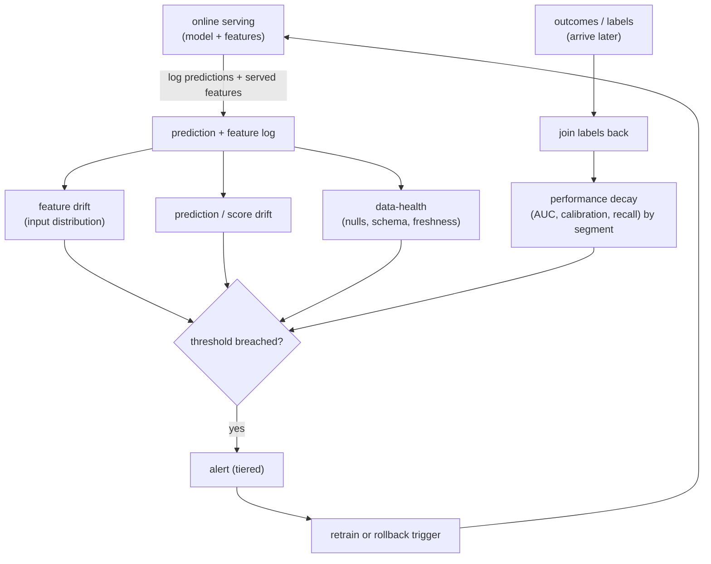
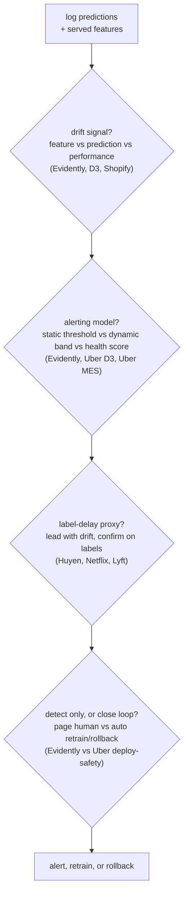
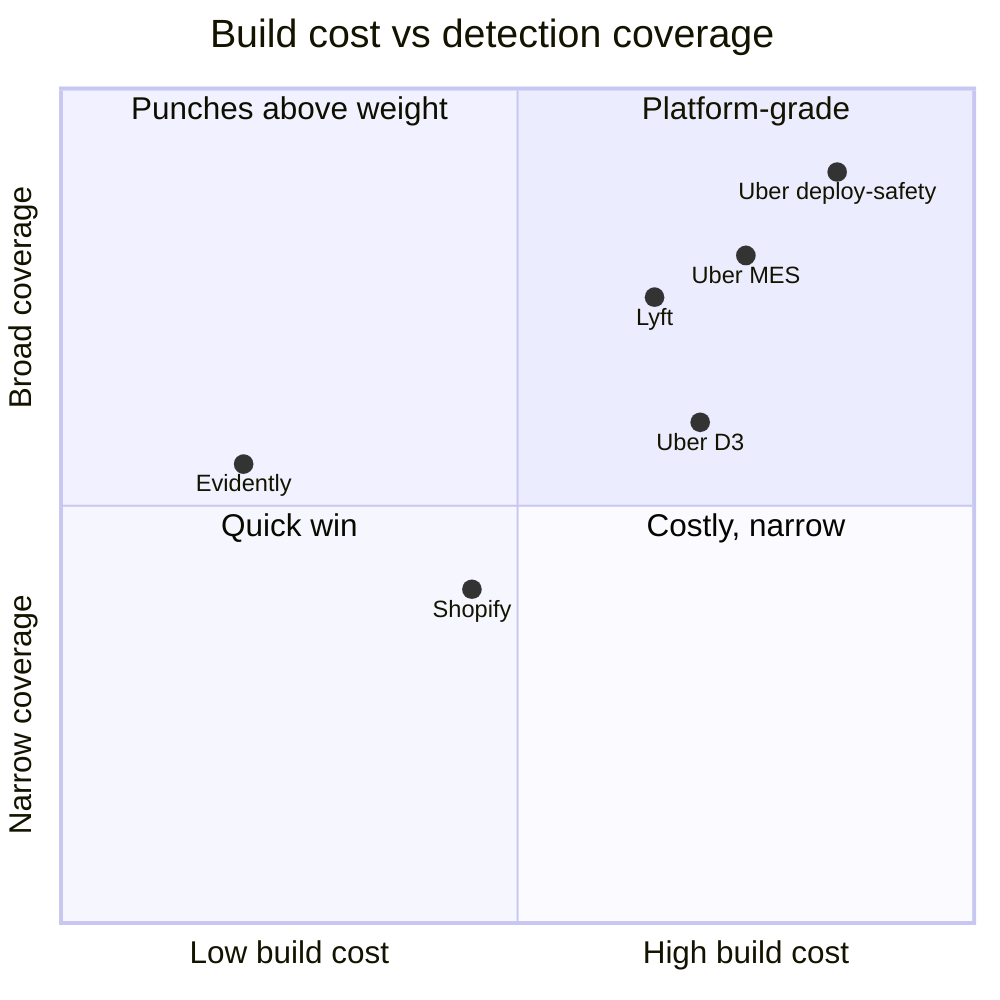

**What they share.** Every system logs production predictions alongside the exact features that produced them, runs cheap label-free distribution and data-health checks on that log immediately, and waits for labels to confirm true performance. The dividing line is whether a system stops at detection or closes the loop by gating, retraining, or rolling back on its own.

**The reference pipeline.** The canonical monitoring loop runs beside serving: predictions and served features stream into one log, three cheap detectors (feature drift, prediction or score drift, data-health) fire off that log immediately, and a slower performance-decay signal joins in once labels land. Breaches feed one tiered alerting layer that pages a human, triggers a retrain, or fires a rollback, and the retrain flows back into serving to close the loop.

**The choices, side by side.**

| Decision | Options (who) | What decides it |
| --- | --- | --- |
| drift signal | `feature/PSI` (Evidently, Uber D3) vs `performance` (Uber MES, Lyft) vs `concept` (Shopify fraud) | how fast labels arrive, and whether the input-to-label mapping (not just inputs) can move |
| alerting | `static threshold` (Evidently defaults) vs `dynamic bands` (Uber D3 Prophet) vs `health score` (Uber MES) | seasonality in the data, and how many models or datasets share one quality bar |
| label-delay proxy | `input + prediction drift now` (Huyen, Netflix) vs `shadow on live inputs` (Uber deploy-safety) vs `wait for AUC` (Lyft) | label latency: seconds (click) watches accuracy live, days or weeks (churn, default) forces leading proxies |
| build vs adopt | `platform` (Uber D3, deploy-safety, MES) vs `Evidently tooling` | infra budget and stakes: high-stakes promotion justifies shadow plus auto-rollback, low-stakes just needs metrics fast |

**The math that separates them.**

$$\textbf{Population Stability Index}\quad \mathrm{PSI}=\sum_{i}\left(p_i-q_i\right)\ln\frac{p_i}{q_i}$$

where $p_i$ and $q_i$ are the reference and current fraction of mass in bin $i$. A common field rule reads $\mathrm{PSI}<0.1$ as stable, $0.1$ to $0.25$ as moderate shift, and above $0.25$ as a material move worth an alert.

$$\textbf{Data drift moves inputs}\quad P_{\text{cur}}(X)\neq P_{\text{ref}}(X),\qquad P(y\mid X)\ \text{unchanged}$$

$$\textbf{Concept drift moves the mapping}\quad P(y\mid X)\ \text{shifts},\qquad P(X)\ \text{fixed}$$

The split matters because the fix differs: retraining on fresh data cleanly repairs data drift where only $P(X)$ moved, but only helps concept drift once enough re-labeled examples of the new $P(y\mid X)$ exist.

$$\textbf{KL divergence of two distributions}\quad D_{\mathrm{KL}}(P\parallel Q)=\sum_{i}P_i\ln\frac{P_i}{Q_i}$$

$$\textbf{Population Stability Index as symmetrized KL}\quad \mathrm{PSI}=D_{\mathrm{KL}}(P\parallel Q)+D_{\mathrm{KL}}(Q\parallel P)$$

so PSI is just the symmetric sibling of KL: KL is directional and asymmetric ($D_{\mathrm{KL}}(P\parallel Q)\neq D_{\mathrm{KL}}(Q\parallel P)$), PSI adds both directions so the score does not depend on which window you call the reference.

**Interview watch-outs.**

- Label delay is the whole game: if the truth arrives in seconds you monitor accuracy live, but for fraud or default (days to weeks) you must lead with input and prediction drift as proxies and confirm on labels later.
- Premature labeling biases accuracy low: scoring a click-through label before the feedback window closes counts not-yet-clicks as negatives, so the metric lies until you wait the window out.
- Decay without drift is real: concept drift can move $P(y\mid X)$ while $P(X)$ barely budges, so a green feature-drift dashboard is not proof of health; watch the feature-to-label relationship and segmented performance, not just marginals.
- Drift without decay is also real: a feature can drift hard yet not matter if the model barely weights it; PSI and KS answer "did it move," not "does it matter," so gate on impact, not raw movement.
- Alert fatigue kills a monitor: fire on sustained breaches (not single noisy points), set thresholds from historical variation, tier severity (page a fraud model, dashboard-note a feed model), and make every alert name the feature and segment that moved.
- A pipeline bug looks exactly like drift: a null-returning feature or a schema change reads as a distribution shift; run data-health and online-offline parity checks first so you do not retrain to "fix drift" that is really a broken feature.
