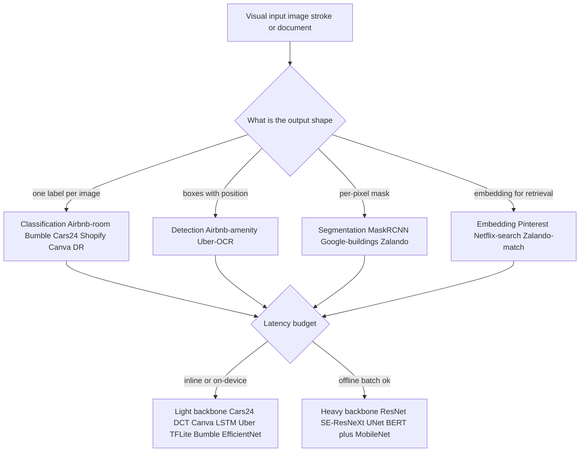
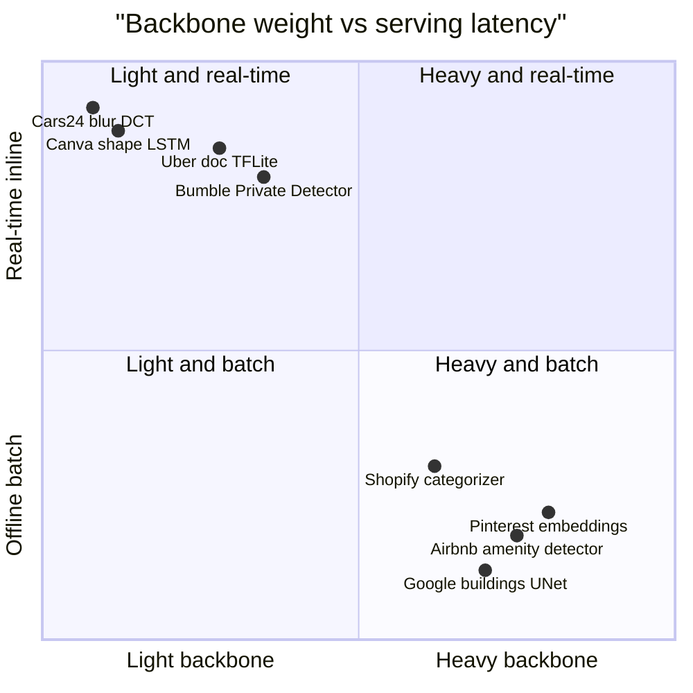

## How these vision systems diverge

**What they share.** Every system ingests an image (or a stroke sequence), runs a learned or hand-crafted feature extractor, and thresholds a score into an action; they diverge on the task head, the backbone weight, how labels are sourced, and where inference runs.

**The choices, side by side.**

| Decision | Options (who) | What decides it |
| --- | --- | --- |
| Task head | classification (Cars24, Shopify, Airbnb-room, Bumble, Canva) vs detection (Airbnb-amenity, Uber-OCR) vs segmentation (Mask R-CNN, Google-buildings) vs embedding (Pinterest, Netflix) | Does the product need a label, a position, a boundary, or a similarity match |
| Backbone | hand-crafted DCT (Cars24), tiny LSTM (Canva), MobileNet or EfficientNet or quantized (Shopify, Uber, Bumble) vs ResNet or SE-ResNeXt or U-Net or BERT (Airbnb, Pinterest, Google, Shopify-text) | Latency and device budget versus accuracy ceiling |
| Labeling | manual annotation (Shopify, Airbnb, Google), multi-grader consensus (DR), hard-negative mining (Bumble), volunteer collection (Canva), synthetic (Netflix-QC) | Cost of a label and the cost of a wrong one |
| Serving | on-device or inline real-time (Cars24, Canva, Uber, Bumble) vs offline batch or precomputed index (Airbnb, Pinterest, Netflix, Google) | Is the output on a user-facing critical path |

**The math that separates them.**

Detection and segmentation quality rest on intersection-over-union between a predicted region and ground truth:

$$IoU = \frac{|A \cap B|}{|A \cup B|}$$

Detectors (Airbnb amenities, Google buildings) report mean average precision, the mean over classes of area under each precision-recall curve at a fixed IoU:

$$mAP = \frac{1}{C}\sum_{c=1}^{C} \int_{0}^{1} p_c(r)\, dr$$

Gate-style classifiers (Bumble, Cars24, Uber) pick an operating point by fixing precision and taking the recall achievable there:

$$R_{\text{op}} = \max\{\, R : P(t) \ge P_{\min} \,\}$$

Screening models (diabetic retinopathy) headline the harmonic mean of precision and recall so a collapse in either is punished:

$$F_1 = \frac{2\,P\,R}{P + R}$$

