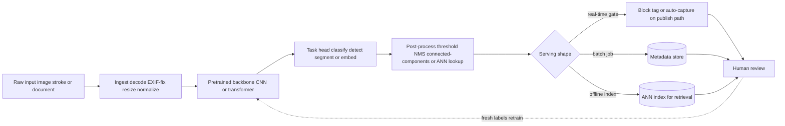
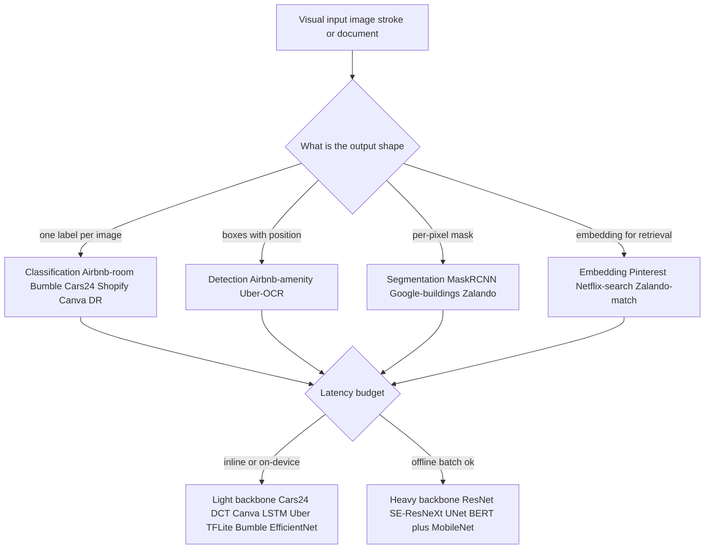
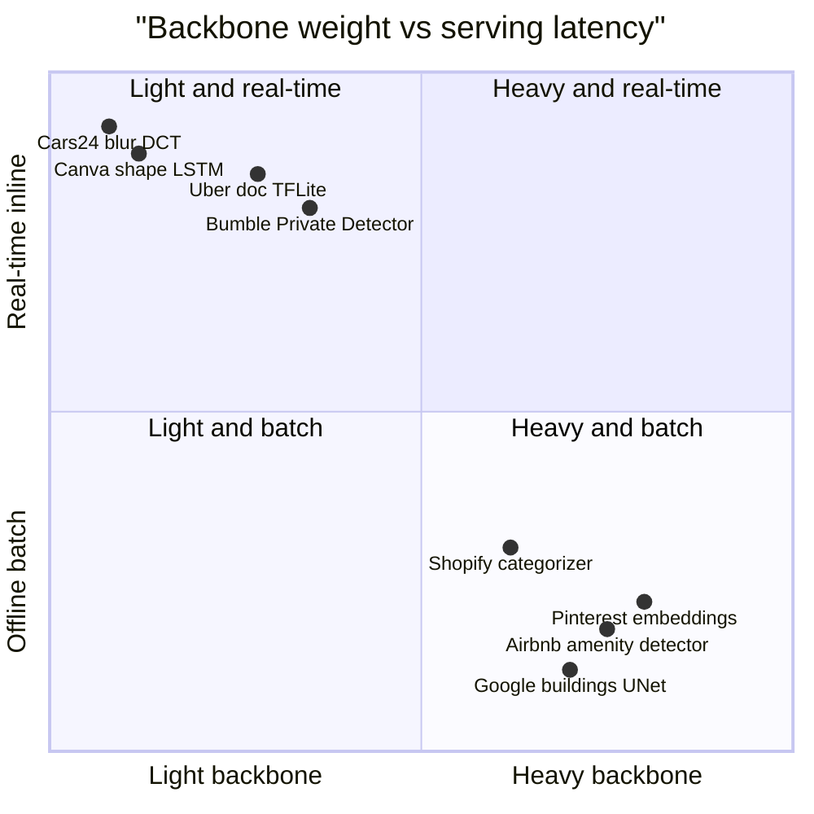

**What they share.** Every system ingests an image (or a stroke sequence), runs a learned or hand-crafted feature extractor, and thresholds a score into an action; they diverge on the task head, the backbone weight, how labels are sourced, and where inference runs. The skeleton underneath is always the same four stages: a canonical ingest step, a pretrained backbone that carries the transfer-learning leverage, a task-specific head, and a post-process or serving step that turns raw model output into a product decision. A human-review loop feeds corrected labels back into the backbone.

**The reference pipeline.** Read every design below as a specialization of this canonical flow. What changes across systems is which head hangs off the backbone and whether the tail gates a publish, tags a photo, or lands a vector in an index; the ingest and backbone stages are shared infrastructure.

**Reading the diagram.** Ingest is the unglamorous front door: it decodes bytes, fixes EXIF rotation, resizes, and normalizes so every downstream stage sees a canonical tensor, and sloppy decode here silently starves the GPU and corrupts accuracy before any model runs. The pretrained backbone is where transfer learning does the heavy lifting, since a CNN or transformer trunk from ImageNet-scale pretraining lets teams like Airbnb and Pinterest reach product accuracy on a few thousand labels instead of millions, making labeling cost, not model architecture, the real early budget. The task head is the cheapest place to change behavior and the most common place to get it wrong: pick classification for a whole-image tag, detection for a box, segmentation for a per-pixel mask (Google buildings, Mask R-CNN), or an embedding for open-catalog retrieval, and using the wrong shape (classification for a localization job) is the classic junior mistake. Post-process turns raw logits into a decision via thresholding, non-max suppression, connected components, or an ANN lookup, and this is where you tune the operating point that the product actually implies. The serving fork decides the economics: a real-time publish gate (Bumble, Cars24, Uber) needs a distilled low-latency model, while an offline index (Pinterest, Netflix) can run heavy backbones on cheap batch or spot capacity, so at tens of millions of images a day GPU serving cost, not training, becomes the line item. The design leverage is that ingest and backbone are shared infrastructure, so swapping the head and the serving tail specializes the whole system while one trunk improvement lifts every task at once.

**Where they diverge.** The first fork is the output shape the head must emit; the second is the latency budget, which sets how heavy a backbone you can afford.

**The choices, side by side.**

| Decision | Options (who) | What decides it |
| --- | --- | --- |
| Task head | classification (Cars24, Shopify, Airbnb-room, Bumble, Canva) vs detection (Airbnb-amenity, Uber-OCR) vs segmentation (Mask R-CNN, Google-buildings) vs embedding (Pinterest, Netflix) | Does the product need a label, a position, a boundary, or a similarity match |
| Backbone | hand-crafted DCT (Cars24), tiny LSTM (Canva), MobileNet or EfficientNet or quantized (Shopify, Uber, Bumble) vs ResNet or SE-ResNeXt or U-Net or BERT (Airbnb, Pinterest, Google, Shopify-text) | Latency and device budget versus accuracy ceiling |
| Labeling | manual annotation (Shopify, Airbnb, Google), multi-grader consensus (DR), hard-negative mining (Bumble), volunteer collection (Canva), synthetic (Netflix-QC) | Cost of a label and the cost of a wrong one |
| Serving | on-device or inline real-time (Cars24, Canva, Uber, Bumble) vs offline batch or precomputed index (Airbnb, Pinterest, Netflix, Google) | Is the output on a user-facing critical path |

**The math that separates them.**

Precision and recall are the base pair, defined from the confusion counts; almost every metric below is built out of them:

$$P = \frac{TP}{TP + FP} \qquad R = \frac{TP}{TP + FN}$$

Detection and segmentation quality rest on intersection-over-union between a predicted region and ground truth:

$$IoU = \frac{\lvert A \cap B \rvert}{\lvert A \cup B \rvert}$$

Semantic segmentation (Google buildings, Zalando cutout) averages IoU over the class set, so a single dominant class cannot hide a weak one:

$$mIoU = \frac{1}{C}\sum_{c=1}^{C} \frac{\lvert A_c \cap B_c \rvert}{\lvert A_c \cup B_c \rvert}$$

Detectors (Airbnb amenities, Google buildings) report mean average precision, the mean over classes of area under each precision-recall curve at a fixed IoU:

$$mAP = \frac{1}{C}\sum_{c=1}^{C} \int_{0}^{1} p_c(r)\, dr$$

Gate-style classifiers (Bumble, Cars24, Uber) pick an operating point by fixing precision and taking the recall achievable there:

$$R_{\text{op}} = \max\lbrace R : P(t) \ge P_{\min} \rbrace$$

Screening models (diabetic retinopathy) headline the harmonic mean of precision and recall so a collapse in either is punished:

$$F_1 = \frac{2 P R}{P + R}$$

Retrieval systems (Pinterest, Netflix in-video, Zalando match) headline recall at k over a labeled query set, the fraction of queries whose relevant item lands in the top k of the ANN lookup:

$$R@k = \frac{1}{\lvert Q \rvert}\sum_{q \in Q} \mathbf{1}\!\left[ \text{rel}(q) \in \text{top-}k(q) \right]$$

**When to use which.** Match the task head, the backbone weight, and the headline metric to the output shape, the latency budget, and what the product gates on.

| Reach for | When | Instead of |
|---|---|---|
| Classification head | the product needs one label per whole image | a detection head, when position inside the frame matters |
| Detection head (Airbnb amenity, Uber-OCR) | you need boxes and position, not just a tag | classification for a localization job, the classic junior mistake |
| Segmentation head (Mask R-CNN, Google buildings) | a per-pixel boundary drives the decision | detection, when a bounding box is precise enough |
| Embedding head (Pinterest, Netflix) | the catalog is open and growing with no fixed class list | classification, which needs a closed taxonomy |
| Light backbone (Cars24 DCT, MobileNet) | inference is inline or on-device with a tight latency budget | a heavy trunk, viable only on offline batch capacity |
| Heavy backbone (ResNet, U-Net, BERT) | offline batch lets you spend for the accuracy ceiling | a light backbone, when it starves the accuracy target |
| Recall at a fixed precision floor (Bumble, Cars24) | a harm gate must hold a precision guarantee before shipping | F1, when the product does not imply a precision floor |
| mIoU for segmentation, mAP at IoU for detection | you need a shape-appropriate quality number | plain accuracy, which lets a dominant class hide a weak one |
| Recall at k (Pinterest, Netflix, Zalando) | quality is whether the right item lands in the top-k ANN pull | classification metrics, which do not read retrieval order |

**Interview watch-outs.**

- **Labeling is the budget, not GPUs, early on.** Box and mask labels cost far more than image-level tags (Airbnb amenity, Mask R-CNN), so a task-head choice is also a labeling-cost choice; reach for active learning, weak supervision, and human-review-as-labels before asking for a bigger annotation spend.
- **Class imbalance makes plain accuracy a trap.** Real taxonomies are Zipfian; a model can score 95 percent by ignoring every rare class. Report macro precision and recall, calibrate a threshold per class rather than one global cut, and consider retrieval for the extreme tail where you cannot get enough labels for a head.
- **GPU serving cost is the line item at scale.** At tens of millions of images a day, state cost per million, not per request. Split real-time moderation onto a distilled low-latency model from throughput-optimized batch tagging on cheap or spot capacity, quantize and compile, and watch that CPU-heavy decode does not starve the GPU.
- **Match the task head to the output shape.** Classification for a whole-image label, detection when position or a small region matters, segmentation for per-pixel boundaries, embedding for an open growing catalog with no fixed class list. Using classification for a localization job is the most common junior mistake.
- **Share one backbone across heads.** A single trunk with multiple heads (Pinterest unified embedding) cuts per-image compute and lets a trunk improvement lift every task at once; it is the biggest structural cost win.
- **Pick the metric and operating point the product implies.** mAP at IoU for detection, mean IoU for segmentation, recall at a fixed precision floor for a harm gate, recall at k for retrieval; then define fail-closed versus fail-open behavior for anything on the publish critical path.
