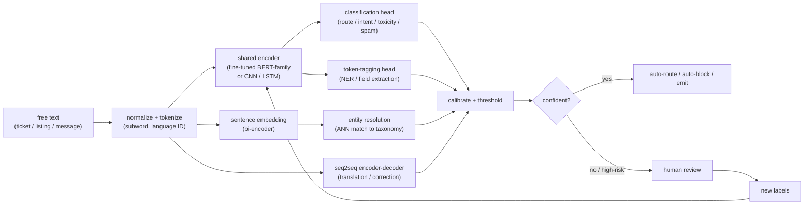
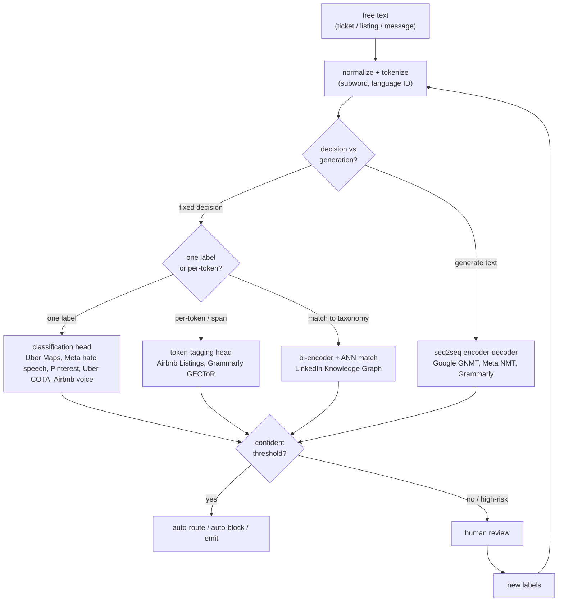
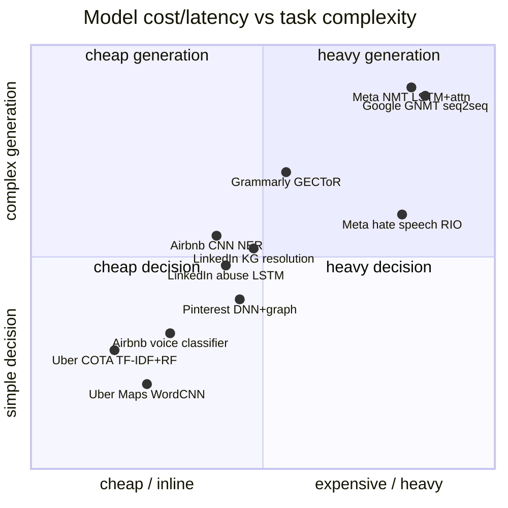

**What they share.** Every system normalizes and tokenizes free text once, then fans out to a task-specific model whose score a threshold either auto-acts on or routes to human review, whose verdicts flow back as fresh labels. None puts a large LLM on the inline firehose; volume forces a small, calibratable model on the hot path.

**The reference pipeline.** Under the product framing every system is the same skeleton: text is normalized and tokenized once, encoded by a shared backbone (a fine-tuned BERT-family encoder, or an earlier CNN/LSTM, or a seq2seq encoder-decoder for generation), then a thin task head turns the representation into a decision. A calibrated threshold auto-acts on the confident tail and hands the uncertain middle to human review, whose verdicts return as labels.

**Reading the diagram.** Follow it left to right: raw free text (a ticket, listing, or message) hits normalization and subword tokenization first, where language ID routes the string and casing/Unicode cleanup doubles as a safety control against homoglyph and zero-width evasion. That single token stream then fans out to whichever backbone the task needs: a fine-tuned BERT-family encoder (or an older CNN/LSTM) for fixed decisions, a bi-encoder sentence embedding for entity matching, or a seq2seq encoder-decoder when the output is generated text, and this fork is the central design call, since a distilled encoder scores in single-digit milliseconds and emits a calibratable probability while a large decoder LLM is orders of magnitude slower, pricier, and returns text you must parse, so the LLM belongs offline as a label factory and long-tail fallback, never on the inline firehose (the choice Meta, Uber, and Airbnb all made). Each backbone feeds a thin task head (classification, token-tagging NER, or ANN match) whose raw scores mean nothing until the calibrate-plus-threshold node turns them into real probabilities, which matters most under the brutal class imbalance of abuse and spam where the positive class sits well under one percent and accuracy is a trap, forcing loss weighting and per-class cost-aware cutoffs. The confidence gate is the product leverage point: auto-act on the confident tail, hand the uncertain middle to human review, and note that a shared multilingual encoder buys cross-lingual transfer but dilutes per-language capacity and fragments non-Latin scripts into more tokens (more latency), so slice eval per language and stay inside the tens-of-milliseconds budget that live traffic demands. The loop closes when every human verdict returns as a fresh label back into the encoder, which is exactly why thresholds must be recalibrated on each retrain as the score distribution shifts.

**Where they diverge.** One tokenization feeds many heads, but the head, model era, latency budget, and supervision each split the field.

**The choices, side by side.**

| Decision | Options (who) | What decides it |
| --- | --- | --- |
| task | `classify` (Uber Maps, Meta hate speech, Pinterest, Uber COTA, Airbnb voice) vs `NER/tagging` (Airbnb Listings, Grammarly) vs `translation/seq2seq` (Google GNMT, Meta NMT) vs `entity resolution` (LinkedIn KG) | Fixed decision uses an encoder head; generating new text needs seq2seq; matching messy strings to a canonical entity is embed-and-match |
| model era | `TF-IDF/LSA/RF` (Uber COTA) vs `CNN/LSTM` (Uber Maps, Airbnb Listings, LinkedIn abuse, Google/Meta NMT) vs `BERT encoder` (Airbnb scorer, Grammarly GECToR) vs `RIO/Linformer LLM` (Meta hate speech) | Label volume, latency budget, and when the writeup shipped; a distilled encoder beats a big LLM inline at scale |
| latency/volume | `inline` (Meta hate-speech firehose, Airbnb voice under 50ms) vs `batch` (Uber Maps weekly Spark, Pinterest PySpark) | Interactive tasks on live traffic run in tens of ms; offline enrichment or enforcement can batch for cost |
| supervision/multilingual | manual labels (Uber Maps), weak/synthetic labels (Pinterest, Grammarly), member-confirmed feedback loop (LinkedIn KG/abuse), bilingual human ratings (Google/Meta NMT); English-only vs 2,000+ directions (Meta NMT) | Cost and asymmetry of errors, plus whether cross-lingual transfer is needed; multilingual dilutes per-language capacity |

**The math that separates them.**

$$\textbf{precision and recall: } P = \frac{TP}{TP+FP}, \quad R = \frac{TP}{TP+FN}$$

$$\textbf{per-class F1: } F_1 = \frac{2 \cdot P \cdot R}{P + R}$$

$$\textbf{macro-averaged F1 over C classes: } F_1^{\text{macro}} = \frac{1}{C}\sum_{c=1}^{C} F_1^{(c)}$$

$$\textbf{F-beta (correction favors precision, } \beta=0.5\textbf{): } F_{\beta} = (1+\beta^2) \frac{P \cdot R}{\beta^2 P + R}$$

$$\textbf{multiclass cross-entropy: } \mathcal{L} = -\frac{1}{N}\sum_{i=1}^{N} \sum_{c=1}^{C} y_{i,c} \log p_{\theta}(c \mid x_i)$$

$$\textbf{class-weighted cross-entropy (imbalance): } \mathcal{L}_w = -\frac{1}{N}\sum_{i=1}^{N} w_{y_i} \log p_{\theta}(y_i \mid x_i)$$

$$\textbf{temperature-scaled calibration: } p_{\theta}(c \mid x) = \text{softmax}\!\left(\frac{z_c}{T}\right), \quad T > 0$$

$$\textbf{seq2seq attention decode: } p(y_t \mid y_{\lt t}, x) = \text{softmax}\!\left(W \sum_{j} \alpha_{tj} h_j\right)$$

**Interview watch-outs.**

- **Fine-tuned encoder vs a big LLM.** The prompt is testing whether you default to "call an LLM." State the tradeoff: a distilled BERT-family encoder classifies in single-digit milliseconds and emits a calibratable score, while a large decoder is orders of magnitude slower and costlier and returns text you must parse. With a few thousand labels the encoder matches or beats a zero-shot LLM on a fixed label set. Use the LLM offline as a label factory and for the long tail, never on the inline firehose.
- **Class imbalance on abuse and spam.** The positive class is often well under 1 percent, so accuracy is meaningless (predict "not spam" and score 99 percent). Resample or weight the loss, mine hard negatives, report per-class F1 and PR curves, and set a per-class cost-aware threshold rather than one global cutoff.
- **Multilingual capacity dilution.** A shared multilingual encoder buys cross-lingual transfer but underperforms a dedicated monolingual model on any single language, and morphologically rich or non-Latin scripts fragment into many more subword tokens (more latency and cost). Run language ID up front, and slice eval per language so English metrics never mask a broken one.
- **Latency budget picks the architecture.** Inline tasks on live traffic (a phone call, a firehose) live in tens of milliseconds, which rules out a large decoder and points to a distilled encoder or efficient attention (Linformer). Offline enrichment or enforcement can batch. Name the budget before you name the model.
- **Calibration and thresholds, not raw scores.** A raw score is not a decision. Temperature or isotonic calibration makes "0.9" mean roughly 90 percent positive; then auto-act on the confident tail, route the uncertain middle to review, and recalibrate on every retrain since a new model shifts the score distribution and stale thresholds over- or under-act.
- **Metric must fit the task.** Classification uses per-class F1 and PR curves; NER uses span-level exact and partial F1; correction reports F0.5 because false edits annoy users more than misses; translation needs BLEU or COMET plus human adequacy and fluency, since automatic metrics miss meaning.
