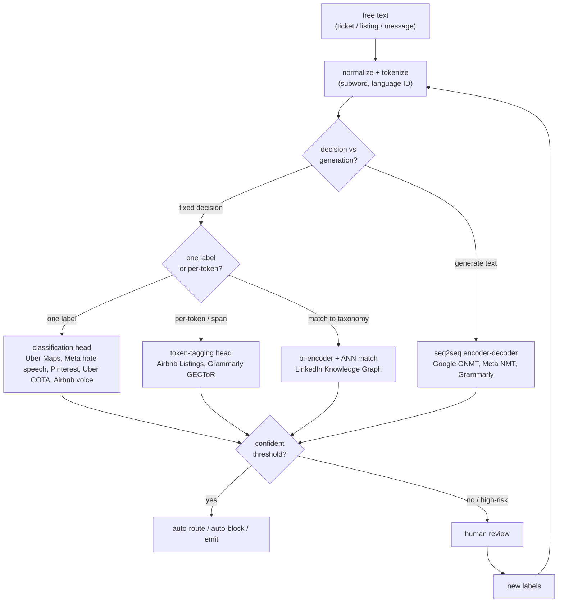
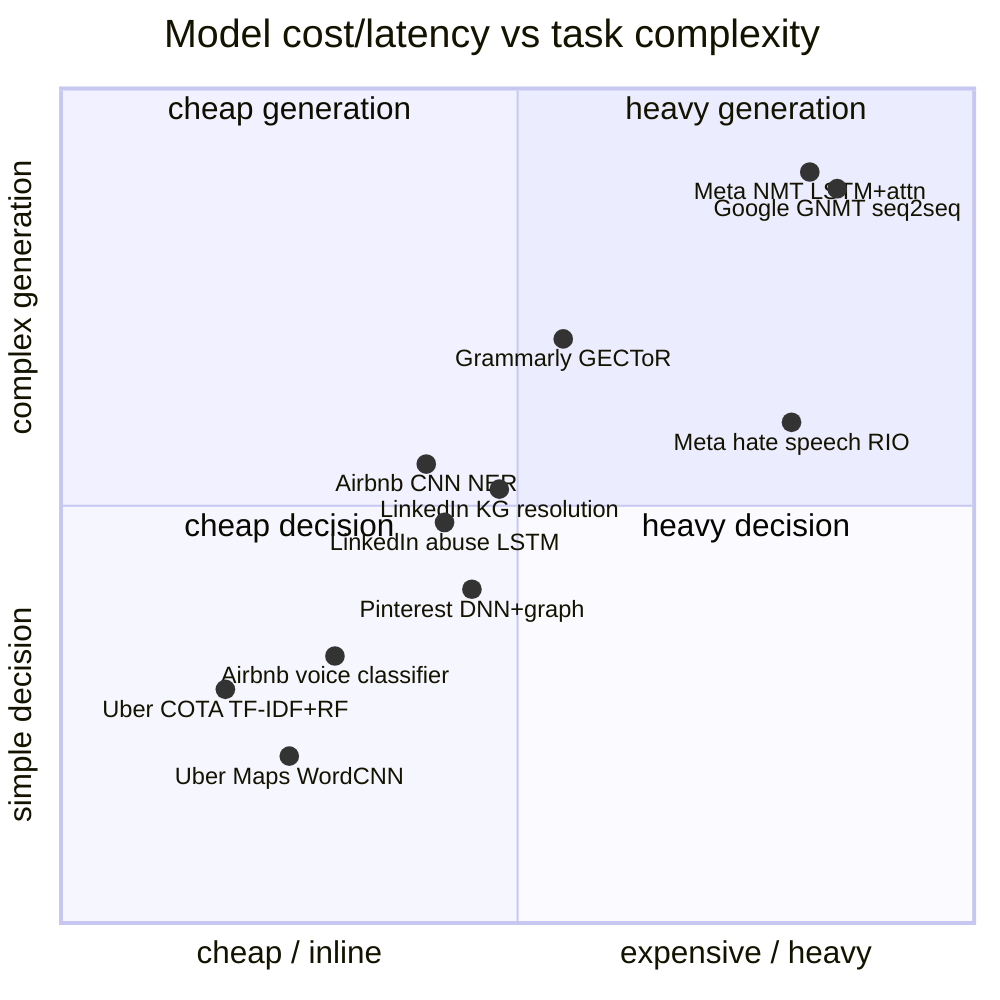

**What they share.** Every system normalizes and tokenizes free text once, then fans out to a task-specific model whose score a threshold either auto-acts on or routes to human review, whose verdicts flow back as fresh labels. None puts a large LLM on the inline firehose; volume forces a small, calibratable model on the hot path.

**The choices, side by side.**

| Decision | Options (who) | What decides it |
| --- | --- | --- |
| task | `classify` (Uber Maps, Meta hate speech, Pinterest, Uber COTA, Airbnb voice) vs `NER/tagging` (Airbnb Listings, Grammarly) vs `translation/seq2seq` (Google GNMT, Meta NMT) vs `entity resolution` (LinkedIn KG) | Fixed decision uses an encoder head; generating new text needs seq2seq; matching messy strings to a canonical entity is embed-and-match |
| model era | `TF-IDF/LSA/RF` (Uber COTA) vs `CNN/LSTM` (Uber Maps, Airbnb Listings, LinkedIn abuse, Google/Meta NMT) vs `BERT encoder` (Airbnb scorer, Grammarly GECToR) vs `RIO/Linformer LLM` (Meta hate speech) | Label volume, latency budget, and when the writeup shipped; a distilled encoder beats a big LLM inline at scale |
| latency/volume | `inline` (Meta hate-speech firehose, Airbnb voice under 50ms) vs `batch` (Uber Maps weekly Spark, Pinterest PySpark) | Interactive tasks on live traffic run in tens of ms; offline enrichment or enforcement can batch for cost |
| supervision/multilingual | manual labels (Uber Maps), weak/synthetic labels (Pinterest, Grammarly), member-confirmed feedback loop (LinkedIn KG/abuse), bilingual human ratings (Google/Meta NMT); English-only vs 2,000+ directions (Meta NMT) | Cost and asymmetry of errors, plus whether cross-lingual transfer is needed; multilingual dilutes per-language capacity |

**The math that separates them.**

$$\textbf{per-class F1: } F_1 = \frac{2 \cdot P \cdot R}{P + R}, \quad P = \frac{TP}{TP+FP}, \quad R = \frac{TP}{TP+FN}$$

$$\textbf{weighted cross-entropy: } \mathcal{L} = -\frac{1}{N}\sum_{i=1}^{N} w_{y_i}\, \log p_{\theta}(y_i \mid x_i)$$

$$\textbf{F-beta (correction, } \beta=0.5\textbf{): } F_{\beta} = (1+\beta^2)\,\frac{P \cdot R}{\beta^2 P + R}$$

$$\textbf{seq2seq attention decode: } p(y_t \mid y_{<t}, x) = \mathrm{softmax}\!\left(W \sum_{j} \alpha_{tj}\, h_j\right)$$

