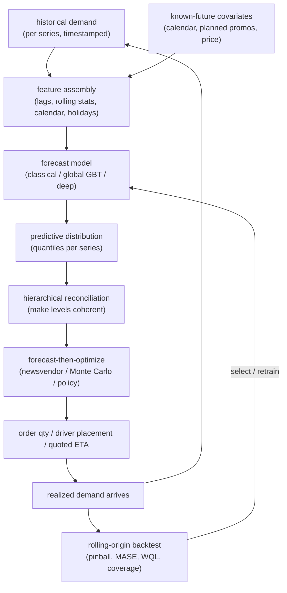
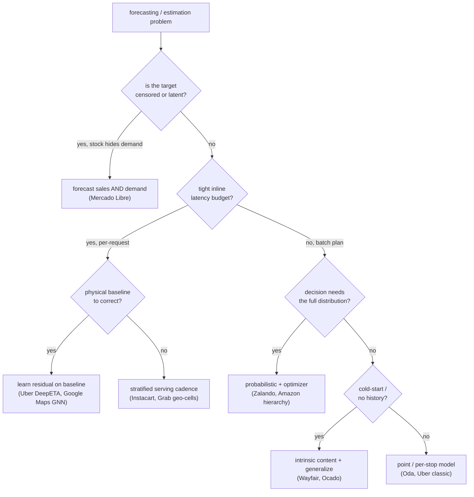
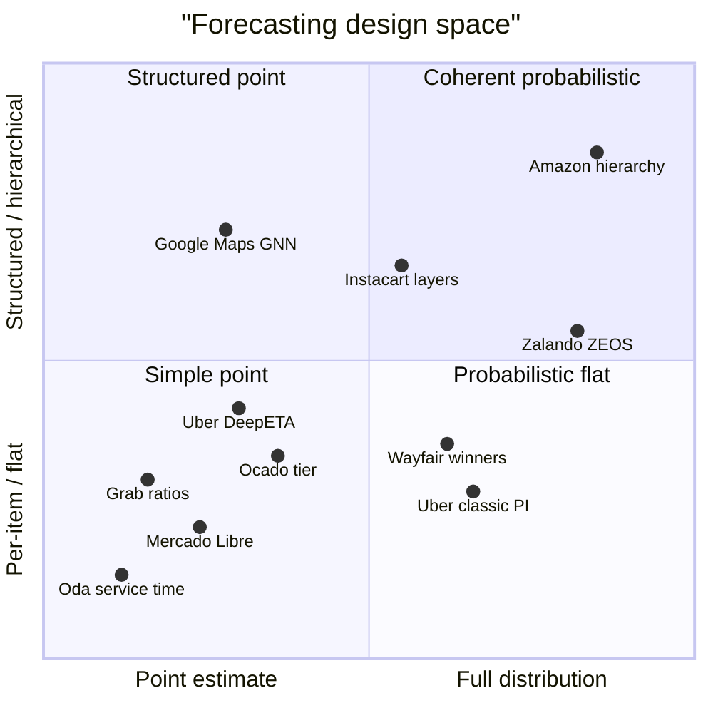

**What they share.** Every team turns a noisy history of a many-item, geo-temporal marketplace into a forward estimate that a downstream decision (buy, stock, route, position) will spend real money on, validating chronologically against a naive or legacy baseline rather than an absolute error target. What splits them is what the estimate is of (point vs distribution, realized sales vs latent demand, per-item vs hierarchy vs graph) and how hard latency, cold-start, or perishability squeezes the model choice.

**The reference pipeline.** Under the branding, every system walks the same forecast-then-optimize loop: assemble history plus known-future covariates into features, fit a model that emits a distribution (or a point plus interval), reconcile the levels so they add up, hand that distribution to a decision step (an optimizer or a policy, never the forecast itself), take the action, and close the loop with a rolling-origin backtest that retrains as the series drift. The teams differ only in which boxes they invest in: DeepETA and Google Maps live in the residual-on-baseline branch, Zalando and Amazon in the reconcile-then-optimize branch, Wayfair and Ocado in the cold-start branch.

**Reading the diagram.** Feature assembly is the load-bearing first stage: it fuses timestamped history (lags, rolling stats) with known-future covariates (calendar, planned promos, price), and its failure mode is leakage, since any lag or rolling window that peeks past the forecast time makes the whole backtest fantasy, so a seven-step-ahead forecast cannot lean on the one-step lag. The forecast model (classical, global GBT, or deep) is where iteration speed versus exogenous richness gets decided, but the design leverage lives at the next box: emitting a predictive distribution or quantiles rather than a point, because no downstream decision cares about the mean and a point forecast makes safety stock uncomputable. Hierarchical reconciliation then forces item, store, and region to add up, the difference between coherent action and levels that silently contradict each other; either post-hoc (bottom-up, top-down, MinT) or end to end as Amazon emits coherent probabilistic forecasts directly. Only then does the forecast-then-optimize step consume that distribution, a newsvendor or Monte Carlo policy stocking to the critical-fractile quantile set by the over-versus-under cost ratio (Zalando, Amazon planning), never the raw forecast. Finally the loop closes with a rolling-origin backtest scored on pinball, MASE, WQL, and coverage that selects and retrains the model as the series drift, which is the only honest way to catch horizon-dependent decay before it surfaces as a live stockout. The leverage points differ by team: DeepETA and Google Maps invest in the residual-on-baseline entry, while Zalando and Amazon pour effort into reconciliation and the optimizer that reads the tail.

**Where they diverge.**

**The choices, side by side.**

| Decision | Options (who) | What decides it |
| --- | --- | --- |
| Model family | Global LSTM (Mercado Libre); GBT / LightGBM (Zalando, Oda, Instacart trending); linear-attention Transformer (Uber DeepETA); GNN (Google Maps); feed-forward plus seq2seq tier (Ocado); NN plus LSTM (Wayfair) | Iteration speed and serving cost push toward GBTs; rich exogenous regressors or graph structure justify deep nets; content-only cold-start forces embeddings |
| Point vs quantile | Point / MAE (Oda, Mercado Libre, Grab); prediction intervals (Uber classic); full probabilistic (Amazon, Zalando, Wayfair heads) | Whether the downstream decision sizes a reserve or safety stock off the spread, not just the mean |
| Hierarchy | Flat per-item (Mercado Libre, Oda); layered general / trending / real-time (Instacart, Ocado tier); coherent hierarchy (Amazon); SKU-then-optimizer (Zalando) | Whether levels must sum coherently and whether sparse or new leaves borrow strength from parents and similar items |
| Spatial / ETA | Geohash aggregation (Grab); Supersegment graph plus message passing (Google Maps); routing-baseline residual (Uber DeepETA); area-as-proxy features (Oda) | How much congestion or availability diffuses across neighbors, and whether a physical routing engine already gives a baseline to correct |

**The math that separates them.**

Point-error teams (Oda, Mercado Libre, Grab) optimize mean absolute error, robust to zero-heavy intermittent sales:

$$\mathrm{MAE} = \frac{1}{n}\sum_{i=1}^{n}\left| y_i - \hat{y}_i \right|$$

Interval and probabilistic teams (Uber, Zalando, Amazon, Wayfair) score quantiles with the pinball (quantile) loss, penalizing under and over prediction asymmetrically by quantile level $\tau$:

$$L_\tau(y,\hat{q}) = \max\big(\tau \cdot (y-\hat{q}),\ (\tau-1) \cdot (y-\hat{q})\big)$$

Baseline-relative teams (Uber classic, Google Maps, Oda) judge skill against a naive forecast, e.g. MASE scaling error by the in-sample one-step naive error:

$$\mathrm{MASE} = \frac{\frac{1}{n}\sum_{i=1}^{n}\left| y_i - \hat{y}_i \right|}{\frac{1}{T-1}\sum_{t=2}^{T}\left| y_t - y_{t-1} \right|}$$

Full-distribution replenishment teams (Zalando, Amazon) evaluate the whole predictive distribution with the weighted quantile loss, an integral of pinball loss over quantile levels:

$$\mathrm{WQL} = 2 \cdot \int_{0}^{1} L_\tau\big(y,\ \hat{q}(\tau)\big) \, d\tau$$

The optimizer teams (Zalando newsvendor, Amazon planning) do not stock to the mean: the cost-minimizing order quantity is the demand quantile at the critical fractile set by the ratio of underage cost $c_u$ (lost sale) to overage cost $c_o$ (holding plus waste):

$$q^{*} = F^{-1}\!\left(\frac{c_u}{c_u + c_o}\right)$$

Every probabilistic team must then prove calibration, not just report a loss: the empirical coverage of a nominal $\tau$-quantile should land near $\tau$, using the indicator $\mathbf{1}[\cdot]$ that a realized value falls at or below the forecast:

$$\widehat{\mathrm{cov}}(\tau) = \frac{1}{n}\sum_{i=1}^{n}\mathbf{1}\big[\,y_i \le \hat{q}_i(\tau)\,\big] \approx \tau$$

For a single continuous predictive distribution $F$, the continuous ranked probability score generalizes MAE to the full forecast and is the limit the WQL integral approximates:

$$\mathrm{CRPS}(F, y) = \int_{-\infty}^{\infty}\big(F(z) - \mathbf{1}[\,z \ge y\,]\big)^{2}\, dz$$

**When to use which.** Let iteration cost and exogenous richness pick the model family, let the downstream decision pick point vs distribution, and let the zero-demand leaves pick the metric.

| Reach for | When | Instead of |
|---|---|---|
| GBT / LightGBM | fast iteration and cheap serving on tabular features (Zalando, Oda, Instacart) | a deep net when the exogenous signal is thin |
| GNN with message passing | demand or congestion diffuses across neighbors (Google Maps Supersegments) | a per-series independent model |
| Residual on a physical baseline | a routing engine already gives a close ETA (Uber DeepETA), and you want a cheap inline layer | predicting absolute travel time from scratch |
| Global model plus attribute embeddings and shrinkage | cold-start items with no lag history (Wayfair, Ocado) | per-item lag features that break on day zero |
| MAE (point) | zero-heavy intermittent series where the decision needs only a central number (Oda, Grab) | a full distribution you will never consume |
| Pinball / quantile loss | the decision sizes safety stock off the spread (Uber, Zalando) | MAE that only fits the mean |
| WQL or CRPS | grading the whole predictive distribution (Zalando, Amazon) | a single-quantile pinball number |
| MASE | proving scale-free skill over a naive baseline | MAPE, undefined at zero demand and exploding on small denominators |
| Critical-fractile newsvendor quantile | turning a distribution into an order quantity under over vs under costs (Zalando, Amazon) | stocking to the mean forecast |

**Interview watch-outs.**

- **Backtesting leakage.** A random train/test split leaks the future; any lag or rolling feature must use only data available at forecast time, and a 7-day-ahead forecast cannot lean on the t-1 lag. Use rolling-origin (walk-forward) evaluation at the production horizon, or your offline numbers are fantasy and collapse live.
- **Point vs distribution.** No decision cares about the mean: replenishment stocks to a service-level quantile via the critical fractile above, so handing an optimizer a point forecast makes safety stock uncomputable and stocks out at the target quantile. Emit quantiles or a density, then report coverage, not just the loss.
- **MAPE is a trap.** It is undefined at zero demand (common at the item-store leaf), asymmetric, and explodes on small denominators. Reach for MASE for scale-free point accuracy and pinball/WQL for the distribution, weighted by business value so a million tiny-volume series do not dominate the average.
- **Hierarchy reconciliation.** Forecast each of item, store, region, and total independently and the numbers will not sum, and the business cannot act on incoherent levels. Reconcile (bottom-up, top-down, or MinT), or emit coherent probabilistic forecasts end to end as Amazon does, and carry the full distribution through reconciliation, not just the point.
- **ETA residuals and latency.** Predicting absolute travel time from scratch throws away a physical routing baseline that is already close; learn the residual on it (DeepETA, Google Maps), which is easier and lets you update the ML layer without touching the router. ETA is inline in a quote, so keep the model cheap (linear attention, embedding lookups, precomputed features) and use an asymmetric loss because a late ETA and an early one cost differently.
- **Cold-start and censoring.** New items break lag features, so lean on global models with learned attribute embeddings and hierarchical shrinkage toward the parent, keeping intervals wide until history accrues. And remember observed sales are censored by stock: train on them and you learn the stock ceiling, not true demand, so model latent demand separately (Mercado Libre) when the decision needs it.
