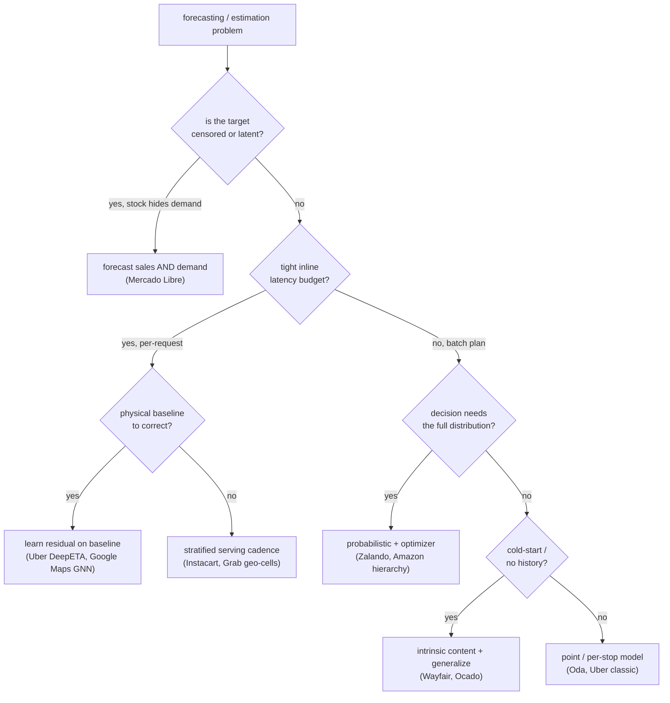
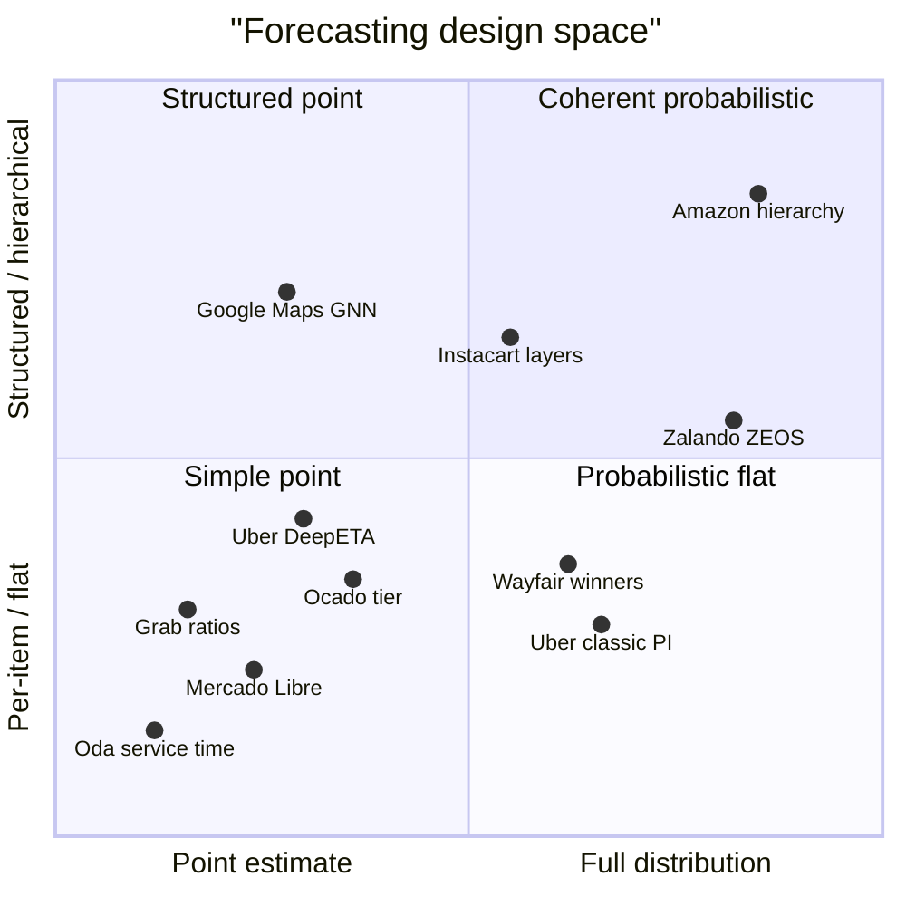

**What they share.** Every team turns a noisy history of a many-item, geo-temporal marketplace into a forward estimate that a downstream decision (buy, stock, route, position) will spend real money on, validating chronologically against a naive or legacy baseline rather than an absolute error target. What splits them is what the estimate is of (point vs distribution, realized sales vs latent demand, per-item vs hierarchy vs graph) and how hard latency, cold-start, or perishability squeezes the model choice.

**The choices, side by side.**

| Decision | Options (who) | What decides it |
| --- | --- | --- |
| Model family | Global LSTM (Mercado Libre); GBT / LightGBM (Zalando, Oda, Instacart trending); linear-attention Transformer (Uber DeepETA); GNN (Google Maps); feed-forward plus seq2seq tier (Ocado); NN plus LSTM (Wayfair) | Iteration speed and serving cost push toward GBTs; rich exogenous regressors or graph structure justify deep nets; content-only cold-start forces embeddings |
| Point vs quantile | Point / MAE (Oda, Mercado Libre, Grab); prediction intervals (Uber classic); full probabilistic (Amazon, Zalando, Wayfair heads) | Whether the downstream decision sizes a reserve or safety stock off the spread, not just the mean |
| Hierarchy | Flat per-item (Mercado Libre, Oda); layered general / trending / real-time (Instacart, Ocado tier); coherent hierarchy (Amazon); SKU-then-optimizer (Zalando) | Whether levels must sum coherently and whether sparse or new leaves borrow strength from parents and similar items |
| Spatial / ETA | Geohash aggregation (Grab); Supersegment graph plus message passing (Google Maps); routing-baseline residual (Uber DeepETA); area-as-proxy features (Oda) | How much congestion or availability diffuses across neighbors, and whether a physical routing engine already gives a baseline to correct |

**The math that separates them.**

Point-error teams (Oda, Mercado Libre, Grab) optimize mean absolute error, robust to zero-heavy intermittent sales:

$$\mathrm{MAE} = \frac{1}{n}\sum_{i=1}^{n}\left| y_i - \hat{y}_i \right|$$

Interval and probabilistic teams (Uber, Zalando, Amazon, Wayfair) score quantiles with the pinball loss, penalizing under and over prediction asymmetrically by quantile level $\tau$:

$$L_\tau(y,\hat{q}) = \max\big(\tau (y-\hat{q}),\ (\tau-1) (y-\hat{q})\big)$$

Baseline-relative teams (Uber classic, Google Maps, Oda) judge skill against a naive forecast, e.g. MASE scaling error by the in-sample one-step naive error:

$$\mathrm{MASE} = \frac{\frac{1}{n}\sum_{i=1}^{n}\left| y_i - \hat{y}_i \right|}{\frac{1}{T-1}\sum_{t=2}^{T}\left| y_t - y_{t-1} \right|}$$

Full-distribution replenishment teams (Zalando, Amazon) evaluate the whole predictive distribution with the weighted quantile loss, an integral of pinball loss over quantile levels:

$$\mathrm{WQL} = 2\int_{0}^{1} L_\tau\big(y,\ \hat{q}(\tau)\big) d\tau$$

