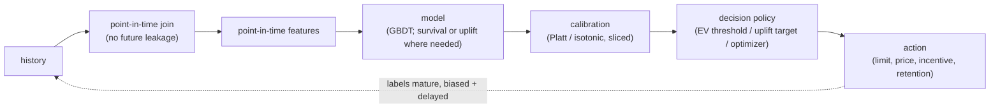
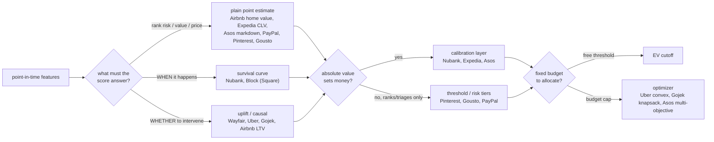
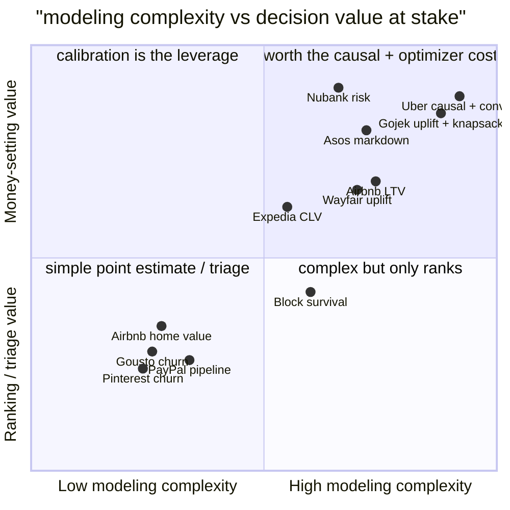

**What they share.** Every system builds point-in-time features, scores an entity, then hands the number to a decision layer that turns it into money, with calibration wedged in whenever the absolute probability (not the ranking) sets the amount.

**The reference pipeline.** The canonical tabular path is a short assembly line: point-in-time features feed a gradient-boosted tree (a survival or uplift model where the question demands it), a post-hoc calibrator maps raw scores to true rates, and a decision policy (expected-value threshold, uplift targeting, or a budget optimizer) converts the calibrated number into an action. Delayed labels close the loop.

**The divergence.** Where the reference path forks, and who takes each branch.

**The choices, side by side.**

| Decision | Options (who) | What decides it |
| --- | --- | --- |
| prediction target | `risk` (Nubank) vs `churn/close propensity` (Block, Pinterest, Gousto, PayPal) vs `LTV/value` (Airbnb, Expedia) vs `pricing` (Uber, Asos) | which money decision the score feeds: a credit limit, a retention or rep-priority action, a budget, or a price |
| plain vs causal/uplift | `classification` (Airbnb home value, Expedia, Pinterest, Gousto, PayPal) vs `uplift/causal` (Wayfair, Uber, Gojek, Airbnb LTV) | is the question "who will act" (predict) or "whose behavior changes if I act" (intervene) |
| survival / time-to-event | `survival` (Nubank, Block) vs `fixed-window binary` (Pinterest 14d, Gousto 4w, PayPal) vs `point/horizon estimate` (Airbnb, Expedia, Asos) | does WHEN it lands matter, and are there censored not-yet-resolved rows worth keeping |
| calibration + decision | `risk tiers/threshold` (Pinterest, Gousto, PayPal) vs `calibrate then EV threshold` (Nubank) vs `calibrate then optimizer` (Uber, Gojek, Asos) | does the absolute probability set money, or just triage scarce human attention under a fixed budget |

**The math that separates them.**

$$\textbf{Fixed-window churn label}\qquad y_i=\mathbf{1}\left[\text{no activity in }(t,\ t+\Delta]\right],\qquad \hat{p}_i=\sigma\left(f(x_i)\right)$$

$$\textbf{Survival from hazard}\qquad S(t)=\Pr(T>t)=\exp\left(-\int_{0}^{t}\lambda(u)\ du\right)$$

$$\textbf{Hazard rate}\qquad \lambda(t)=\lim_{\Delta\to 0}\frac{\Pr\left(t\le T<t+\Delta\ \middle|\ T\ge t\right)}{\Delta}=-\frac{d}{dt}\log S(t)$$

$$\textbf{CATE uplift (persuadables)}\qquad \tau(x)=\mathbb{E}\left[Y\ \middle|\ X{=}x,\ W{=}1\right]-\mathbb{E}\left[Y\ \middle|\ X{=}x,\ W{=}0\right]$$

$$\textbf{Expected-value approve rule}\qquad \text{approve}\iff \hat{p}_{\text{good}}\cdot V_{\text{good}}\ >\ \left(1-\hat{p}_{\text{good}}\right)\cdot \text{EAD}\cdot \text{LGD}$$

$$\textbf{Discounted lifetime value}\qquad \text{LTV}=\sum_{t=1}^{H}\frac{S(t)\ m(t)}{\left(1+d\right)^{t}}$$

$$\textbf{Constrained allocation}\qquad \max_{a}\ \sum_i \tau(x_i)\ a_i \quad \text{s.t.} \quad \sum_i c_i\ a_i\le B,\qquad \text{rank by }\frac{\tau(x_i)}{c_i}$$

**Interview watch-outs.**

- **Why trees win on tabular.** Gradient-boosted trees (XGBoost, LightGBM, CatBoost) are invariant to monotone transforms, handle missing values natively, and capture non-smooth thresholds and interactions without feature engineering. Deep nets earn their place only for very high-cardinality ids (learned embeddings beat one-hot or target encoding) or when tabular columns must fuse with text, images, or event sequences. Reaching for a neural net on already-meaningful columns is the tell of a junior answer.
- **Calibration is the product, not the ranking.** When a threshold or optimizer multiplies the score into money (an expected loss, an approved limit, a bid), a 0.05 must mean a 5 percent real rate. Train with log loss, fit Platt or isotonic on a held-out slice, apply prior correction if you sampled for imbalance, and monitor reliability sliced by segment and vintage. AUC says nothing about whether the number sets prices correctly.
- **Uplift, not propensity, for interventions.** Pricing, discounts, incentives, and retention offers are causal questions: target the persuadables whose behavior the treatment changes, not the sure things and lost causes a churn or propensity score would flag. Uplift needs randomized (RCT) variation to identify the effect; observational logs alone confound it. Under a fixed budget, rank by uplift-per-dollar and fill a knapsack or solve a convex allocation, with the ML and the optimizer as separate boxes.
- **Delayed and biased labels break the offline story.** A 12-month default label leaves the last year of applications unmatured: train only on matured vintages and the model is stale, count immature accounts as good and you bias risk downward. Use matured vintages, a faster-maturing proxy, or survival censoring. And you only observe repayment for approvals, so the model is valid only on the approved region; break the selection-bias loop with reject inference plus a small randomized-approval slice below the cutoff.
- **Target leakage is the signature silent failure.** A suspiciously high offline AUC usually means a feature encodes the outcome or is knowable only after it (post-default status, a window aggregate that spans the label period, a collections-call count). Enforce point-in-time correctness so every feature is computed as of the decision timestamp, and log served features rather than recomputing them later.
- **Explainability and fairness are model-family constraints, not afterthoughts.** Regulated credit and insurance decisions owe an adverse-action reason per decline and forbid protected attributes and their proxies. That pushes you toward monotone-constrained GBDTs or scorecards with SHAP reason codes, and is worth trading a little AUC for. Decide this up front, because it constrains the whole design.
