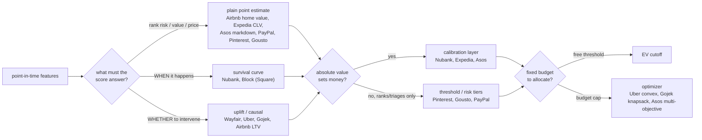
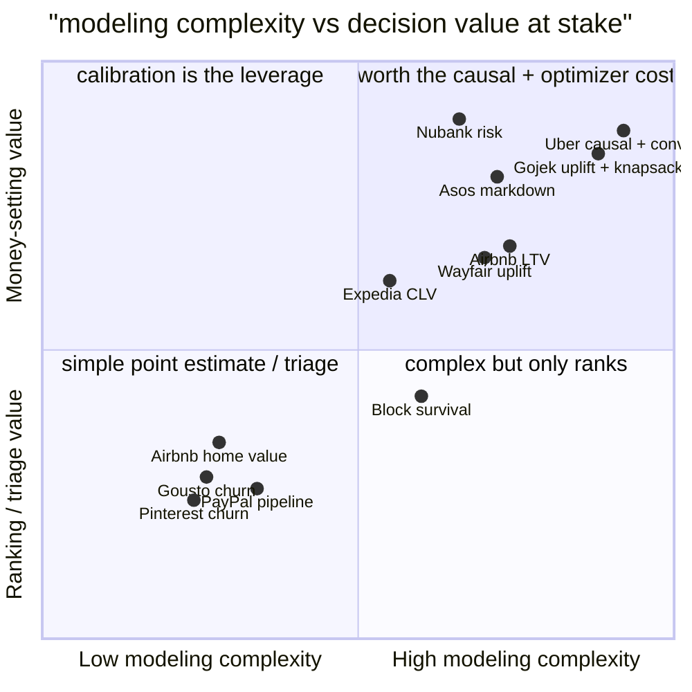

**What they share.** Every system builds point-in-time features, scores an entity, then hands the number to a decision layer that turns it into money, with calibration wedged in whenever the absolute probability (not the ranking) sets the amount.

**The choices, side by side.**

| Decision | Options (who) | What decides it |
| --- | --- | --- |
| prediction target | `risk` (Nubank) vs `churn/close propensity` (Block, Pinterest, Gousto, PayPal) vs `LTV/value` (Airbnb, Expedia) vs `pricing` (Uber, Asos) | which money decision the score feeds: a credit limit, a retention or rep-priority action, a budget, or a price |
| plain vs causal/uplift | `classification` (Airbnb home value, Expedia, Pinterest, Gousto, PayPal) vs `uplift/causal` (Wayfair, Uber, Gojek, Airbnb LTV) | is the question "who will act" (predict) or "whose behavior changes if I act" (intervene) |
| survival / time-to-event | `survival` (Nubank, Block) vs `fixed-window binary` (Pinterest 14d, Gousto 4w, PayPal) vs `point/horizon estimate` (Airbnb, Expedia, Asos) | does WHEN it lands matter, and are there censored not-yet-resolved rows worth keeping |
| calibration + decision | `risk tiers/threshold` (Pinterest, Gousto, PayPal) vs `calibrate then EV threshold` (Nubank) vs `calibrate then optimizer` (Uber, Gojek, Asos) | does the absolute probability set money, or just triage scarce human attention under a fixed budget |

**The math that separates them.**

$$\textbf{Fixed-window churn label}\qquad y_i=\mathbf{1}\!\left[\text{no activity in }(t,\,t+\Delta]\right],\qquad \hat{p}_i=\sigma\!\left(f(x_i)\right)$$

$$\textbf{Survival from hazard}\qquad S(t)=\Pr(T>t)=\exp\!\left(-\int_{0}^{t}\lambda(u)\,du\right)$$

$$\textbf{CATE uplift (persuadables)}\qquad \tau(x)=\mathbb{E}[Y \mid X{=}x, W{=}1]-\mathbb{E}[Y \mid X{=}x, W{=}0]$$

$$\textbf{Constrained allocation}\qquad \max_{a}\ \sum_i \tau(x_i)\,a_i \quad \text{s.t.} \quad \sum_i c_i\,a_i \le B$$

