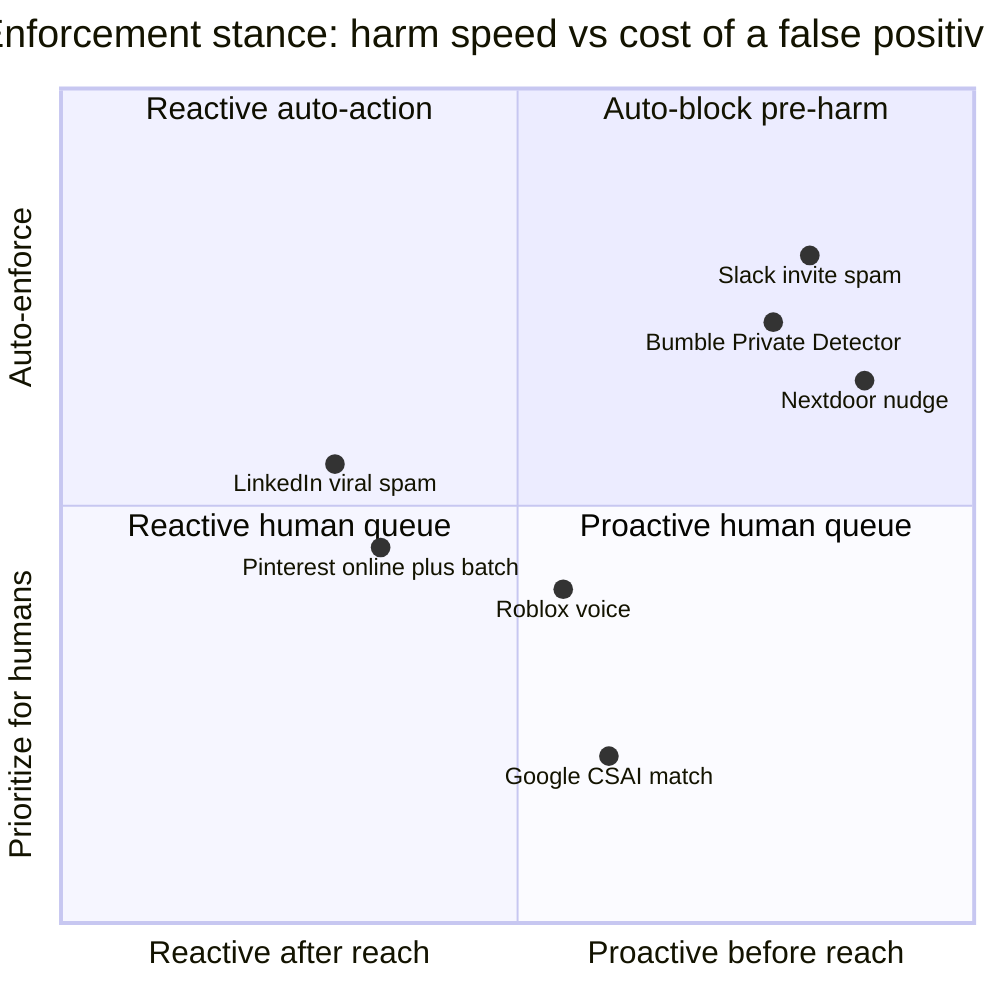

**What they share.** Every system scores user content or accounts for a policy violation and must hold a fixed precision floor, because a false positive silences a real user or blocks a legitimate invite. They diverge on modality, whether the decision is a learned classifier or a hash-match, whether it fires before or after the content spreads, and where the human sits.

```mermaid
flowchart TD
    A[Incoming content or account] --> B{Known-bad fingerprint?}
    B -->|yes, exact enough| C[Hash-match: Google CSAI / PhotoDNA]
    B -->|no, must judge| D{Modality}
    D -->|voice| E[Roblox distilled WavLM]
    D -->|image| F[Bumble EfficientNetV2]
    D -->|image + text| G[Meta hateful-memes fusion]
    D -->|text / metadata| H[Slack invite spam, LinkedIn, Nextdoor, Pinterest]
    E --> I{When to act}
    F --> I
    G --> I
    H --> I
    I -->|before publish or send| J[Proactive: Slack, Nextdoor, Bumble, LinkedIn proactive]
    I -->|after some reach| K[Reactive: LinkedIn viral, Pinterest online]
    J --> L{Human role}
    K --> L
    C --> L
    L -->|auto-enforce| M[Slack, Bumble, Nextdoor nudge]
    L -->|prioritize queue| N[Google, Pinterest, Roblox]
    L -->|challenge or appeal| O[LinkedIn, Roblox multimodal]
```

**The choices, side by side.**

| Decision | Options (who) | What decides it |
| --- | --- | --- |
| Modality scored | Text/metadata (Slack invite spam, LinkedIn, Nextdoor, Pinterest), voice (Roblox), image (Bumble), image+text (Meta memes) | Where the harm lives; joint reasoning is needed only when neither modality is damning alone |
| Hash-match vs classifier | Hash-match for known-bad (Google CSAI), learned classifier for novel (Slack, Roblox, Bumble, Pinterest, LinkedIn) | Whether the material repeats exactly and the false-positive cost is legally unacceptable |
| Proactive vs reactive | Proactive at send or publish (Slack, Nextdoor, Bumble, LinkedIn proactive DNN), reactive on engagement (LinkedIn viral, Pinterest online-plus-batch) | Whether you can score before harm reaches an audience, or must watch the spread signal |
| Human routing | Auto-enforce (Slack, Bumble, Nextdoor), prioritize-then-review (Google, Pinterest, Roblox), challenge or appeal (LinkedIn, Roblox multimodal) | The cost of a wrong auto-action versus the volume a human queue can absorb |

**The math that separates them.** Each team fixes a precision floor and maximizes recall under it, since false positives block real users:

$$\max_{\tau}\; \text{Recall}(\tau) \quad \text{s.t.}\quad \text{Precision}(\tau) \ge P_{\min}^{(\text{policy})}$$

Slack judges the blocker by the acceptance rate of blocked invites, a proxy for how much of what it blocked was actually legitimate:

$$\text{FalseBlockProxy} = \frac{\lvert \text{accepted}\cap\text{blocked}\rvert}{\lvert \text{blocked}\rvert} = 0.03 \;\;\text{vs}\;\; 0.70 \;\text{under manual rules}$$

Under a skewed base rate (Bumble at 0.1 percent positives) accuracy is useless, so the operating point is set on the precision-recall curve instead:

$$\text{Precision} = \frac{tp}{tp + fp}, \qquad \text{Recall} = \frac{tp}{tp + fn}$$

