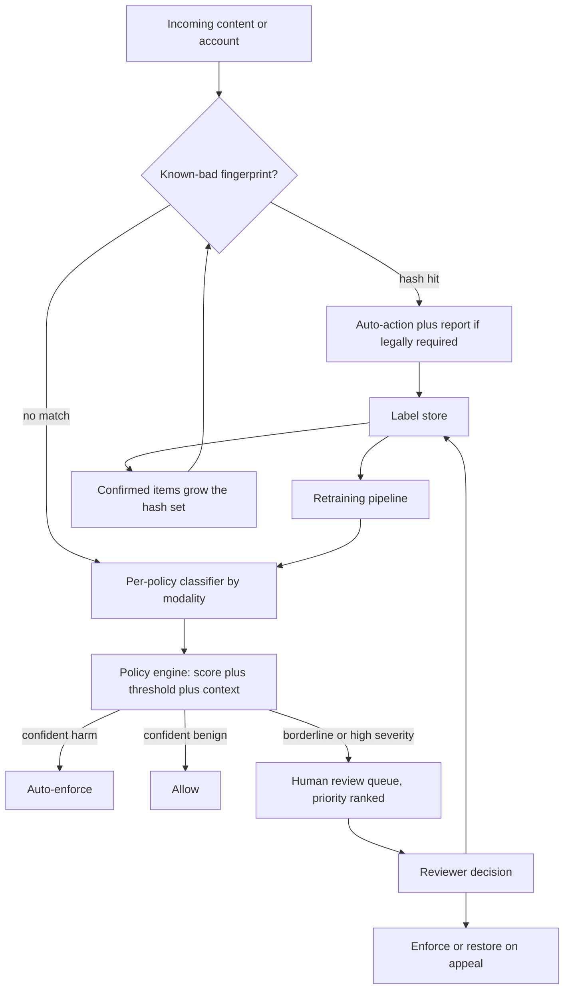
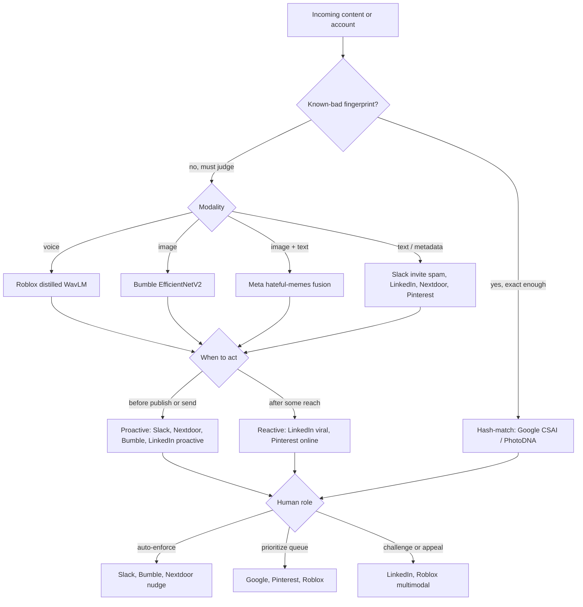
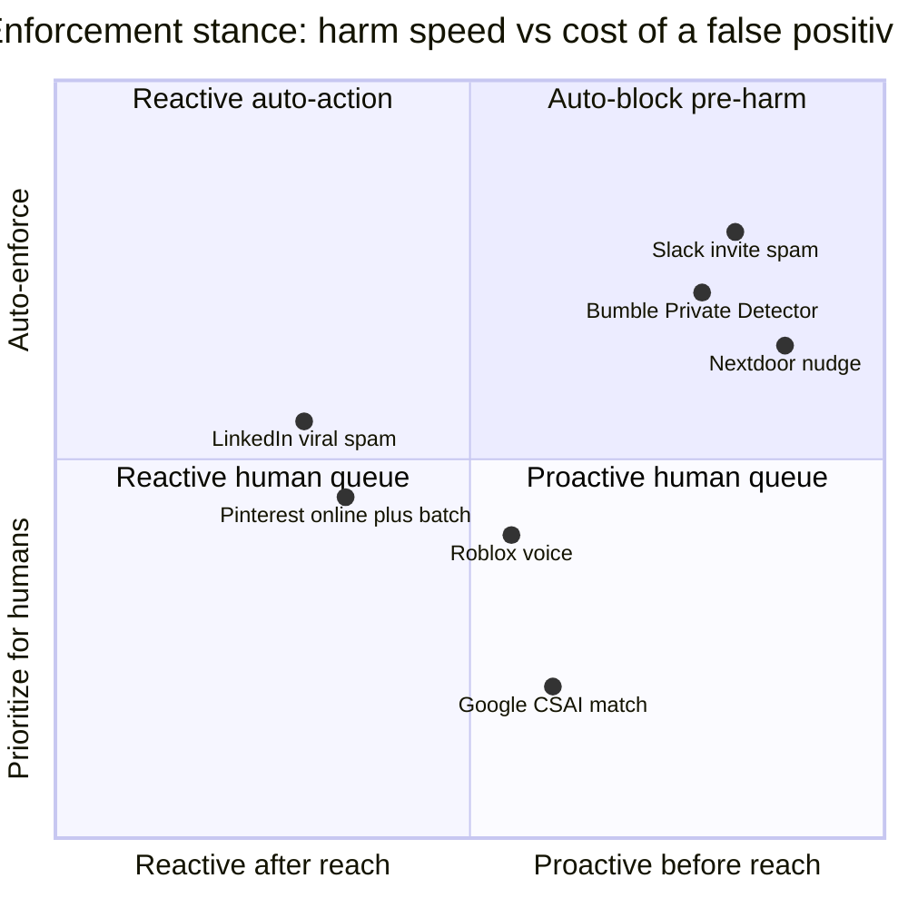

**What they share.** Every system scores user content or accounts for a policy violation and must hold a fixed precision floor, because a false positive silences a real user or blocks a legitimate invite. They diverge on modality, whether the decision is a learned classifier or a hash-match, whether it fires before or after the content spreads, and where the human sits.

**The reference pipeline.** Strip away the company-specific choices and every stack above is the same funnel: hash-match the known mass, run a per-policy classifier on the novel tail, let a policy engine turn scores into actions, route the uncertain middle to humans, and feed every human decision back as a label. This is the canonical shape each teardown is a variation on.

**Reading the diagram.** Content enters at the top and the first gate is a fingerprint lookup: perceptual hashing (Google CSAI Match, PhotoDNA) catches previously judged material like known CSAM, terrorist media, and re-uploaded spam campaigns, so the known mass is auto-actioned for near zero cost and, where the law requires, reported, its failure mode being blindness to anything novel it has never seen. Whatever misses the hash set flows into per-policy classifiers chosen by modality (a text encoder such as BERT, an image backbone such as EfficientNet, a joint image-plus-text fusion for hateful memes, a distilled audio model for Roblox-style live voice), each calibrated to its own precision floor because a false positive silences a real user while a miss can be irreversible. The policy engine then folds score, threshold, and context into one of three routes, auto-enforce on the confident harmful tail, allow on the confident benign tail, and everything borderline or high severity into a human queue that is priority ranked by severity times reach so scarce reviewer minutes hit the worst items first. Reviewers resolve the hard middle, restore on appeal (a restored item is a confirmed false positive), and every one of their decisions drops into the label store as a gold label drawn from exactly the distribution the models find hardest. Two loops close from there: labels feed the retraining pipeline so classifiers track adversarial drift, and confirmed items grow the hash set so the next occurrence is caught upstream for free. The design leverage is in where you place the thresholds and the human queue, since raising auto-enforce precision starves appeals but over-flagging starves reviewers, and the human loop is the core of the system rather than a fallback.

**Where they diverge.**

**The choices, side by side.**

| Decision | Options (who) | What decides it |
| --- | --- | --- |
| Modality scored | Text/metadata (Slack invite spam, LinkedIn, Nextdoor, Pinterest), voice (Roblox), image (Bumble), image+text (Meta memes) | Where the harm lives; joint reasoning is needed only when neither modality is damning alone |
| Hash-match vs classifier | Hash-match for known-bad (Google CSAI), learned classifier for novel (Slack, Roblox, Bumble, Pinterest, LinkedIn) | Whether the material repeats exactly and the false-positive cost is legally unacceptable |
| Proactive vs reactive | Proactive at send or publish (Slack, Nextdoor, Bumble, LinkedIn proactive DNN), reactive on engagement (LinkedIn viral, Pinterest online-plus-batch) | Whether you can score before harm reaches an audience, or must watch the spread signal |
| Human routing | Auto-enforce (Slack, Bumble, Nextdoor), prioritize-then-review (Google, Pinterest, Roblox), challenge or appeal (LinkedIn, Roblox multimodal) | The cost of a wrong auto-action versus the volume a human queue can absorb |

**The math that separates them.** Each team fixes a precision floor and maximizes recall under it, since false positives block real users. Writing the operating point as a constrained argmax over the decision threshold makes the per-policy floor explicit:

$$\tau^{\star} \;=\; \operatorname*{arg\,max}_{\tau}\ \operatorname{Recall}(\tau) \qquad \text{subject to}\qquad \operatorname{Precision}(\tau)\ \ge\ P_{\min}^{(\text{policy})}$$

where precision and recall come from the confusion counts at that threshold:

$$\operatorname{Precision}(\tau) \;=\; \frac{tp(\tau)}{tp(\tau)+fp(\tau)}, \qquad \operatorname{Recall}(\tau) \;=\; \frac{tp(\tau)}{tp(\tau)+fn(\tau)}$$

The floor itself is not arbitrary. It falls out of a cost-weighted objective in which a missed harm and a false flag carry very different weights, and severe policies set the miss cost orders of magnitude above the false-flag cost:

$$\tau^{\star} \;=\; \operatorname*{arg\,min}_{\tau}\ \Big[\, c_{fn}\cdot fn(\tau) \;+\; c_{fp}\cdot fp(\tau) \,\Big], \qquad \frac{c_{fn}}{c_{fp}} \;\gg\; 1 \ \text{ for CSAM, terrorism, imminent violence}$$

A finite human queue turns routing into a second constrained problem: rank the uncertain middle by expected damage so scarce reviewer-minutes land on the worst items first:

$$\operatorname{Priority}(x) \;=\; \operatorname{Severity}(\text{policy})\ \times\ \operatorname{Reach}(x), \qquad \text{review in order of decreasing } \operatorname{Priority}$$

Slack judges the blocker by the acceptance rate of blocked invites, a proxy for how much of what it blocked was actually legitimate:

$$\operatorname{FalseBlockProxy} \;=\; \frac{\lvert \text{accepted}\cap\text{blocked}\rvert}{\lvert \text{blocked}\rvert} \;=\; 0.03 \quad \text{versus}\quad 0.70 \ \text{ under manual rules}$$

Under a skewed base rate (Bumble at 0.1 percent positives) accuracy is useless: a model that flags nothing scores 99.9 percent, so the operating point is set on the precision-recall curve, never on accuracy.

**Interview watch-outs.**

- **State the precision floor before any model.** The objective is recall at a fixed per-policy precision floor, not accuracy and not blind F1. A single accuracy or AUC number on skewed data (Bumble at 0.1 percent positives) is the fastest way to fail the signal check; report recall at precision P per policy instead.
- **Auto-action only the confident tail.** The floor is high for auto-enforce policies and the uncertain middle routes to humans. CSAM does not auto-action on a classifier score at all: it hashes for known material and routes novel content to expert review, because the false-positive cost is legally unacceptable.
- **Assume adversarial drift.** The threat model is non-stationary. A sudden drop in a policy's flag rate is as likely to be a successful new evasion as a genuine drop in harm, so alert on both directions. Defenses are process (adversarial augmentation, continuous retraining on fresh labels, perceptual hashing, red-teaming), not one trick.
- **Treat the human loop as the core, not a fallback.** Every reviewer decision is a gold label drawn from exactly the hard distribution the models miss. Reviewer capacity is the real ceiling, so model precision and queue load are coupled: over-flagging directly starves the queue. Priority-rank by severity times reach.
- **Guard the audit sample.** If you only label the uncertain middle you routed to humans, you can no longer measure true recall on the full distribution. Keep a random, independently labeled audit stream and watch for feedback-loop poisoning via mass false-reporting.
- **Own the over-censorship failure.** At scale even a low false-positive rate silences a large absolute number of real users and floods appeals. Handle borderline content (satire, reclaimed slurs, counter-speech, news, educational nudity) with soft enforcement or pre-post nudges rather than removal, and make appeals fast, since a restored item is a confirmed false positive and a free label.
