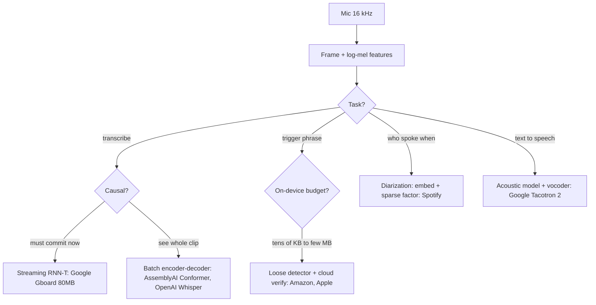
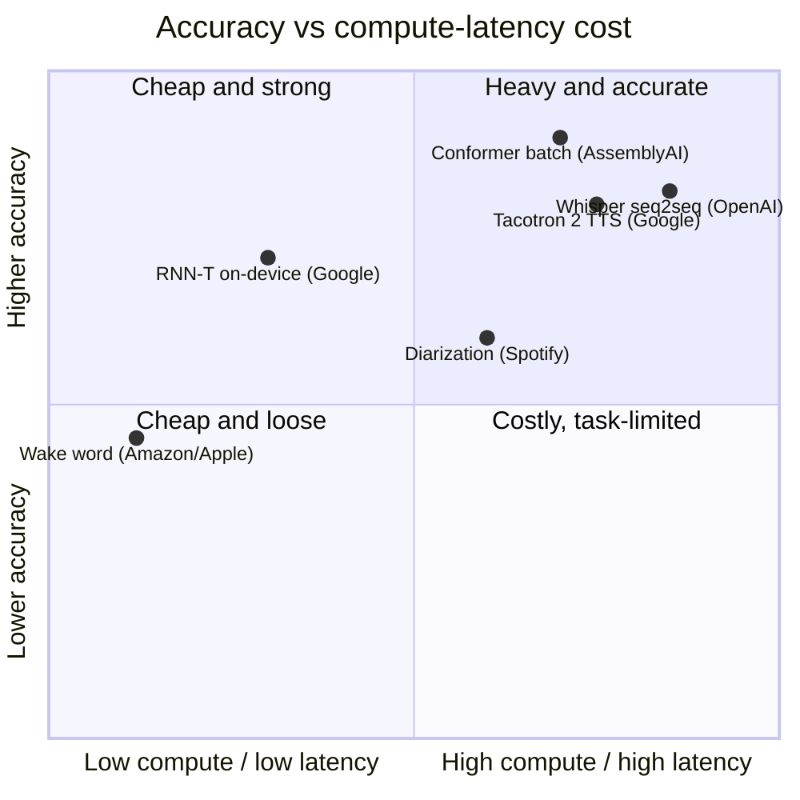

**What they share.** Every system captures 16 kHz audio, frames it, and turns it into log-mel features before a task-specific head. They diverge on causality (can it see future audio), where compute runs, and which metric gates release.

**The choices, side by side.**

| Decision | Options (who) | What decides it |
| --- | --- | --- |
| task | `ASR` vs `wake-word` (Amazon/Apple) vs `TTS` (Google) vs `diarization` (Spotify) | What the product needs: a transcript, a trigger bit, generated speech, or "who spoke when". Each is a different model family, head, and metric |
| architecture | `RNN-T` (Google) vs `Conformer` (AssemblyAI) vs `Whisper seq2seq` (OpenAI) | Streaming forces a monotonic transducer with no external LM; batch accuracy favors conv+attention Conformer; zero-shot breadth favors weakly-supervised multitask seq2seq |
| streaming vs batch | `streaming` (Google RNN-T, Amazon/Apple wake) vs `batch` (AssemblyAI, OpenAI, Spotify, Tacotron) | Live dictation needs a first partial under ~300 ms so it cannot see future audio and must commit; uploads attend over the whole clip and self-correct |
| on-device vs server | `on-device` (Google 80MB RNN-T, Apple 4x256 DNN, VoiceFilter-Lite 2.2MB) vs `server` (AssemblyAI 650K hrs, OpenAI 1.55B, Amazon cloud verifier) | Always-on and privacy paths run on the phone inside a memory/power envelope; heavy or long-audio compute goes to the cloud, where a second stage fires rarely |

**The math that separates them.**

$$\textbf{Word error rate:}\quad \mathrm{WER} = \frac{S + I + D}{N}$$

$$\textbf{Wake-word operating point:}\quad \mathrm{FA/hr},\quad \mathrm{FRR} = \frac{\text{missed triggers}}{\text{true triggers}}$$

$$\textbf{Equal error rate (Apple):}\quad \mathrm{FAR}(\lambda) = \mathrm{FRR}(\lambda)$$

$$\textbf{Speaker match (cosine):}\quad s = \frac{\mathbf{e}\cdot\mathbf{p}}{\lVert\mathbf{e}\rVert\,\lVert\mathbf{p}\rVert} > \lambda$$

