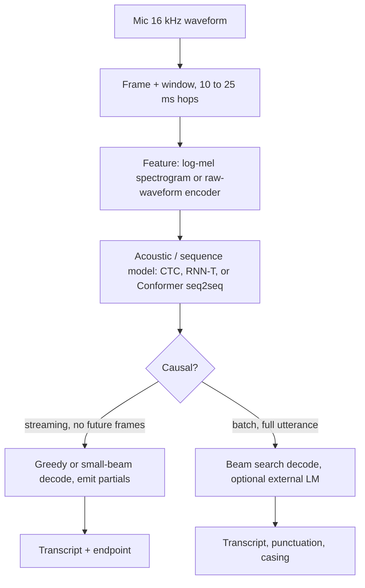
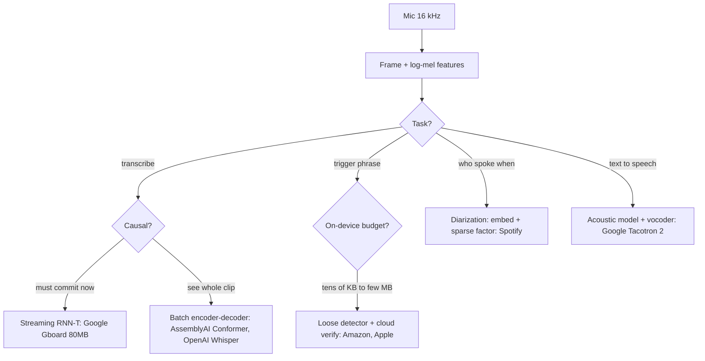
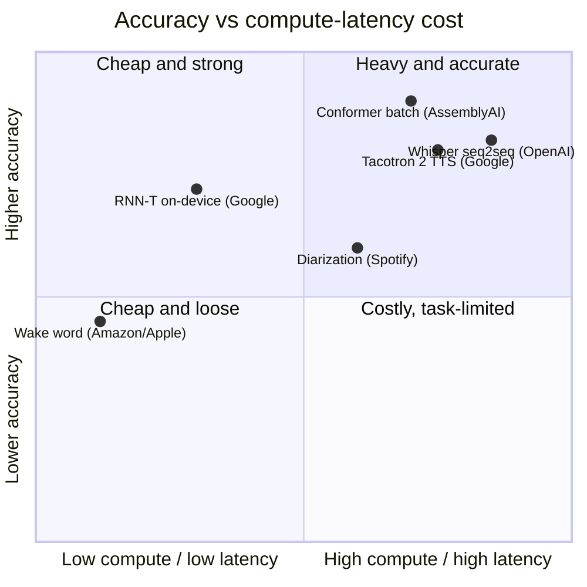

**What they share.** Every system captures 16 kHz audio, frames it, and turns it into log-mel features before a task-specific head. They diverge on causality (can it see future audio), where compute runs, and which metric gates release.

**The reference pipeline.** Strip away the task-specific heads and every recognizer walks the same canonical ASR path: raw audio becomes frames, frames become features, an acoustic or sequence model scores them, and a decoder turns scores into text. Streaming and batch differ only in whether the model can see future frames before the decoder commits.

**The choices, side by side.**

| Decision | Options (who) | What decides it |
| --- | --- | --- |
| task | `ASR` vs `wake-word` (Amazon/Apple) vs `TTS` (Google) vs `diarization` (Spotify) | What the product needs: a transcript, a trigger bit, generated speech, or "who spoke when". Each is a different model family, head, and metric |
| architecture | `RNN-T` (Google) vs `Conformer` (AssemblyAI) vs `Whisper seq2seq` (OpenAI) | Streaming forces a monotonic transducer with no external LM; batch accuracy favors conv+attention Conformer; zero-shot breadth favors weakly-supervised multitask seq2seq |
| streaming vs batch | `streaming` (Google RNN-T, Amazon/Apple wake) vs `batch` (AssemblyAI, OpenAI, Spotify, Tacotron) | Live dictation needs a first partial under ~300 ms so it cannot see future audio and must commit; uploads attend over the whole clip and self-correct |
| on-device vs server | `on-device` (Google 80MB RNN-T, Apple 4x256 DNN, VoiceFilter-Lite 2.2MB) vs `server` (AssemblyAI 650K hrs, OpenAI 1.55B, Amazon cloud verifier) | Always-on and privacy paths run on the phone inside a memory/power envelope; heavy or long-audio compute goes to the cloud, where a second stage fires rarely |

**The math that separates them.**

$$\textbf{Word error rate:}\quad \mathrm{WER} = \frac{S + I + D}{N}$$

where $S$, $I$, $D$ are substituted, inserted, and deleted words and $N$ is reference-word count. Character error rate swaps words for characters and is the fairer cross-language signal.

$$\textbf{Wake-word operating point:}\quad \mathrm{FA/hr},\quad \mathrm{FRR} = \frac{\text{missed triggers}}{\text{true triggers}}$$

$$\textbf{False-accept rate:}\quad \mathrm{FAR} = \frac{\text{wrong activations}}{\text{negative trials}}$$

$$\textbf{Equal error rate (Apple):}\quad \mathrm{FAR}(\lambda) = \mathrm{FRR}(\lambda)$$

$$\textbf{Speaker match (cosine):}\quad s = \frac{\mathbf{e}\cdot\mathbf{p}}{\lVert\mathbf{e}\rVert \, \lVert\mathbf{p}\rVert} > \lambda$$

$$\textbf{Real-time factor:}\quad \mathrm{RTF} = \frac{T_{\text{compute}}}{T_{\text{audio}}}$$

$\mathrm{RTF} < 1$ means the model runs faster than real time, the hard gate for streaming on a single low-power core.

$$\textbf{Diarization error rate:}\quad \mathrm{DER} = \frac{T_{\text{miss}} + T_{\text{false}} + T_{\text{confusion}}}{T_{\text{total}}}$$

**Interview watch-outs.**

- **Streaming vs batch is the first fork, not a flag.** Streaming (CTC, RNN-T) is causal and commits left to right under a ~300 ms first-partial budget; batch (Conformer, Whisper) attends over the whole clip and self-corrects. Proposing one model with a "streaming mode" toggle signals you missed that these are two serving paths and two decoding regimes.
- **A single WER number is a trap.** All errors weigh equally, so a dropped "the" scores like a mangled name or dosage. Normalization (casing, numbers, punctuation) can swing WER by points, so two systems are not comparable unless normalized identically. Always slice by accent, noise, and domain, and report entity and numeric WER alongside the aggregate.
- **On-device is a memory and power envelope, not a smaller cloud model.** Quantization to int8 buys roughly 4x compression with a WER cost you validate rather than assume; it also bounds architecture (RNN-T over giant Conformers), beam width, and context. And on-device means no audio logging, so you lose the retraining signal and need federated or on-device metrics.
- **Wake word is a false-accept vs false-reject tradeoff, measured per hour.** Report false accepts per hour of ambient audio, not recall. The standard shape is a loose always-on first stage to avoid false rejects plus a heavier second-stage verifier (cloud or larger on-device) to kill the resulting false accepts, with thresholds tuned per device class (phone vs far-field).
- **Endpointing latency is invisible to WER.** A model can be accurate and still feel broken if it hangs waiting for silence or cuts the user off mid-sentence. Track endpoint latency and false cutoffs as separate metrics that trade against each other.
- **Weakly-supervised batch models hallucinate on silence.** Whisper-style models can emit fluent transcript for non-speech, and attention decoders can loop or truncate. Gate with voice-activity detection and confidence thresholds, and prefer transducer or CTC decoding where robustness matters more than zero-shot breadth.
