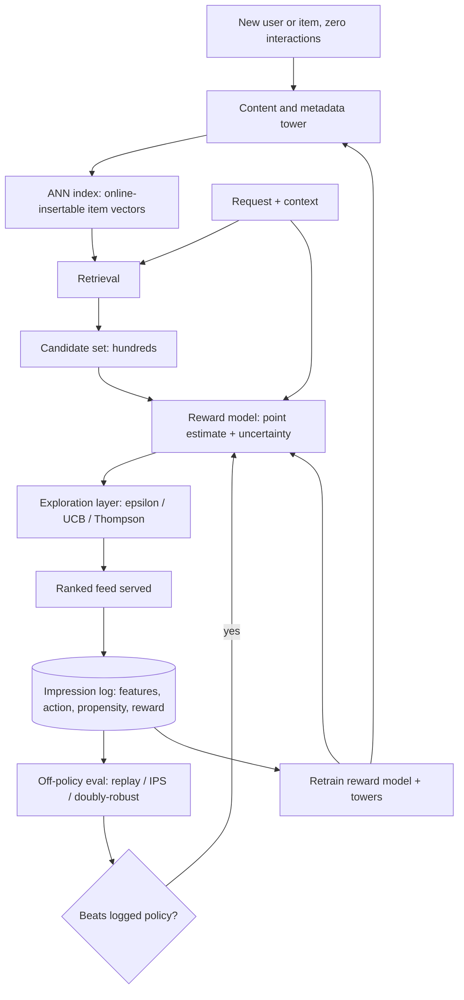
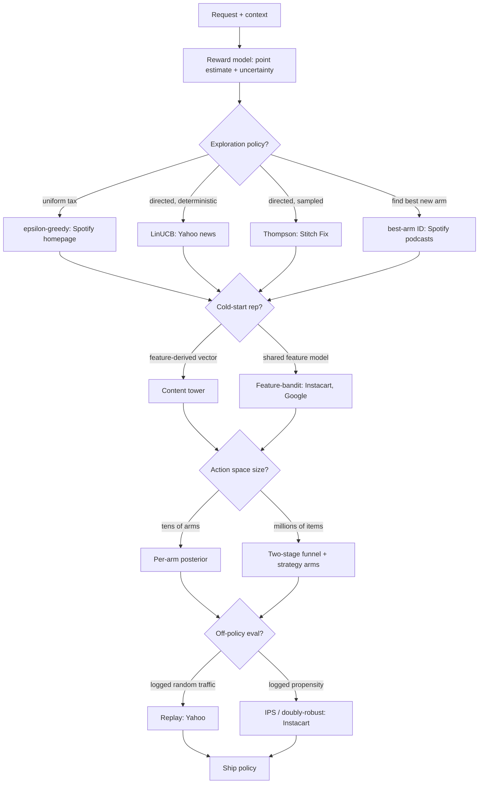
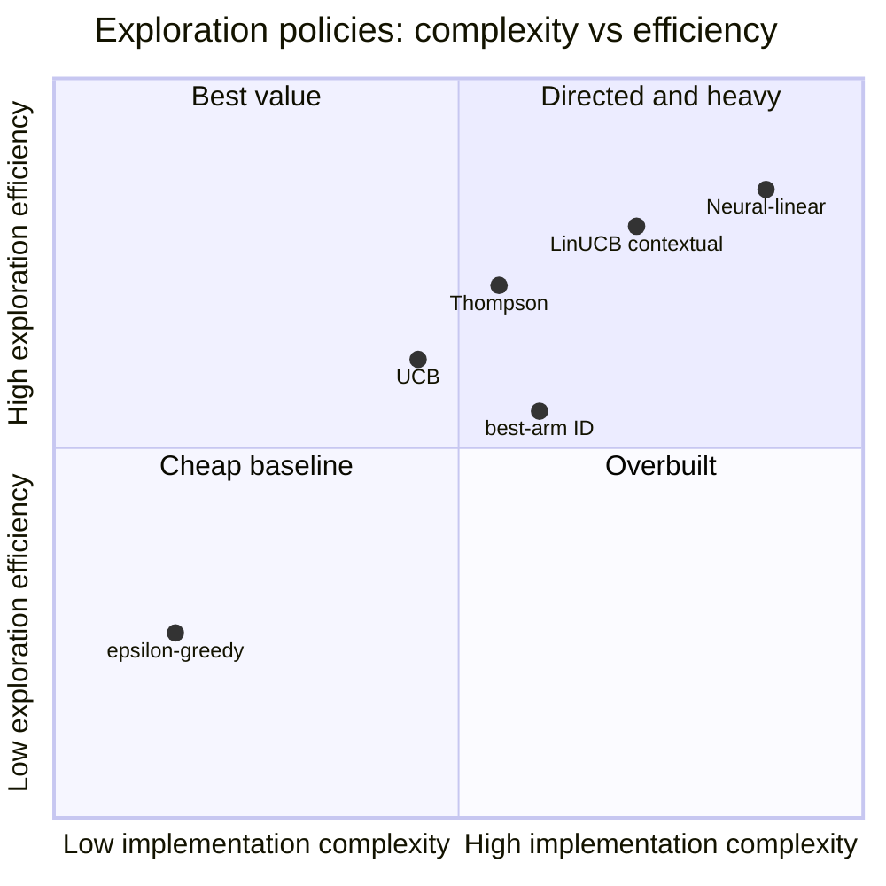

**What they share.** Every system logs `(context, action, propensity, reward)`, scores candidates with a reward model, then spends some impressions on uncertainty so a greedy exploit-only policy does not ossify the corpus. They diverge on how exploration is directed, how the arm set is bounded, and how a new policy is scored offline.

**The reference pipeline.** Strip away the per-company specifics and every design collapses to the same loop: a content tower places cold entities so they are retrievable on day zero, an exploration layer reads the uncertainty the reward model already emits, the serve decision is logged with its propensity, and a new policy is scored off-policy before it ever touches live traffic. The four decision points below are exactly where the systems fork.

**Reading the diagram.** Follow the loop from the top left: the content and metadata tower turns a brand-new user or item with zero interactions into a vector from features alone, so a fresh entity is insertable into the ANN index and retrievable on day zero instead of stranded at an untrained ID embedding, and the leverage is metadata richness plus an online-insertable index. That candidate set flows into the reward model, which emits both a point estimate and an uncertainty, and the exploration layer (epsilon-greedy, UCB, or Thompson, as Spotify, Yahoo, and Stitch Fix respectively pick) reads that uncertainty to decide where to spend impressions; the decision here is explore versus exploit, and the failure mode it defends against is ossification, where greedy argmax serving only ever relabels what it already ranks high and the corpus narrows. The ranked feed is served and then logged with its features, action, propensity, and reward, and that propensity field is load-bearing: it is the single thing that lets a candidate policy be scored off-policy before it touches live traffic. Off-policy evaluation (replay when the log carries uniformly random traffic, IPS or doubly-robust when it carries known propensities) is where a new policy must beat the logged one, and the failure mode is dishonest propensities, since a deterministic argmax with no logged randomness silently breaks every estimator. The retrain arm closes the loop by updating both the towers and the reward model from the same log, and the large-action-space constraint (millions of items, per Instacart and Google) is what forces the retrieval funnel and feature-shared arms rather than a posterior per raw item. The design leverage across the whole flow is that exploration is a cheap layer over an uncertainty the reward model already produces, paid for against long-horizon corpus growth rather than this session's click.

**The choices, side by side.**

| Decision | Options (who) | What decides it |
| --- | --- | --- |
| exploration | `epsilon-greedy` (Spotify homepage) vs `LinUCB` (Yahoo) vs `Thompson` vs `best-arm` (Spotify podcasts) | Uniform tax fits a high-traffic surface where explore rate must stay small; directed spend wins when you can estimate per-arm uncertainty; best-arm ID when the goal is finding good new items, not cumulative reward |
| cold-start rep | `content tower` vs `feature-bandit` (Instacart, Google) | Content tower places a fresh entity from metadata for day-zero retrieval; a feature-parameterized reward model shares parameters across arms so a never-seen item gets uncertainty from its features, not ID history |
| large action space | `per-arm posterior` (Stitch Fix, tens of arms) vs `strategy arms + funnel` (Instacart, millions) | Per-arm posteriors do not scale past thousands; retrieval cuts millions to hundreds, or arms become ranking strategies instead of raw items |
| off-policy eval | `replay` (Yahoo) vs `IPS / doubly-robust` (Instacart) | Replay is unbiased but needs uniformly-random logged traffic and burns most of the log; IPS/DR reuse any logged propensity, DR hedges a bad reward model or bad propensities but not both at once |

**The math that separates them.**

**UCB optimistic score.** Pick the arm with the highest optimistic value: the estimated mean reward plus a bonus that grows with feature-space uncertainty, where `A` is the feature-covariance matrix accumulated for the chosen arm and `alpha` scales exploration.

$$a_t = \text{arg max}_a \left( \hat{\theta}^{\top} x_a + \alpha \sqrt{ x_a^{\top} A^{-1} x_a } \right)$$

**UCB bonus (count form).** For the non-contextual case the bonus reduces to a term that shrinks as an arm is pulled more, where `N_t` is total pulls and `n_{a}` is pulls of arm `a`, so a rarely-tried arm stays optimistic:

$$b_t(a) = \alpha \sqrt{ \dfrac{ \ln N_t }{ n_{a} } }$$

**Thompson Beta posterior draw.** Maintain a Beta posterior per arm from successes `s_a` and failures `f_a`, draw one sample per arm, and serve the argmax of the samples so wide-posterior arms win often enough to get explored:

$$\tilde{\mu}_a \sim \text{Beta}\!\left( \alpha_a + s_a,\ \beta_a + f_a \right), \qquad a_t = \text{arg max}_a \tilde{\mu}_a$$

**IPS off-policy estimate.** Reweight each logged reward by the ratio of the new policy probability to the logging policy propensity, giving an unbiased value estimate when every action had nonzero logging probability:

$$\hat{V}_{\mathrm{IPS}}(\pi) = \frac{1}{n} \sum_{i=1}^{n} \frac{ \pi(a_i \mid x_i) }{ \pi_0(a_i \mid x_i) }\, r_i$$

**Doubly-robust estimate.** Add a learned reward model `\hat{r}` as a baseline and importance-weight only its residual, so the estimate stays consistent if either the reward model or the propensities are right:

$$\hat{V}_{\mathrm{DR}}(\pi) = \frac{1}{n} \sum_{i=1}^{n} \left[ \hat{r}(x_i, \pi) + \frac{ \pi(a_i \mid x_i) }{ \pi_0(a_i \mid x_i) } \Big( r_i - \hat{r}(x_i, a_i) \Big) \right]$$

**When to use which.** Let traffic volume and per-arm uncertainty pick the exploration rule, let the action-space size pick the arm representation, and let the logged randomness pick the off-policy estimator.

| Reach for | When | Instead of |
|---|---|---|
| epsilon-greedy | a high-traffic surface where the explore rate must stay small and simple (Spotify homepage) | directed exploration you cannot afford to tune |
| LinUCB | you can estimate per-arm feature uncertainty and want deterministic directed spend (Yahoo news) | a uniform epsilon tax that explores blindly |
| Thompson sampling (Beta posterior) | directed but sampled exploration from a cheap Bayesian head (Stitch Fix) | hand-tuning a UCB alpha bonus |
| Best-arm identification | the goal is finding good new items, not cumulative reward (Spotify podcasts) | a regret-minimizing bandit optimizing this session |
| Content and metadata tower | day-zero retrieval of a cold entity from features alone | an untrained ID embedding that strands new items |
| Feature-bandit with shared parameters | a never-seen item must get uncertainty from its features (Instacart, Google) | a per-arm posterior with no ID history to draw on |
| Two-stage funnel plus strategy arms | millions of items where per-arm posteriors blow up (Instacart, Google) | enumerating raw items as arms |
| Replay off-policy eval | the log carries uniformly-random traffic (Yahoo) | IPS on a deterministic argmax log with no randomness |
| IPS or doubly-robust | the log carries known nonzero propensities (Instacart); DR hedges a bad reward model or bad propensities | replay that burns most of the log |

**Interview watch-outs.**

- **Explore-exploit is a long-horizon bet.** Exploration lowers this session's reward by construction, so it is only rational under a value-of-information objective. If you cannot name the long-term metric it buys (corpus growth, retention), the interviewer reads it as lost revenue with no return.
- **Ossification is the failure you are defending against.** Greedy argmax serving only collects labels for what it already ranks highly, so demoted items freeze at stale estimates and the served corpus narrows. Say explicitly that the logging policy and the training data are entangled, and that deliberate uncertainty spend is the only escape.
- **Off-policy eval is only as honest as the propensities.** Replay needs uniformly-random logged traffic and burns most of the log; IPS needs nonzero logging probability on every action; doubly-robust hedges a bad reward model or bad propensities but not both at once. A deterministic argmax with no logged randomness silently breaks all three, so prefer a stochastic policy with propensities that match what actually served.
- **Large action spaces kill per-arm posteriors.** Do not enumerate millions of items as arms. Cut with a two-stage funnel, share parameters across arms via features so a never-seen item still gets uncertainty, or make the arms ranking strategies instead of raw items.
- **Uncertainty at ranking latency, not a second model call.** UCB and Thompson need a per-candidate uncertainty cheap enough to compute inline; a full Bayesian posterior per request is too slow, so reach for a linear or neural-linear head whose confidence bonus is a closed form over features.
- **Bound exploration by a quality floor.** Exploring on a checkout or safety-sensitive surface is reckless. State that the worst exploratory impression must clear a threshold, and that the explore rate on a high-traffic surface stays small and capped.
