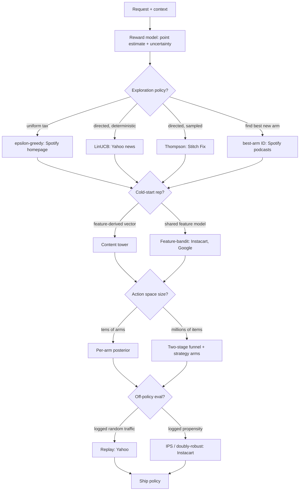
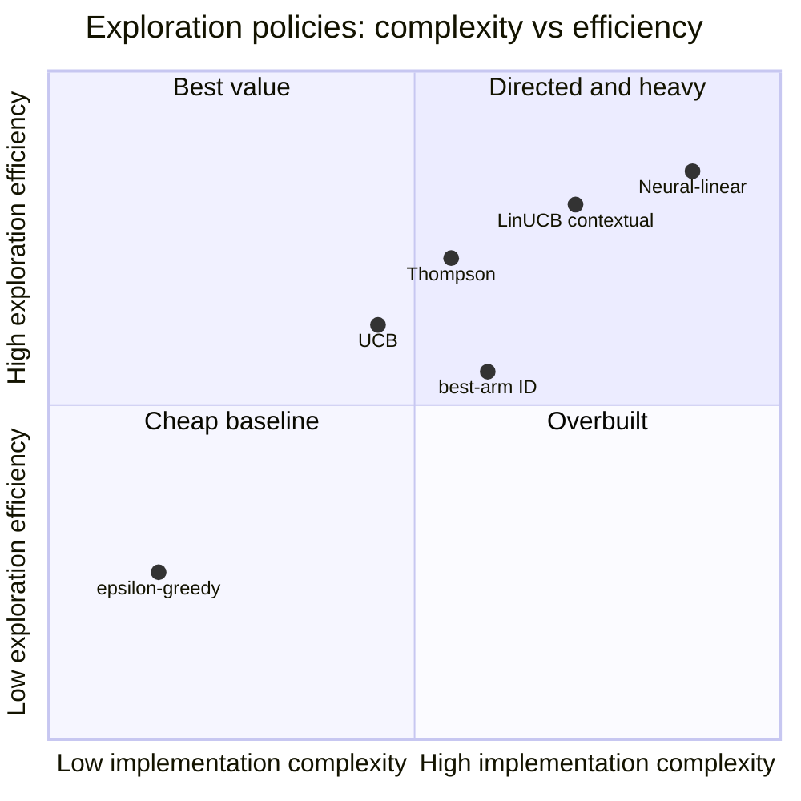

**What they share.** Every system logs `(context, action, propensity, reward)`, scores candidates with a reward model, then spends some impressions on uncertainty so a greedy exploit-only policy does not ossify the corpus. They diverge on how exploration is directed, how the arm set is bounded, and how a new policy is scored offline.

**The choices, side by side.**

| Decision | Options (who) | What decides it |
| --- | --- | --- |
| exploration | `epsilon-greedy` (Spotify homepage) vs `LinUCB` (Yahoo) vs `Thompson` vs `best-arm` (Spotify podcasts) | Uniform tax fits a high-traffic surface where explore rate must stay small; directed spend wins when you can estimate per-arm uncertainty; best-arm ID when the goal is finding good new items, not cumulative reward |
| cold-start rep | `content tower` vs `feature-bandit` (Instacart, Google) | Content tower places a fresh entity from metadata for day-zero retrieval; a feature-parameterized reward model shares parameters across arms so a never-seen item gets uncertainty from its features, not ID history |
| large action space | `per-arm posterior` (Stitch Fix, tens of arms) vs `strategy arms + funnel` (Instacart, millions) | Per-arm posteriors do not scale past thousands; retrieval cuts millions to hundreds, or arms become ranking strategies instead of raw items |
| off-policy eval | `replay` (Yahoo) vs `IPS / doubly-robust` (Instacart) | Replay is unbiased but needs uniformly-random logged traffic and burns most of the log; IPS/DR reuse any logged propensity, DR hedges a bad reward model or bad propensities but not both at once |

**The math that separates them.**

**UCB optimistic score**

$$a_t = \arg\max_a \left( \hat{\theta}^\top x_a + \alpha \sqrt{x_a^\top A^{-1} x_a} \right)$$

**Thompson Beta posterior draw**

$$\tilde{\mu}_a \sim \mathrm{Beta}(\alpha_a + s_a,\ \beta_a + f_a), \qquad a_t = \arg\max_a \tilde{\mu}_a$$

**IPS off-policy estimate**

$$\hat{V}_{\mathrm{IPS}}(\pi) = \frac{1}{n} \sum_{i=1}^{n} \frac{\pi(a_i \mid x_i)}{\pi_0(a_i \mid x_i)} r_i$$

**Doubly-robust estimate**

$$\hat{V}_{\mathrm{DR}}(\pi) = \frac{1}{n} \sum_{i=1}^{n} \left[ \hat{r}(x_i, \pi) + \frac{\pi(a_i \mid x_i)}{\pi_0(a_i \mid x_i)} \big( r_i - \hat{r}(x_i, a_i) \big) \right]$$

