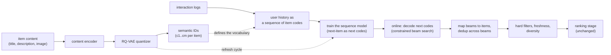
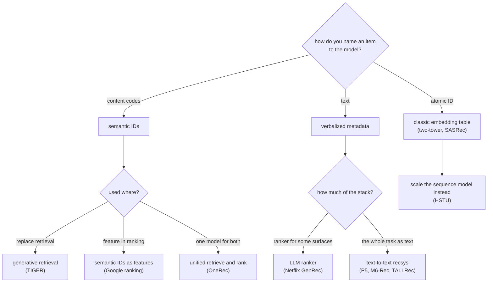
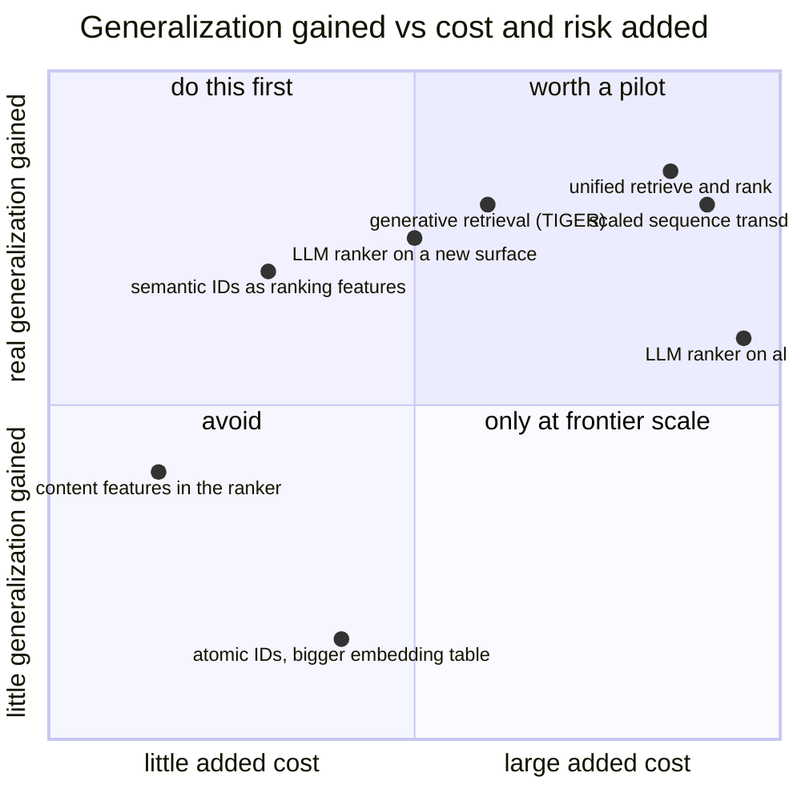

**What they share.** Every system here stops treating an item as an opaque integer. Each one gives the item a representation a model can generalize over (a tuple of content-derived codes, or the item's metadata as text), models the user's history as a sequence in that vocabulary, and then produces the next item by generating rather than by looking it up. All of them still filter, deduplicate and rank afterwards, because a generative retriever that cannot be constrained is not shippable. They diverge on which representation they chose and on how much of the existing cascade they were willing to replace.

**The reference pipeline.** Read every design below as a specialization of this flow. The offline path builds the item representation and trains the sequence model on it; the online path decodes candidates and hands them to the same downstream stages a two-tower retriever would feed.

**Reading the diagram.** Follow the top row first, because it is the part that does not exist in a classic recommender. An item's content is embedded and then quantized into a short tuple of discrete codes, coarse to fine, so two items with similar content share their leading codes. That is the entire generalization mechanism: a new item inherits a neighbourhood from its content instead of waiting for interactions. It also collapses the output vocabulary, from one logit per item (tens of millions) to $K$ logits per code position (typically 256), which is what makes decoding a catalogue tractable at all. The bottom row is the familiar sequence recommender with its vocabulary swapped, and the dotted edge back from the quantizer is the operational trap: retrain the quantizer and every item's ID changes, which invalidates the sequence model trained on the old codes, so the two refresh cycles are coupled whether or not anyone planned for it. On the serving side, decoding is constrained to prefixes that actually exist, beams are deduplicated because several can land on one item, and the result enters the same filter and ranking stages as before. Nothing downstream gets simpler; what changes is where candidates come from and what they cost, since a beam decode is several sequential forward passes against a single ANN probe.

**Where they diverge.** The fork is the item representation, and each choice commits you to a different cost and a different failure mode.

**The choices, side by side.**

| System | Representation | Replaces | The bet | Watch out |
| --- | --- | --- | --- | --- |
| TIGER (Google) | RQ-VAE semantic IDs | The retrieval index | Content codes generalize to cold and tail items | Collisions, and the quantizer refresh cycle |
| Semantic IDs for ranking (Google) | Semantic IDs as features | Nothing; it augments the ranker | Cheapest way to get the generalization | The gain lives in a slice, so an aggregate hides it |
| HSTU (Meta) | Actions as a sequence, atomic items | The ambition is the whole cascade | Quality follows a scaling law, not features | Serving cost, and an organizational commitment |
| OneRec (Kuaishou) | Semantic IDs, one model | Retrieval and ranking together | The cascade is the accidental complexity | One model failing is a whole-surface failure |
| Netflix foundation model | Pretrained user-history model | Nothing directly; it feeds surfaces | One pretrained model amortizes across surfaces | Integration effort per surface |
| Netflix GenRec | Verbalized history and metadata | The ranker, on some surfaces | Engineering velocity on new content types | Token cost and latency per request |
| P5, M6-Rec, TALLRec | Text prompts | Varies by task | An LLM's world knowledge transfers | Sampled-metric optimism, prompt drift |
| DSI (Google) | Document identifiers | Document retrieval, not recsys | The ancestor of the whole idea | Index updates are a retrain |

**The math that separates them.** Three expressions decide whether any of this is worth it.

$$\textbf{vocabulary collapse: } \underbrace{|V| = N_{\text{items}}}_{\text{atomic, } 10^{7}\text{ to }10^{8}} \quad \longrightarrow \quad \underbrace{|V| = K \text{ per position}, \ m \text{ positions}}_{K = 256,\ m = 4 \ \Rightarrow \ K^{m} \approx 4.3 \times 10^{9}}$$

$$\textbf{retrieval cost: } \underbrace{C_{\text{ANN}} \approx 1 \text{ index probe}}_{\text{milliseconds}} \quad \text{versus} \quad \underbrace{C_{\text{gen}} \approx m \text{ sequential steps} \times b \text{ beams}}_{\text{several forward passes}}$$

$$\textbf{where the gain is: } \Delta\text{recall} = \sum_{s \in \text{slices}} w_s \cdot \Delta\text{recall}_s, \qquad \Delta\text{recall}_{\text{tail}} \gg \Delta\text{recall}_{\text{head}}$$

The first says why decoding a catalogue is possible: you never score 50 million things, you score 256 things four times. The second says what it costs, and it is the number most candidates never mention. The third is the reporting rule: the head slice usually moves little or not at all, so an aggregate number both understates the effect and hides the risk.

**When to use which.** Decide what you are short of first: interaction data, engineering velocity, or nothing in particular.

| Reach for | When | Instead of |
|---|---|---|
| Semantic IDs as ranking features | You want the generalization without changing the serving path | Rebuilding retrieval first, which is the expensive half |
| Generative retrieval | Cold start and the long tail are the actual pain | Replacing a healthy ANN path, which buys latency you did not want |
| A unified retrieve-and-rank model | Frontier scale, and the cascade's coordination cost is the bottleneck | A first project, since one model failing takes the whole surface |
| A scaled sequence transducer | You can commit to data, parameters and compute as the improvement axis | Expecting scaling-law gains from a model you cannot afford to grow |
| An LLM ranker on one surface | A new content type has no features and no history | An LLM on all traffic, which is the cost trap |
| Keeping the cascade | Stable catalogue, rich interactions, tuned pipeline | Rebuilding because the frontier is interesting |
| Full-catalogue offline metrics | Comparing any of these to your current system | Sampled-candidate metrics, which flatter generative retrieval most |
| An online test with slice reporting | Any adoption decision | An aggregate offline number, which hides where the gain and the risk both live |

**Interview watch-outs.**

- **Name the representation before the model.** Atomic ID, semantic ID or text is the decision that determines everything else. Candidates who lead with "we would use a transformer" have not answered the question.
- **"No index to maintain" is not true, it is different.** You maintain a valid-prefix structure and the item table instead, and you added a quantizer with its own training and refresh cycle.
- **It is usually not cheaper to serve.** A beam decode is several sequential forward passes against one ANN probe. It buys generalization, not latency.
- **The quantizer refresh is the operational trap.** Retraining it changes every item's ID and invalidates the sequence model trained on the old codes. Version the codebook and migrate both together.
- **Report per slice.** Gains concentrate on cold and tail items. An aggregate both understates the effect and hides the popularity collapse that beam search can cause.
- **Count the hallucinated and unavailable items.** Decoded tuples that map to nothing, or to something the user cannot see, are a metric with a target, not something to silently filter.
- **Say what you would pilot.** The cascade is what nearly everyone runs; the honest answer names one surface, shadow mode, and slice-level decision criteria, rather than proposing to replace a working funnel in one step.
