## Candidate retrieval (two-tower)

### Pinterest: large-scale learned retrieval for Homefeed ([source](https://medium.com/pinterest-engineering/establishing-a-large-scale-learned-retrieval-system-at-pinterest-eb0eaf7b92c5))
Pinterest replaced hand-tuned candidate generators with a jointly-trained two-tower model. The user tower runs at request time and combines a long-term interest summary (PinnerSage) with a real-time user-sequence transformer that captures immediate intent, while the item tower embeds billions of Pins offline into an HNSW index served by their in-house Manas system. Training uses sampled softmax with in-batch negatives and a popularity-bias correction that subtracts the log probability of an item appearing in the batch. A large share of the engineering budget goes to versioning: each ANN host carries model-version metadata so a viewer embedding is never scored against a mismatched index during staggered rollouts.

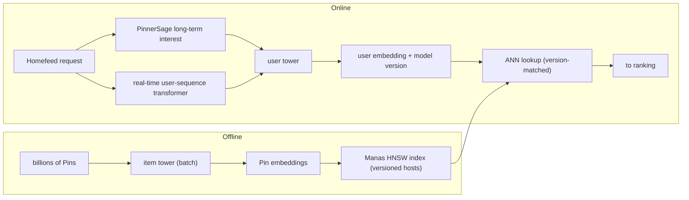
**Interview questions this design invites**
- Why blend a long-term interest summary (PinnerSage) with a real-time sequence transformer in the same user tower instead of picking one?
- How does attaching a model version to each ANN host prevent a viewer embedding from being scored against a stale item index during a rollout?
- Sampled softmax subtracts log P(item in batch); walk through why in-batch negatives over-penalize popular Pins and how that term corrects it.
- Two services (user tower and item index) must be retrained and redeployed in lock-step. What breaks if they drift, and how would you gate the deploy?
- They deprecated two prior candidate generators. How would you prove the learned retriever is strictly better rather than just additive?

**Tricks and gotchas**
- Model-version metadata on every ANN host, plus keeping N previous viewer-model versions for rollback, makes staggered two-service deploys safe.
- Splitting the user tower into a slow long-term interest signal and a fast sequence signal lets one embedding carry both stable taste and immediate intent.
- The popularity-correction term is baked into the loss, not a post-hoc reweight, so it shapes the embedding space directly.
- Building on the existing Manas/HNSW serving stack avoided a new index system and reused proven infra.

**Common mistakes and how to fix them**
- Deploying a new user tower before the matching item index is live: gate on version metadata so mismatched pairs are never scored.
- Ignoring popularity bias from in-batch negatives: add the logQ / batch-probability correction so head Pins are not suppressed.
- Treating retrieval quality as a single-model win: measure save-rate and user coverage against the specific generators you intend to deprecate.
- Assuming a long-term interest vector reacts to current intent: add a real-time sequence signal so a session pivot surfaces immediately.

### YouTube/Google: sampling-bias-corrected neural retrieval (NDR) ([source](https://research.google/pubs/sampling-bias-corrected-neural-modeling-for-large-corpus-item-recommendations/))
Google's Neural Deep Retrieval trains a two-tower model over a corpus of tens of millions of videos, with an item tower over a wide variety of item features and a query tower over user/context features, scored by dot product. The core contribution is fixing sampling bias: the batch softmax over in-batch negatives is skewed under power-law item popularity, so they estimate each item's sampling frequency from streaming data and use it as a logQ correction, yielding an unbiased softmax that adapts as the item distribution drifts. The frequency estimator sketches item occurrences and learns them via gradient descent, so no fixed global count is needed. They validate offline on two datasets and with a live YouTube A/B test showing recommendation-quality gains.

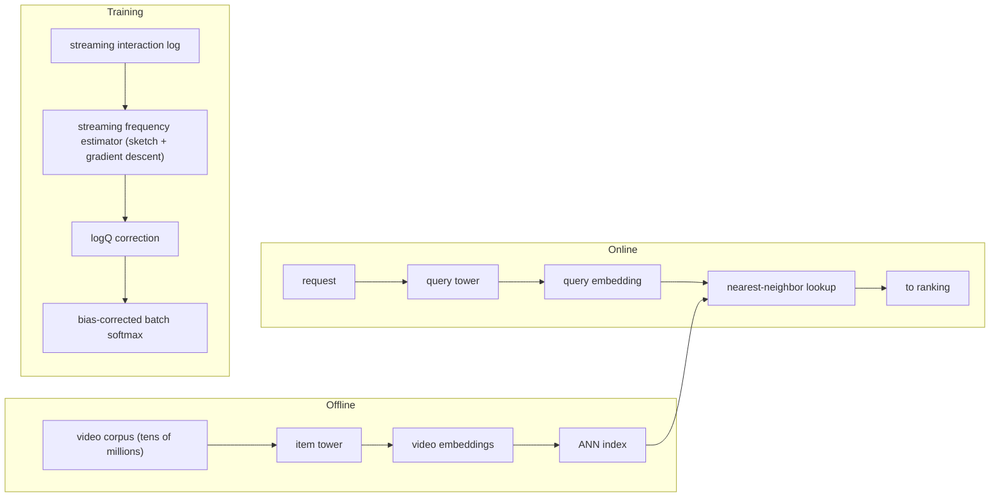
**Interview questions this design invites**
- Why does a plain in-batch softmax become biased specifically under a power-law item distribution?
- How does estimating item frequency from a stream (rather than a fixed global count) let the correction adapt to distribution drift?
- What are the failure modes of the sketch-based frequency estimator, and how would you detect a bad estimate?
- The abstract reports offline gains and an online A/B win. Why insist on both before shipping a retrieval change?
- Where would you apply the logQ term: to logits during training, at serving, or both, and why?

**Tricks and gotchas**
- Frequency is learned online via gradient descent over a sketch, avoiding a separate global counting job that would lag the stream.
- The correction is unbiased and self-adapting, so it keeps working as new videos shift the popularity curve.
- Casting retrieval as a batch-softmax MIPS problem is exactly what makes item embeddings precomputable and ANN-servable.

**Common mistakes and how to fix them**
- Training in-batch negatives without any correction: popular items get pushed down; apply the streaming logQ correction.
- Using a stale global frequency table: estimate frequency from streaming data so it tracks the current distribution.
- Trusting offline recall alone: confirm with an online A/B test since the two do not always move together.
- Normalizing/temperature-scaling embeddings arbitrarily: tune them, as they materially affect the softmax sharpness and recall.

### Uber: two-tower embeddings replacing thousands of city models ([source](https://www.uber.com/blog/innovative-recommendation-applications-using-two-tower-embeddings/))
Uber Eats built one global two-tower model where the query tower encodes search query and user profile and the item tower encodes store, grocery item, and geo-location features, scored by dot product. Instead of raw user IDs, the user side uses a bag-of-words of the customer's time-sorted previously-ordered store_ids, which shrinks the model roughly 20x and softens cold start; the two towers also share a UUID embedding layer. This single contextual model replaced thousands of per-city Deep Matrix Factorization models, cutting weekly training from hundreds of thousands to thousands of core-hours. Training uses in-batch negatives with logQ correction plus geo-hashed data so negatives stay geographically meaningful, lifting recall@500 from 89% to 93%.

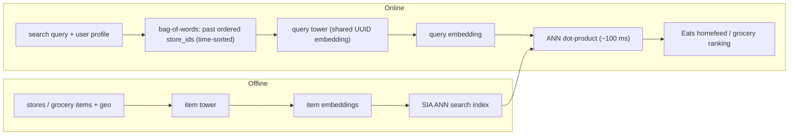
**Interview questions this design invites**
- Why does a bag-of-words of past store_ids beat a raw user-ID embedding for both model size and cold start?
- What does one global contextual model buy over thousands of per-city models, and what does it risk losing for small cities?
- Geo-hashing the training data changes which items become in-batch negatives. Why are geographically-local negatives more useful here?
- Sharing a UUID embedding layer across towers is unusual. What does it couple, and when would it hurt?
- Recall@500 went 89% to 93% with logQ. How would you attribute that gain between logQ and the geo-local negatives?

**Tricks and gotchas**
- A time-sorted bag-of-words of past store_ids replaces user-ID embeddings, cutting model size ~20x while adding personalization.
- Cross-tower UUID embedding sharing reduces complexity yet improved performance, contrary to the usual no-share rule.
- Geo-hashing the training stream produces spatially-constrained negatives so the model learns local, actionable distinctions.
- The same embeddings are reused as transferable features for downstream ML tasks, amortizing the training cost.

**Common mistakes and how to fix them**
- Maintaining a separate model per city: collapse to one global contextual model conditioned on geo features to slash training cost.
- Random global negatives in a geo-local product: geo-hash so negatives are plausible alternatives the user could actually order from.
- Raw user-ID features that explode model size and fail on new users: use an aggregated history bag-of-words instead.
- Skipping popularity correction on in-batch negatives: add logQ to recover several points of recall.

### Airbnb: embedding-based retrieval for search, IVF over HNSW ([source](https://airbnb.tech/ai-ml/embedding-based-retrieval-for-airbnb-search/))
Airbnb added a two-tower retriever to search: a query tower over search parameters (location, guests, length of stay) computed per request, and a listing tower over home attributes (historical engagement, amenities, capacity) precomputed in a daily batch. Training is contrastive over real user journeys, with the finally-booked listing as positive and homes the user saw-but-did-not-book as negatives. They deliberately chose IVF over HNSW because HNSW's memory and rebuild cost could not absorb the high volume of price/availability updates, and geographic filters ran poorly alongside HNSW graph traversal; IVF stores only centroids and cluster assignments, so a filter becomes a cluster-selection step. A key finding: Euclidean distance yields balanced clusters while dot product yields imbalanced ones, because dot product ignores vector magnitude even though many features come from historical counts. Deployment produced a statistically significant bookings gain rivaling two years of ranking wins.

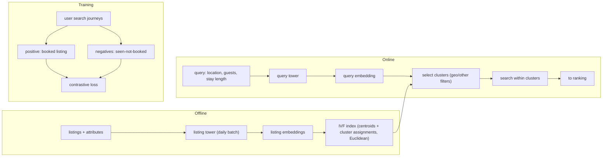
**Interview questions this design invites**
- Why did high price/availability update volume make HNSW's memory footprint and rebuilds untenable, and how does IVF sidestep that?
- Treating a geo filter as cluster selection changes the recall profile. What do you lose versus post-filtering an HNSW result?
- Why does dot-product clustering come out imbalanced while Euclidean is balanced, and why do count-based features make magnitude matter?
- Journey-based negatives (seen-not-booked) vs random negatives: what bias does each introduce?
- A daily listing-embedding batch sets item freshness. How would you surface a brand-new or newly-repriced listing before the next build?

**Tricks and gotchas**
- IVF stores only centroids and cluster assignments, so filters become cluster selection and per-second updates are cheap versus rebuilding an HNSW graph.
- Switching the distance metric to Euclidean fixed cluster imbalance that dot product caused, because many features are historical counts where magnitude is signal.
- Negatives are mined from real multi-search journeys, so the model learns the exact tradeoffs a booking user weighed.
- Query-context (dates, guests, location) enters retrieval itself, not just ranking, so filtered relevance is captured early.

**Common mistakes and how to fix them**
- Defaulting to HNSW everywhere: for high-update, filter-heavy catalogs, IVF's centroid model handles updates and filters far better.
- Using dot-product clustering with count-based features: switch to Euclidean so magnitude is respected and clusters stay balanced.
- Random negatives that ignore the booking funnel: use seen-not-booked journey negatives to teach real preference boundaries.
- Running geo filters as a parallel pass over an ANN graph: fold the filter into cluster selection to keep latency low.

### Snap: two-tower retrieval for Spotlight, split feed and retrieval services ([source](https://eng.snap.com/embedding-based-retrieval))
Snap's Spotlight retrieval uses a user tower over dense features (demographics, engagement stats) and pooled sparse engagement sequences, and a story tower over metadata, creator, and content-understanding embeddings; both are MLP plus 4-layer deep-cross networks producing 128-dim L2-normalized vectors. Training uses in-batch negatives (other users' stories in the batch) with a cosine-similarity, sigmoid, BCE loss and temperature-scaled hardness-aware weighting. Operationally the key move is splitting serving into a high-QPS feed-processing service that fetches the user embedding and a separately sharded retrieval service that queries HNSW indexes over millions of story documents, so the two scale independently and multiple EBR sources coexist. User embeddings refresh every few hours and story embeddings refresh frequently via separate offline dataflows; the system delivered double-digit view and view-time gains.

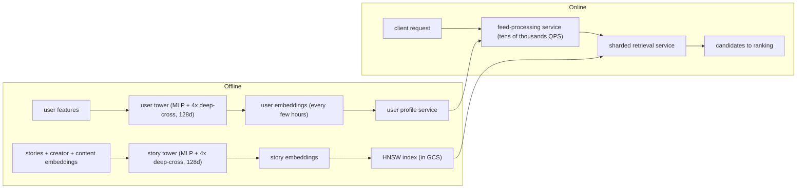
**Interview questions this design invites**
- Why split feed-processing from a sharded retrieval service instead of one service, and what does each scale on independently?
- User embeddings refresh every few hours but story embeddings refresh frequently. Why the asymmetry, and what staleness does each introduce?
- In-batch negatives use other users' stories to counter country/language mismatch. What bias does same-batch composition still leave?
- Both towers are 128-dim L2-normalized with deep-cross layers. Why L2-normalize, and what does the deep-cross network add over a plain MLP?
- They run several EBR sources (user-story, user-creator, similar creators). How would you blend and dedup them before ranking?

**Tricks and gotchas**
- The feed-processing / retrieval split lets one service absorb tens-of-thousands QPS while the sharded index service scales on document count.
- Temperature-scaled hardness-aware weighting in the BCE loss focuses learning on informative in-batch negatives.
- Story embeddings live in GCS and refresh on a fast cadence, decoupling item freshness from the slower user-embedding job.
- The architecture is explicitly multi-model, so new EBR sources plug in without reworking the serving path.

**Common mistakes and how to fix them**
- Coupling request handling and index search in one service: split them so QPS-bound and corpus-bound scaling are independent.
- Refreshing user and item embeddings on one cadence: give fresh-churning items their own fast dataflow.
- Un-normalized embeddings that make cosine unstable: L2-normalize both towers to a fixed dimension.
- Treating all in-batch negatives as equally hard: add hardness-aware weighting so easy negatives do not dominate the gradient.

### Etsy: unified embedding-based personalized retrieval ([source](https://arxiv.org/abs/2306.04833))
Etsy's search retrieval unifies graph, transformer, and term/token-based embeddings end to end into a single model with separate query and product encoders scored for semantic matching, tuned for a performance-versus-efficiency tradeoff. The distinguishing choices are a hard-negative sampling strategy plus feature engineering that lets one embedding capture lexical, semantic, and behavioral signal at once, avoiding separate lexical and vector retrievers. For serving they use HNSW with 4-bit product quantization to fit the index at scale with minimal recall loss. Aggregated across multiple live A/B tests, the model lifted search purchase rate by +5.58% and site-wide conversion by +2.63%.

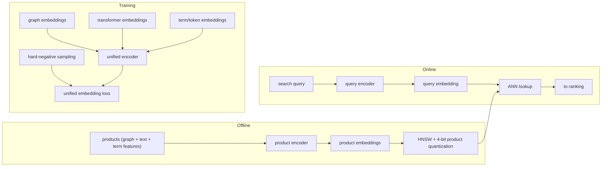
**Interview questions this design invites**
- What does unifying graph, transformer, and term embeddings into one model buy over running lexical and vector retrievers side by side?
- Why does hard-negative sampling matter more here than in-batch negatives, and how do you avoid destabilizing training with too many?
- 4-bit product quantization shrinks the HNSW index; how much recall do you trade, and how would you measure it?
- The +5.58% purchase-rate gain aggregates multiple A/B tests. Why aggregate rather than cite one test?
- How would term/token embeddings help typo and long-tail queries that a purely semantic encoder might miss?

**Tricks and gotchas**
- Folding term/token embeddings into the same model preserves lexical matching that a purely semantic vector retriever would drop.
- 4-bit product quantization on HNSW keeps the index in memory at catalog scale with a controlled recall hit.
- Hard-negative mining sharpens the decision boundary that easy in-batch negatives leave fuzzy.
- Training the three embedding families end to end lets the model learn how to weight them rather than fixing weights by hand.

**Common mistakes and how to fix them**
- Maintaining separate lexical and semantic retrievers: unify them into one embedding so ranking sees a single consistent candidate set.
- Relying only on easy in-batch negatives: add a hard-negative sampling strategy to improve precision on near-misses.
- Storing full-precision vectors that blow the memory budget: apply product quantization and validate recall stays acceptable.
- Judging retrieval on offline metrics only: gate on live A/B purchase-rate and conversion, aggregated across tests.

### Expedia Group: two-tower candidate generation for travel ([source](https://medium.com/expedia-group-tech/candidate-generation-using-a-two-tower-approach-with-expedia-group-traveler-data-ca6a0dcab83e))
Expedia built a two-tower candidate generator where the query tower encodes search context (user history, queries, reference items) and the property tower encodes property characteristics (location, popularity, amenities); both are stacks of ReLU fully-connected layers producing matching-dimension vectors scored by a batched dot product. Training uses in-batch sampled softmax with an identity-matrix label (the diagonal is the positive) and, critically, a logQ correction that subtracts each item's log occurrence probability from the logits to counter popularity bias. Item embeddings are indexed in ScaNN for ANN retrieval so candidates are fetched without scoring the full catalog. Ablations showed batch normalization, logQ correction, and L2 normalization together gave the best recall@k, well above logQ alone.

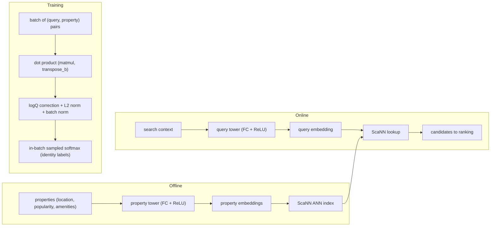
**Interview questions this design invites**
- Why must the query and property towers output the same dimension, and what breaks if they do not?
- Walk through the identity-matrix labeling of an in-batch softmax: why is the diagonal the positive and everything off-diagonal a negative?
- The ablation shows batch norm + logQ + L2 beats logQ alone. Why do these three interact rather than add independently?
- ScaNN vs HNSW vs IVF: what would make ScaNN the right index choice for this catalog?
- Travel items have strong seasonality and availability. How would you keep property embeddings fresh enough?

**Tricks and gotchas**
- The whole in-batch loss is a single matmul with transpose_b plus an identity label, which is cheap and vectorized.
- logQ correction is applied to the logits directly, keeping popular properties from being unfairly penalized.
- Combining batch normalization and L2 normalization with logQ was necessary to realize the full recall gain, not optional polish.
- Reference items in the query tower let the model condition on what the traveler is already looking at.

**Common mistakes and how to fix them**
- Applying logQ but skipping normalization: pair it with L2 and batch norm to actually move recall@k.
- Mismatched tower output dimensions: enforce equal dimensions so the dot product is well-defined.
- Scoring the full property catalog per request: index item embeddings in ScaNN and do ANN retrieval instead.
- Ignoring popularity bias from in-batch negatives: subtract log item-occurrence probability from the logits.

### Pinterest: request-level deduplication and false-negative masking ([source](https://medium.com/pinterest-engineering/scaling-recommendation-systems-with-request-level-deduplication-93bd514142d9))
When Pinterest sorted training data by request (to enable deduplication), batches concentrated on few users, so many in-batch negatives were actually items those users had engaged with, pushing the false-negative rate from near 0% (IID) to about 30% and degrading the two-tower retriever. The fix modifies the InfoNCE loss with user-level masking: only engagements from other users count as negatives, excluding candidates whose user matches the anchor. Separately, a user's ~16K-token history was being duplicated for every scored candidate; they dedup it with Iceberg sorted storage (10-50x compression) and, for two-tower training, run the user tower once per request over R requests rather than B pairs (4x retrieval speedup). For ranking they built a Deduplicated Cross-Attention Transformer that encodes user history once and caches KV so each item cross-attends the cached context (7x serving throughput).

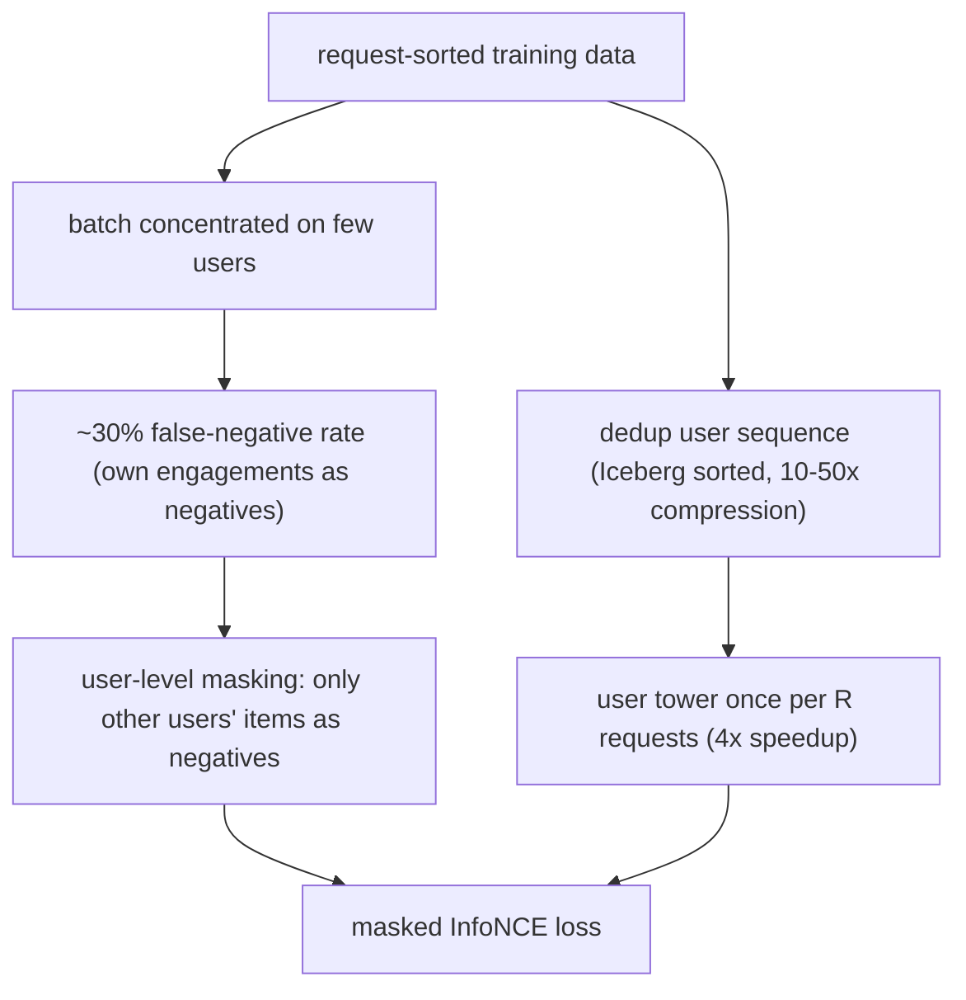
**Interview questions this design invites**
- Why does request-sorted data spike the in-batch false-negative rate to ~30% when IID sampling sits near 0%?
- Derive the user-level masking change to InfoNCE: which negatives get excluded and why does that restore quality?
- Running the user tower once per request instead of per pair gives a 4x speedup. What makes that safe for two-tower but harder for a cross-attention ranker?
- What tradeoff does request-sorting buy (storage/compute) that justifies fighting the false-negative problem it creates?
- How would you monitor false-negative rate in production to know masking is still needed?

**Tricks and gotchas**
- A one-line masking constraint on InfoNCE recovered retrieval quality while unlocking request-sorted training data.
- Sorting storage by request/user in Iceberg compresses user-heavy feature columns 10-50x.
- Two-tower retrieval is already dedup-friendly: compute the user embedding once per request, not once per candidate.
- The ranking-side DCAT caches user-history KV so each item cross-attends cached context, giving 7x throughput without recomputing the sequence.

**Common mistakes and how to fix them**
- Switching to request-sorted data without touching the loss: add user-level masking or the false-negative rate wrecks recall.
- Recomputing the full user sequence per candidate: dedup it (once per request for two-tower, cached KV for ranking).
- Storing duplicated user features naively: sort by request/user in columnar storage to reclaim 10-50x space.
- Assuming IID-sampling assumptions hold after re-sorting data: re-measure false-negative rate before trusting the loss.

### Glassdoor: two-tower candidate generation served on OpenSearch ([source](https://medium.com/glassdoor-engineering/improving-embedding-based-candidate-generation-for-recommender-systems-with-a-two-tower-model-c222123beb7f))
Glassdoor built a two-tower recommender where the user tower encodes profile and engagement metadata and the post tower encodes post text, comment text, and topics (each via a Sentence Transformer) plus structured post features, both stacks being linear layers with ReLU. Training combines mixed negatives (in-batch via matmul plus uniformly-sampled random negatives from the full corpus) under a sampled-softmax contrastive loss, with an auxiliary self-supervised loss that masks input features so the model learns structure independent of interactions. Post embeddings are precomputed in batch and indexed in OpenSearch's vector kNN for ANN retrieval, with a model service returning embeddings over REST. Offline they saw 40-60% relative gains on Precision/Recall/F1/HitRate@K over a Sentence-Transformer baseline, and A/B tests gave +5% engaged users and +5% clicks with better feed diversity.

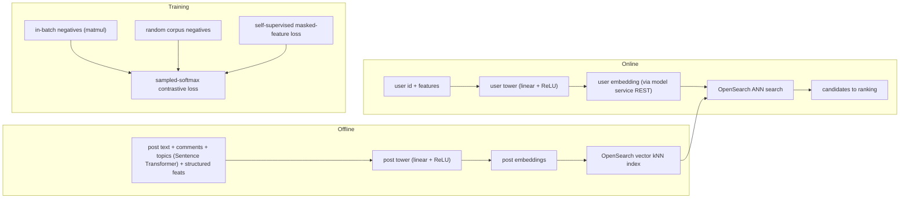
**Interview questions this design invites**
- Why mix in-batch and random-corpus negatives rather than relying on either alone?
- What does the self-supervised masked-feature auxiliary loss add that the contrastive loss cannot learn?
- Post features come from a Sentence Transformer. What are the freshness and cost implications of re-embedding text on every post update?
- Serving via OpenSearch kNN vs a dedicated HNSW service: what do you gain and give up?
- Offline showed 40-60% relative gains but A/B only +5%. Why the gap, and which number do you trust for the ship decision?

**Tricks and gotchas**
- Sentence-Transformer embeddings of post/comment/topic text give the item tower strong cold-start content signal.
- Mixed negatives (in-batch for hard-ish, random for coverage) balance boundary sharpness against corpus representativeness.
- A masking-based self-supervised loss regularizes the towers to learn structure beyond observed interactions.
- Reusing OpenSearch's built-in vector kNN avoided standing up a separate ANN service.

**Common mistakes and how to fix them**
- Only in-batch negatives on a small-user batch: add uniform random corpus negatives so the model sees the whole distribution.
- Over-trusting large offline lifts: validate with an A/B test, expecting compression from offline to online.
- Text features that go stale on edits: re-embed posts on update so the item tower reflects current content.
- Learning only from interactions: add self-supervised auxiliary objectives to generalize to sparse-interaction items.

### Spotify: Voyager, an HNSW nearest-neighbor library for serving retrieval ([source](https://engineering.atspotify.com/2023/10/introducing-voyager-spotifys-new-nearest-neighbor-search-library))
Voyager is Spotify's production HNSW-based nearest-neighbor library, the successor to Annoy, that provides the ANN lookup at the end of a two-tower or embedding retrieval pipeline. It is about 10x faster than Annoy at equal accuracy, up to 50% more accurate at equal speed, and uses 4x less memory via E4M3 8-bit float quantization (16x less than hnswlib during index build). It ships identical Python and Java interfaces so ML teams (Python) and backend teams (JVM) share one index format, and it deploys as stateless in-memory indexes on Kubernetes so similarity lookups need no database. It powers recommendation features such as Discover Weekly and has been battle-tested across teams since 2022.

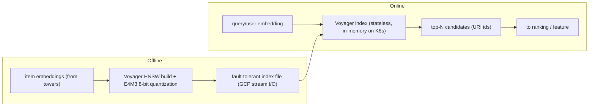
**Interview questions this design invites**
- Why does E4M3 8-bit quantization cut memory 4x, and where does the accuracy cost show up in HNSW recall?
- What forces a company to build a new library instead of adopting hnswlib? What API/architecture constraints drove Voyager?
- Stateless in-memory indexes on Kubernetes eliminate a database. What operational tradeoffs does that introduce for freshness and rollout?
- Identical Python and Java bindings: why is a shared index format across languages worth building from scratch?
- HNSW gives 10x speed but higher memory than IVF-PQ. When would you still pick IVF-PQ over Voyager?

**Tricks and gotchas**
- E4M3 8-bit float quantization gives 4x memory savings while keeping accuracy competitive, and 16x savings during index creation.
- Matching Python and Java interfaces lets ML and backend teams share one index without a serialization boundary.
- Stateless in-memory K8s deployment removes database maintenance from the serving path.
- Fault-tolerant files with corruption detection and string URI ids make the index safe to ship and reference directly.

**Common mistakes and how to fix them**
- Running ANN behind a database when the index fits in memory: deploy stateless in-memory replicas for lower latency and less ops.
- Full-precision vectors that inflate memory: quantize (E4M3 8-bit) and verify recall stays within budget.
- Forking a library your stack cannot adapt: if API/architecture needs diverge, a purpose-built library can be cheaper than fighting one.
- Different index formats per language: standardize one library with shared bindings so ML and serving stay in sync.

### Twitter: debiasing model-based candidate generation for the home timeline ([source](https://arxiv.org/abs/2105.09293))
Twitter's paper tackles dataset bias in two-tower candidate generation for the home timeline: the training log lacks representative examples of very irrelevant candidates, so the model is never taught what a clearly-bad candidate looks like. They find inverse propensity scoring, the usual debiasing tool, does not work well in the candidate-generation setting. Instead they use random sampling techniques to inject representative negatives and mitigate the bias, then fine-tune for additional gains. The result is a candidate generator that better separates relevant from irrelevant tweets at retrieval time.

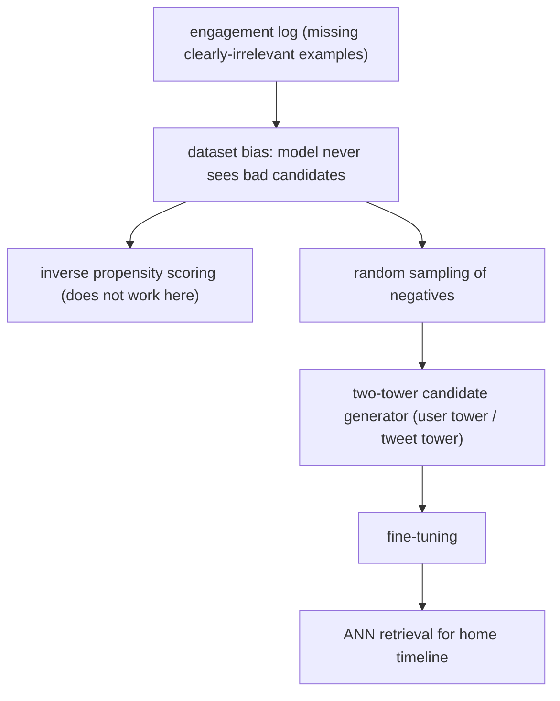
**Interview questions this design invites**
- Why does the engagement log systematically lack very-irrelevant candidates, and why does that hurt a retrieval model specifically?
- Why does inverse propensity scoring fail in candidate generation when it works for ranking or counterfactual eval?
- How do random-sampled negatives supply the missing irrelevant examples, and what bias might random sampling itself add?
- What is the fine-tuning step correcting for after random-sampling debiasing?
- How would you measure whether the debiased retriever actually surfaces fewer irrelevant tweets online?

**Tricks and gotchas**
- Random sampling supplies the clearly-irrelevant negatives the log never records, which is the crux of the fix.
- The paper explicitly rejects IPS for this setting, a useful counter to the reflex of reaching for propensity weighting.
- A fine-tuning pass layered on the debiased base model recovers additional quality.

**Common mistakes and how to fix them**
- Assuming IPS is the default debiasing tool: in candidate generation it underperforms; use random-sampled negatives instead.
- Training only on logged (retrieved-and-shown) items: the model never learns obvious negatives, so inject random ones.
- Treating debiasing as a single step: follow it with fine-tuning to close the remaining gap.
- Evaluating only on logged positives: build an eval that includes representative irrelevant candidates.

### Walmart: relevance-enhanced embedding-based retrieval ([source](https://arxiv.org/abs/2408.04884))
Walmart improves its neural embedding-based product retrieval, which bridges the vocabulary gap between queries and products, by attacking training-data noise and robustness. They train a Relevance Reward Model from human relevance feedback and distill its signal into the EBR model through a multi-objective loss, so the retriever is steered toward human-judged relevance rather than raw clicks. They add typo-aware training so query misspellings still retrieve the right products, and semi-positive generation to manufacture additional useful training signal. Together these sharpen relevance of the retrieved candidate set at search time.

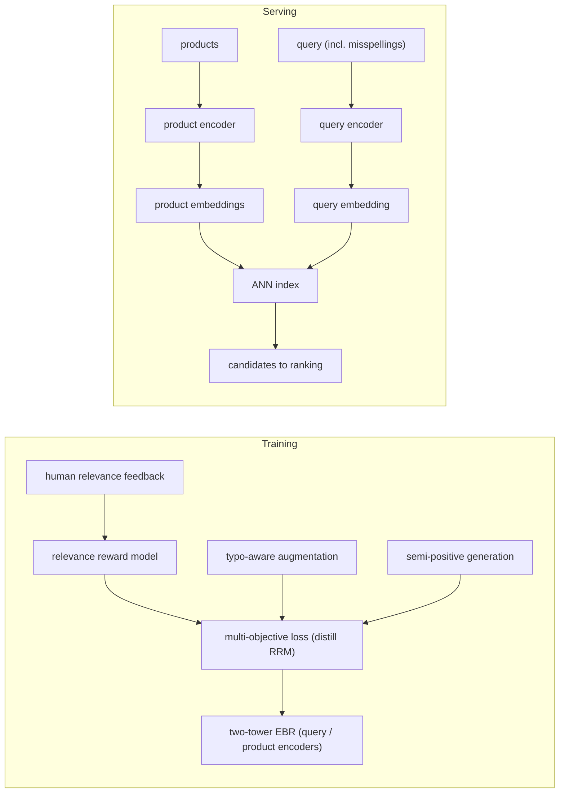
**Interview questions this design invites**
- Why distill a relevance reward model into EBR instead of training directly on click labels?
- How does a multi-objective loss balance the RRM relevance signal against engagement signal without one dominating?
- What does typo-aware training change in the query encoder, and why not just add a spell-corrector upstream?
- What is semi-positive generation, and what failure mode of pure positive/negative labeling does it address?
- How would you keep the RRM from encoding the annotators' own biases into retrieval?

**Tricks and gotchas**
- A human-feedback reward model denoises training data that raw clicks would mislabel, then is distilled rather than queried online.
- Typo-aware training bakes misspelling robustness into the encoder instead of relying on a separate correction stage.
- Semi-positive generation manufactures extra useful training pairs where explicit labels are sparse.
- The multi-objective loss lets one model serve both relevance and engagement rather than trading them off by hand.

**Common mistakes and how to fix them**
- Training EBR on clicks alone: clicks are noisy for relevance; distill a human-feedback reward model to clean the signal.
- Bolting on a spell-corrector instead of robustifying the model: use typo-aware training so the encoder handles misspellings directly.
- Starving the model of positives in sparse regions: generate semi-positive pairs to fill gaps.
- Optimizing a single objective: use a multi-objective loss so relevance and engagement are jointly served.

_Not yet covered (reachable, beyond the 12-case cap): Allegro (Two-tower recommendations at Allegro.com, https://arxiv.org/abs/2508.03702)._

_Not reachable: none_
