## Ranking model

### Google: Wide & Deep ranking for Google Play app recommendations ([source](https://arxiv.org/abs/1606.07792))

Google combined a wide linear model and a deep neural network into a single jointly-trained ranker for Google Play app recommendations, serving over a billion users. The wide side is a generalized linear model over raw and cross-product categorical features that memorizes specific, frequent user-item rules; the deep side embeds sparse features into low-dimensional dense vectors and runs an MLP that generalizes to feature combinations never seen in training. Both outputs are summed into one logit and trained together so memorization and generalization share the same gradient signal. Online A/B tests showed Wide & Deep lifted app acquisitions over wide-only and deep-only baselines, and the model was open-sourced in TensorFlow.

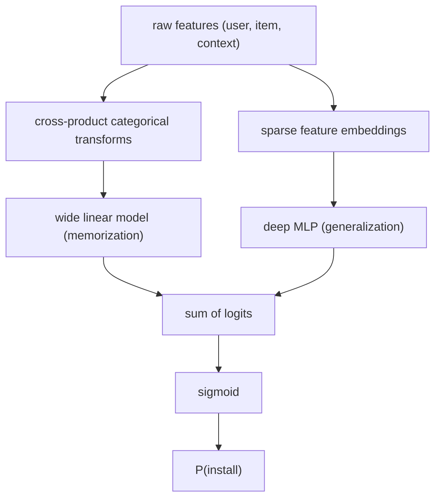

**Interview questions this design invites**
- Why join the wide and deep parts at the logit rather than training two models and ensembling their scores?
- Which feature crosses go in the wide side, and how do you pick them without exploding the parameter count?
- What breaks if you drop the wide side entirely and rely only on the deep MLP?
- Why does the deep side over-generalize on sparse, high-rank interactions, and how does the wide side compensate?
- How would you serve this within a per-candidate latency budget when scoring hundreds of apps?
- The paper reports offline AUC roughly flat but online acquisitions up. Why can offline and online diverge here?

**Tricks and gotchas**
- The wide side needs hand-engineered cross features; that manual work is the cost of its memorization power, not an incidental detail.
- Joint training means the two optimizers (FTRL for wide, AdaGrad for deep in the paper) update against a shared loss, so tuning one side shifts the other.
- Embedding tables, not the MLP, dominate parameter count once you have millions of app and user ids.
- Wide-only memorizes but cannot rank unseen crosses; deep-only generalizes but recommends off-target items when interactions are sparse.

**Common mistakes and how to fix them**
- Treating wide-and-deep as an ensemble of two separately trained models. Fix: train jointly so the combined logit is optimized end to end.
- Putting continuous features raw into the wide side. Fix: bucketize or cross them; the wide side wants categorical crosses.
- Skipping cross features and expecting the deep MLP to recover them. Fix: engineer the crosses the product actually needs; the MLP will not reliably rediscover them.

### Meta: DLRM, explicit pairwise feature interactions for recommendation ([source](https://arxiv.org/abs/1906.00091))

DLRM is Meta's reference recommendation model built around explicit second-order feature interactions. Each sparse categorical feature indexes its own embedding table (a one-hot lookup that returns one dense vector per feature), while dense continuous features pass through a bottom MLP that outputs a vector of the same width. The model then takes the dot product between every pair of these vectors, concatenates those interaction terms with the processed dense vector, and feeds the result into a top MLP with a final sigmoid for click probability. To scale, DLRM uses model parallelism on the memory-heavy embedding tables and data parallelism (with allreduce) on the compute-heavy MLPs.

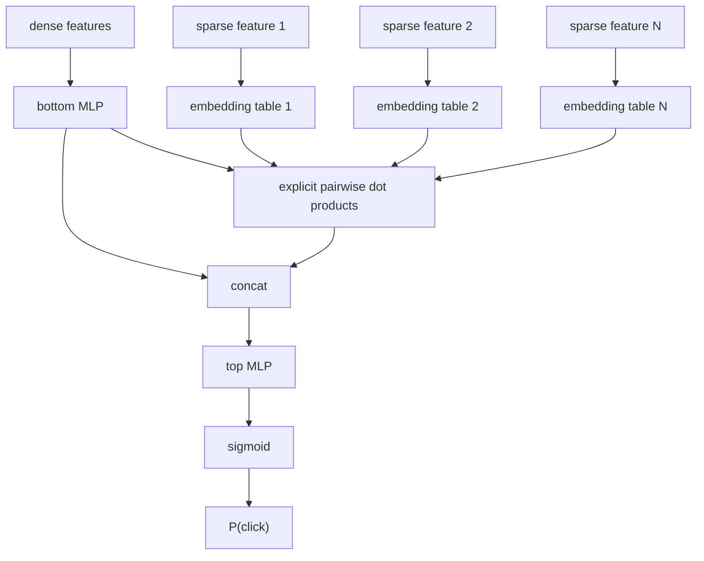

**Interview questions this design invites**
- Where exactly does the interaction step sit, and why after the embeddings and bottom MLP rather than before?
- Why compute explicit pairwise dot products instead of letting the top MLP learn the interactions implicitly?
- Why must dense and embedded features share the same width before the interaction layer?
- Why is model parallelism used for embeddings but data parallelism for the MLPs?
- How does per-candidate cost scale as you add sparse features, given the pairwise interaction is quadratic in feature count?
- How would you shard a single embedding table too large for one device?

**Tricks and gotchas**
- The interaction is second-order only by construction; higher-order crosses still lean on the top MLP.
- Bottom MLP output width must equal embedding dimension or the dot products are undefined; this is the wiring diagrams get wrong.
- Embedding tables carry almost all the parameters, so memory, not FLOPs, is the scaling wall.
- Pairwise interaction count grows quadratically with the number of sparse features, so feature count is a latency lever.

**Common mistakes and how to fix them**
- Drawing the interaction before the embeddings or merging dense and sparse paths too early. Fix: interact after embeddings and bottom MLP, before the top MLP.
- Data-paralleling the embedding tables. Fix: model-parallel them; they do not fit replicated per device.
- Assuming a wide top MLP substitutes for explicit interactions. Fix: keep the dot-product layer; it is the whole point of DLRM.

### Instacart: one deep pCTR model consolidating per-surface XGBoost ([source](https://company.instacart.com/how-its-made/one-model-to-serve-them-all-how-instacart-deployed-a-single-deep-learning-pctr-model-for-multiple-surfaces-with-improved-operations-and-performance-along-the-way))

Instacart replaced a fleet of surface-specific XGBoost pCTR models (Buy It Again, Frequently Bought With, Store Root, Collections, Item Details) with one wide-and-deep deep learning model. The deep side embeds high-cardinality features (product id, user id, textual attributes) through large embedding matrices into stacked fully connected layers; the wide side runs low-cardinality categoricals and continuous features through a factorization machine that models pairwise interactions and lets coefficients vary by surface. A factorization machine layer adds explicit second-order interactions for a roughly 1% log-loss and AUC gain. Consolidation reported 10 to 190% AUC-PR gains and 64 to 77% calibration improvements across surfaces, plus lower serving latency and far less model-maintenance overhead.

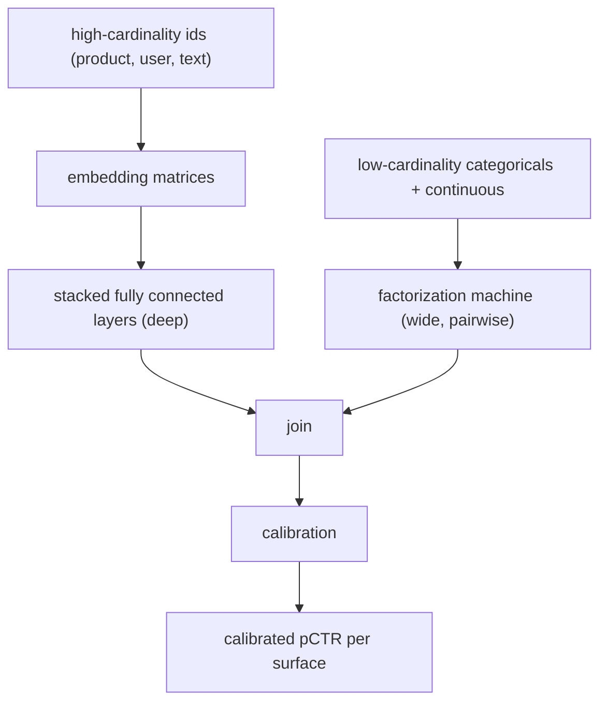

**Interview questions this design invites**
- What do you gain and risk by serving five product surfaces from one model instead of five?
- How does the factorization machine let one model behave differently per surface without a separate model each?
- Why did calibration improve so much when consolidating, and why does calibration matter for pCTR specifically?
- How do you prevent one high-traffic surface from dominating the shared training signal?
- What is the operational payoff (iteration speed, maintenance) versus the modeling payoff here?
- How would you handle a brand-new surface with little labeled data under this single-model design?

**Tricks and gotchas**
- Surface identity must be a feature so the FM coefficients can specialize; drop it and surfaces blur together.
- Mean target encoding (historical CTR segments) is a leakage risk if not point-in-time correct.
- Missing values are imputed with defaults the model can learn to read as signal, not silently zeroed.
- A single model concentrates risk: one bad deploy hits every surface at once.

**Common mistakes and how to fix them**
- Assuming consolidation must sacrifice per-surface accuracy. Fix: let surface-conditioned FM coefficients recover surface-specific behavior.
- Ignoring calibration and shipping raw scores across surfaces. Fix: add an explicit calibration step, since surfaces have different base rates.
- Sharing training data naively so heavy surfaces swamp light ones. Fix: balance or weight by surface, and monitor per-surface AUC-PR.

### Pinterest: multi-task learning and calibration for utility-based home feed ranking ([source](https://medium.com/pinterest-engineering/multi-task-learning-and-calibration-for-utility-based-home-feed-ranking-64087a7bcbad))

Pinterest ranks the home feed with a multi-task DNN whose separate heads each predict one binary engagement action (click, long-click, close-up, repin), sharing a lower body while keeping action-specific outputs. Because the DNN is trained on stratified-sampled data, its head outputs are not true probabilities, so each head gets a per-action logistic-regression calibration model that maps ranking-optimized scores to empirical rates using 80+ features (position and bias signals, historical action rates over 3-hour to 90-day windows, and real-time geo/demographic feedback). The calibrated per-action probabilities combine by weighted summation into a single utility score, with high negative weights suppressing bad content. Utility weights are tuned live, so stakeholders adjust the ranking within hours instead of retraining.

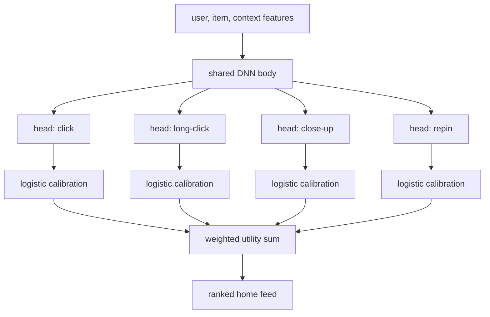

**Interview questions this design invites**
- Why calibrate each head separately instead of calibrating the final utility score once?
- Why does stratified sampling during training force a calibration step at all?
- How does decoupling utility weights from the model let the business retune ranking without retraining?
- What goes into the calibration model beyond a single Platt-scaling parameter, and why 80+ features?
- How do you keep negatively-correlated tasks (for example close-up versus repin) from hurting each other in the shared body?
- How would you validate that offline calibration error predicts online behavior before shipping?

**Tricks and gotchas**
- Calibration here is a transfer-learning layer with real features, not one-parameter Platt scaling.
- Calibration training data deliberately excludes the stratified sampling used for the main model, so it reflects true rates.
- Utility weights are a live business lever; changing them reorders the feed within hours without touching model weights.
- Negative-weight terms let the utility actively demote content, not just rank positives.

**Common mistakes and how to fix them**
- Treating multi-task head outputs as calibrated probabilities. Fix: add a per-head calibration model trained on unsampled data.
- Baking business weightings into the loss. Fix: keep them as post-model utility weights so they are tunable without retraining.
- Sharing one body across tasks without checking task correlation. Fix: monitor per-task metrics and use gating if tasks conflict.

### Pinterest: multi-task related products recommendations ([source](https://medium.com/pinterest-engineering/multi-task-learning-for-related-products-recommendations-at-pinterest-62684f631c12))

Pinterest replaced a single binary engagement classifier for related-products recommendations with a multi-task model that outputs four separate scores (save, click, long-click, close-up), sharing the same feature and fully connected layers and differing only in the output heads. The binary model lost signal by collapsing distinct actions into one label; the four-head version keeps each action distinct and lifted propensity and volume across all engagement types. The multi-task loss is an equal-weighted sum of per-head log losses, and a calibration correction accounts for negative downsampling so outputs are true probabilities (checked with calibration plots and Brier scores). The final ranking score is a weighted sum of per-action probabilities computed after training, so utility weights can be retuned without retraining. Bayesian optimization of the weights did not beat hand-picked weights.

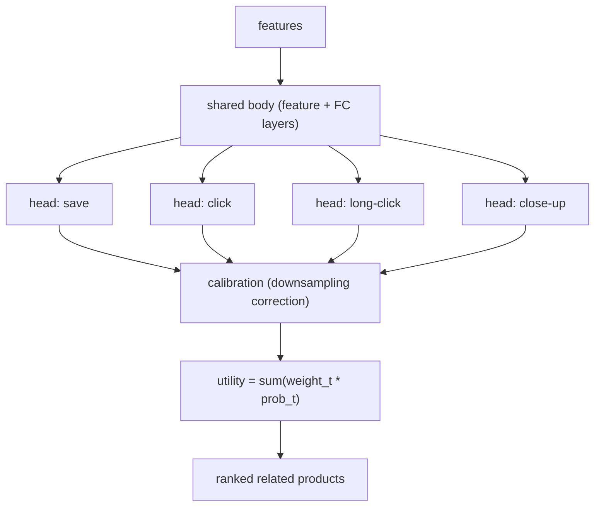

**Interview questions this design invites**
- Why does a binary classifier lose signal when several engagement types get merged into one label?
- Why compute the ranking score after training instead of learning the utility weights inside the loss?
- Why did equal-weighted per-head losses work as a starting point, and when would you weight them unequally?
- Why did Bayesian optimization of utility weights fail to beat hand-picked ones, and what would you try next?
- What calibration correction is needed when you train with negative downsampling?
- How do you validate calibration beyond eyeballing a plot?

**Tricks and gotchas**
- Shared body plus per-task heads means the heads share representation but keep separate decision surfaces.
- Negative downsampling shifts the predicted base rate, so a calibration correction is mandatory, not optional.
- Utility weights are a post-training lever; changing them re-ranks instantly without a new model.
- Offline Bayesian weight search can underperform hand tuning; online experimentation may be needed to build the surrogate.

**Common mistakes and how to fix them**
- Collapsing distinct engagements into one binary label. Fix: give each action its own head and combine post hoc.
- Reporting raw downsampled scores as probabilities. Fix: apply the downsampling calibration correction and verify with Brier score.
- Hardcoding business preferences into training. Fix: keep them as tunable utility weights outside the model.

### LinkedIn: homepage feed multi-task learning in TensorFlow ([source](https://www.linkedin.com/blog/engineering/feed/homepage-feed-multi-task-learning-using-tensorflow))

LinkedIn ranks its homepage feed by jointly optimizing multiple objectives split into passive consumption (clicks, dwell, reads) and active contribution (comments, reshares, votes, reactions), migrating from separate per-objective logistic regression and XGBoost models to one unified deep network. The architecture uses towers per objective category so related objectives share transfer learning while keeping distinct parameter spaces, and it feeds XGBoost leaf-node indices as categorical inputs into embedding lookups followed by fully connected layers. Per-objective cross-entropy losses train the shared network, and the per-objective predictions combine into a multi-objective utility for the final order. Engineering choices (dense-tensor feature encoding cutting gRPC overhead, large batches, warm-start training) made it serve efficiently, and A/B tests showed engagement gains in both passive and active consumption.

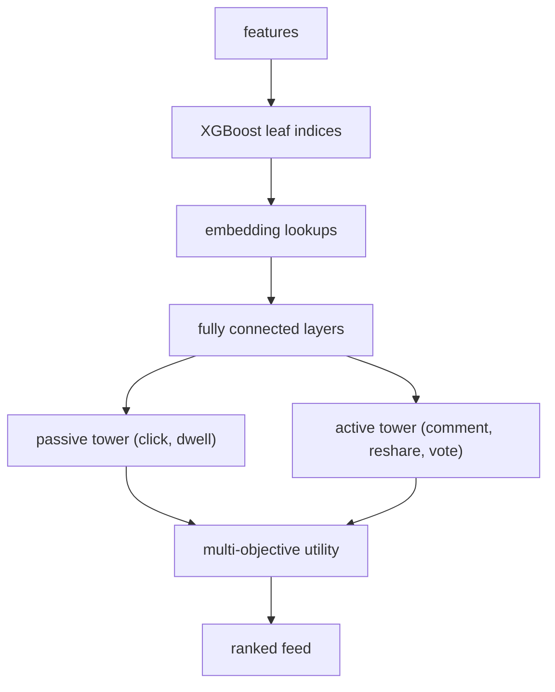

**Interview questions this design invites**
- Why split objectives into passive versus active towers rather than one flat multi-head network?
- Why feed XGBoost leaf indices into the DNN instead of raw features or a pure DNN?
- How do you set the utility weights that trade a comment against a click against dwell time?
- How does transfer learning between objectives help sparse objectives like reshare?
- What serving optimizations let a multi-task DNN meet feed latency (dense tensors, batch size, warm-start)?
- How do you detect when one objective is dominating and degrading another?

**Tricks and gotchas**
- XGBoost-leaf-as-feature bridges tree memorization into the DNN without abandoning the existing model.
- Passive and active objectives correlate imperfectly, so a single shared head can let one drown the other; separate towers hedge this.
- Encoding features as dense tensors cut gRPC serialization overhead by roughly two-thirds, a serving-cost lever.
- Warm-start with gradual learning-rate ramp reduced model variance across retrains.

**Common mistakes and how to fix them**
- Optimizing a single engagement objective for a feed with many desired behaviors. Fix: multi-objective utility across passive and active signals.
- Serving a heavy DNN naively and missing feed latency. Fix: dense-tensor encoding, larger batches, efficient TF linear algebra.
- Assuming trees and DNNs are mutually exclusive. Fix: feed tree leaf indices as DNN inputs to keep both strengths.

### Airbnb: from GBDT to deep neural network search ranking ([source](https://medium.com/airbnb-engineering/applying-deep-learning-to-airbnb-search-7ebd7230891f))

Airbnb evolved booking-oriented search ranking through several model generations rather than one leap. They started with a single-hidden-layer 32-ReLU net matching their GBDT features and loss (booking neutral, validating the pipeline), then a LambdaRank net trained on booked-versus-not pairs weighted by the NDCG change of swapping them, then a hybrid of GBDT leaf indices plus factorization-machine predictions plus NN layers, and finally a two-layer DNN (195 features into 127 then 83 units) trained on 1.7 billion pairs with 10x more data that beat the hybrid. Key lessons: neural nets needed feature normalization and smooth input distributions, listing-id embeddings overfit because each listing books at most about 365 times a year, and multi-task learning with view labels lifted views but left bookings neutral because views and bookings correlate imperfectly.

**Interview questions this design invites**
- Why did listing-id embeddings overfit here when they work in NLP and video recommendation?
- Why weight pairwise loss by NDCG change instead of treating bookings as a plain binary label?
- Why did multi-task learning lift views but leave bookings neutral?
- Neural nets need normalized, smooth-distributed features. Why, when GBDT does not?
- Why did the simple two-layer DNN eventually beat the more complex hybrid model?
- Why was the first NN deliberately shipped as booking neutral rather than chasing a win?

**Tricks and gotchas**
- Data sparsity per listing (bounded bookings per year) makes per-item id embeddings unreliable; lean on content and location features.
- Neural nets are magnitude-sensitive: apply z-score or log transforms so most values sit in roughly [-1, 1].
- Smooth input distributions help interpolation to unseen combinations; raw lat/long spikes had to be reshaped to offsets from map center.
- Dropout hurt; treat it as data augmentation only when the injected noise mirrors realistic variation.

**Common mistakes and how to fix them**
- Expecting deep learning to be a plug-in replacement for GBDT. Fix: rethink the whole system (data pipeline, features, objective), not just the model.
- Feeding raw unnormalized features into the net. Fix: normalize and smooth distributions before training.
- Using view labels as a proxy to boost bookings. Fix: recognize views and bookings diverge; optimize the objective you actually want.

### DoorDash: homepage ads conversion, from trees to multi-task DNNs ([source](https://arxiv.org/abs/2502.10514))

DoorDash rebuilt its homepage ads ranking, moving from tree-based models to multi-task deep neural networks that predict multiple ad outcomes (click and downstream conversion) in last-mile delivery. The paper frames a problem-driven journey spanning data foundations, model design, training efficiency, evaluation rigor, and online serving, with the multi-task DNN capturing complex user behavior the tree models could not. DoorDash reports substantial business impact from the migration and offers it as practical guidance for scaling deep learning recommendation systems in an ads context.

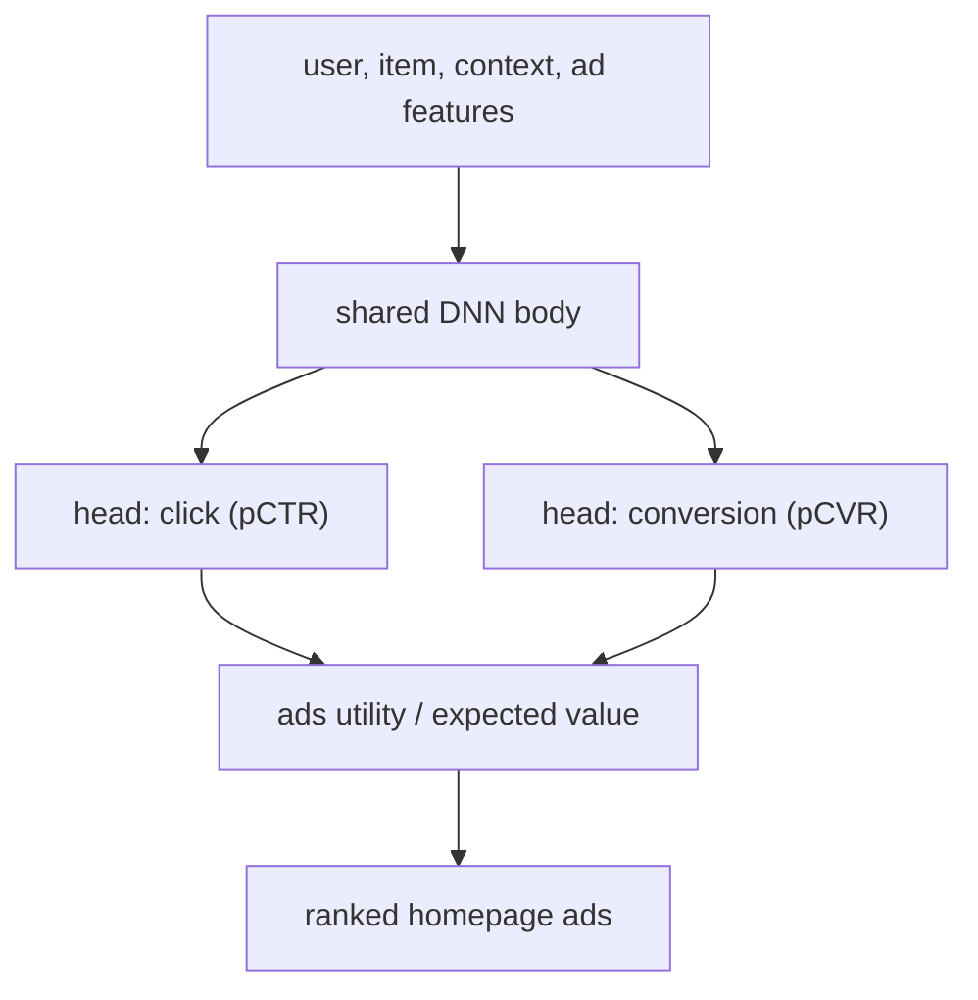

**Interview questions this design invites**
- Why do ads ranking systems need multi-task heads (click and conversion) rather than one objective?
- What does a multi-task DNN capture that a tree model on the same features cannot?
- How does an ads utility combine pCTR and pCVR with the bid to order ads?
- What data-foundation and training-efficiency work is needed before a DNN beats trees in ads?
- How do you evaluate an ads ranker where conversion is delayed and sparse?
- How do you keep per-candidate DNN scoring within the homepage latency budget?

**Tricks and gotchas**
- The migration was as much about data foundations and eval rigor as about the model architecture.
- Conversion labels arrive delayed in last-mile delivery, complicating training and attribution.
- Ads ranking must fold the bid into the utility, so calibrated probabilities matter more than raw order.
- A shared body across click and conversion tasks risks one task dominating; task balance needs monitoring.

**Common mistakes and how to fix them**
- Predicting only clicks for an ads system. Fix: add a conversion head so ranking reflects downstream value, not just engagement.
- Swapping trees for a DNN without upgrading the data and eval pipeline. Fix: invest in data foundations and offline-online eval alignment first.
- Ranking on uncalibrated scores in an auction. Fix: calibrate so expected-value combination with the bid is meaningful.

### Spotify: modality-aware multi-task learning for ad targeting (CAMoE) ([source](https://research.atspotify.com/2025/8/modality-aware-multi-task-learning-to-optimize-ad-targeting-at-scale))

Spotify ranks ads with CAMoE, a multi-gate mixture-of-experts model built on MMoE with modality-specific heads for audio-plus-display versus video impressions, so each tower learns what makes its own modality clickable without interference. DCN-v2 cross blocks inside each expert model feature interactions (for example Friday evening times headphones times hip-hop) without manual crossing. Because audio impressions vastly outnumber video, Adaptive Loss Masking drops non-relevant examples so audio errors only update audio towers and vice versa, which cut video ECE by 55%. Expected calibration error is monitored as a first-class metric because it directly drives auction pricing (miscalibration means over- or under-bidding); the model lifted audio CTR 14.5% and video CTR 1.3% and serves all click-based campaigns.

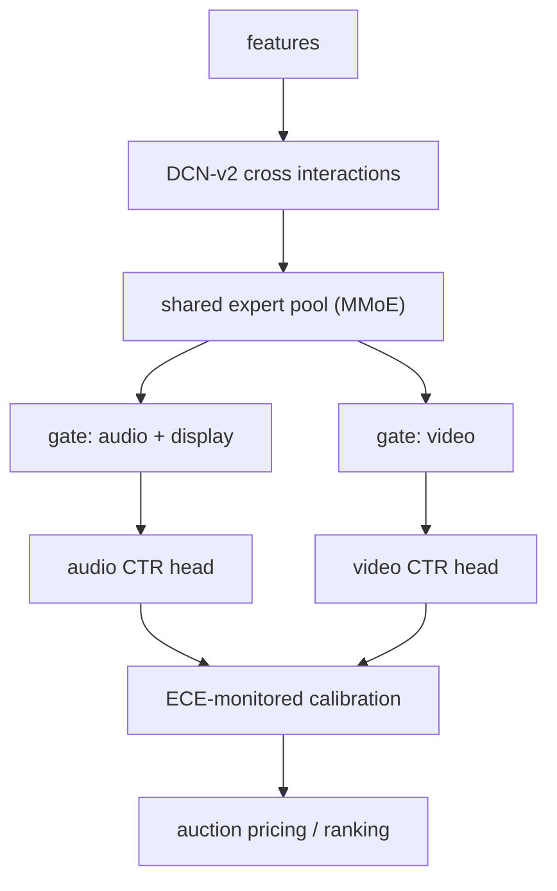

**Interview questions this design invites**
- Why split by modality (audio versus video) into separate gates and heads rather than one shared head?
- What is Adaptive Loss Masking solving, and why does modality imbalance demand it?
- Why put DCN-v2 cross layers inside each expert instead of relying on the MMoE gates alone?
- Why is ECE treated as first-class here when many rankers only care about order?
- How does calibration error translate into over-bidding or under-bidding in the ad auction?
- How do MMoE gates help when tasks are negatively correlated?

**Tricks and gotchas**
- MMoE gating lets tasks share experts while each task picks its own expert mixture, softening task conflict.
- Modality imbalance silently suppresses the minority modality without loss masking; ALM confines gradients per modality.
- DCN-v2 gives explicit bounded-order crosses so you do not hand-engineer feature combinations.
- In ads, calibration is revenue: ECE drift moves pricing directly, so monitor it continuously.

**Common mistakes and how to fix them**
- Training one head over mixed modalities and letting the majority dominate. Fix: modality-specific heads plus adaptive loss masking.
- Optimizing only CTR order and ignoring calibration in an auction. Fix: monitor ECE and recalibrate; pricing depends on it.
- Hand-crafting feature crosses at scale. Fix: use DCN-v2 cross blocks inside the experts.

### Pinterest: lightweight XGBoost ranker early in the funnel ([source](https://medium.com/pinterest-engineering/improving-the-quality-of-recommended-pins-with-lightweight-ranking-8ff5477b20e3))

Pinterest inserts a lightweight XGBoost ranker between candidate generation (Pixie, generating tens of millions of pins per second) and the expensive full neural ranker, so personalization starts earlier without paying the full-ranker cost on every candidate. The lightweight model deliberately trades some precision for efficiency, and training logs at the serving stage to capture both impressed and unimpressed candidates, avoiding frontend-only logging and supporting multiple client surfaces. They compared pure engagement, pure funnel-efficiency, and a blended objective mixing engagement and impression labels; the blended objective won. Per-surface models with custom label weights delivered 1 to 2% more saves on home feed, about 1% CTR and time-spent gains on Related Pins, and 6% CTR on email notifications.

**Interview questions this design invites**
- Why add a lightweight ranking stage between retrieval and the full ranker instead of just enlarging retrieval or the full ranker?
- Why is XGBoost a reasonable choice for the lightweight stage but not the full ranker?
- Why log at the serving stage rather than at the frontend, and what candidates does that capture?
- Why did the blended engagement-plus-funnel objective beat pure engagement or pure funnel efficiency?
- How do you set the latency budget for a stage that runs on far more candidates than the full ranker?
- How would you keep the lightweight and full rankers from optimizing at cross purposes?

**Tricks and gotchas**
- The lightweight stage optimizes funnel efficiency (what to pass downstream), not just engagement; the blend matters.
- Serving-stage logging captures unimpressed candidates the frontend never sees, which the lightweight ranker needs.
- Simpler model is fine precisely because a full ranker follows; do not over-invest at the top of the funnel.
- Per-surface label weighting lets one framework serve home feed, Related Pins, and notifications.

**Common mistakes and how to fix them**
- Training the lightweight ranker only on impressed pins. Fix: log at serving to include unimpressed candidates.
- Optimizing pure engagement at the top of the funnel. Fix: blend engagement with funnel-efficiency labels.
- Reusing one heavy model everywhere. Fix: a cheap ranker early, the expensive ranker only on survivors.

### Wayfair: time-informed calibration of ranking scores into purchase probabilities ([source](https://www.aboutwayfair.com/careers/tech-blog/time-informed-calibration))

Wayfair's Time Informed Calibration (TIC) converts raw ranking scores, which order customers well but are not real probabilities, into calibrated purchase probabilities that account for time. It bins rank-ordered customers into equal-sized groups, measures actual conversions per bin, and fits a monotonic function (for example exponential) that preserves order while mapping scores to realistic rates. Because sales have strong weekly seasonality plus holiday and one-off effects, TIC uses Prophet forecasts of sales and normalizes them against the calibration probabilities to shift the calibration curve for same-day marketing decisions like bidding. The design is modular and model-agnostic, serving more than 300 models independently of their training pipelines.

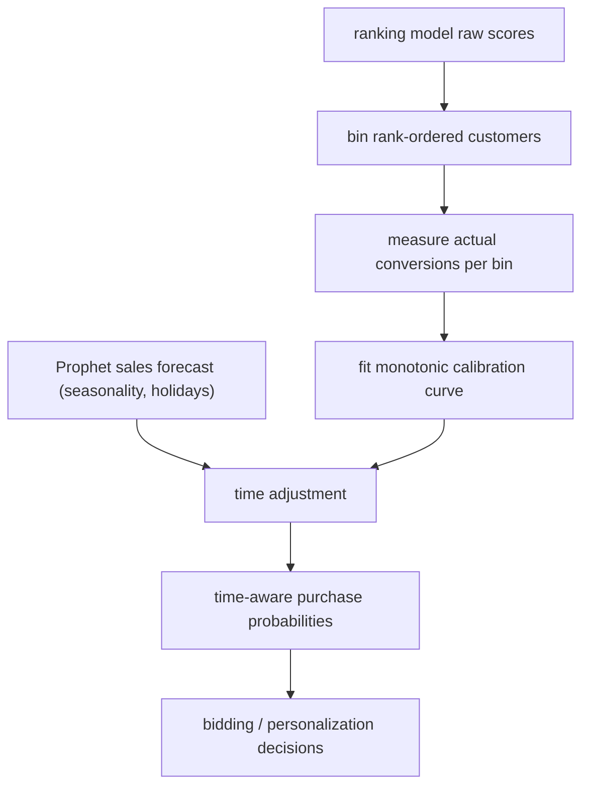

**Interview questions this design invites**
- Why are raw ranking scores good for ordering but wrong to use as probabilities for bidding?
- Why does calibration need to be time-aware rather than a single static curve?
- Why require a monotonic calibration function, and what does monotonicity preserve?
- How does a Prophet sales forecast get folded into the calibration curve for same-day decisions?
- Why keep calibration modular and independent of the model training pipeline?
- How would you detect that a calibration curve has drifted and needs refitting?

**Tricks and gotchas**
- Binning plus monotonic fit calibrates while preserving the model's ranking, so order is never disturbed.
- A fixed calibration curve is wrong under weekly seasonality and holidays; the same score means different rates by day.
- TIC is decoupled from model training, so it can serve hundreds of models without retraining any.
- Forecast and calibration series must be normalized to the same scale before combining.

**Common mistakes and how to fix them**
- Using raw scores as purchase probabilities in bidding. Fix: calibrate against measured per-bin conversion rates.
- Calibrating once and reusing forever. Fix: make calibration time-aware via a seasonal forecast.
- Coupling calibration into each model. Fix: a modular post-hoc layer that serves many models independently.

### Walmart: search re-ranker balancing relevance and engagement ([source](https://medium.com/walmartglobaltech/improving-walmart-search-to-help-our-customers-save-time-e9fcd1f03e94))

Walmart improved search with a two-tier ranking system: a first-round ranker over the retrieved candidates and a second-round re-ranker that jointly optimizes relevance (item-query semantic match) and engagement (item-query engagement) instead of treating them independently. They strengthened product-type matching in the first-round ranker so downstream stages see better candidates, then tuned the re-ranker to be more inclusive of the most relevant and engaged products. The change delivered over a 4.5% relevance lift with engagement improvements, validated through editorial evaluations, market comparison, and customer research alongside quantitative metrics.

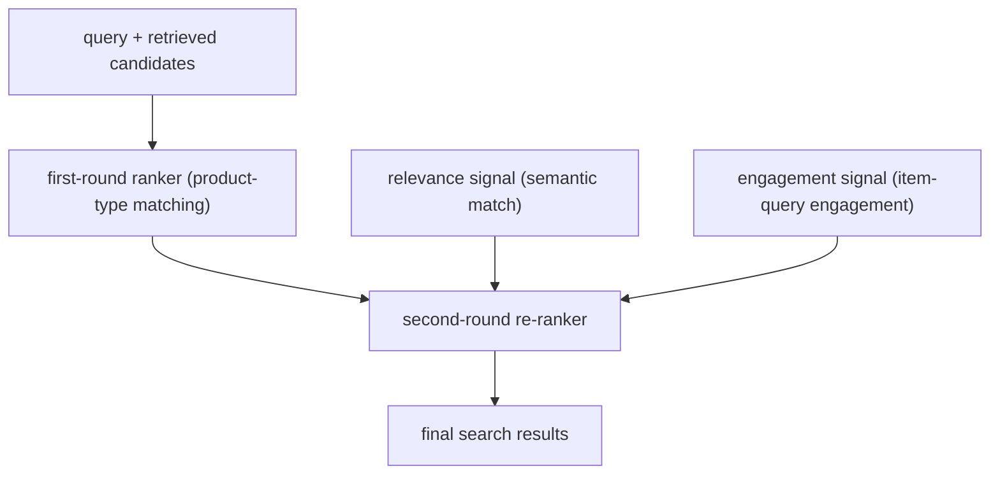

**Interview questions this design invites**
- Why split ranking into a first-round ranker and a second-round re-ranker rather than one model?
- Why can optimizing engagement alone hurt search, and how does relevance counterbalance it?
- How do you combine a relevance signal and an engagement signal into one order?
- Why strengthen product-type matching in the first round specifically?
- How do you evaluate a relevance lift beyond click metrics (editorial judgment, market comparison)?
- How would you keep engagement optimization from surfacing popular-but-irrelevant items?

**Tricks and gotchas**
- Engagement-only ranking drifts toward popular items that may not match the query; relevance must anchor it.
- Fixing candidate quality in the first round (product-type match) limits how much the re-ranker must repair.
- Relevance lift needs human/editorial evaluation, not just engagement metrics, to confirm true quality.
- The two signals compete, so the combination weighting is the lever that decides the tradeoff.

**Common mistakes and how to fix them**
- Ranking search purely on engagement. Fix: jointly optimize relevance and engagement so popular-but-irrelevant items do not win.
- Measuring only clicks. Fix: add editorial evaluation, market comparison, and customer research to gate relevance.
- Letting a weak first round pass bad candidates. Fix: strengthen product-type matching upstream so the re-ranker has good inputs.

### Snap: deep-learning ad ranker under trillions of daily predictions ([source](https://eng.snap.com/machine-learning-snap-ad-ranking))

Snap selects ads through a four-stage funnel (eligibility filtering, lightweight candidate generation that cuts millions of ads to hundreds or thousands, heavy ML scoring per candidate, then an auction combining ML scores with bids and budgets). The heavy scorer is a multi-task network using MMoE and PLE to jointly predict multiple conversion events (app installs, purchases, sign-ups), with DCN and DCN-v2 blocks for high-order feature interactions and a tower split (a user-feature tower and an ad-feature tower) so the expensive user side can be computed once and reused across ads. Because ad ids churn constantly and conversion labels arrive days or weeks late, the team warm-starts from checkpoints hourly-to-daily with SGD and applies a calibration correction layer (Platt scaling or isotonic regression) so total predicted conversions track true conversions, which is what the auction prices against.

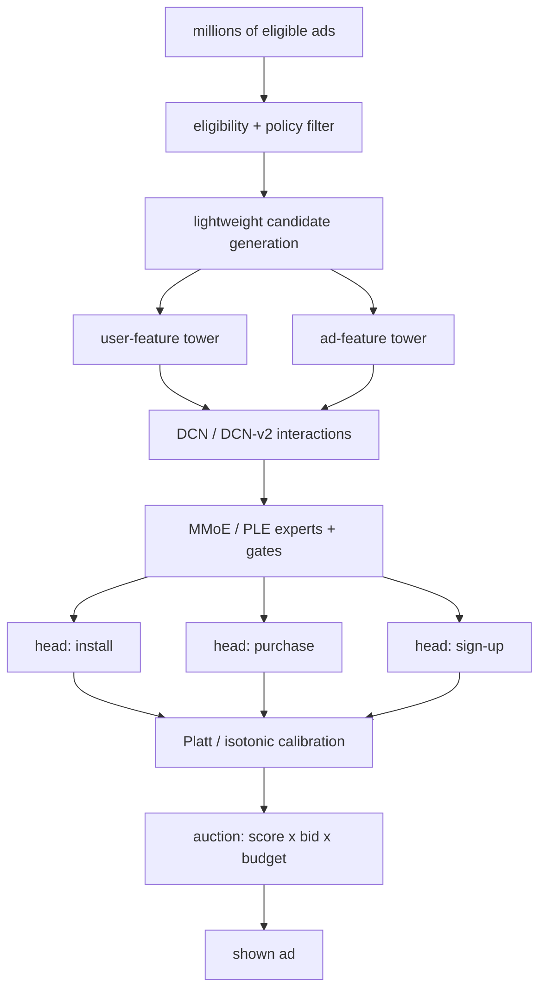

**Interview questions this design invites**
- Why split user and ad features into separate towers, and what does that buy you at serving time when scoring many ads per request?
- Why choose PLE over plain MMoE when conversion tasks (install, purchase, sign-up) partly conflict?
- How do delayed conversion labels (days to weeks) corrupt training, and what do you do about impressions whose label has not arrived?
- Why is calibration (predicted totals matching true totals) treated as first-class in an ad auction rather than just ranking order?
- How do you keep constantly-arriving fresh ad ids from becoming out-of-vocabulary and dominating the embedding space?
- How would you meet a per-candidate latency budget while running DCN-v2 crosses over hundreds of candidates?

**Tricks and gotchas**
- The user tower is computed once per request and shared across all candidate ads; only the ad tower and interaction head run per candidate, which is the latency lever.
- MMoE/PLE gates let each conversion task pick its own expert mixture, so a high-volume task (installs) does not swamp a sparse one (purchases).
- Fresh ad ids mean the embedding table is a moving target; frequent warm-started retraining is what keeps OOV ids from dominating.
- Calibration drives auction pricing, so isotonic/Platt correction is mandatory, not cosmetic; miscalibration means systematic over- or under-bidding.

**Common mistakes and how to fix them**
- Scoring every candidate through one monolithic tower. Fix: split user and ad towers so the user side is computed once and reused.
- Treating delayed conversions as if labels were complete at impression time. Fix: account for label delay in training windows or wait-and-attribute, and monitor for bias.
- Ranking on uncalibrated multi-task scores in an auction. Fix: add a Platt/isotonic calibration layer and check predicted-vs-actual conversion totals continuously.

### ASOS: transformer sequence recommender over interaction history ([source](https://medium.com/asos-techblog/transforming-recommendations-at-asos-254b95c6a07a))

ASOS models each customer as a sequence of past product interactions and ranks with a self-attention transformer (built on NVIDIA Merlin's Transformers4Rec over PyTorch), replacing an asymmetric matrix-factorization baseline that serves 5 billion requests a day. Self-attention lets the model weigh every past product against the others so the same item is interpreted differently depending on the surrounding sequence (a style-context effect), and multi-head attention captures several relationship nuances at once. Positional encoding gives the model order awareness so recent interactions can outweigh older ones. The transformer delivered over 20% offline improvement versus the matrix-factorization baseline.

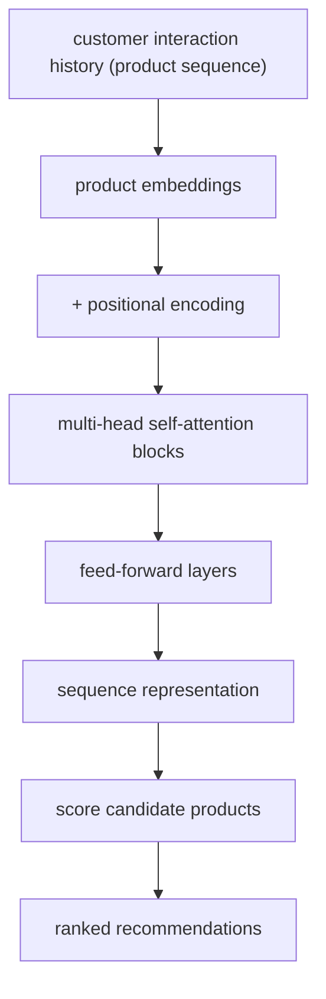

**Interview questions this design invites**
- Why does self-attention over a product sequence beat asymmetric matrix factorization for this recommendation task?
- What does positional encoding contribute here, and how does recency get expressed through it?
- Why does multi-head attention help when the same product can mean different things in different sequences?
- How would you turn a next-item transformer into a full ranker over a large candidate catalog at serving time?
- What negative-sampling and sequence-length/padding choices matter for training a session transformer, and why?
- Offline lift was over 20%; how would you check that survives online before trusting it?

**Tricks and gotchas**
- Self-attention makes the representation of an item context-dependent; the same product contributes differently depending on neighbors in the sequence.
- Positional encoding is what injects order and recency; without it the transformer sees a bag of products, not a sequence.
- The baseline already serves 5 billion requests a day, so any transformer must clear a hard serving-cost bar, not just an offline metric.
- Transformers4Rec/Merlin handles sequence plumbing, but sequence length, padding, and masking choices still drive quality and cost.

**Common mistakes and how to fix them**
- Treating the interaction history as an unordered set. Fix: add positional encoding so order and recency are modeled.
- Trusting a greater than 20% offline lift as a ship signal. Fix: validate online, since offline sequence metrics diverge from live engagement.
- Ignoring serving cost against a 5-billion-request-a-day baseline. Fix: budget sequence length and attention depth for latency, not just accuracy.

### Yelp: hybrid XGBoost learning-to-rank blending interaction and content features ([source](https://engineeringblog.yelp.com/2022/04/beyond-matrix-factorization-using-hybrid-features-for-user-business-recommendations.html))

Yelp moved from collaborative filtering (Spark ALS matrix factorization) to a supervised XGBoost learning-to-rank model that blends interaction features (matrix-factorization scores, user-business aggregates) with content features (categories, ratings, review counts, and text similarity from Universal Sentence Encoder review embeddings). Review embeddings are pooled to business and user level and the user-business cosine similarity became the single most important content feature, which is what lets the model recommend to sparse tail users and double user coverage. Training uses XGBoost's rank:ndcg (LambdaMART) objective with groups defined by user and location, and a recall step over a location radius supplies positive and negative candidates labeled by future interactions with point-in-time separation to avoid leakage. Against matrix factorization it lifted NDCG 5 to 14%, and over 100% versus a popularity baseline at k=1.

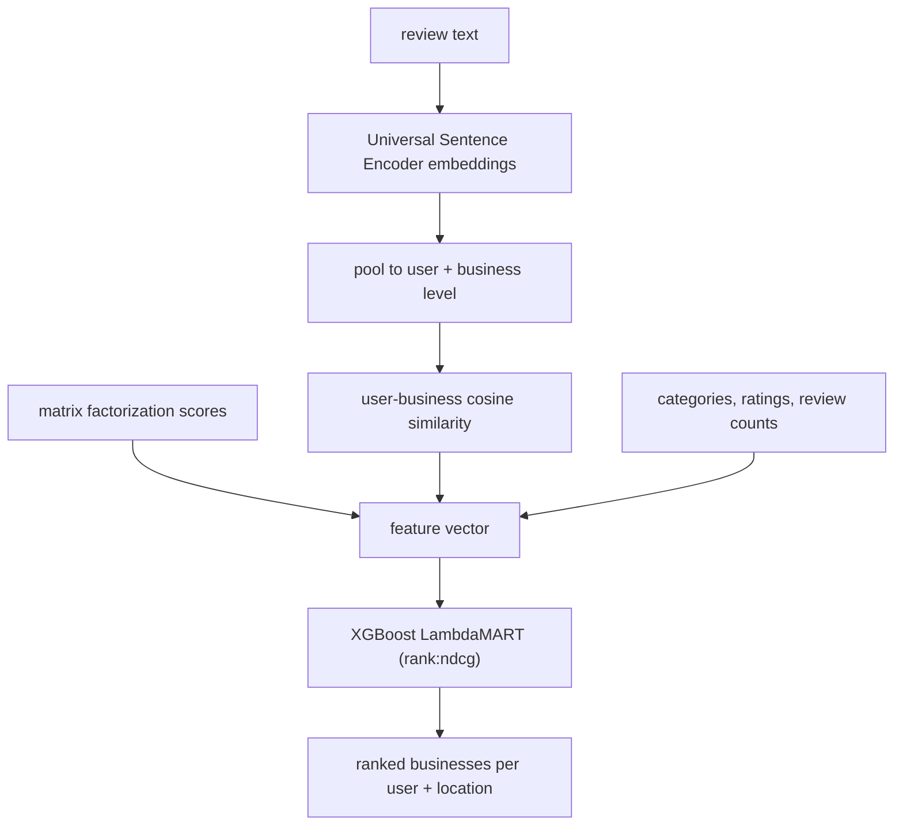

**Interview questions this design invites**
- Why does matrix factorization alone fail tail users, and how do content features restore coverage?
- Why is text-embedding cosine similarity between user and business the strongest content feature here?
- Why group the rank:ndcg objective by both user and location rather than user alone?
- How do you build positive and negative training candidates from a recall step without leaking future information?
- Why did LambdaMART with hybrid features beat a pure matrix-factorization ranker on NDCG?
- How would you confirm the model uses collaborative signal for head users and content signal for tail users?

**Tricks and gotchas**
- Feeding the matrix-factorization score in as one feature keeps its collaborative signal while content features cover where it is blind.
- Pooling review embeddings to user and business level, then taking cosine similarity, is what generalizes to users with no interaction history.
- Grouping by user and location makes the ranking location-aware; group definition is a modeling decision, not a detail.
- Point-in-time separation between the feature period and label period is what prevents leakage in the recalled candidates.

**Common mistakes and how to fix them**
- Relying on matrix factorization and leaving tail users uncovered. Fix: add content features (text similarity) so sparse users still get ranked.
- Leaking the label period into features via the recall step. Fix: separate feature and label windows in time and label candidates by future interactions.
- Grouping the learning-to-rank objective by user only. Fix: group by user and location so rankings are personalized and location-aware.
_Not reachable: none_
