## Sequential and personalized recommendation

### Alibaba: Behavior Sequence Transformer (BST) for Taobao ranking ([source](https://arxiv.org/abs/1905.06874))

BST replaces the usual concat-of-features WDL/DIN style ranking input with a Transformer that consumes the user's ordered behavior sequence, so ordering and dependency between past interactions is modeled instead of flattened away. Each interaction becomes an item embedding plus side features, a positional signal preserves order, and one self-attention block plus an MLP head produce a CTR score for a candidate item. Deployed in Taobao's ranking stage, it delivered a significant online CTR lift over the WDL baseline.

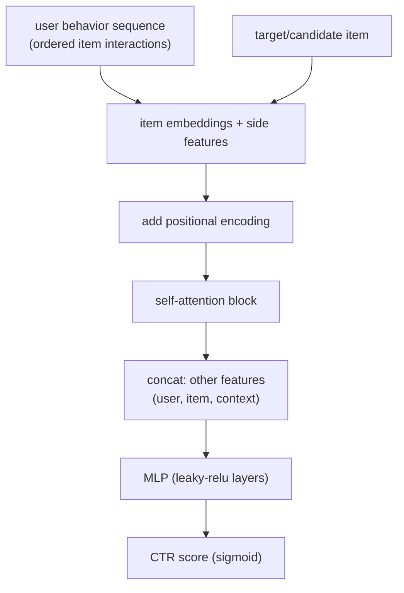

**Interview questions this design invites**
1. Why does a Transformer beat plain feature concatenation for user behavior here?
2. How does the positional encoding enter the attention block, and what does it represent (rank order vs time)?
3. Why only a single self-attention block instead of a deep stack like NLP Transformers?
4. How is the candidate item combined with the sequence, and why include it?
5. What is the per-request latency cost of the attention block, and how do you bound it?
6. How would you extend positional encoding to capture real time gaps between actions?

**Tricks and gotchas**
1. One attention layer was enough; deeper stacks overfit and added latency without CTR gains.
2. The positional signal here is the time-gap-informed position, not just 1st/2nd/3rd index.
3. Sequence must be capped (recent N) so the per-request encode fits the ranking budget.
4. Side features (category, action type) matter as much as the item id for weighting attention.

**Common mistakes and how to fix them**
1. Treating the sequence as a bag of aggregates loses order and recency; keep it ordered and attend over it.
2. Copying NLP depth (6-12 layers) blows latency; use a shallow block sized to the CTR budget.
3. Forgetting the positional/time signal makes attention order-blind; inject it before attention.
4. Not capping length lets power users blow tail latency; truncate to recent N.

### Alibaba: Deep Interest Network (DIN) for CTR prediction ([source](https://arxiv.org/abs/1706.06978))

DIN's insight is that a single fixed user vector cannot express that different candidate ads activate different parts of a user's history. A local activation unit computes attention weights between each historical behavior and the candidate ad, so the user-interest representation is recomputed per candidate rather than pooled once. It shipped in Alibaba's display advertising main traffic, trained on 2B+ samples, with mini-batch-aware regularization and a data-adaptive activation (Dice) to make it train at scale.

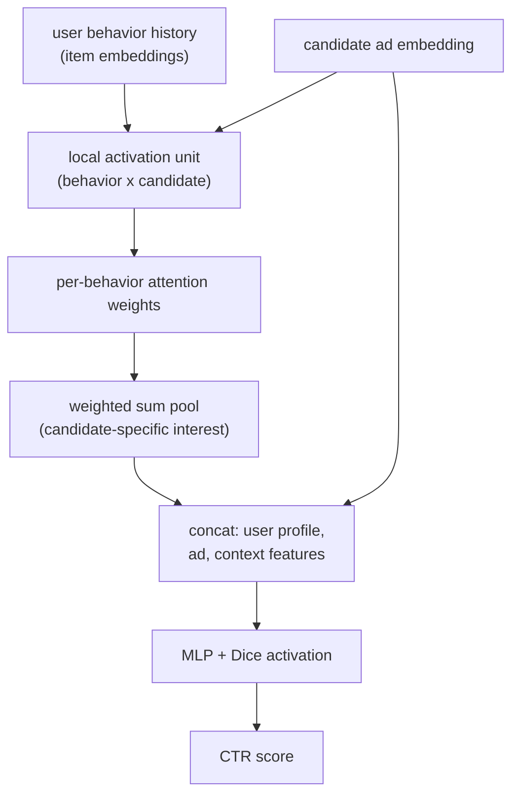

**Interview questions this design invites**
1. Why recompute the user vector per candidate instead of pooling once?
2. What does the activation unit take as input and output?
3. Why is a plain sum-pool of behaviors insufficient?
4. What is mini-batch-aware regularization solving at 2B-sample scale?
5. Why replace ReLU with a data-adaptive activation (Dice)?
6. How does DIN differ from BST in how it uses attention (pool vs sequence encode)?

**Tricks and gotchas**
1. DIN attention has no softmax normalization over behaviors by design; it preserves interest intensity.
2. The activation weight is a function of both the behavior and the candidate, not the behavior alone.
3. Regularization must be sparse-feature-aware or the huge id embedding table overfits.
4. DIN pools per candidate but ignores sequence order; that is what BST later adds.

**Common mistakes and how to fix them**
1. Using one static user embedding for all ads underfits diverse interests; make it candidate-aware.
2. Normalizing attention weights to sum to 1 washes out intensity; skip the softmax as DIN does.
3. Standard L2 on all params is too costly on giant embedding tables; use mini-batch-aware reg.
4. Assuming DIN captures order; it does not, so add positional/sequence modeling if order matters.

### Pinterest: TransAct real-time action sequences in Homefeed ranking ([source](https://medium.com/pinterest-engineering/how-pinterest-leverages-realtime-user-actions-in-recommendation-to-boost-homefeed-engagement-volume-165ae2e8cde8))

TransAct fuses a user's latest 100 real-time actions into the Homefeed ranker (Pinnability), each action carrying a GraphSage pin embedding, an action-type embedding, and a timestamp. The candidate pin is fused early with the sequence, a Transformer encoder processes the stack, and the compressed output (first 10 tokens plus max-pool) crosses with other features through DCN v2. It pairs this short-term signal with PinnerSAGE long-term embeddings, retrains twice weekly to fight decay, and moved to GPU serving because the Transformer added 20x+ CPU latency. Online A/B: +6% repin volume overall, +11% for non-core users.

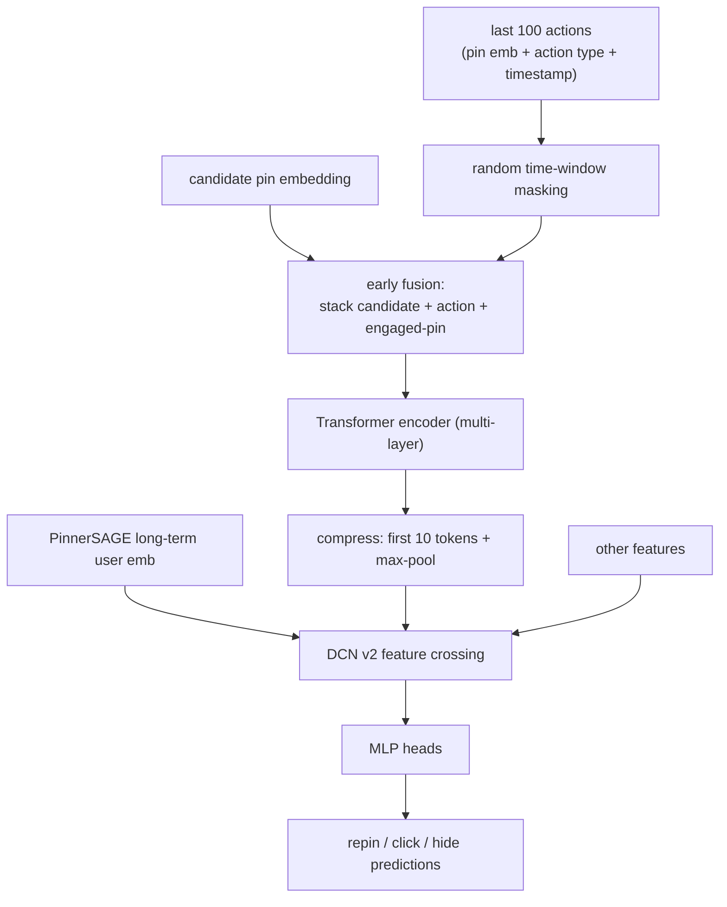

**Interview questions this design invites**
1. Why fuse the candidate pin into the sequence early rather than late?
2. Why keep both real-time last-100 actions and a slow long-term embedding?
3. What does random time-window masking prevent?
4. Why does a Transformer force a move from CPU to GPU serving, and how do you justify the cost?
5. Why retrain twice weekly instead of daily or monthly?
6. How do you keep online and offline sequence construction identical?

**Tricks and gotchas**
1. Time-window masking on recent actions stops the model over-reacting to the single last click.
2. Early fusion of the candidate was empirically critical; late fusion underperformed.
3. Output compression (first 10 + max-pool) is what makes explicit DCN v2 crossing tractable.
4. Real-time features decay fast, so a stale model silently loses the responsiveness that justified it.
5. Non-core/new users gain the most, because long-term embeddings are weak for them.

**Common mistakes and how to fix them**
1. Serving a heavy Transformer on CPU blows latency 20x; migrate the sequence encode to GPU.
2. Over-weighting the most recent action creates jumpy recs; apply time-window masking.
3. Dropping long-term embeddings hurts cold/casual users; fuse short-term with PinnerSAGE.
4. Letting the model age between retrains decays engagement; retrain on a tight cadence.

### Pinterest: PinnerFormer batch user representation with all-action loss ([source](https://arxiv.org/abs/2205.04507))

PinnerFormer produces a single long-term user embedding from a Transformer over the user's recent actions, deliberately trained for batch (daily) generation rather than streaming. Its dense all-action loss predicts a window of future long-term actions rather than only the next one, which closes most of the gap between a daily-batch embedding and a real-time one without the cost of mutable streaming state. The embedding feeds both retrieval candidate generation and ranking, and A/B tests showed retention and engagement gains.

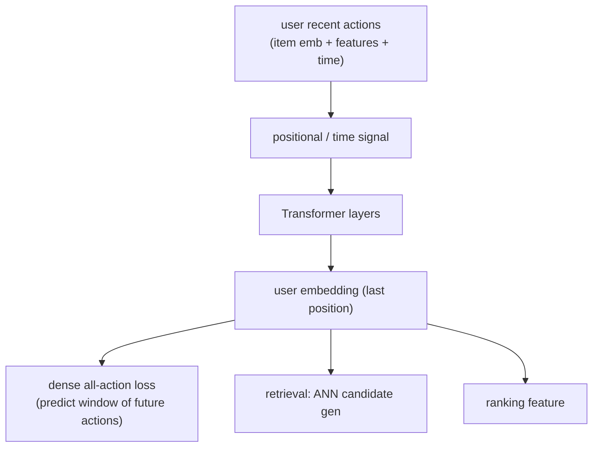

**Interview questions this design invites**
1. Why choose daily batch generation over streaming embedding updates?
2. What is the all-action loss and why does it beat next-action prediction here?
3. How does batch inference stay competitive with real-time freshness?
4. Why does one user vector serve both retrieval and ranking?
5. What is the tradeoff of long-horizon vs short-term intent in this design?
6. How do you evaluate a user representation that targets long-term engagement?

**Tricks and gotchas**
1. Predicting a window of future actions (not just t+1) is what makes a stale-ish batch embedding hold up.
2. Avoiding streaming removes mutable-state infra but accepts up-to-a-day staleness.
3. The embedding targets long-term engagement, so next-click offline metrics can mislead.
4. PinnerFormer and TransAct are complementary: long-term batch vector plus real-time sequence.

**Common mistakes and how to fix them**
1. Assuming streaming is mandatory for freshness; all-action loss recovers most of it in batch.
2. Optimizing only next-item recall misses long-term value; train and eval on multi-action horizons.
3. Building separate embeddings for retrieval and ranking duplicates cost; share one user vector.
4. Ignoring staleness entirely; bound it and confirm the batch-vs-realtime gap is small offline.

### Kuaishou: TWIN V2 lifelong user behavior sequence modeling ([source](https://arxiv.org/abs/2407.16357))

TWIN V2 scores CTR over user histories up to ~10^6 events by a two-stage attention that first retrieves a relevant subsequence then scores it exactly. Offline hierarchical clustering compresses life-cycle behavior into clusters (divide-and-conquer), the GSU (general search unit) retrieves target-relevant clusters cheaply, and the ESU (exact search unit) runs cluster-aware target attention to extract multi-faceted long-term interest. It serves Kuaishou's main traffic of hundreds of millions of DAU with offline and online A/B validation.

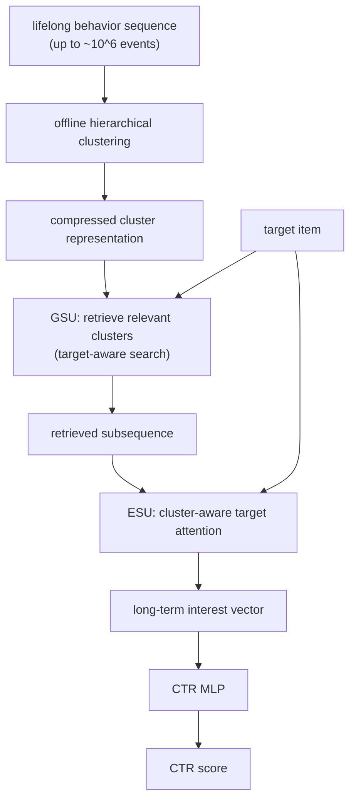

**Interview questions this design invites**
1. Why split into a cheap retrieve stage and an exact score stage?
2. How does offline clustering make 10^6-length sequences tractable online?
3. What does cluster-aware attention preserve that naive truncation loses?
4. What is the staleness risk of offline-computed clusters, and how do you refresh them?
5. How does GSU keep the retrieval target-relevant rather than generic?
6. Where does the latency budget actually go across the two stages?

**Tricks and gotchas**
1. Compression is offline clustering, so online inference only touches compact cluster representations.
2. GSU must be target-aware or it retrieves generically irrelevant history.
3. Two stages let you spend attention compute only on the retrieved subset.
4. Lifelong signal is real but stale between clustering runs; refresh cadence matters.

**Common mistakes and how to fix them**
1. Truncating to recent N throws away lifelong signal; cluster-and-retrieve keeps long-range interest.
2. Running full attention over 10^6 events is infeasible online; do the heavy work offline via clustering.
3. A target-agnostic search unit surfaces noise; make GSU condition on the candidate.
4. Never refreshing clusters lets them drift; schedule re-clustering as behavior accumulates.

### Pinterest, Alibaba, Kuaishou shared note: see the per-system diagrams above for how each places attention in the funnel

### Netflix: integrating a foundation sequence model into personalization ([source](https://netflixtechblog.medium.com/integrating-netflixs-foundation-model-into-personalization-applications-cf176b5860eb))

Netflix centralized member-preference learning into one foundation model trained on large-scale interaction and content data, then exposed it to downstream apps three ways. Option 1 pushes last-event hidden-state user embeddings and item-tower embeddings through an Embedding Store (cheap, but stale). Option 2 grafts the foundation decoder subgraph into the downstream model and fine-tunes it (no staleness, but bigger and slower). Option 3 fine-tunes the whole foundation model per domain (most tailored, highest maintenance). Pretraining runs monthly with daily incremental updates.

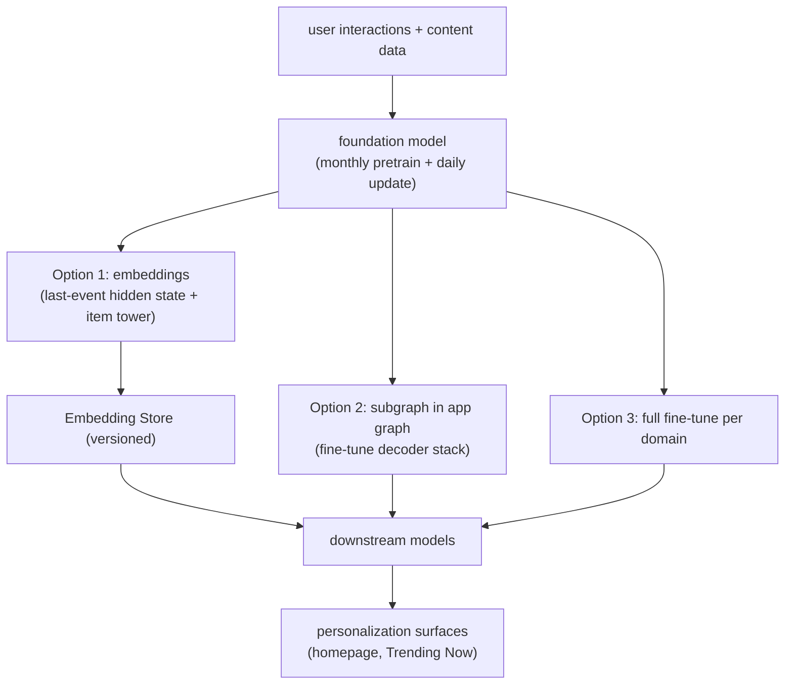

**Interview questions this design invites**
1. When do you push embeddings vs graft a subgraph vs fully fine-tune?
2. What is the staleness source in the embedding approach and how do you shrink it?
3. Why serve embeddings through a versioned Embedding Store?
4. What latency and model-size cost does the subgraph approach add?
5. How do you avoid every downstream team retraining the whole foundation model?
6. What does monthly-pretrain plus daily-update buy over continuous training?

**Tricks and gotchas**
1. Embeddings are the cheap high-leverage default; reach for subgraph/fine-tune only when metrics justify it.
2. The Embedding Store's versioning and timestamps are what make offline/online consistency possible.
3. Subgraph integration removes staleness but pulls foundation-model latency into request time.
4. Full fine-tuning multiplies maintenance burden across teams; reserve it for high-impact domains.

**Common mistakes and how to fix them**
1. Maintaining many bespoke models per surface; centralize into one foundation model with shared embeddings.
2. Ignoring embedding staleness; add near-real-time embedding generation for time-sensitive surfaces.
3. Grafting the subgraph everywhere blows latency; use it only where the lift pays for the cost.
4. Skipping versioning in the feature store causes train/serve skew; version and timestamp every embedding.

### Spotify: CoSeRNN contextual and sequential session embeddings ([source](https://research.atspotify.com/contextual-and-sequential-user-embeddings-for-music-recommendation/))

CoSeRNN models a user's taste as a sequence of per-session embeddings rather than one static profile, predicting the tracks a user will play at the start of each session. It sums a context-independent long-term preference vector with a sequential-contextual offset (conditioned on time of day, device, stream source, and prior sessions) via a recurrent net. The single session embedding is used with approximate nearest-neighbor search over word2vec track embeddings, which decouples user and track spaces and scales to millions of tracks; ranking metrics improved by 10%+, most in rare contexts.

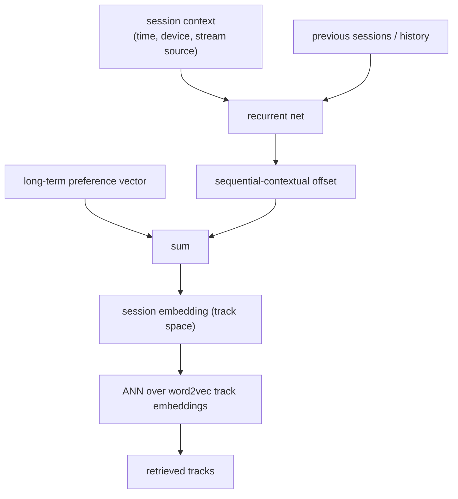

**Interview questions this design invites**
1. Why model taste as a sequence of session embeddings instead of one user vector?
2. What is the split between the long-term vector and the per-session offset?
3. Why predict at session start rather than continuously within a session?
4. Why decouple user and track embedding spaces?
5. How does ANN over track embeddings keep retrieval scalable to millions of tracks?
6. Why do gains concentrate in rare contexts like late-night or web?

**Tricks and gotchas**
1. Context (device, time, source) is a first-class input; the same user wants different music in different contexts.
2. Long-term plus offset decomposition lets a stable base taste flex per session.
3. Predicting one session-level embedding, not per-track, is what makes ANN retrieval cheap.
4. Track embeddings come from word2vec and are frozen; the RNN only has to land in that space.

**Common mistakes and how to fix them**
1. Using one static user embedding ignores context shifts; add a contextual per-session offset.
2. Coupling user and item towers hurts scaling; keep them separate and retrieve by ANN.
3. Predicting individual tracks directly is expensive; predict a session embedding and search.
4. Ignoring rare contexts leaves easy wins; condition explicitly on context features.

### Instacart: centralized BERT-style next-product retrieval ([source](https://tech.instacart.com/sequence-models-for-contextual-recommendations-at-instacart-93414a28e70c))

Instacart replaced disparate legacy retrieval systems with one centralized contextual retrieval model serving search, browse, item pages, cart, and checkout. It is a BERT-like masked-language model over sequences of product ids (like BERT4Rec / Transformers4Rec but ~10x larger), where in-session views and cart-adds form the tokens and the model predicts the next product to feed top-K into downstream ranking. Sequences cap at 20 tokens with the last 3-5 products dominating, the vocabulary is ~1M popular product ids with an OOV token, and launch drove a 30% lift in cart additions.

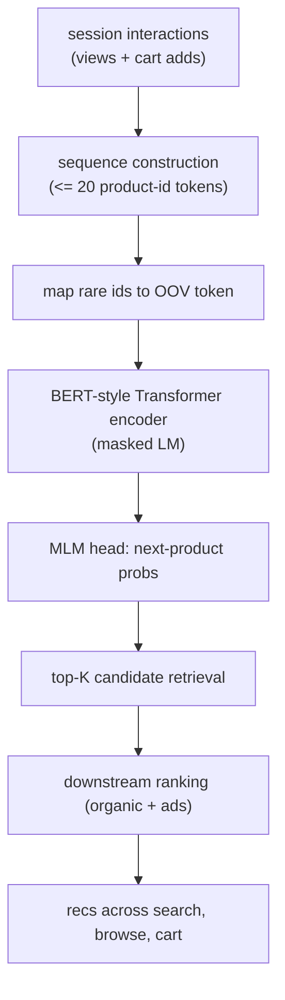

**Interview questions this design invites**
1. Why centralize one retrieval model across many surfaces instead of per-surface models?
2. Why a masked-LM (BERT) objective rather than strict left-to-right next-item?
3. How do you cap vocabulary at ~1M ids and handle out-of-vocabulary products?
4. Why does a 20-token window suffice when the last few products dominate?
5. How do you keep online and offline sequence construction consistent?
6. How does this retrieval stage hand off to organic vs ads ranking?

**Tricks and gotchas**
1. Randomizing training or test sequence order degrades recall 10-45%, proving order carries the signal.
2. The last 3-5 products dominate prediction, so short windows are fine and cheap.
3. Vocabulary is bounded by popularity plus business rules; everything else is an OOV token.
4. One model must feed heterogeneous surfaces, so downstream ranking specializes, not retrieval.

**Common mistakes and how to fix them**
1. Maintaining separate retrieval per surface multiplies cost; centralize and specialize only ranking.
2. Ignoring order (bag of products) tanks recall; keep sequences strictly ordered.
3. Unbounded product vocabulary is intractable; cap by popularity and route the rest to OOV.
4. Over-long windows waste compute for little gain; truncate to ~20 recent tokens.

### Etsy: adSformers short-term sequence personalization for ads ([source](https://arxiv.org/abs/2302.01255))

Etsy's adSformer Diversifiable Personalization Module (ADPM) personalizes sponsored-search CTR and post-click conversion by encoding recent user action sequences with a custom adSformer block. The module enriches that sequence signal with visual, multimodal, and other pretrained representations, plus an on-the-fly diversification component, then feeds the combined user representation into the CTR and PCCVR models. It gave +2.66% and +2.42% offline ROC-AUC and shipped to 100% of sponsored-search traffic in Feb 2023.

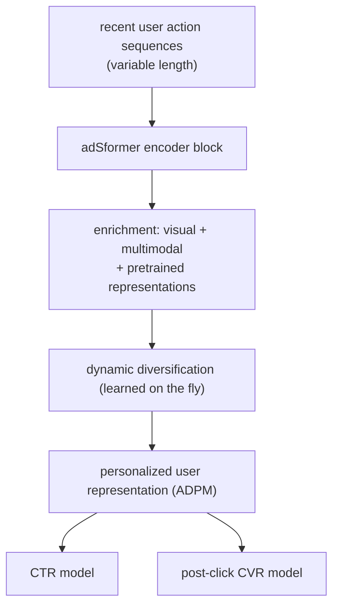

**Interview questions this design invites**
1. Why combine a sequence encoder with pretrained visual/multimodal representations?
2. What does the on-the-fly diversification component add?
3. How do you handle variable-length recent-action sequences?
4. Why optimize CTR and post-click CVR from a shared user representation?
5. How much of the lift comes from the sequence vs the enrichment signals?
6. How do you serve this within an ads latency budget?

**Tricks and gotchas**
1. The sequence encoder alone is not the whole win; multimodal/visual enrichment is a named component.
2. Diversification is learned dynamically to avoid a narrow, collapsed user representation.
3. One shared ADPM representation feeds two downstream heads (CTR and CVR).
4. Short-term recent actions are the focus; this is intentionally not a lifelong-history model.

**Common mistakes and how to fix them**
1. Relying only on id-sequence signal; enrich with pretrained visual/multimodal embeddings.
2. Letting the representation collapse to a narrow interest; add explicit diversification.
3. Training CTR and CVR from separate encoders duplicates cost; share the user representation.
4. Padding/truncation mishandling on variable-length sequences; define a clean length policy.

### Wayfair: MARS self-attention over browsed-item sequences ([source](https://www.aboutwayfair.com/careers/tech-blog/mars-transformer-networks-for-sequential-recommendation))

MARS predicts the next products a customer will browse by running self-attention over their ordered browsing history, capturing how tastes shift over time instead of averaging them. The input is the 100 most recent views (adjacent duplicate SKUs removed, rare items filtered, zero-padded), item embeddings are summed with learned positional embeddings, and stacked self-attention plus MLP blocks with residuals and layer norm output a sigmoid trained with binary cross-entropy. It lifted recall 67% over matrix factorization, and top-6 recs matched a future purchase 50% of the time versus 30% baseline.

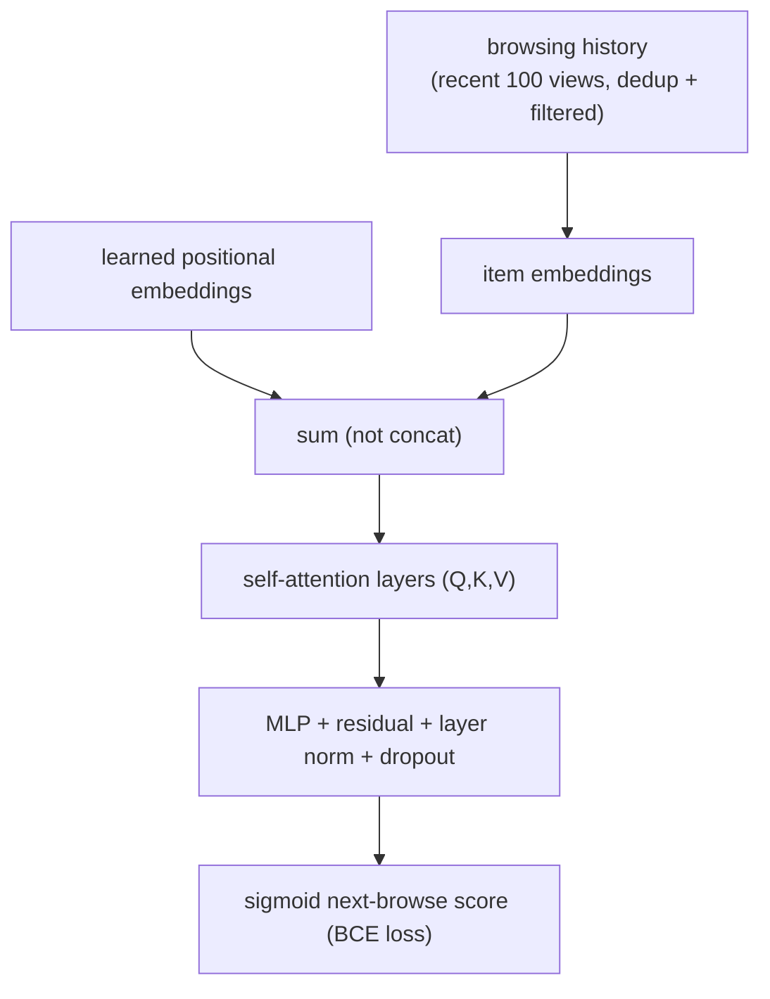

**Interview questions this design invites**
1. Why sum item and positional embeddings instead of concatenating them?
2. Why truncate to the most recent 100 views and dedup adjacent SKUs?
3. What does self-attention capture that matrix factorization cannot?
4. What do the learned positional embeddings converge to, and why does that validate the design?
5. How do item embeddings transfer style across product classes?
6. Why binary cross-entropy on a next-browse sigmoid rather than a ranking loss?

**Tricks and gotchas**
1. Summing embeddings (vs concat) deliberately reduces model complexity.
2. Removing adjacent duplicate SKUs stops the model over-fixating on repeated views.
3. Positional embeddings for nearby positions converge to be similar, confirming order matters.
4. Learned item embeddings capture style, so sofa preferences inform desk recommendations.

**Common mistakes and how to fix them**
1. Aggregating browsing into static counts misses taste drift; attend over the ordered sequence.
2. Concatenating many embeddings bloats the model; sum them to keep it lean.
3. Leaving adjacent duplicate views in skews attention; dedup them before encoding.
4. Unbounded history hurts latency; cap at recent 100 with zero-padding.

### LinkedIn: Feed SR transformer sequential ranker ([source](https://arxiv.org/abs/2602.12354))

LinkedIn's Feed Sequential Recommender (Feed SR) replaces a DCNv2-based ranker with a transformer-based sequential ranking model serving 1.2 billion members. It models the member's interaction sequence and scores candidate feed items, and the team evaluated alternative sequential and LLM-based rankers before landing on Feed SR for the best balance of online metrics and serving efficiency. In production for over three months on the majority of feed traffic, it delivered +2.10% time spent and +3.52% engagement (likes, comments, reshares) over the prior model.

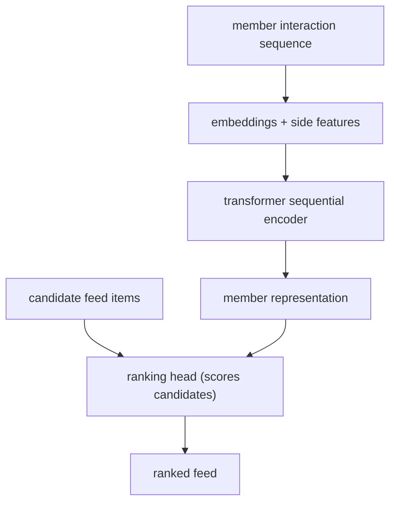

**Interview questions this design invites**
1. Why replace a proven DCNv2 ranker with a sequential transformer?
2. Why was Feed SR chosen over LLM-based rankers that were also evaluated?
3. How do you serve a transformer ranker at 1.2B-member scale within budget?
4. How does sequential modeling change the ranking feature set vs DCNv2?
5. What serving optimizations make the transformer feasible?
6. How do you attribute the engagement lift to sequence modeling specifically?

**Tricks and gotchas**
1. LLM-based rankers were considered but lost on the metric-vs-efficiency tradeoff.
2. Replacing a mature ranker means matching its serving cost, not just beating its metrics.
3. The gains (time spent, engagement) come from modeling sequence, so training/serving skew is fatal.
4. Billion-scale serving forces production-specific optimizations distinct from the research model.

**Common mistakes and how to fix them**
1. Assuming the fanciest model (LLM ranker) wins; pick for online metric per unit serving cost.
2. Swapping in a transformer without serving optimization blows latency; co-design serving.
3. Ignoring sequence-construction consistency; share online/offline logic to avoid skew.
4. Trusting offline lift alone; confirm with a long online A/B before full rollout.

### Airbnb: listing embeddings for similar-listing recs and in-session personalization ([source](https://medium.com/airbnb-engineering/listing-embeddings-for-similar-listing-recommendations-and-real-time-personalization-in-search-601172f7603e))

Airbnb learned 32-dimensional embeddings for ~4.5M listings by treating search-click sessions as word2vec sentences over 800M+ sessions, adapting the objective with the booked listing as a global context term and market-specific negative samples. For real-time personalization, two rolling windows (recent clicks Hc, recent skips Hs) produce EmbClickSim and EmbSkipSim features that push similar listings up and skipped-similar listings down in search ranking. For similar-listing recs it does a k=12 nearest-neighbor lookup in embedding space filtered by market and availability, giving +21% carousel CTR and 4.9% more bookings discovered.

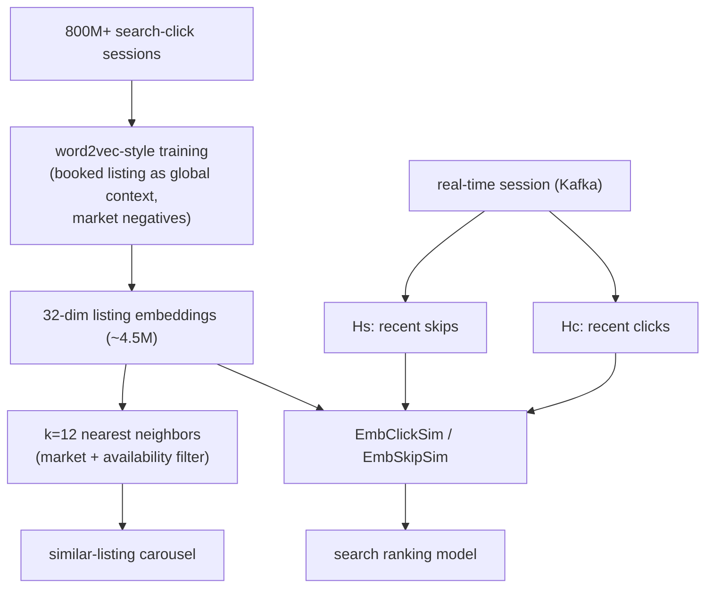

**Interview questions this design invites**
1. Why treat click sessions as sentences and use word2vec rather than a supervised model?
2. What does adding the booked listing as a global context term accomplish?
3. Why add market-specific negative samples?
4. How do click-similarity and skip-similarity features enter ranking with opposite signs?
5. Why k-nearest-neighbor lookup for similar listings instead of the full ranking model?
6. How do you keep in-session personalization real-time (Kafka windows)?

**Tricks and gotchas**
1. The booked listing is used as a constant global context across the whole session, not just a nearby click.
2. Market negatives are needed because random global negatives make within-market similarity poor.
3. Skips are signal too: EmbSkipSim lowers rank, not just clicks raising it.
4. Similar-listing recs skip full ranking and use pure ANN, filtered by market and availability.

**Common mistakes and how to fix them**
1. Using only click positives; add the booked listing as global context to capture the true target.
2. Sampling negatives globally gives weak within-market similarity; add same-market negatives.
3. Modeling only clicks ignores rejection signal; include skip-similarity as a negative feature.
4. Running full ranking for the similar carousel is overkill; use ANN in embedding space.

_Not reachable: none_
