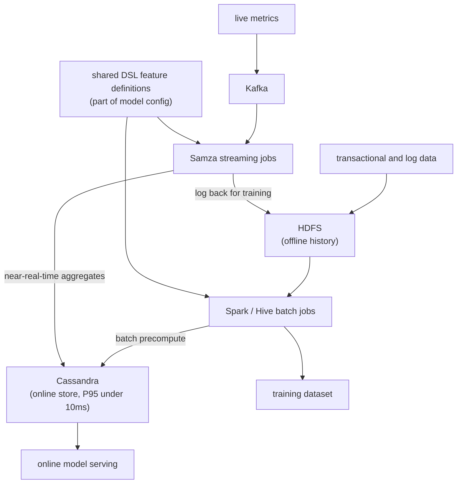
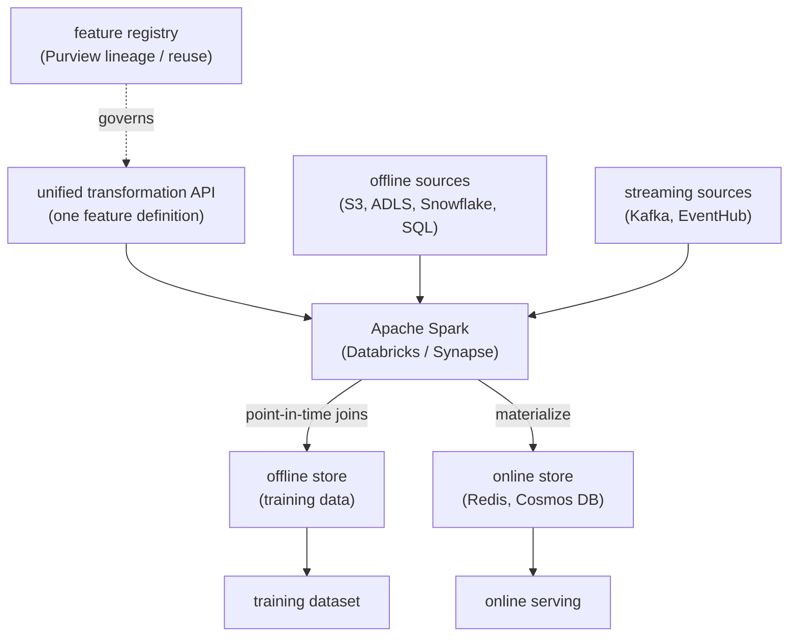
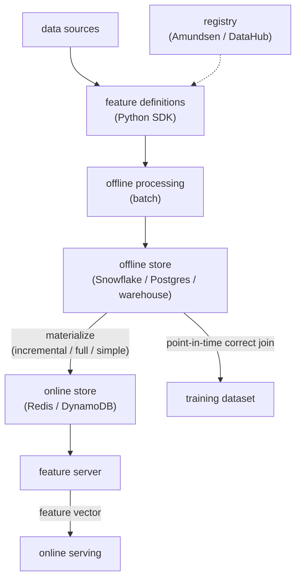
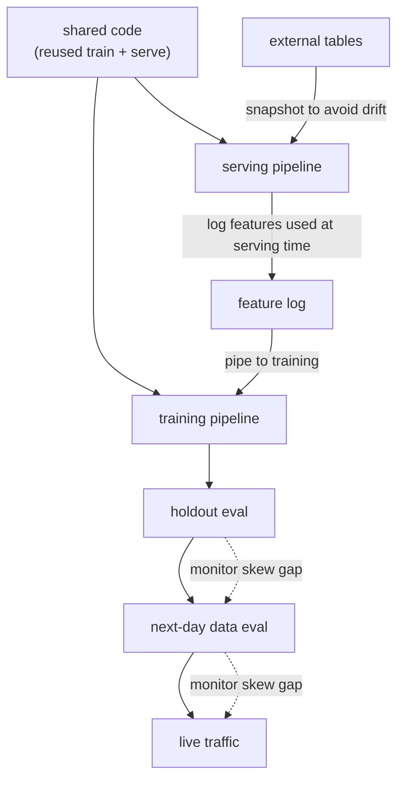

## Feature store and training-serving skew

### Uber: Michelangelo and the Palette feature store ([source](https://www.uber.com/blog/michelangelo-machine-learning-platform/))

Michelangelo is Uber's end-to-end ML platform, and its centralized Palette feature store holds roughly 10,000 shared features that teams create, discover, and reuse. Offline, transactional and log data lands in HDFS and is processed by scheduled Spark and Hive jobs to build training data; online, features are precomputed and served from Cassandra at low latency because production models cannot read HDFS directly. Real-time signals flow through Kafka into Samza streaming jobs that write aggregates to Cassandra while also logging to HDFS so the same values can rebuild training sets. A Scala-subset DSL expresses feature transformations as part of the model config, and because the identical DSL expressions run at both training and prediction time, the final feature set stays consistent.

**Interview questions this design invites**
- Why serve from Cassandra instead of reading features from HDFS at request time?
- How does running the same DSL expressions at train and predict time kill code skew?
- When would you choose batch precompute over the Kafka plus Samza near-real-time path for a given feature?
- How does logging streaming aggregates back to HDFS enable point-in-time-correct training data?
- What does the backfill tool have to guarantee so a newly added feature is safe to train on?
- How do you keep 10,000 features from becoming an undiscoverable swamp?

**Tricks and gotchas**
- The DSL lives inside the model configuration, so the feature transformation is versioned with the model, not as separate glue code.
- Near-real-time features must be logged to HDFS at compute time, otherwise you cannot reconstruct what was actually served for training.
- Batch precompute is fine only when a feature tolerates hourly or daily staleness (for example a seven-day average prep time).
- Cassandra is chosen for its low-latency point reads, not for the bulk historical scans that training needs.

**Common mistakes and how to fix them**
- Writing separate offline SQL and online service code for the same feature: fix by driving both from one shared definition (the DSL).
- Backfilling with today's logic but stamping rows as historical: this leaks the future; recompute with as-of logic and correct timestamps.
- Assuming batch precompute is fresh enough for session signals: route fast-moving features through the streaming path.
- Treating the feature store as a dumping ground: attach owner, description, and SLA metadata so features stay reusable.

### LinkedIn: Feathr, one definition serving offline, streaming, and online ([source](https://github.com/feathr-ai/feathr))

Feathr is LinkedIn's open-sourced feature store built on a unified data transformation API that runs the same feature definition across offline batch, streaming, and online environments. Its transformation APIs include time-based aggregations and sliding-window joins with point-in-time correctness, so training rows never absorb values from after the label time. Offline data sits in stores like S3, ADLS, Snowflake, or SQL warehouses while online serving runs from Redis or Cosmos DB, and streaming sources such as Kafka and EventHub feed real-time features. A built-in registry enables named, reusable transformations with lineage and governance through Azure Purview, and the compute runs on Apache Spark (Databricks or Synapse).

**Interview questions this design invites**
- What does a sliding-window aggregation need to store so it stays point-in-time correct?
- Why split online serving (Redis or Cosmos) from the offline training store technology?
- How does a single transformation API prevent the offline and online computations from drifting?
- What role does the registry play beyond discovery, in terms of lineage and reuse?
- How would you onboard a streaming feature so it matches its offline backfill exactly?
- Why run the heavy transformations on Spark rather than in the serving path?

**Tricks and gotchas**
- The same definition must compile to three runtimes (batch, streaming, online), so the transformation language has to stay backend-agnostic.
- Point-in-time correctness on sliding windows requires timestamped history, not just the latest aggregate.
- Online stores hold the latest value per entity; do not expect to run historical joins against Redis.
- Governance through Purview is what keeps named transformations reusable rather than duplicated per team.

**Common mistakes and how to fix them**
- Defining a streaming feature and its batch backfill separately: unify them under one transformation so both compute the identical aggregate.
- Joining current feature values onto past labels: use the as-of join APIs so no future data leaks.
- Serving heavy transformations at request time: precompute and materialize to the online store instead.
- Skipping the registry and letting teams re-derive the same feature: register named transformations for reuse and lineage.

### Feast: open-source reference design for the dual store and point-in-time joins ([source](https://github.com/feast-dev/feast))

Feast is a production-ready open-source feature store that gives a clean reference for the dual-store pattern: an offline store for historical batch training data and an online store for low-latency real-time retrieval, plus a feature server that serves the precomputed vectors. It generates point-in-time-correct feature sets so teams avoid leakage instead of hand-debugging join logic. Materialization loads features from offline to online in three modes (incremental, which is recommended; full with timestamps; and simple without event timestamps), and storage is abstracted so backends like Redis, DynamoDB, Postgres, Snowflake, and vector stores (Qdrant, Milvus) plug in. A registry and Python SDK drive discovery and governance, integrating with Amundsen and DataHub, with native drift and serving-log monitoring.

**Interview questions this design invites**
- What is the difference between incremental, full, and simple materialization, and when would you pick each?
- How does Feast generate point-in-time-correct feature sets, and why does that prevent leakage?
- Why abstract the online store behind an interface instead of coupling to one database?
- What role does the feature server play between the online store and the model at serving time?
- How does the registry plus Amundsen and DataHub integration enable governance without heavy process?
- When is a full feature store overkill relative to writing features into Redis directly?

**Tricks and gotchas**
- Simple materialization without event timestamps is convenient but drops the point-in-time guarantee; use it only when you truly do not need history.
- Incremental materialization is recommended because full recomputation gets expensive fast as history grows.
- Storage abstraction lets the same definitions target Redis for serving and Snowflake for training without rewriting logic.
- Native serving-log monitoring is the built-in hook for detecting skew (served vs computed), not an afterthought.

**Common mistakes and how to fix them**
- Reaching for full materialization every run: default to incremental and reserve full for corrections and backfills.
- Joining current feature values onto past labels: use Feast's as-of join so training only sees data available at event time.
- Treating the online store as source of truth: the offline store holds timestamped history, the online store holds the latest value.
- Deploying without a registry: register features so they are discoverable and owned before other teams consume them.

### Google: Rules of Machine Learning, the discipline that stops skew ([source](https://developers.google.com/machine-learning/guides/rules-of-ml))

Google's Rules of ML is not a store but the discipline every store encodes: train the way you serve. Its headline guidance is to reuse code between the training and serving pipelines so a single computation cannot drift, and, most reliably, to log the exact features used at serving time and pipe them back for training. It stresses temporal testing (measure on data gathered after your training data ends, since that reflects production) and warns that external tables joined into features can change between train and serve, so snapshot them or log at serving time. Skew should be monitored across three gaps: training vs holdout, holdout vs next-day, and next-day vs live.

**Interview questions this design invites**
- Why is logging serving-time features the most reliable way to train the way you serve?
- How does reusing code between training and serving pipelines eliminate a whole class of skew?
- Why test on data gathered after the training window rather than a random holdout?
- What goes wrong when an external table changes between training and serving, and how do you prevent it?
- What are the three skew gaps to monitor (train/holdout, holdout/next-day, next-day/live) and what does each catch?
- How do these rules translate into concrete feature store requirements?

**Tricks and gotchas**
- Logging features at serving time is more reliable than recomputing them identically offline; recomputation always risks drift.
- Random holdouts hide time leakage; only post-training-window data reveals what production will actually see.
- External tables are a silent skew source because they mutate between train and serve; snapshot or log to pin them.
- Monitoring must cover three sequential gaps, not just offline accuracy, or slow live degradation goes unseen.

**Common mistakes and how to fix them**
- Maintaining separate training and serving feature code: reuse one code path so there is nothing to drift.
- Recomputing serving features offline and hoping they match: log actual served features and train on those.
- Evaluating only on a random split: add a next-day and live comparison to catch temporal skew.
- Joining live external tables blindly: snapshot them at serving time so training and serving see the same values.

_Not reachable: Tecton (engineering blog redirected off-host to databricks.com)_
