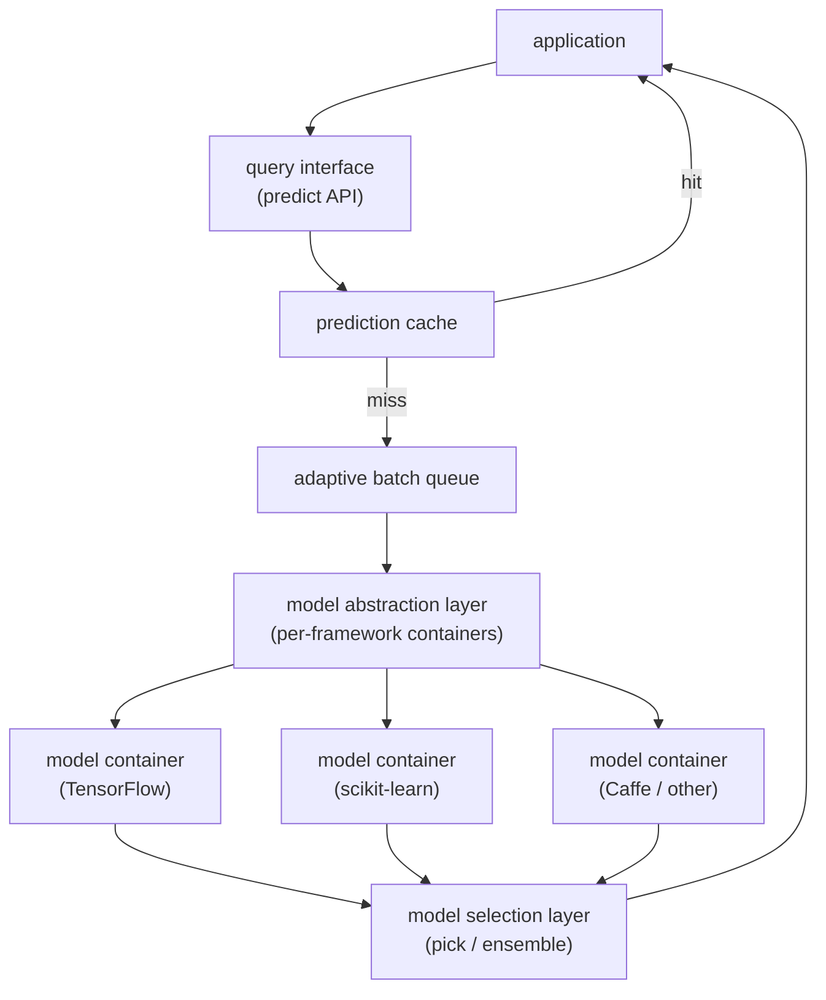
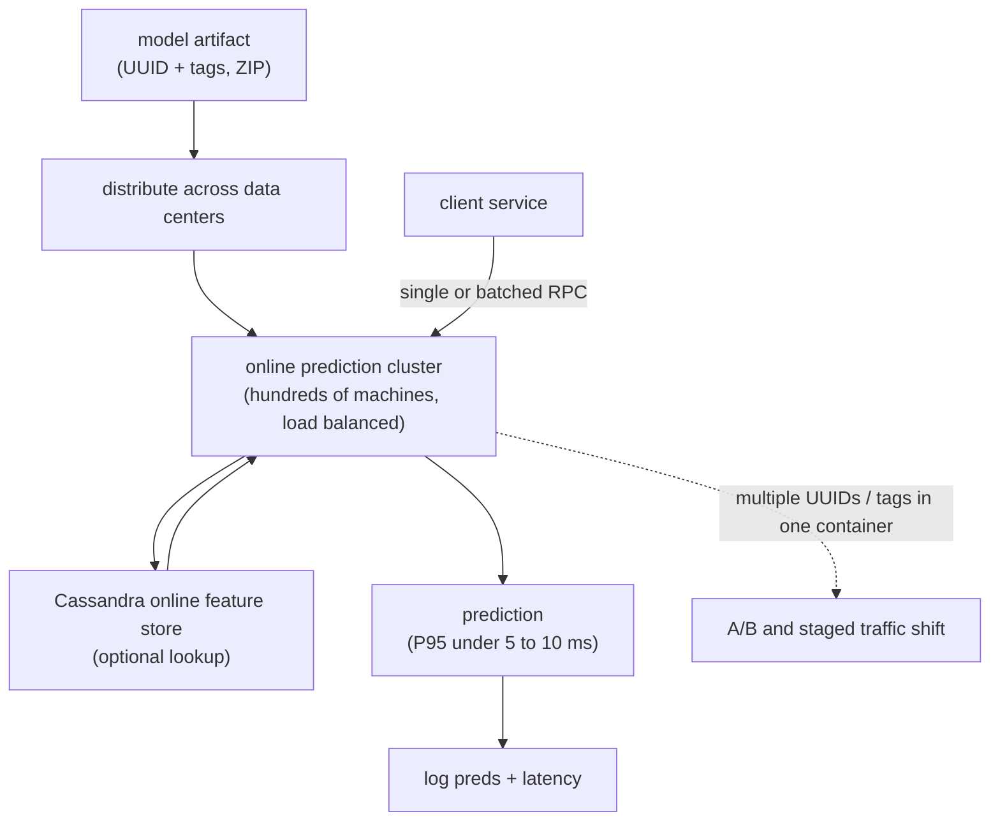
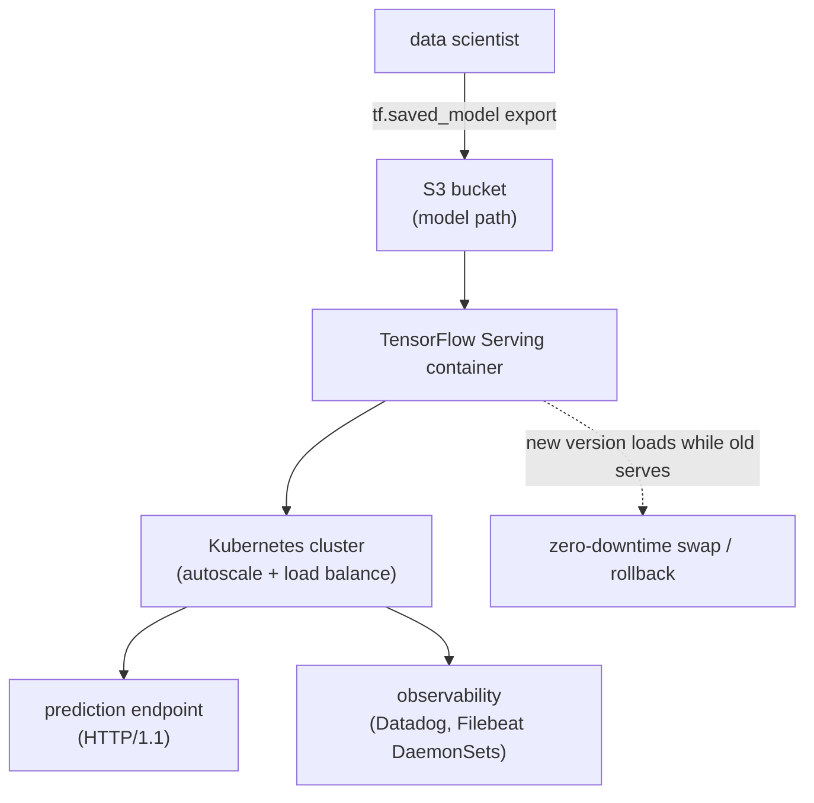
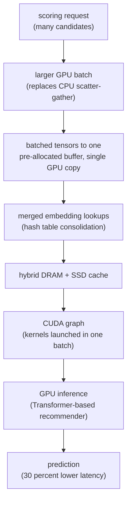
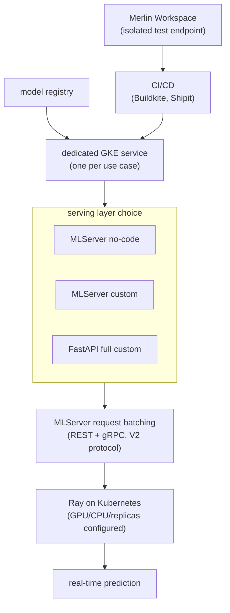
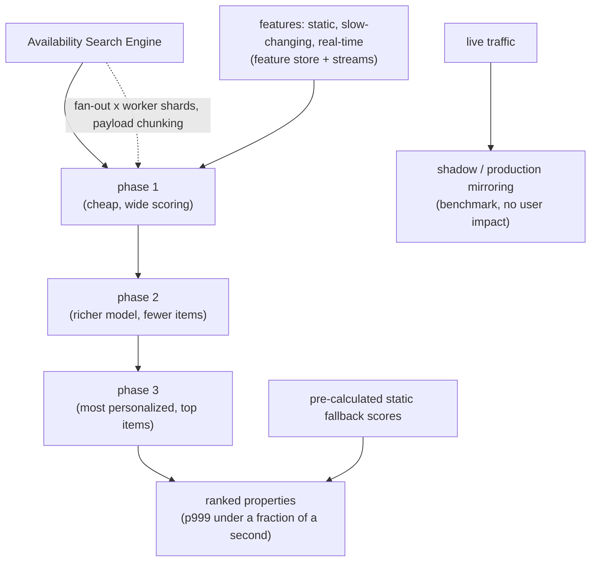

## Real-time serving and deployment

### Berkeley RISELab: Clipper, a low-latency online prediction serving system ([source](https://arxiv.org/abs/1612.03079))

Clipper is a general-purpose serving layer that sits between applications and heterogeneous ML frameworks, exposing one thin predict API. It hides framework differences behind a model abstraction layer, then applies adaptive request batching, prediction caching, and adaptive model selection to cut latency and raise throughput without modifying the underlying frameworks. It reaches throughput comparable to TensorFlow Serving while additionally supporting model composition and online correction for more robust predictions.

**Interview questions this design invites**
- Why put a serving layer between the app and the framework instead of calling the framework directly?
- How does adaptive batching decide its window, and what latency does it add?
- When does prediction caching help and when does it hurt (input cardinality, staleness)?
- How does the model selection layer improve accuracy or robustness at serve time?
- What breaks when you host each framework in its own container (cold start, resource isolation)?
- How would you extend Clipper's abstraction to GPU models or to LLMs?

**Tricks and gotchas**
- Adaptive batching tunes the window per model to hold a latency target rather than maximizing raw throughput.
- Caching pays off only when identical inputs recur; high-cardinality queries make it dead weight and memory cost.
- The abstraction layer isolates frameworks in containers, which trades a little RPC overhead for uniform observability and swaps.
- Model composition and online selection add robustness but also add a hop and a failure mode to reason about.

**Common mistakes and how to fix them**
- Treating caching as free: bound cache size and measure hit rate before relying on it.
- Batching for peak throughput: size the window against the p99 budget, not against idle-hardware benchmarks.
- Assuming one predict path fits every framework: keep per-framework containers so a slow model cannot stall others.
- Ignoring warm-up: pre-load and warm each model container before it takes traffic.

### Uber: Michelangelo online prediction service with sub-10ms P95 ([source](https://www.uber.com/us/en/blog/michelangelo-machine-learning-platform/))

Michelangelo deploys models to an online prediction cluster of hundreds of machines behind a load balancer, taking single or batched RPC scoring requests. Models that need no feature store lookup hit P95 under 5 ms; those reading the Cassandra online store hit P95 under 10 ms, with top models exceeding 250k predictions per second. Each model is identified by UUID plus optional tags so several versions run in one container, enabling A/B tests and staged traffic shifts without client changes when feature signatures match.

**Interview questions this design invites**
- How does serving many model versions in one container enable A/B tests without touching clients?
- Where does the 5 ms vs 10 ms P95 split come from, and what does the feature lookup cost?
- How do tags (aliases) make a version swap or rollback a pointer change?
- What has to be true about feature signatures for two versions to share traffic transparently?
- How do you distribute a multi-megabyte artifact across data centers without a slow deploy?
- How would you scale past 250k predictions per second on the hottest models?

**Tricks and gotchas**
- Tags decouple "which version is live" from client code, so promotion and rollback are alias moves.
- The feature store lookup is the swing factor in the latency budget, so co-locate or cache it.
- Packing several versions in one container makes side-by-side comparison cheap but shares blast radius.
- Artifacts are ZIP bundles (metadata, params, compiled DSL) pushed to disk so servers auto-load updates.

**Common mistakes and how to fix them**
- Quoting average latency: Michelangelo reports P95 precisely because tails breach SLAs.
- Coupling model version to app release: use UUID plus tag so redeploys are independent of the client.
- Assuming feature fetch is free: budget the Cassandra hop explicitly and cache hot keys.
- Ignoring signature compatibility: verify feature signatures match before routing shared traffic across versions.

### Grab: Catwalk, TensorFlow Serving on Kubernetes for hundreds of models ([source](https://engineering.grab.com/catwalk-serving-machine-learning-models-at-scale))

Catwalk runs TensorFlow Serving containers on Kubernetes wired into Grab's observability stack, giving data scientists a self-service path from a saved model to a live endpoint. Scientists export via tf.saved_model to an S3 path and TensorFlow Serving auto-loads it; Kubernetes handles autoscaling, load balancing, and rollout. New versions load while the current version keeps serving, so deploys are zero-downtime and rollback is simple, cutting the deploy cycle from days to minutes.

**Interview questions this design invites**
- How does version-served-while-loading give zero-downtime deploys and easy rollback?
- Why is an S3 folder path a good self-service contract for data scientists?
- What signal should drive Kubernetes autoscaling for a TF Serving pod?
- What are the tradeoffs of HTTP/1.1 today versus adding gRPC later?
- How do you keep hundreds of models observable through shared DaemonSets?
- Where does cold start show up when a pod loads a large saved model?

**Tricks and gotchas**
- TensorFlow Serving auto-discovers new version dirs, so promotion is a file drop, not a redeploy.
- The old version keeps serving until the new one is ready, which is what makes rollback boring.
- A minimal interface (just an S3 path) is what collapses the deploy cycle from days to minutes.
- Observability rides on Kubernetes DaemonSets (Datadog, Filebeat) so every model is monitored uniformly.

**Common mistakes and how to fix them**
- Scaling on CPU: prefer a serving-specific signal so autoscaling tracks real inference load.
- Cutting over before the new version is warm: rely on load-while-serving so traffic never hits a half-loaded model.
- Per-team bespoke serving: centralize on one platform so monitoring and rollback are standard.
- Forgetting protocol limits: plan the gRPC path if HTTP/1.1 becomes a throughput ceiling.

### Pinterest: GPU-accelerated ML inference for large recommenders ([source](https://medium.com/@Pinterest_Engineering/gpu-accelerated-ml-inference-at-pinterest-ad1b6a03a16d))

Pinterest moved recommender serving from CPU to GPU to run 100x larger models at neutral cost, landing 30 percent lower latency, 20 percent more throughput, and a 16 percent Homefeed engagement lift. The wins came from removing per-op overhead: merging embedding lookups via hash tables, copying batched tensors into one pre-allocated buffer to the GPU (10 ms down to under 1 ms), and capturing inference as a CUDA graph so kernels launch in one batch. They also redesigned batching away from CPU-era scatter-gather toward larger GPU batches, backed by hybrid DRAM and SSD caching.

**Interview questions this design invites**
- Why does a single request underuse a GPU, and how does dynamic batching fix it?
- What is sub-linear latency scaling with batch size and why does GPU serving exploit it?
- How do CUDA graphs cut kernel launch overhead versus eager op-by-op execution?
- Why merge embedding lookups, and what does hash-table consolidation buy?
- What is the memory tradeoff when GPU cache capacity is smaller than CPU DRAM?
- How do you keep p99 flat when batch sizes grow to fill the accelerator?

**Tricks and gotchas**
- One pre-allocated buffer plus a single host-to-device copy turns many small transfers into a sub-1 ms step.
- CUDA graphs amortize launch overhead only for a static graph, so dynamic shapes need care.
- Larger GPU batches beat CPU-era scatter-gather but shrink effective cache, so DRAM plus SSD tiering compensates.
- Neutral cost was the constraint: the goal was 100x model size at the same spend, not raw speed alone.

**Common mistakes and how to fix them**
- Porting CPU batching to GPU unchanged: redesign for large batches rather than many small ones.
- Leaving kernels eager: capture a CUDA graph to remove per-op launch cost.
- Copying tensors piecemeal: coalesce into one buffer and do a single device copy.
- Ignoring embedding-table memory: use hybrid DRAM and SSD caching when the tables outgrow GPU memory.

### Shopify: Merlin, a Ray-on-Kubernetes service per use case ([source](https://shopify.engineering/shopifys-machine-learning-platform-real-time-predictions))

Merlin Online Inference runs each use case as its own Kubernetes (GKE) service that loads its dedicated model from the registry and is independently autoscaled. Teams choose a serving layer by effort: no-code MLServer with pre-built runtimes, low-code MLServer custom serving, or full-custom FastAPI, with MLServer providing REST plus gRPC and built-in request batching under the V2 inference protocol. Services declare GPU (for example NVIDIA T4), CPU, memory, and replica counts per environment, and ship through automated CI/CD (Buildkite plus internal Shipit) after iterating in isolated Merlin Workspaces.

**Interview questions this design invites**
- What do you gain and lose by giving each use case its own dedicated serving service?
- When would a team pick MLServer no-code over FastAPI full-custom?
- How does per-service resource config (GPU, CPU, replicas) control both latency and cost?
- What role do isolated Workspaces play before a model reaches production?
- How does the V2 inference protocol standardize batching and transport across services?
- How do you monitor drift when serving is decentralized across many services?

**Tricks and gotchas**
- Per-service isolation limits blast radius but multiplies the number of things to autoscale and monitor.
- The no-code to full-custom ladder lets simple models ship fast without blocking complex ones.
- MLServer batching and gRPC come out of the box under V2, so teams do not reinvent the predict path.
- Workspaces expose temporary endpoints so teams validate live behavior before CI/CD promotes.

**Common mistakes and how to fix them**
- Over-customizing early: start on MLServer no-code and drop to FastAPI only when the use case demands it.
- One-size resource config: tune GPU, CPU, and replicas per environment to avoid paying for idle capacity.
- Skipping the workspace step: validate on an isolated endpoint before promoting through CI/CD.
- Losing sight of drift in a decentralized fleet: standardize monitoring across every dedicated service.

### Booking.com: multi-phase ranking with shadow mirroring under p999 ([source](https://medium.com/booking-com-development/the-engineering-behind-booking-coms-ranking-platform-a-system-overview-2fb222003ca6))

Booking.com's ranking platform sits behind the Availability Search Engine, scoring matching properties across verticals on three Kubernetes clusters with hundreds of pods each. It splits scoring into multiple phases, each with its own criteria and model complexity, and must finish under a fraction of a second at p999 while handling a fan-out problem where call volume multiplies by worker shards and property batches range from dozens to thousands. Safety and speed come from pre-calculated fallback static scores, production shadow-traffic mirroring for benchmarking, and inference optimizations like quantization, pruning, and hardware acceleration.

**Interview questions this design invites**
- Why split ranking into phases instead of scoring everything with one model?
- What is the fan-out problem and how does payload chunking bound it?
- Why measure at p999 rather than p99 for a search-time ranker?
- What does shadow-traffic mirroring catch that offline eval cannot, and what can it not measure?
- Why keep pre-calculated static fallback scores, and when do they kick in?
- Which inference optimizations (quantization, pruning, hardware acceleration) fit which phase?

**Tricks and gotchas**
- Cheap early phases cut the candidate set so the expensive model only scores a few items.
- Fan-out multiplies request volume by shard count, so batch sizes and chunking must be sized deliberately.
- Shadow mirroring runs only in production because the benchmark needs real traffic shape.
- Static fallback scores keep search answering even when the live model path fails.

**Common mistakes and how to fix them**
- Running one heavy model over all candidates: use multi-phase scoring to spend compute where it matters.
- Budgeting to p99 for a fan-out service: hold to p999 because the tail dominates at search scale.
- No degradation path: pre-compute static fallback scores so a model failure does not blank the results.
- Trusting shadow alone: it proves no breakage but cannot measure user impact, so still canary before widening.

_Not reachable: Lyft LyftLearn Serving, Netflix Kayenta_
