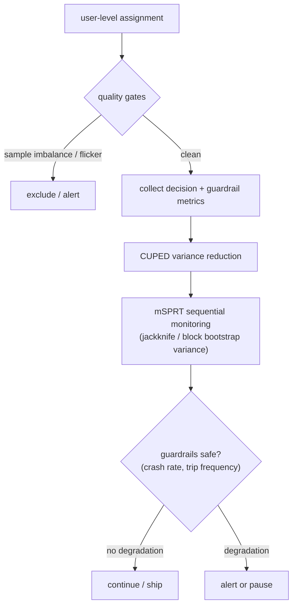
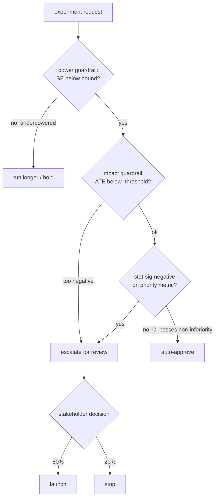
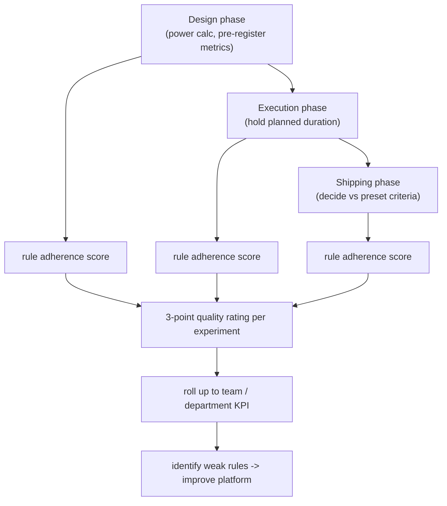
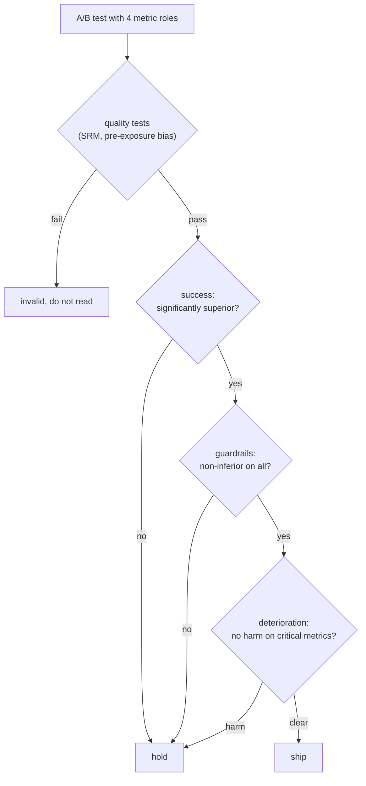
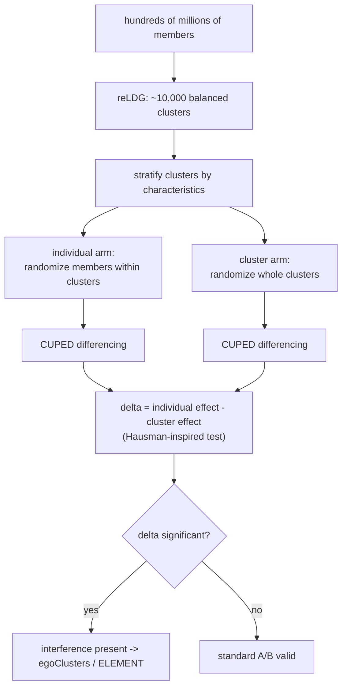

## Online experimentation and A/B testing

### Uber: XP, a company-wide experimentation platform with CUPED and sequential monitoring ([source](https://www.uber.com/blog/xp/))

Uber runs over 1,000 concurrent experiments across rider, driver, Eats, and Freight on one platform (XP) that supports A/B/N tests, causal inference, and multi-armed-bandit continuous experiments. They squeeze variance with CUPED (valuable for small user bases or early termination) and monitor cumulatively with a mixture Sequential Probability Ratio Test (mSPRT), using delete-a-group jackknife and block bootstrap variance estimation to handle observations correlated across days. Two data-quality gates run continuously: sample-imbalance detection (control/treatment ratio deviating from intended) and flicker exclusion (a user who crosses arms, e.g. switching from an iPhone to an Android when treatment is iOS-only, is dropped from analysis). Guardrails on app crash rate and trip-frequency rate pause or alert when a significant degradation appears.

**Interview questions this design invites**
- Why does continuous (sequential) monitoring need mSPRT instead of a fixed-horizon t-test, and what does that buy you?
- What is a flicker, why does it bias results, and how would you detect and exclude flickers safely?
- Why use delete-a-group jackknife or block bootstrap variance when observations span multiple days?
- How does CUPED reduce variance, and when does it fail to help?
- How would you set auto-pause thresholds on crash rate vs trip frequency so you do not pause on noise?
- With 1,000 concurrent experiments, how do you keep assignments orthogonal so tests do not confound each other?

**Tricks and gotchas**
- Sequential monitoring lets you look continuously without the peeking penalty, but only if you use a method (mSPRT) built for it; a normal test still inflates false positives.
- Within-user observations across days are correlated, so naive variance underestimates uncertainty; jackknife/bootstrap at the right unit fixes the intervals.
- Flicker users are contaminated by both arms; keeping them dilutes and biases the effect.
- CUPED gains depend on a pre-period metric that correlates with the in-experiment metric; low correlation means little reduction.

**Common mistakes and how to fix them**
- Reading a sequential dashboard as if it were a fixed-horizon test. Fix: use always-valid p-values / mSPRT boundaries, not a raw 5% cutoff.
- Ignoring sample-ratio mismatch because the primary looks good. Fix: gate every readout on the observed-vs-intended ratio and refuse to read on failure.
- Treating request-level rows as independent. Fix: cluster variance at the diversion unit (user).
- Pausing on the first guardrail blip. Fix: require statistically significant degradation before auto-kill.

### Airbnb: experimentation guardrails that flag harmful experiments before and during launch ([source](https://medium.com/airbnb-engineering/designing-experimentation-guardrails-ed6a976ec669))

Airbnb built a company-wide guardrail framework (2019) that triggers an escalation review when an experiment risks harming a critical metric, flagging roughly 25 experiments per month; about 80% still launch after review and 20% are stopped. Three guardrail types work together: an Impact Guardrail escalates when the global average treatment effect is more negative than a preset threshold (catching large harm regardless of significance); a Power Guardrail requires enough sample (standard error of the percent-change estimate below a bound) so the Impact Guardrail keeps reasonable power and false-positive rates before approval; and a Stat-Sig-Negative Guardrail escalates any statistically significant negative move on top-priority metrics like revenue even when small. The system adjusts escalation thresholds by experiment coverage (lower-coverage tests face higher percent-change thresholds but stricter global-impact requirements) and auto-approves clearly positive experiments whose confidence intervals pass a non-inferiority test.

**Interview questions this design invites**
- Why have both a magnitude-based Impact Guardrail and a significance-based Stat-Sig-Negative Guardrail; what does each catch that the other misses?
- Why does the Power Guardrail exist, and what breaks if you run the Impact Guardrail on an underpowered test?
- How would you set the Impact threshold (e.g. -0.5%) and per-metric priorities?
- Why scale escalation thresholds with experiment coverage?
- How do non-inferiority tests enable safe auto-approval without human review?
- What is the cost of over-escalation, and how do you tune the flag rate?

**Tricks and gotchas**
- A large negative point estimate can be non-significant on a small test; without a power gate the Impact Guardrail either misses harm or fires on noise.
- Non-inferiority (not superiority) is the right frame for guardrails: you must prove "not meaningfully worse," not "better."
- Coverage-adjusted thresholds prevent tiny experiments from tripping global-impact alarms while still protecting at scale.

**Common mistakes and how to fix them**
- Only checking the primary and ignoring harm to protected metrics. Fix: pre-declare guardrails with per-metric thresholds and priorities.
- Gating on significance alone, so a big but noisy regression slips through. Fix: add a magnitude (Impact) guardrail independent of significance.
- Escalating everything, drowning reviewers. Fix: auto-approve confidently-safe experiments via non-inferiority CIs.
- Approving tests too early to launch. Fix: require the power guardrail (SE bound) before launch.

### Booking.com: experimentation quality as the platform's north-star KPI ([source](https://medium.com/booking-product/why-we-use-experimentation-quality-as-the-main-kpi-for-our-experimentation-platform-f4c1ce381b81))

Booking.com argues that "running bad experiments is just a very expensive and convoluted way to make unreliable decisions," so instead of optimizing experiment volume or a satisfaction score, they make experimentation quality the platform's main KPI. Quality is defined as adherence to standardized experimentation protocols across three phases: Design (power calculations, pre-registering expected metric movements), Execution (sticking to the planned duration), and Shipping (deciding against predetermined criteria). Rule adherence in each phase yields a three-point quality rating that rolls up to team and department level, letting them track quality over time and see which specific rules teams struggle with, which in turn informs platform improvements. The rule set is intentionally extensible as practices evolve.

**Interview questions this design invites**
- Why is decision quality a better platform KPI than experiment count or velocity?
- How would you operationalize "quality" into an auditable, per-experiment score?
- What Design-phase rules (power, pre-registration) most reduce false decisions, and why?
- How does pre-registering expected metric movements curb HARKing and post-hoc rationalization?
- How do you roll individual scores up to team level without gaming?
- What is the risk of optimizing a process-adherence metric instead of business outcomes?

**Tricks and gotchas**
- Pre-registering the expected direction and the shipping criteria before launch is what removes hindsight bias from the ship call.
- A three-phase rating localizes failure (design vs execution vs shipping), so fixes target the actual weak point.
- The rubric must stay extensible; freezing the rule set makes it stale as practices change.

**Common mistakes and how to fix them**
- Measuring the platform by number of experiments run. Fix: measure whether experiments produce reliable decisions.
- Letting teams choose metrics and stopping rules after seeing data. Fix: enforce pre-registration in the Design phase.
- Stopping experiments off-plan when a result looks good. Fix: score Execution-phase duration adherence.
- No feedback loop from scores to tooling. Fix: aggregate weak rules to drive platform improvements.

### Spotify: risk-aware ship decisions across multiple metrics ([source](https://engineering.atspotify.com/2024/03/risk-aware-product-decisions-in-a-b-tests-with-multiple-metrics))

Spotify ships only when all conditions hold: the treatment is significantly superior on at least one success metric, significantly non-inferior on every guardrail metric, shows no evidence of harm on success/guardrail/deterioration metrics, and passes quality tests. They organize metrics into four roles: success (superiority tests), guardrail (non-inferiority tests for expected-stable metrics), deterioration (inferiority tests protecting critical business metrics), and quality (sample-ratio-mismatch and pre-exposure-bias checks). Rather than a loss function, they control error rates for the combined decision: false-positive rate alpha (shipping something that does not help) and false-negative rate beta (missing a real win). A key subtlety is that false-positive rates are not adjusted for guardrail metrics because you require all guardrails to pass, but power must be corrected, powering each metric at beta_star = beta / (G + 1) where G is the number of guardrail metrics so the joint decision hits the intended power.

**Interview questions this design invites**
- Why frame guardrails as non-inferiority tests rather than testing for a significant negative?
- Why are false-positive rates not adjusted across guardrails, while power must be corrected?
- Derive why per-metric power target becomes beta / (G + 1) with G guardrails.
- What is the difference between a guardrail metric and a deterioration metric here?
- Why gate the whole decision on quality tests (SRM, pre-exposure bias) first?
- How does controlling error rates for the combined decision differ from correcting each test independently?

**Tricks and gotchas**
- Requiring all guardrails to pass means their false-positive risks do not compound the way independent tests would, so no alpha correction is needed there, but the joint power drops and must be boosted.
- Non-inferiority needs a pre-set margin; "not significant" is not the same as "not worse."
- Quality tests run first: a failed SRM or pre-exposure bias invalidates everything downstream.
- Separating deterioration (critical, inferiority-tested) from ordinary guardrails lets you apply stricter protection where harm is unacceptable.

**Common mistakes and how to fix them**
- Declaring a win on any metric that turns significant. Fix: pre-declare success metrics and require superiority only on those.
- Reading "guardrail not significant" as "guardrail safe." Fix: use non-inferiority tests with an explicit margin.
- Ignoring that testing many metrics erodes joint power. Fix: power each metric at beta / (G + 1).
- Skipping SRM / pre-exposure checks. Fix: make quality tests a hard pre-gate on reading results.

### LinkedIn: detecting network-effect interference with an A/B test of A/B tests ([source](https://www.linkedin.com/blog/engineering/ab-testing-experimentation/detecting-interference-an-a-b-test-of-a-b-tests))

LinkedIn detects interference by running two experimental designs in parallel and comparing them: if there is no network effect, an individual-level randomization and a cluster-level randomization should estimate the same effect, so a gap between them reveals leakage. In the individual arm, members are randomized within clusters (standard A/B); in the cluster arm, whole network communities move to the same treatment so a treated user's connections are also mostly treated. To make the comparison powerful across hundreds of millions of members they partition roughly 10,000 balanced clusters with the reLDG algorithm, stratify clusters by similar characteristics before randomizing, and apply CUPED (per-user in-experiment-minus-pre-experiment differencing) to cut variance. They compute delta = individual effect minus cluster effect and test whether it differs from zero with a Hausman-inspired test; a significant delta signals interference that needs specialized measurement (egoClusters, ELEMENT).

**Interview questions this design invites**
- Why should individual and cluster randomization agree when there is no interference, and diverge when there is?
- What does the Hausman-inspired test on delta actually test, and what are its assumptions?
- Why cluster with a balanced-partition algorithm (reLDG) rather than arbitrary groups?
- How does CUPED differencing help when cluster-level tests have so few effective units?
- What are the power costs of cluster randomization, and how does stratification recover some?
- Once interference is detected, why do you still need a separate method (egoClusters/ELEMENT) to measure the true effect?

**Tricks and gotchas**
- Cluster randomization drastically cuts effective sample size (units become clusters, not members), so variance reduction (CUPED, stratification) is essential to keep the comparison powered.
- Balanced clustering matters: if clusters differ systematically, the two arms are not comparable and the delta test is confounded.
- A non-significant delta does not prove zero interference; it may just be underpowered, so report the interval.

**Common mistakes and how to fix them**
- Assuming SUTVA and running a plain member-level test on a social graph. Fix: run the dual-design check to detect leakage first.
- Comparing individual vs cluster arms without balancing/stratifying clusters. Fix: use reLDG plus stratification so arms are comparable.
- Reading tiny cluster-arm effects as null. Fix: apply CUPED and report power/CIs before concluding no interference.
- Stopping at detection. Fix: switch to an interference-robust estimator (egoClusters/ELEMENT) to measure the real effect.

_Not reachable: Netflix Interleaving, Netflix Reimagining Experimentation Analysis, Lyft Ridesharing Marketplace (Medium login-redirect loop)_
