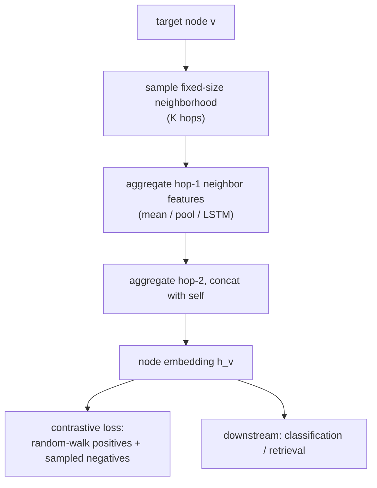
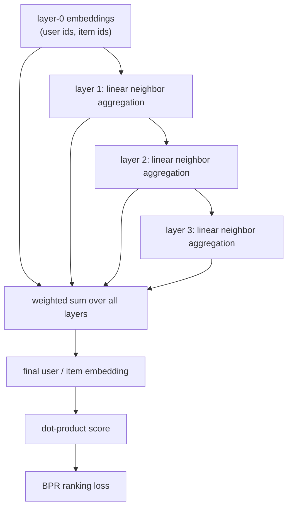
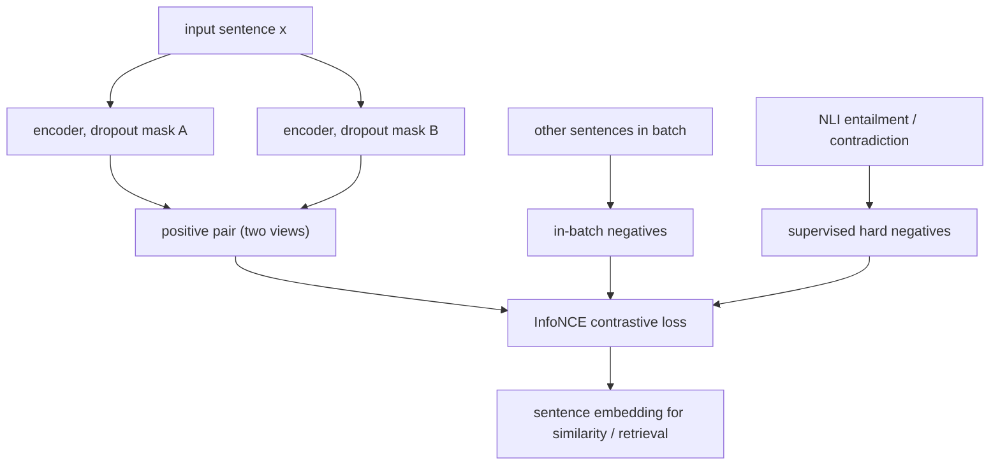
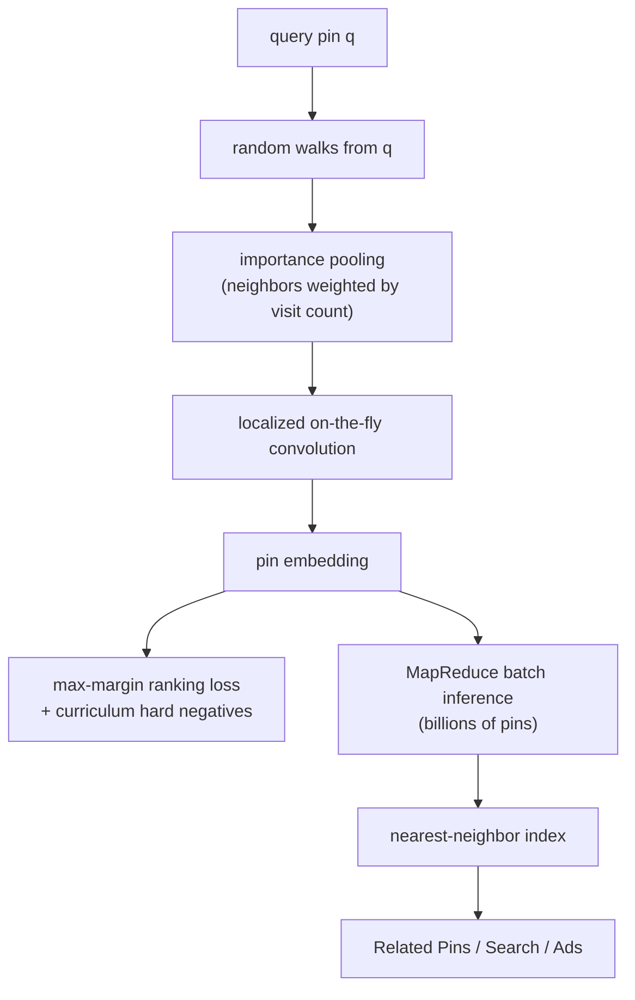
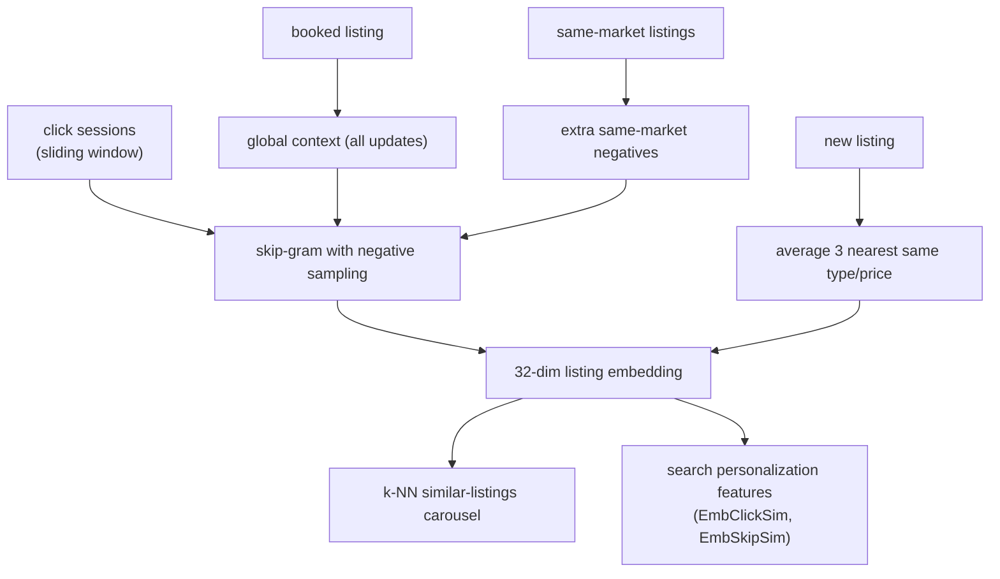
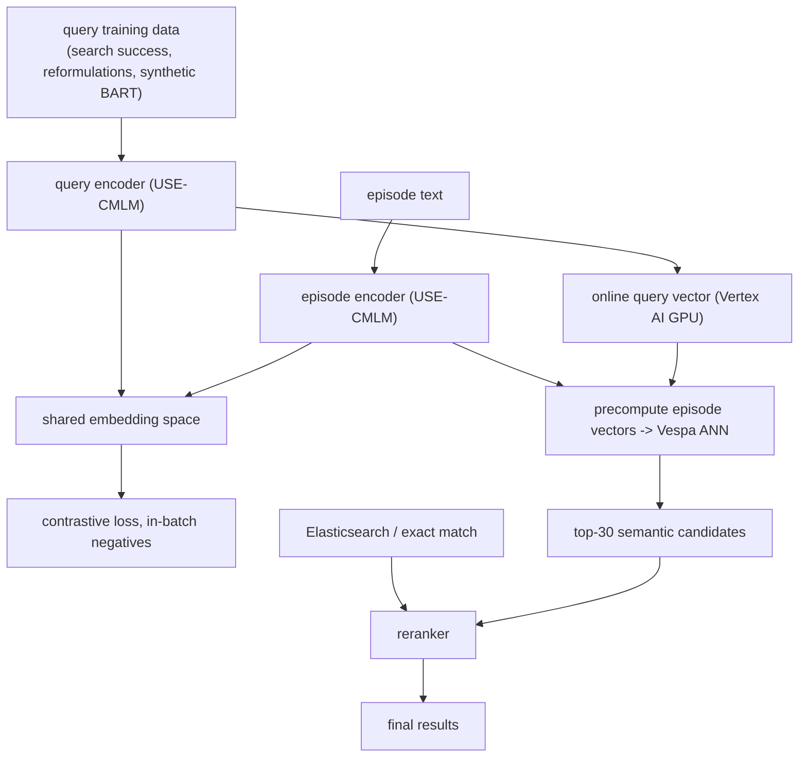
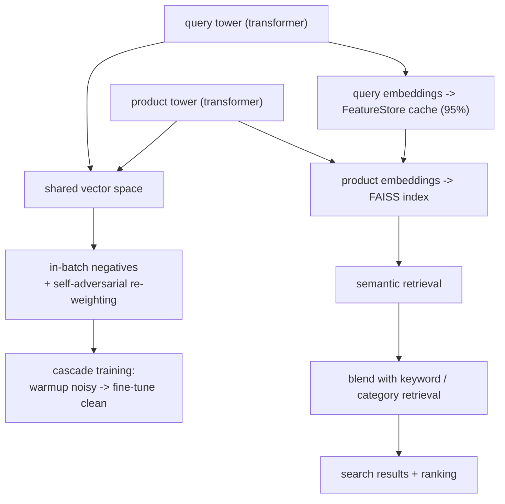
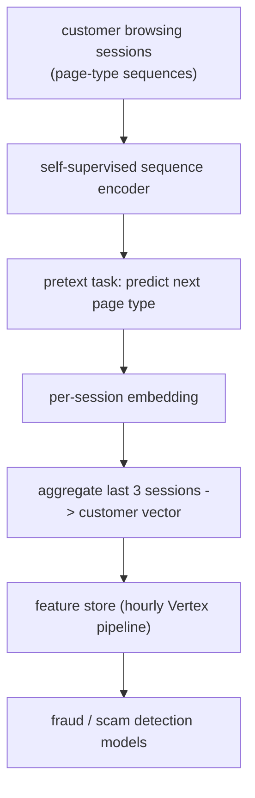

## Embeddings and representation learning

### Stanford / Hamilton et al.: GraphSAGE, inductive node embeddings on large graphs ([source](https://arxiv.org/abs/1706.02216))

GraphSAGE learns aggregation functions rather than a fixed vector per node: a node's embedding is built by sampling a fixed number of neighbors and pooling their feature vectors (mean, LSTM, or max-pooling aggregators), stacked over K hops. Because embeddings are computed from features, the model generalizes to nodes and even whole graphs unseen at training time, which is the inductive property. It is trained unsupervised with a graph-based contrastive loss (nearby nodes via random walks are positives, negatives sampled with a distribution) or supervised for node classification, and validated on citation networks, Reddit posts, and protein-protein interaction graphs.

**Interview questions this design invites**
- Why is learning aggregation functions inductive while learning a per-node vector is transductive?
- How does neighbor sampling bound the compute and memory cost per node?
- Compare the mean, pooling, and LSTM aggregators: which are order-invariant and why does that matter?
- How do positives from random walks and sampled negatives define the unsupervised loss?
- What breaks when a node has very high degree, and how does fixed-size sampling help?
- How would you embed a brand-new node at serving time with zero interaction history?

**Tricks and gotchas**
- Sample a fixed number of neighbors per hop instead of using the full neighborhood so per-batch cost stays bounded regardless of degree.
- Concatenate the node's own representation with the aggregated neighbor vector at each layer rather than averaging them together.
- More than 2 or 3 hops rarely helps and blows up the receptive field exponentially.
- Neighbor sampling is stochastic, so re-embedding the same node twice gives slightly different vectors unless you fix the sample.

**Common mistakes and how to fix them**
- Assuming you need the whole graph in memory: use localized sampled computation graphs per minibatch.
- Treating GraphSAGE like a transductive method and retraining for every new node: exploit the inductive encoder to embed new nodes directly from features.
- Ignoring feature quality: the inductive power comes from features, so poor input features cap embedding quality no matter the depth.

### He et al.: LightGCN, simplified graph convolution for recommendation ([source](https://arxiv.org/abs/2002.02126))

LightGCN strips a standard GCN down to its useful core for collaborative filtering: it removes feature transformation matrices and nonlinear activations, keeping only linear neighborhood aggregation over the user-item interaction graph. Each layer smooths a node's embedding with its neighbors' embeddings; the final representation is a weighted sum of the embeddings from all layers, which captures different aggregation depths without stacking nonlinearities. It is trained with BPR (Bayesian Personalized Ranking) loss, and recommendation is a dot product between user and item vectors, giving roughly a 16 percent gain over NGCF.

**Interview questions this design invites**
- Which two GCN components does LightGCN remove, and why do they hurt collaborative filtering?
- Why combine embeddings from all layers instead of only using the last layer's output?
- Why is LightGCN transductive, and what does that mean for cold-start entities?
- How does BPR loss differ from a pointwise classification loss for recommendation?
- What does over-smoothing look like as you stack more propagation layers?
- Where does LightGCN fit as a baseline versus a two-tower or GraphSAGE encoder?

**Tricks and gotchas**
- The only trainable parameters are the layer-0 id embeddings; propagation itself has no weights.
- Symmetric normalization of the adjacency is what keeps embedding magnitudes stable across layers.
- Layer combination weights are typically fixed to a uniform average rather than learned.
- Because it is id-based and transductive, a new user or item has no vector until retrain.

**Common mistakes and how to fix them**
- Adding nonlinearities or feature transforms back in expecting a lift: the paper shows they degrade recommendation quality.
- Using only the deepest layer's embedding: aggregate across layers to avoid over-smoothing.
- Expecting cold-start coverage: pair LightGCN with a content-based fallback for unseen entities.

### Gao et al.: SimCSE, simple contrastive sentence embeddings ([source](https://arxiv.org/abs/2104.08821))

SimCSE learns sentence embeddings contrastively. The unsupervised variant feeds the same sentence through the encoder twice with independent dropout masks, treating the two views as a positive pair and other in-batch sentences as negatives, so standard dropout is the entire data augmentation. The supervised variant uses NLI data: entailment pairs are positives and contradiction pairs are explicit hard negatives. Both minimize an InfoNCE objective, and a key finding is that contrastive training regularizes the anisotropic pretrained embedding space toward uniformity, lifting BERT-base to 76.3 (unsupervised) and 81.6 (supervised) Spearman on STS.

**Interview questions this design invites**
- How does dropout act as data augmentation to build a positive pair from one sentence?
- What happens to the embeddings if you remove dropout entirely?
- Where do the negatives come from in the unsupervised versus supervised variants?
- What is anisotropy in pretrained embeddings and how does contrastive training fix it?
- Why are NLI contradiction pairs especially valuable as hard negatives?
- How would you evaluate sentence embeddings beyond STS correlation?

**Tricks and gotchas**
- The two positive views differ only by the random dropout mask, so both passes must use the same input but independent masks.
- Larger batches supply more in-batch negatives and usually improve the space.
- Adding NLI contradictions as hard negatives gives a measurable jump over entailment-only positives.
- Alignment (positives close) and uniformity (spread over the space) are the two diagnostics to track, not just downstream accuracy.

**Common mistakes and how to fix them**
- Disabling dropout at training time and wondering why embeddings collapse: dropout is the augmentation, keep it on.
- Using a single dropout mask for both views: use independent masks so the positive pair is non-trivial.
- Judging the space only by cosine on a probe set: check uniformity so you catch representation collapse.

### Pinterest: PinSage, web-scale graph convolutional embeddings ([source](https://medium.com/pinterest-engineering/pinsage-a-new-graph-convolutional-neural-network-for-web-scale-recommender-systems-88795a107f48))

PinSage scales GraphSAGE-style convolutions to Pinterest's pin-board graph of roughly 3 billion nodes and 18 billion edges. Instead of fixed K-hop neighborhoods it defines a node's neighborhood by short random walks and weights neighbors by visit counts (importance pooling), building localized computation graphs on the fly so the full graph never has to sit in memory. It trains with a max-margin ranking loss using curriculum hard negatives (progressively harder items resembling the query), and a MapReduce inference pipeline embeds billions of pins in a few hours, feeding a nearest-neighbor index. Reported gains include 40 percent recall and 30 percent engagement lifts.

**Interview questions this design invites**
- Why replace fixed K-hop neighborhoods with random-walk sampling and importance pooling?
- How do localized computation graphs let this scale to billions of nodes without holding the full graph?
- What is curriculum hard-negative training and why introduce harder negatives over time?
- How does MapReduce avoid recomputing embeddings for overlapping neighborhoods at inference?
- How do the learned pin embeddings get served for recommendation retrieval?
- What offline metrics (recall, MRR) versus online metrics did they use, and why both?

**Tricks and gotchas**
- Random-walk visit counts give a soft, importance-weighted neighborhood instead of an unweighted hop set, worth a large recall gain.
- Curriculum hard negatives are added gradually; starting too hard destabilizes training.
- MapReduce joins reuse neighbor embeddings so overlapping receptive fields are not recomputed.
- Producer-consumer minibatch construction (CPU builds graphs, GPU trains) keeps the accelerators busy at scale.

**Common mistakes and how to fix them**
- Trying to materialize the full graph Laplacian: build localized sampled computation graphs per minibatch instead.
- Using only random negatives so the loss saturates: add curriculum hard negatives to sharpen the boundary.
- Re-embedding overlapping neighborhoods independently: batch inference with MapReduce to share work.

### Airbnb: listing embeddings from booking sessions ([source](https://medium.com/airbnb-engineering/listing-embeddings-for-similar-listing-recommendations-and-real-time-personalization-in-search-601172f7603e))

Airbnb learns 32-dimensional listing vectors with a skip-gram / word2vec objective run over 800 million click sessions from 4.5 million listings: within a sliding context window, a listing is pulled toward listings clicked nearby and pushed from randomly sampled negatives. Two domain adaptations matter: the final booked listing is kept as a global context that influences every update in the session, and negatives are additionally sampled from the same market so the model learns fine within-market distinctions rather than trivial geography. Cold-start listings get a vector by averaging the three nearest same-type, same-price listings, and the embeddings power a similar-listings carousel and in-session search personalization features.

**Interview questions this design invites**
- Why adapt word2vec skip-gram to listings, and what are "words" versus "sentences" here?
- Why keep the booked listing as a global context in every window update?
- What bias do same-market negatives correct, and what would uniform-random negatives learn instead?
- How do you cold-start a listing with no click history?
- How do EmbClickSim and EmbSkipSim turn a static space into real-time personalization?
- Why choose a dimension as small as 32, and what constrains it?

**Tricks and gotchas**
- The booked listing is treated specially as a persistent positive context rather than one click among many.
- Same-market negatives are the key trick; random negatives make all out-of-market listings look equally dissimilar.
- Cold start is handled by geographic-plus-attribute averaging, not by retraining.
- Both clicked-similarity and skipped-similarity are fed as features so skips carry negative signal in ranking.

**Common mistakes and how to fix them**
- Sampling negatives uniformly across all markets: draw same-market negatives to learn useful local distinctions.
- Treating a booking like any other click: promote it to global context so the strongest signal shapes every update.
- Leaving new listings with no vector: seed from nearest same-type, same-price neighbors until interactions accrue.

### Spotify: natural language podcast search with dense retrieval ([source](https://engineering.atspotify.com/2022/03/introducing-natural-language-search-for-podcast-episodes/))

Spotify built semantic podcast search as a dual-encoder: a query encoder and an episode encoder map into a shared space where cosine similarity ranks relevance, initialized from the Universal Sentence Encoder CMLM (chosen over vanilla BERT for sentence-level, multilingual embeddings). Training positives come from historical search successes, query-reformulation pairs, and synthetic queries generated by a BART model fine-tuned on MS MARCO; negatives are in-batch, giving B squared minus B pairs per batch. Episode vectors are precomputed and indexed in Vespa for ANN retrieval, query vectors are computed online on GPU via Vertex AI, and semantic results are merged with Elasticsearch candidates before a final reranker.

**Interview questions this design invites**
- Why a dual-encoder rather than a cross-encoder for this retrieval task?
- Why start from Universal Sentence Encoder CMLM instead of vanilla BERT?
- How do you manufacture training positives when you lack explicit relevance labels?
- What does in-batch negative sampling give you and what is its popularity-bias risk?
- Why keep semantic search as an additional retrieval source alongside Elasticsearch rather than replacing it?
- Where is precomputation possible and why does the two-tower factorization enable it?

**Tricks and gotchas**
- Query reformulation pairs (failed query then successful reformulation) are a cheap, high-signal positive source.
- Synthetic queries from a fine-tuned BART model expand coverage for episodes with little search traffic.
- Episode side is precomputed and indexed; only the query side needs online GPU inference.
- The final cosine similarity is reused as a feature in the reranker, not just as a retrieval filter.

**Common mistakes and how to fix them**
- Replacing lexical search outright: dense retrieval misses exact-match intents, so run it as an added source and rerank.
- Relying only on logged clicks for positives: augment with reformulations and synthetic queries for tail coverage.
- Computing episode embeddings online: precompute and index them so only queries are embedded at request time.

### Instacart: ITEMS, two-tower transformer for search relevance ([source](https://company.instacart.com/how-its-made/how-instacart-uses-embeddings-to-improve-search-relevance))

ITEMS (Instacart Transformer-based Embedding Model for Search) is a two-tower transformer that projects queries and products into one space so relevance is a dot product. It trains on conversion signal from search logs with in-batch negatives plus self-adversarial re-weighting to emphasize the hardest examples, and found that data quality beats quantity: expanding the training set past a point added noise, so they cascade-train (warmup on noisier data, fine-tune on clean). Product embeddings are indexed in FAISS; over 95 percent of query embeddings are served from a FeatureStore cache under 8ms with the rest computed on the fly. The similarity score complements keyword and category retrieval, lifting MRR by 1.2 percent and cart-adds-per-search by 4.1 percent.

**Interview questions this design invites**
- Why treat off-diagonal in-batch pairs as negatives, and what noise does that risk introduce?
- What is self-adversarial re-weighting and why up-weight hard examples?
- Why does adding more training data eventually hurt, and how does cascade training fix it?
- How does query caching hit sub-8ms latency, and what is the fallback for cache misses?
- Why blend embedding retrieval with keyword and category retrieval rather than replace them?
- Which offline metrics map to the online cart-add and GMV gains?

**Tricks and gotchas**
- Unconverted products are noisy negatives because preference is personal, so in-batch negatives are safer than treating all non-clicks as hard negatives.
- Self-adversarial re-weighting sharpens distinctions between similar products without a separate hard-negative mining stage.
- The query distribution is heavy-headed, so caching over 95 percent of query vectors makes online cost tiny.
- Embeddings double as a semantic-dedup signal for autocomplete suggestions.

**Common mistakes and how to fix them**
- Assuming more data is always better: filter and cascade-train because low-quality pairs degrade the space.
- Treating every unconverted product as a hard negative: use in-batch negatives with re-weighting to avoid false negatives.
- Computing query embeddings fresh every request: cache the head of the query distribution in a FeatureStore.

### Wayfair: Melange, customer-journey embeddings for fraud ([source](https://www.aboutwayfair.com/careers/tech-blog/introducing-melange-a-customer-journey-embedding-system-for-improving-fraud-and-scam-detection))

Melange is a self-supervised sequence model that turns a customer's browsing journey into a single behavioral vector. The pretext task predicts the next page type from prior session interactions, so the encoder learns temporal patterns of behavior with no fraud labels. An hourly Vertex pipeline pulls each customer's last three sessions, encodes them, and aggregates the session vectors into one customer embedding stored in a feature store. Those embeddings become additional input features to downstream fraud and scam models, delivering up to 18 percent relative PR-AUC improvement over hand-engineered features alone.

**Interview questions this design invites**
- Why use a self-supervised next-page pretext task instead of training directly on fraud labels?
- How does a sequence model capture behavior that hand-engineered features miss?
- Why aggregate the last three sessions into one vector, and what does that lose or gain?
- How do embeddings-as-features compose with an existing fraud model rather than replace it?
- Why measure with PR-AUC rather than accuracy for fraud?
- What refresh cadence does fraud detection need, and why hourly here?

**Tricks and gotchas**
- Fraud labels are scarce and lagging, so a label-free pretext task lets you learn from abundant session logs.
- Aggregating a fixed window of recent sessions gives a stable per-customer vector without unbounded history.
- Embeddings are consumed as features by existing models, so no need to rebuild the fraud stack.
- Hourly refresh matters because fraud behavior is fast-moving; a stale customer vector misses in-progress attacks.

**Common mistakes and how to fix them**
- Trying to supervise directly on rare fraud labels: pretrain self-supervised on sessions, then attach the fraud head.
- Judging the embedding by accuracy on imbalanced data: use PR-AUC so the minority fraud class is not hidden.
- Letting customer vectors go stale: refresh on a short cadence so recent behavior is represented.

_Not reachable: none_
