## Fraud and anomaly detection

### Chawla et al.: SMOTE, synthetic minority over-sampling for extreme imbalance ([source](https://arxiv.org/abs/1106.1813))

SMOTE attacks the class-imbalance problem where fraud is a tiny fraction of transactions and naive classifiers learn to ignore the positive class. Instead of duplicating minority rows, it synthesizes new minority examples by interpolating between a minority point and its nearest minority neighbors in feature space, and pairs this over-sampling with under-sampling of the majority. The authors evaluate with ROC / AUC rather than accuracy, and show the hybrid beats plain under-sampling or reweighting priors across C4.5, Ripper, and Naive Bayes.

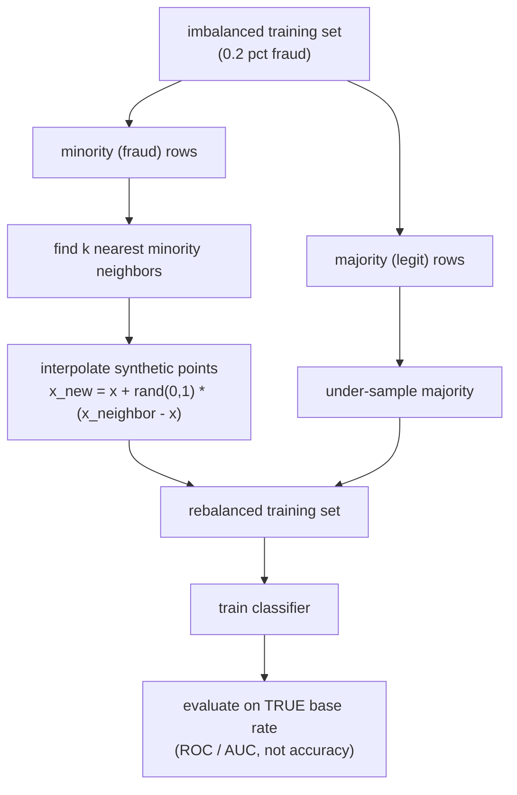

**Interview questions this design invites**
- Why interpolate synthetic minority points instead of just duplicating the fraud rows?
- What can go wrong when SMOTE interpolates across a noisy or overlapping decision boundary?
- Why evaluate on the original imbalanced distribution rather than the rebalanced one?
- When would class weights or focal loss be preferable to SMOTE?
- How does SMOTE interact with categorical features that cannot be linearly interpolated?
- Why is AUC used here instead of accuracy?

**Tricks and gotchas**
- Synthetic points must be generated only from the training fold, never before the train/test split, or you leak.
- Interpolating between minority points near the boundary can invent unrealistic samples and blur the boundary you care about.
- Combining light under-sampling with over-sampling often beats either alone.
- SMOTE assumes a metric space; raw categoricals need encoding first (SMOTE-NC) or the interpolation is meaningless.

**Common mistakes and how to fix them**
- Rebalancing the eval set too, which fabricates precision. Fix: rebalance train only, measure at the real base rate.
- Applying SMOTE before cross-validation folds. Fix: resample inside each fold.
- Blindly setting a 1:1 ratio. Fix: tune the sampling ratio as a hyperparameter against PR-AUC.

### Cheng et al.: Wide & Deep, memorization plus generalization for tabular scoring ([source](https://arxiv.org/abs/1606.07792))

Wide & Deep jointly trains a wide linear model over cross-product feature transforms with a deep network over low-dimensional embeddings of sparse features. The wide side memorizes specific, interpretable feature co-occurrences; the deep side generalizes to unseen combinations but can over-generalize when interactions are sparse. The two branches are summed at the output and trained together, so each compensates for the other's weakness. On Google Play (a billion-plus users) it beat wide-only and deep-only on app acquisitions; the same embedding-plus-dense shape is what fraud models adopt when they go deep instead of boosted trees.

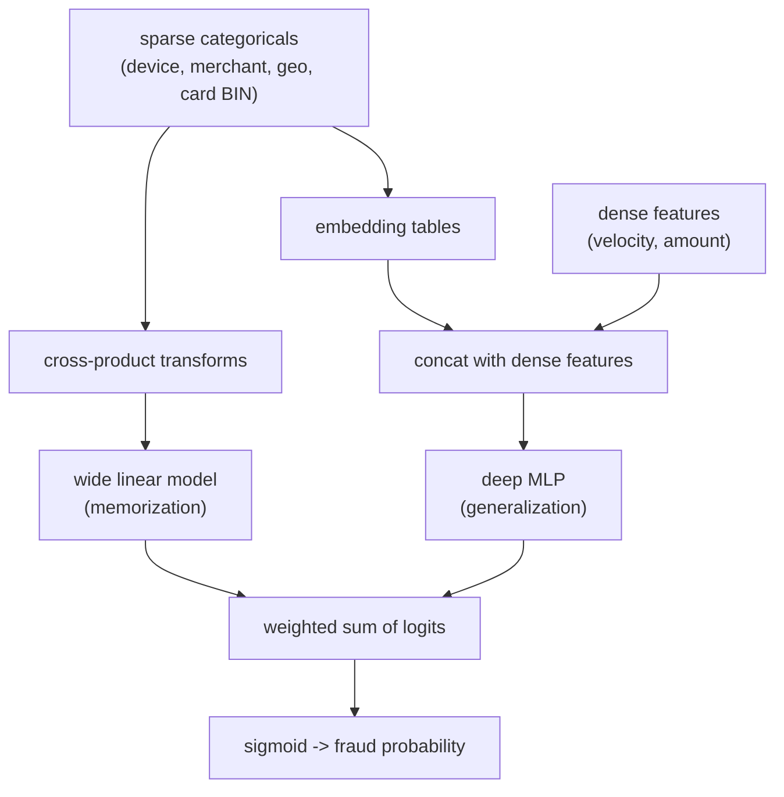

**Interview questions this design invites**
- What does the wide branch capture that the deep branch cannot, and vice versa?
- Why joint training instead of training the two models separately and ensembling?
- Where do the parameters live as you grow embedding dimension?
- How would you adapt a recommender architecture to a binary fraud label?
- Which side gives you interpretability for a declined transaction?
- When are gradient-boosted trees the better choice over this deep shape?

**Tricks and gotchas**
- The wide side needs hand-chosen cross features; picking the wrong crosses wastes the memorization capacity.
- Embedding tables dominate parameter count, not the dense layers.
- Joint training means the optimizer for each branch (FTRL for wide, Adam/SGD for deep) can differ.
- Sparse high-cardinality IDs need hashing or vocab management to bound table size.

**Common mistakes and how to fix them**
- Feeding raw high-cardinality IDs into the linear side and blowing up. Fix: cross and hash deliberately.
- Assuming deep always wins. Fix: measure; on many tabular fraud sets boosted trees match or beat it.
- Ignoring calibration of the joint logit. Fix: calibrate the output probability before thresholding on cost.

### Stripe: How we built Stripe Radar, DNN card-fraud scoring at sub-100ms ([source](https://stripe.dev/blog/how-we-built-it-stripe-radar))

Stripe Radar evolved from a Wide-and-Deep ensemble of XGBoost plus a neural net to a pure DNN, borrowing ResNeXt's multi-branch design, which cut training time by over 85 percent while holding performance. It analyzes more than 1,000 characteristics per transaction and returns a decision in under 100 milliseconds, running at a roughly 0.1 percent false-positive rate across billions of payments. Features come from investigating past attacks, dark-web research, and behavioral patterns; the team grew training data tenfold (experimenting toward 100x) since DNNs benefit from scale. Risk Insights surfaces the exact features that pushed a score up or down so merchants understand declines.

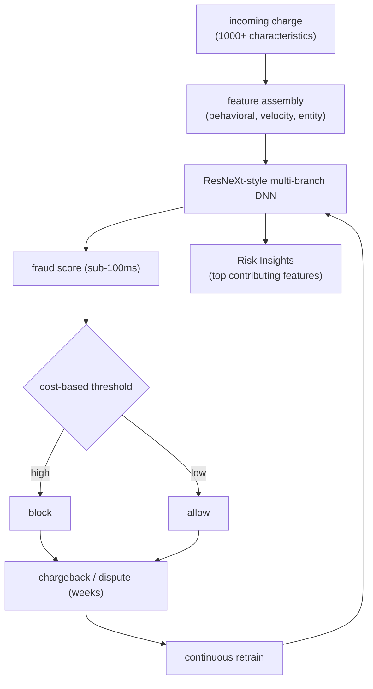

**Interview questions this design invites**
- Why migrate from a boosted-tree-plus-DNN ensemble to a single DNN?
- How do you hit a sub-100ms budget while scoring 1,000+ features?
- Why does a DNN benefit more from 10x-100x more data than trees would?
- How do you keep a 0.1 percent false-positive rate meaningful at billions of payments?
- What does Risk Insights compute, and why do merchants need it?
- How do you source new fraud features when the adversary keeps adapting?

**Tricks and gotchas**
- A multi-branch (ResNeXt-style) net gives representational capacity without a linear blow-up in training cost.
- Explainability is a product requirement here, not a nicety, because merchants dispute declines.
- Reported FP rate only counts allowed-then-disputed; blocked-good transactions are invisible.
- Scaling data helps only if the new data is labeled and point-in-time correct.

**Common mistakes and how to fix them**
- Chasing accuracy on a sub-1-percent base rate. Fix: optimize precision/recall and cost at the operating point.
- Treating the model as a black box merchants must trust. Fix: ship per-decision feature attributions.
- Assuming more features always help latency-free. Fix: precompute and batch lookups to stay in budget.

### PayPal: real-time graph database and analysis to fight fraud ([source](https://medium.com/paypal-tech/how-paypal-uses-real-time-graph-database-and-graph-analysis-to-fight-fraud-96a2b918619a))

PayPal built its own graph database because commercial products could not deliver sub-second query latency at million-QPS throughput over 400M+ accounts. It uses Gremlin as the query language over an Aerospike NoSQL backend and resolves multi-hop relationship traversals in roughly 10 milliseconds. When several compromised accounts share a profile asset such as an IP, a newly created account touching that asset is linked to the ring within a sub-second. Offline batch loading seeds history while event-based streaming keeps the graph fresh to the second.

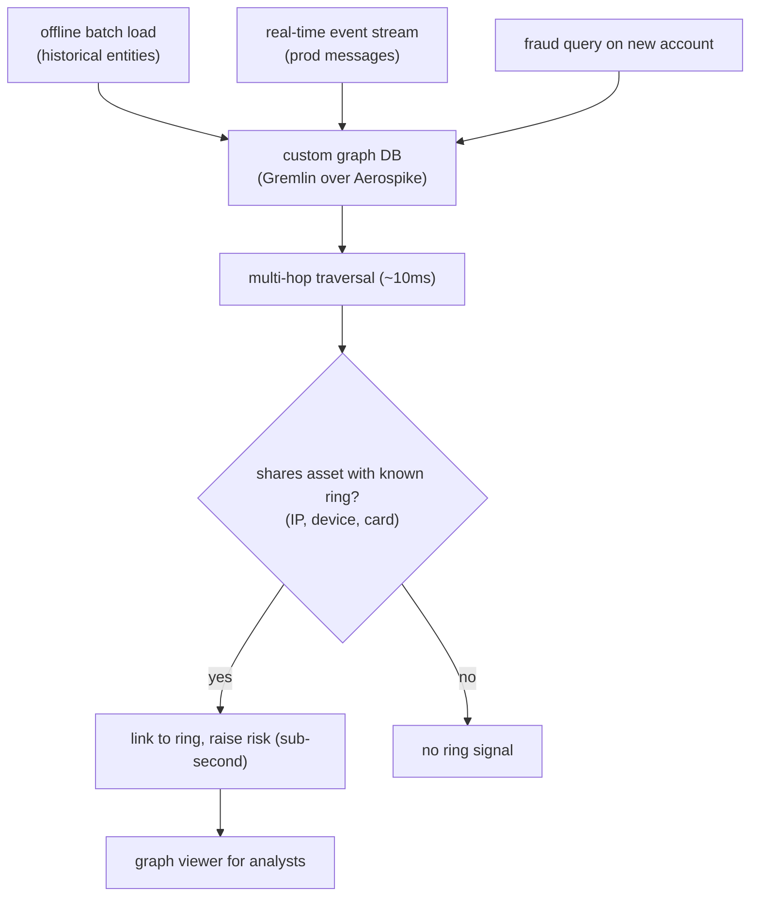

**Interview questions this design invites**
- Why build a custom graph DB instead of adopting a vendor product?
- What makes multi-hop traversal the right primitive for ring detection?
- How do you keep the graph fresh at second-level under million-QPS load?
- Why does a per-transaction classifier miss what the graph catches?
- What is the latency budget for a graph query inline with authorization?
- How do batch and streaming ingestion coexist without inconsistency?

**Tricks and gotchas**
- Shared entities (IP, device, card) are the edges that expose coordinated rings; individual rows look clean.
- Sub-second linking of a new account to an existing ring is the payoff of keeping the graph hot.
- Gremlin plus a fast KV backend trades a general query surface for predictable latency.
- Graph freshness lag is itself an attack surface; stale edges let a ring slip a new account through.

**Common mistakes and how to fix them**
- Modeling fraud as per-event only. Fix: add graph/entity features or a graph query into the decision.
- Rebuilding the whole graph in batch. Fix: incremental event-based updates for second-level freshness.
- Unbounded traversal depth. Fix: cap hops (latency) and prune noisy high-degree shared nodes.

### Uber: RGCN over the rider-driver graph to detect collusion ([source](https://www.uber.com/blog/fraud-detection/))

Uber targets collusion fraud, where cooperating users take fake trips on stolen cards that end in chargebacks, forming clusters in the user network. It models users as nodes connected by shared information and applies a Relational Graph Convolutional Network, which uses relation-specific transforms so different edge types (shared payment method, device, location) carry different signal weights. Trained on a 4-month window with a 6-week validation period, it delivered 15 percent better precision with minimal added false positives. The two RGCN scores became the 4th and 39th most important features among 200 in Uber's downstream risk models.

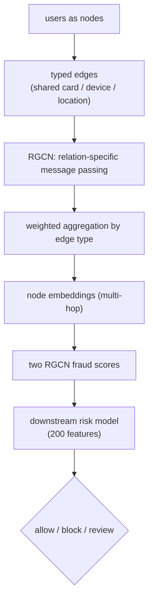

**Interview questions this design invites**
- Why does collusion fraud show up as graph clusters rather than per-user anomalies?
- What does relation-specific weighting add over a plain GCN?
- Why feed RGCN scores into a downstream model instead of acting on them directly?
- How do you pick the training window and validation lag given delayed chargebacks?
- How do you measure precision gain without inflating false positives?
- What edge types matter most, and how do you avoid over-connecting the graph?

**Tricks and gotchas**
- Feeding graph scores as features (not final decisions) lets the risk model weigh them against 200 others.
- RGCN differentiates edge types, so a shared device and a shared city are not treated equally.
- The 4-month/6-week split respects label maturation for chargebacks.
- Feature-importance rank (4th of 200) is how they justified the added graph pipeline cost.

**Common mistakes and how to fix them**
- Treating all shared attributes as one edge type. Fix: use relation-specific transforms (that is the R in RGCN).
- Training on immature labels. Fix: hold a validation lag long enough for chargebacks to settle.
- Deploying the GNN as the sole decision. Fix: integrate its score into the existing risk model.

### Uber: Risk Entity Watch, unsupervised anomaly scoring without labels ([source](https://www.uber.com/us/en/blog/risk-entity-watch/))

Risk Entity Watch is Uber's in-house platform that flags suspicious entities across business lines using unsupervised learning, so it works before labels for a new fraud class exist. Its Entity Feature Generation module auto-builds thousands of features by crossing metrics, time windows, and the entities in each event (a single trip generates features across riders, drivers, payment methods, and more). Multiple tree-based and neural anomaly detectors then score outliers, and the HAIFA method explains each anomaly via per-feature histograms so human agents can validate before acting.

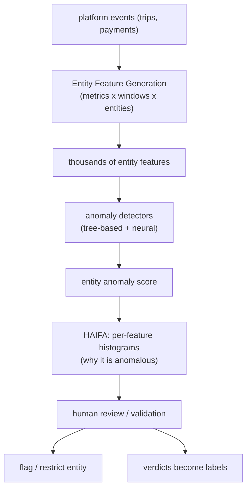

**Interview questions this design invites**
- When do you reach for unsupervised anomaly detection instead of a supervised classifier?
- How does auto-generating thousands of features avoid manual per-fraud engineering?
- Why is explainability (HAIFA) essential before acting on an unsupervised flag?
- How do anomaly flags become labels for supervised models?
- Why score entities rather than individual transactions?
- How do you keep false positives tolerable when unusual is not the same as fraudulent?

**Tricks and gotchas**
- Auto-feature generation across entity/time/metric crosses scales to new fraud types without new engineering.
- Unusual is not fraudulent; the human loop is what converts anomalies into trustworthy actions.
- Per-feature histogram explanations let agents validate fast and generate labels.
- Ensembling tree and neural detectors hedges against any single detector's blind spot.

**Common mistakes and how to fix them**
- Auto-actioning raw anomaly scores. Fix: route to human review with a per-feature explanation.
- Only scoring transactions. Fix: score entities so shared-asset patterns surface.
- Letting the anomaly path drown analysts. Fix: rank by expected cost and cap the queue.

### Grab: GraphBEAN, bipartite-graph autoencoder for novel fraud ([source](https://engineering.grab.com/graph-anomaly-model))

Because fraudsters adversarially innovate, Grab built GraphBEAN to catch new patterns without labels. It is an autoencoder over the bipartite consumer-merchant graph that, unlike node-only methods, reconstructs both node attributes and edge (transaction) attributes. An encoder of graph-convolution layers produces latent node representations; a feature decoder rebuilds node and edge attributes while a structure decoder predicts edge existence. Normal behavior reconstructs easily and anomalies produce high reconstruction error, yielding edge-level and node-level scores that a fraud-type tagger categorizes (for example promo abuse) before feeding humans and automated actioning.

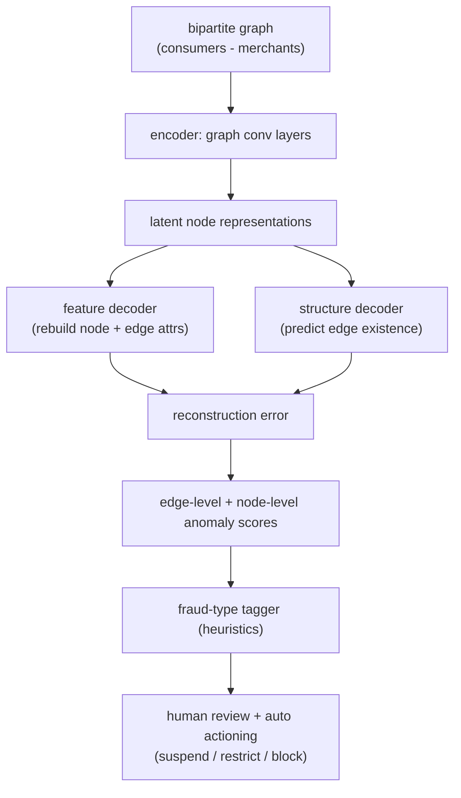

**Interview questions this design invites**
- Why reconstruct edge attributes, not just node attributes?
- How does reconstruction error translate into an anomaly signal without labels?
- Why a bipartite consumer-merchant graph specifically?
- How do you turn raw anomaly scores into actionable, categorized fraud types?
- What are the failure modes when normal-but-rare behavior looks anomalous?
- How does this complement a supervised model on known fraud?

**Tricks and gotchas**
- Edge-attribute reconstruction captures transaction-level anomalies that node-only models miss.
- The rare-reconstructs-poorly assumption breaks if fraud becomes frequent enough to look normal.
- A downstream fraud-type tagger is needed because raw anomaly scores are not directly actionable.
- Combining node and edge scores balances entity-level and interaction-level signals.

**Common mistakes and how to fix them**
- Producing only node-level scores. Fix: score edges too, so transaction anomalies surface.
- Treating high reconstruction error as confirmed fraud. Fix: tag and route to humans first.
- Expecting it to catch known fraud best. Fix: pair with a supervised model; anomaly is for the novel.

### Grab: RGCN over shared-entity graph, less labeled data, explainable clusters ([source](https://engineering.grab.com/graph-for-fraud-detection))

Grab uses a Relational Graph Convolutional Network that exploits how fraudsters share physical properties (identities, phone devices, Wi-Fi routers, delivery addresses) to cut costs, which creates dense clusters distinct from legitimate users. As a semi-supervised method it performs well when only a few percent of nodes are labeled, leaning on graph structure rather than heavy feature engineering. Visualization makes it explainable: genuine accounts appear isolated while high-scoring fraud accounts share devices with many others in recognizable dense clusters. The authors recommend fewer than three convolution layers to avoid over-smoothing and stress that node features still matter.

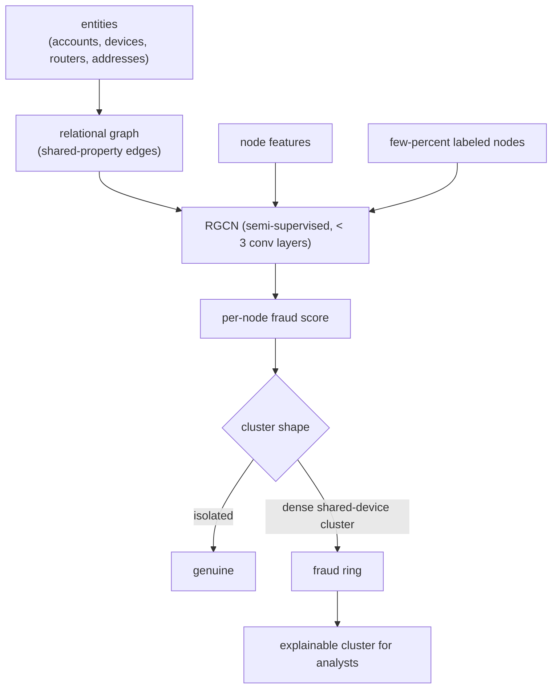

**Interview questions this design invites**
- Why does a semi-supervised GNN need less labeled data than a boosted tree?
- What shared physical properties make the best edges, and why?
- Why cap the network at fewer than three convolution layers?
- How does graph visualization provide explainability that a tabular model lacks?
- What are the scalability challenges of real-time GNN prediction?
- How do you handle noisy edges from incidentally shared attributes?

**Tricks and gotchas**
- Fewer than three conv layers avoids over-smoothing that would blur fraud and genuine nodes.
- Node features still matter; structure alone under-performs without domain context.
- Shared-device clustering is both the detection signal and the analyst-facing explanation.
- Semi-supervised learning propagates a few labels across structure, but noisy edges leak signal.

**Common mistakes and how to fix them**
- Stacking many GNN layers for more reach. Fix: keep it shallow to prevent over-smoothing.
- Dropping node features and relying on topology. Fix: keep domain node features in.
- Trusting every shared-attribute edge. Fix: prune high-degree incidental nodes (shared public Wi-Fi).

### Airbnb: fighting financial fraud with targeted friction ([source](https://medium.com/airbnb-engineering/fighting-financial-fraud-with-targeted-friction-82d950d8900e))

Airbnb reframes the decision from block-versus-allow to friction-versus-allow, optimizing a loss that sums false-positive cost (good users churning), false-negative cost (fraud that slips), and true-positive residual cost (fraudsters who beat the friction). The loss is L = FP times G times V plus FN times C plus TP times (1 minus F) times C. Rather than hard-blocking, it applies frictions that are easy for legitimate users but hard for fraudsters, such as micro-authorizations and billing-statement verification. In their example, friction that is 95 percent effective against fraud with 10 percent good-user dropout cut total losses by roughly 50 percent versus outright blocking.

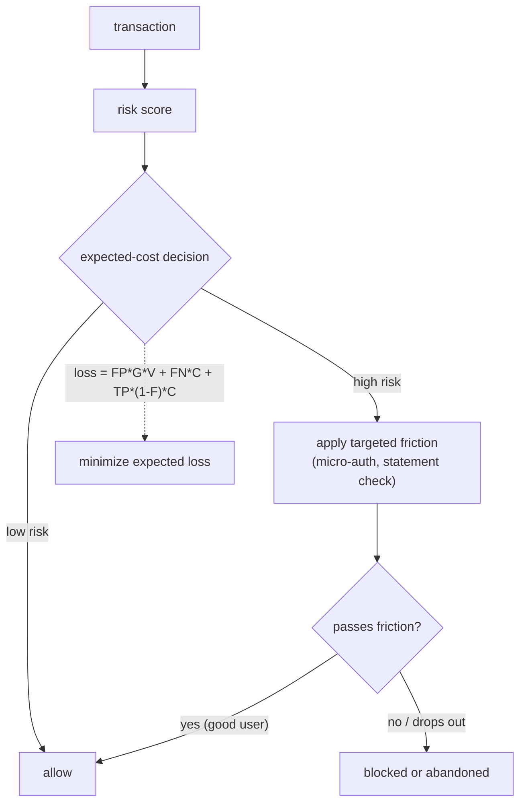

**Interview questions this design invites**
- Why is friction sometimes better than a hard allow/block decision?
- Walk through each term of the loss and what cost it represents.
- How do you estimate friction effectiveness F and good-user dropout for the loss?
- What friction types separate legitimate users from fraudsters cheaply?
- How does targeted friction change the threshold design versus a two-action model?
- How do you measure the churn cost of friction on good users?

**Tricks and gotchas**
- Friction converts some would-be false positives into recovered good transactions.
- Every loss term needs an estimated cost; getting G, V, C, F wrong misplaces the operating point.
- Friction that is too heavy drives good-user dropout, which is a hidden false-positive cost.
- The true-positive residual term acknowledges some fraudsters beat the friction anyway.

**Common mistakes and how to fix them**
- Modeling only allow versus block. Fix: add friction as a third action with its own cost term.
- Ignoring good-user dropout under friction. Fix: put it in the loss (the FP-adjacent term).
- Using a single fixed threshold. Fix: derive operating points by minimizing expected loss as costs move.

### Feedzai: behavioral-biometric session scoring for banking fraud ([source](https://medium.com/feedzaitech/building-trust-in-a-digital-world-the-role-of-machine-learning-in-behavioral-biometrics-bb0da913d95a))

Feedzai scores banking sessions in real time from behavioral biometrics rather than transaction fields alone, capturing keystroke dynamics (key-press duration, key type, typing speed), mouse movement and clicks on desktop, and touch position, pressure, and gestures on mobile, alongside device, network, and in-app behavior signals. It fuses these diverse feature sets holistically and runs a layered decision stack that mixes expert rules, lightweight heuristics, and ML models so latency stays low. The system evaluates whole sessions continuously (not just single transactions) at nearly ten thousand requests per second on Kubernetes with horizontal scaling. Extreme class imbalance (millions of legitimate versus hundreds of fraud cases) is handled with advanced sampling, and Prometheus/Grafana plus event logging feed continuous retraining.

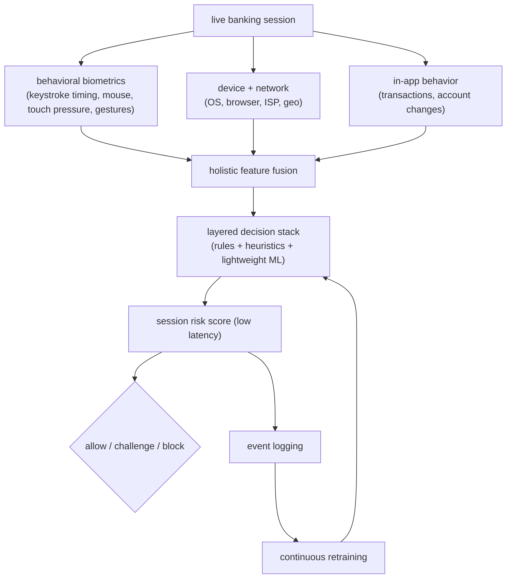
**Interview questions this design invites**
- Why score a continuous session rather than an individual transaction?
- What does keystroke and mouse dynamics add over device fingerprinting alone?
- How do you keep ML lightweight enough for ten thousand requests per second?
- How does mobile touch/pressure signal differ from desktop keystroke signal, and why model both?
- Why blend expert rules with ML instead of an ML-only model?
- How do you address millions-to-hundreds class imbalance without wrecking precision?

**Tricks and gotchas**
- Behavioral biometrics degrade if the capture SDK misses events, so signal completeness gates model quality.
- Continuous session scoring means the operating point shifts as more evidence arrives mid-session.
- Lightweight algorithms are a latency requirement, not a modeling preference, at ten thousand rps.
- Advanced sampling is load-bearing here; naive training on the raw ratio learns to predict legitimate.

**Common mistakes and how to fix them**
- Treating one transaction as the unit. Fix: score the evolving session and re-decide as signal accrues.
- Shipping a heavy model that blows the latency budget. Fix: keep ML lightweight and push a rules layer first.
- Training on the raw imbalance. Fix: apply sampling and evaluate on the true base rate.

### Capital One: random forest AML alert triage with risk-based prioritization ([source](https://www.capitalone.com/tech/machine-learning/how-machine-learning-can-help-fight-money-laundering/))

Capital One replaced first-in-first-out AML alert triage with a random forest (scikit-learn plus PySpark) that scores suspicious activity over several hundred customer and transaction features, trained on more than 100,000 past investigations. They evaluated logistic regression, XGBoost, and RNNs but chose random forest for its balance of accuracy, speed, and explainability under regulatory scrutiny, noting it trains twice as fast as logistic regression while matching XGBoost/RNN ROC curves. Scores bucket alerts into three severity levels so investigators streamline low-score alerts and prioritize high-score ones instead of working the queue sequentially. Features are pruned continuously via recursive elimination and statistical testing, and monthly monitoring, QA, and dashboards keep the model auditable.

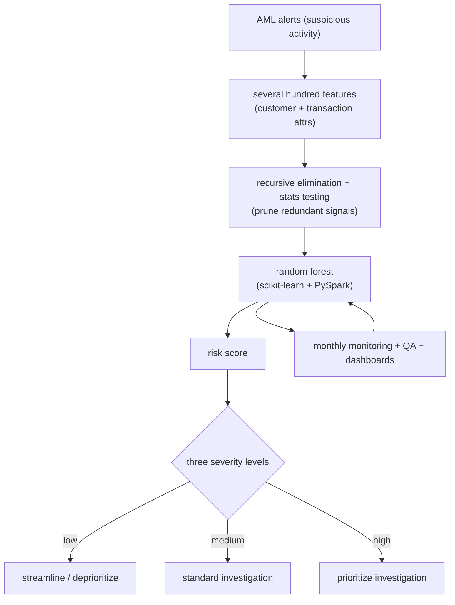
**Interview questions this design invites**
- Why pick random forest over XGBoost or an RNN when the latter matched ROC?
- Why does explainability outrank raw accuracy in an AML setting?
- How does risk-based prioritization change investigator throughput versus FIFO triage?
- How do you keep several hundred features from overfitting 100,000 investigations?
- What does bucketing into three severity levels buy over a single continuous threshold?
- How do you adapt features when customer behavior shifts (for example a pandemic P2P surge)?

**Tricks and gotchas**
- Explainability is a regulatory requirement, so a marginally more accurate black box can be the wrong choice.
- Recursive feature elimination plus statistical testing is what stops several-hundred features from overfitting.
- Training labels are past investigations, so label quality inherits investigator bias.
- Twice-faster training than logistic regression matters for monthly retrain cadence, not just for benchmarks.

**Common mistakes and how to fix them**
- Chasing the highest-AUC model. Fix: weight explainability and audit needs, which is why RF won here.
- Leaving features static as behavior drifts. Fix: refresh features and re-eliminate on a schedule.
- Working alerts FIFO. Fix: score and bucket so high-risk alerts get expert time first.

### Wayfair: GraphSage node classification to catch policy-abuse account hoppers ([source](https://www.aboutwayfair.com/careers/tech-blog/preventing-policy-abuse-with-graph-neural-networks))

Wayfair builds a knowledge graph linking customer accounts through shared names, devices, payment methods, and addresses, then classifies each account node as fraudulent or legitimate to catch policy abusers who open fresh accounts with no order history. Because new accounts have little behavioral signal, the GNN leans on their connections to known fraudsters through shared attributes. They tested GCN, GraphSage, and GAT and chose GraphSage with two convolutional layers (Dropout, ReLU, log-softmax), where the two-layer depth captures 2-hop neighborhoods while avoiding over-smoothing. Run as batch training and inference several times a day, it delivered a 10 percent relative lift in PR-AUC over gradient-boosted models, catching thousands of fraudsters and millions in annual savings.

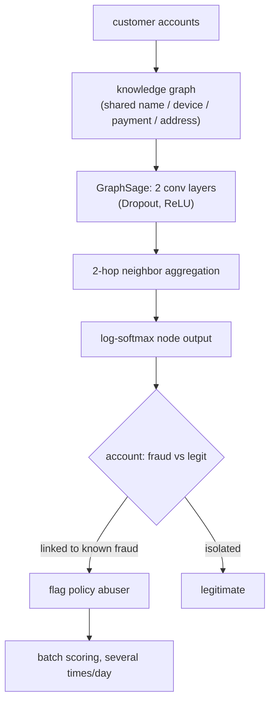
**Interview questions this design invites**
- Why can a GNN flag a brand-new account with no order history?
- Why did GraphSage beat GCN and GAT for this node-classification task?
- Why exactly two convolutional layers and not deeper?
- What is the over-smoothing problem and how does layer depth control it?
- Why is batch scoring acceptable here instead of real-time serving?
- How do you measure lift with PR-AUC on a heavily imbalanced fraud label?

**Tricks and gotchas**
- Shared-attribute edges give signal precisely when per-account behavior is empty (new accounts).
- Two layers is a deliberate 2-hop reach; going deeper over-smooths and blurs fraud from legit.
- Batch several-times-a-day trades freshness for engineering simplicity; hoppers within the window slip.
- GraphSage's neighbor sampling is what makes it scale where full-graph GCN struggles.

**Common mistakes and how to fix them**
- Requiring order history before scoring. Fix: use graph links so cold-start accounts still get a signal.
- Stacking many GNN layers for reach. Fix: keep it shallow (two) to avoid over-smoothing.
- Comparing on ROC-AUC on rare fraud. Fix: report PR-AUC against the boosted-tree baseline.

### Booking.com: real-time JanusGraph BFS for hops-to-fraud network features ([source](https://medium.com/booking-com-development/leverage-graph-technology-for-real-time-fraud-detection-and-prevention-438336076ea5))

Booking.com stores transaction identifiers (account numbers, card details) as nodes and co-observation as edges in JanusGraph over a Cassandra backend, so coordinated fraud shows up as connected identifier networks. On each reservation request the Fraud Detection Service calls a Graph Service that inserts the request's nodes and edges, runs a breadth-first search to find the connected component, and computes graph features. Key features include node-type counts (accounts, cards, fraud flags) and hops_to_fraud, the shortest distance from the request to a known fraud node, which then feed ML models or expert rules. The system meets a synchronous p99 of 300 milliseconds against a very large historical identifier store via indexing and query optimization.

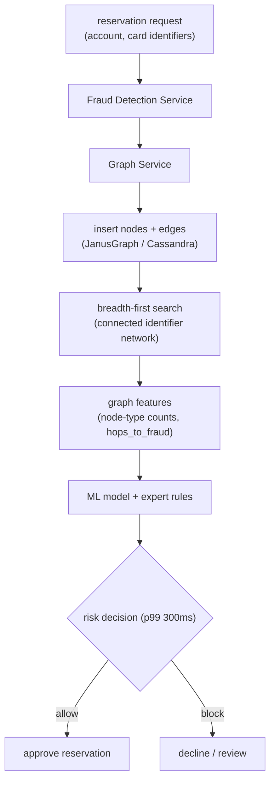
**Interview questions this design invites**
- Why is hops_to_fraud a strong feature, and what does a small hop count imply?
- How do you insert, traverse, and score within a synchronous p99 of 300ms?
- Why store identifiers as a graph instead of joining tables at query time?
- What indexing makes BFS fast over a very large historical identifier store?
- How do you bound BFS so a high-degree shared node does not explode traversal cost?
- Why compute features inline per request rather than precomputing them offline?

**Tricks and gotchas**
- Inserting the current request into the graph first lets BFS relate it to history in one traversal.
- hops_to_fraud collapses a whole neighborhood into one interpretable distance scalar.
- The 300ms p99 forces bounded traversal depth and heavy indexing, not unbounded graph queries.
- Co-observation edges accumulate noise; incidental shared identifiers can inflate false connections.

**Common mistakes and how to fix them**
- Traversing without a depth or fan-out cap. Fix: bound hops and prune high-degree nodes to hold p99.
- Precomputing features that go stale. Fix: insert-and-traverse inline so the newest edges count.
- Trusting every co-observation edge. Fix: down-weight incidental shared identifiers before scoring.
_Not reachable: PayPal engineering blog index (medium.com/paypal-tech), Airbnb fraud and trust engineering index (medium.com/airbnb-engineering)_
