## Search ranking

### Google (Wang et al.): DCN V2, improved Deep and Cross Network for web-scale ranking ([source](https://arxiv.org/abs/2008.13535))

DCN V2 fixes the original Deep and Cross Network's weak expressiveness by making the cross network learn richer explicit feature interactions while staying cheap enough for billions of training examples. Each cross layer computes an element-wise interaction between the raw input and the current representation, stacked in parallel (or in series) with a plain deep MLP. A mixture-of-low-rank variant factorizes the cross weight matrices so the added expressiveness does not blow up serving cost. It shipped across many of Google's web-scale learning-to-rank systems with both offline accuracy and online business-metric gains.

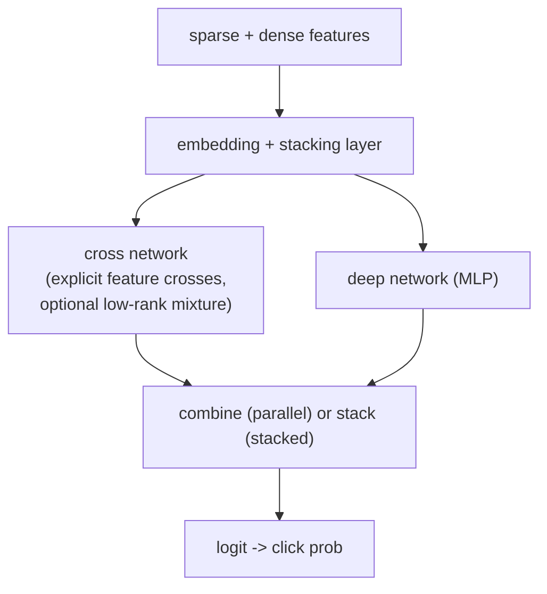

**Interview questions this design invites**
- What does the cross network learn that a plain MLP cannot, and why is it more parameter-efficient for explicit crosses?
- When would you pick the stacked structure over the parallel one for combining cross and deep?
- How does the low-rank mixture keep the cross network cheap without losing much accuracy?
- Why is explicit high-order feature interaction valuable in ranking versus letting the MLP learn it implicitly?
- How would you decide the number of cross layers (interaction order) for a given feature set?
- How do you serve this under a tens-of-milliseconds ranking budget over ~1,000 candidates?

**Tricks and gotchas**
- The cross layer multiplies against the original input each layer, so interaction order grows linearly with depth; too many layers wastes compute for little gain.
- Low-rank factorization is the lever that made it deployable; the naive full-rank cross matrix is quadratic in embedding width.
- Parallel vs stacked is an empirical choice; do not assume one dominates across datasets.

**Common mistakes and how to fix them**
- Treating DCN V2 as a drop-in that always beats an MLP; fix by A/B testing online since offline lift often shrinks in production.
- Ignoring embedding-table cost, which dominates memory at web scale; fix by hashing or dimension tuning per feature.
- Stacking cross layers indefinitely for higher-order crosses; fix by capping depth and measuring marginal NDCG per layer.

### Company: GetYourGuide, powering millions of real-time rankings with production AI ([source](https://www.getyourguide.careers/posts/powering-millions-of-real-time-rankings-with-production-ai))

GetYourGuide serves over 30 million ranking predictions per day for activity search, with the full ranking delivered in under 80ms. A learning-to-rank model is trained daily on historical ranking events joined to downstream user interactions (impressions, clicks, bookings). Tecton is the feature store: it fuses warehouse tables with real-time Kafka streams through Stream Feature Views (real-time aggregation) and On Demand Feature Views (further transforms). A signature feature, "discounted ranking impressions," counts per-visitor activity impressions while discounting by result-page position, which is their explicit position-bias correction. Airflow runs the daily pipeline: build the dataset from ranking events plus interactions, point-in-time join against Tecton's offline store, commit the model to MLflow, and push train and production sets to Arize. Serving is a FastAPI container on Kubernetes with Redis as the online store, hitting p99 under 7ms per feature-serving request. Arize monitors feature drift (PSI and KL divergence against a rolling two-week window) and NDCG per segment, and once caught a downward drift in prediction scores.

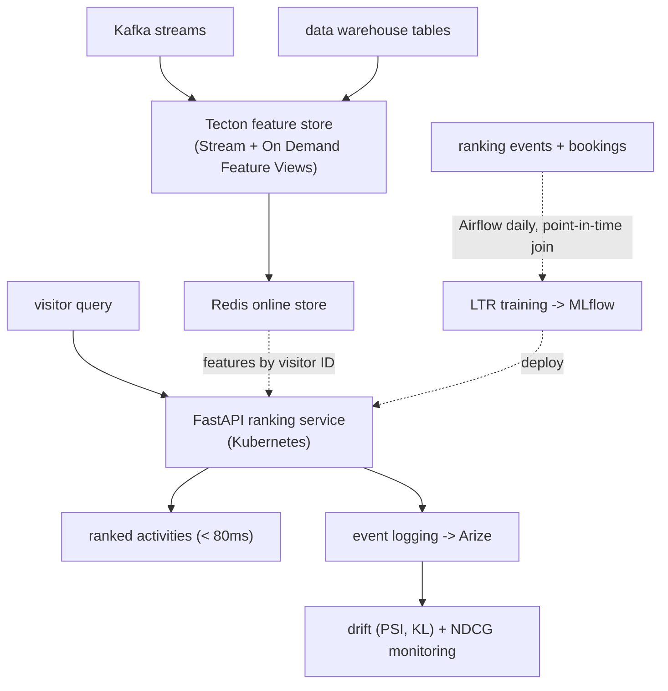

**Interview questions this design invites**
- How does the "discounted ranking impressions" feature correct for position bias, and why discount by rank rather than drop biased data?
- Why split feature computation into Stream Feature Views and On Demand Feature Views instead of one path?
- What does a point-in-time join buy you when assembling the training set from ranking events plus later bookings?
- How do you keep a full ranking under 80ms when feature serving alone is already p99 7ms?
- Why monitor prediction-score drift with PSI and KL divergence rather than only tracking online NDCG?
- How would you A/B test a new ranker when control and treatment models are both pulled from MLflow at request time?

**Tricks and gotchas**
- The 80ms end-to-end budget is dominated by feature fetch plus scoring; Redis as the online store is what keeps p99 feature latency near 7ms.
- Point-in-time correctness on the offline join is load-bearing: bookings happen after the ranking event, so a naive join leaks future labels into features.
- Position enters as a discount factor inside a feature, not as a separate debiasing model, which keeps serving simple but couples the correction to that one feature.

**Common mistakes and how to fix them**
- Training on impressions without discounting position; fix with a position-aware feature like discounted ranking impressions so top-slot exposure is not mistaken for relevance.
- Watching only aggregate NDCG; fix by adding feature-distribution drift (PSI, KL) so a silent score collapse is caught before the business metric moves.
- Joining bookings to ranking events by key alone; fix with point-in-time joins so each feature reflects only what was known at ranking time.

### Company: Booking.com, the engineering behind a high-performance ranking platform ([source](https://medium.com/booking-com-development/the-engineering-behind-booking-coms-ranking-platform-a-system-overview-2fb222003ca6))

Booking.com personalizes property search by scoring candidates on user behavior plus real-time price and availability, under a strict p999 sub-second latency bar. The design centers on multi-stage ranking: ranking is broken into phases, each with its own criteria, so cheaper models prune early and more complex, more personalized models score the survivors. Features are tiered by volatility: static features (location, amenities, room types) recomputed on a schedule, slow-changing features precomputed into a feature store via scheduled workflows, and real-time features (current room prices, availability) computed off a stream. A Feature Collector pulls static features from a distributed cache before inference. Serving spans three Kubernetes clusters with hundreds of pods; a Model Executor chunks each request, invokes the ML platform, and aggregates scores. Ranking is applied twice, once per availability shard and again after merge, with an Experiment Tracker interleaving variants and a static fallback score if inference fails.

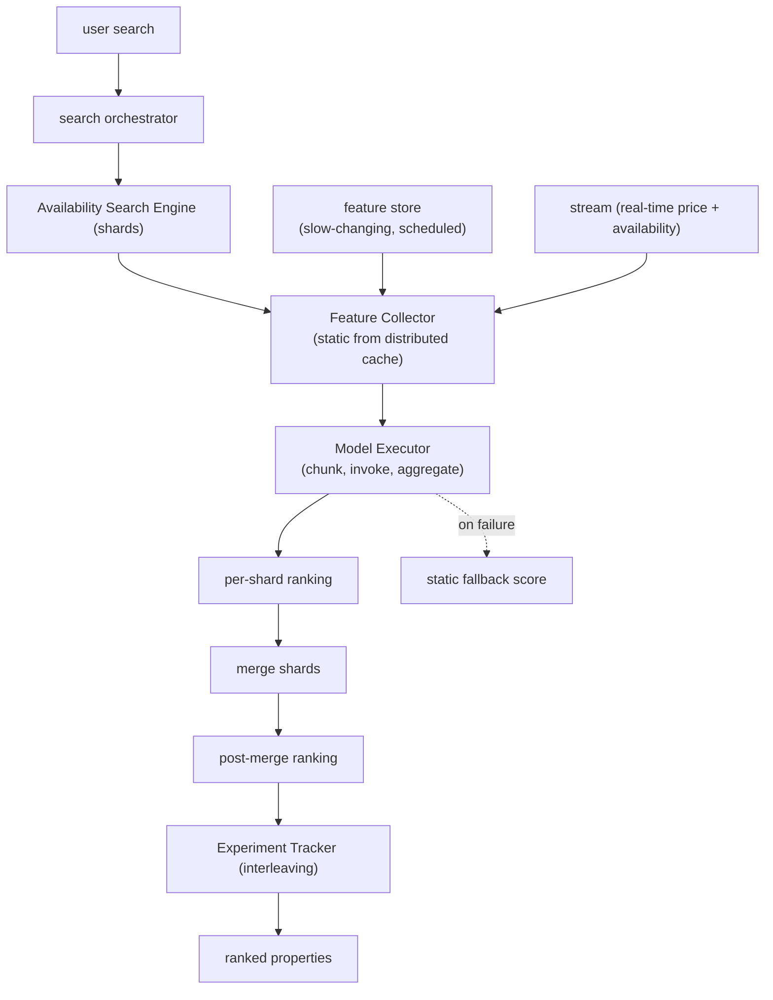

**Interview questions this design invites**
- Why rank twice, once per shard and once after merge, instead of a single global ranking pass?
- How does tiering features into static, slow-changing, and real-time buckets shape the serving path?
- What is the Model Executor's request chunking protecting against at hundreds-of-pods scale?
- Why keep a static fallback score, and what user-facing failure mode does it prevent?
- How does interleaving in the Experiment Tracker compare to a standard A/B split for ranking evaluation?
- What has to be true for a p999 sub-second budget to hold across shards, feature fetch, and two ranking stages?

**Tricks and gotchas**
- Per-shard ranking must be cheap and consistent enough that the post-merge stage is not fed a badly pruned set from any one shard.
- The p999 (not p99) target means the rare slow request drives the design; a distributed cache for static features exists to protect that tail.
- Real-time price and availability can change between retrieval and render, so those features must be computed as late as possible in the stream path.

**Common mistakes and how to fix them**
- Recomputing every feature per request; fix by tiering features by volatility so only real-time price and availability are stream-computed hot.
- Letting an inference failure blank the results page; fix with a deterministic static fallback score so ranking degrades instead of breaking.
- Measuring latency at p99; fix by targeting p999 for a search platform where the slow tail is the felt experience.

### Company: Shopify, improving consumer search intent with real-time ML ([source](https://shopify.engineering/how-shopify-improved-consumer-search-intent-with-real-time-ml))

Shopify moved product search beyond keyword matching to embedding-based semantic search, translating text and image content into high-dimensional vectors so similarity captures intent. The hard part is freshness: when a merchant creates or edits a product, its embedding must update immediately, so the system runs a real-time embedding pipeline on Google Cloud Dataflow, chosen for native streaming, GCP integration, and scale. The pipeline loads the embedding model at startup, listens for merchant content-change events, preprocesses (download, load to memory, resize images), runs inference to produce vectors, postprocesses, and fans out to a data warehouse for offline analysis and to event topics for real-time ingestion. It sustains roughly 2,500 embeddings per second, about 216 million per day, across text and image. Two engineering wins dominate: cutting memory 2.6x by tuning thread concurrency (avoiding a 14 percent cost increase), and batching host-to-device transfers since CPU-GPU transfer is the main bottleneck.

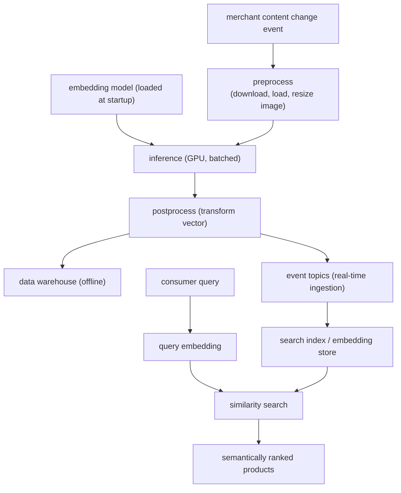

**Interview questions this design invites**
- Why does semantic product search need real-time embedding updates rather than a nightly batch reindex?
- How does batching host-to-device transfers address the CPU-GPU bottleneck, and what is the latency-throughput tradeoff?
- Why fan the embedding output to both a warehouse and event topics instead of one sink?
- What made Dataflow the right streaming substrate here versus a custom consumer service?
- How would you keep text and image embeddings in a comparable space for a single similarity search?
- What breaks if thread concurrency is set too high on a memory-bound embedding worker?

**Tricks and gotchas**
- Loading the embedding model once at worker startup, not per event, is what makes 2,500 embeddings per second affordable.
- CPU-to-GPU transfer, not the matrix multiply, is the usual bottleneck, so batching is about feeding the device, not raw model speed.
- Thread concurrency is a memory dial, not just a throughput dial; the 2.6x memory cut came from lowering it, avoiding a 14 percent cost jump.

**Common mistakes and how to fix them**
- Reindexing embeddings on a batch schedule; fix with an event-driven streaming pipeline so merchant edits appear in search instantly.
- Sending single items to the GPU; fix by batching host-to-device transfers since the transfer dominates the compute.
- Maxing thread concurrency for throughput; fix by tuning it against the memory footprint to avoid a cost blowup on memory-bound workers.

### Company: Spotify, natural language search for podcast episodes ([source](https://engineering.atspotify.com/2022/03/introducing-natural-language-search-for-podcast-episodes/))

Spotify built semantic podcast search on a dual-encoder (two-tower siamese) model with shared weights that maps queries and episodes into one vector space, so a query like "cooking for the holidays" retrieves episodes with no literal term overlap. The base encoder is Universal Sentence Encoder CMLM, picked over vanilla BERT for producing sentence-level embeddings directly and covering 100-plus languages. Training pairs come from four sources: successful Elasticsearch searches, reformulations from failed-then-successful sessions, synthetic queries from a BART model fine-tuned on MS MARCO, and hand-curated semantic queries for popular episodes. Training uses in-batch negatives: for a batch of B positive pairs the other B squared minus B episodes are negatives via a cosine-similarity matrix, with hard-negative mining on top. Offline, episode vectors are precomputed and indexed in Vespa for ANN; online, query vectors are generated on Vertex AI (GPU) with caching, retrieving the top 30 candidates. Crucially, semantic search is an additional retrieval source beside Elasticsearch, and a final reranker fuses both, using cosine similarity as one feature.

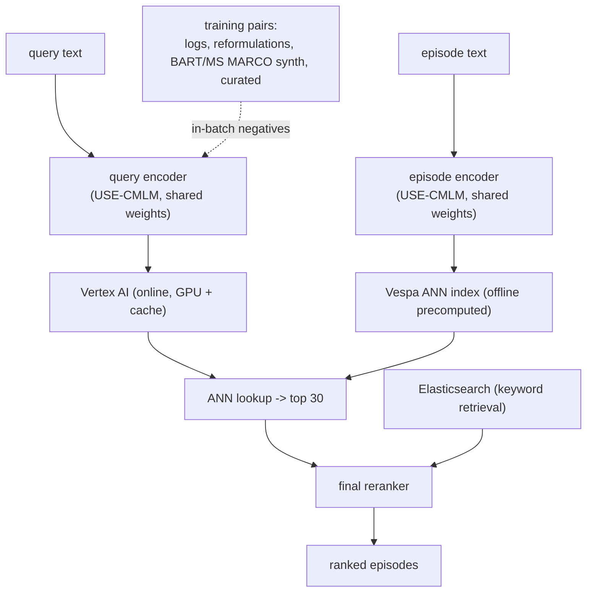

**Interview questions this design invites**
- Why choose Universal Sentence Encoder CMLM over BERT for a sentence-matching retrieval task?
- How do in-batch negatives turn a batch of B positives into roughly B squared training signals, and what are the risks?
- Why generate synthetic queries with BART on MS MARCO instead of relying only on search logs?
- Why keep semantic search as an additional retrieval arm beside Elasticsearch rather than replacing it?
- Why precompute episode vectors offline while computing query vectors online, and what does that asymmetry enable?
- How does using cosine similarity as one reranker feature differ from ranking by cosine similarity alone?

**Tricks and gotchas**
- Shared-weight siamese encoders keep queries and episodes in the same space, but the query side is short and the document side long, so query augmentation (reformulations, synthetics) matters.
- In-batch negatives make batch composition the negative distribution; without hard-negative mining the negatives are too easy and the embedding underfits.
- The keyword arm still catches exact-match and rare-term queries semantic retrieval misses, so fusion beats either arm; "there is no silver bullet."

**Common mistakes and how to fix them**
- Training only on logged successful searches; fix by adding reformulation pairs and BART-synthesized queries so the model learns intent beyond what keyword search already surfaced.
- Replacing keyword search with the semantic tower; fix by keeping both as retrieval sources and fusing in a reranker where cosine is just one feature.
- Recomputing episode embeddings online per query; fix by precomputing them into Vespa ANN and only embedding the query at request time.
_Not reachable: none_

### Google (Cheng et al.): Wide and Deep learning for recommender and ranking systems ([source](https://arxiv.org/abs/1606.07792))

Wide and Deep jointly trains a linear model over crossed categorical features (memorization) with a deep MLP over learned embeddings (generalization), both feeding a single shared output. The wide arm nails specific, frequently co-occurring feature pairs it has seen; the deep arm generalizes to sparse, unseen combinations without hand-built crosses. The two are trained together end to end rather than ensembled after the fact. Deployed on Google Play (over one billion users, over one million apps), it beat both wide-only and deep-only models on online app acquisitions.

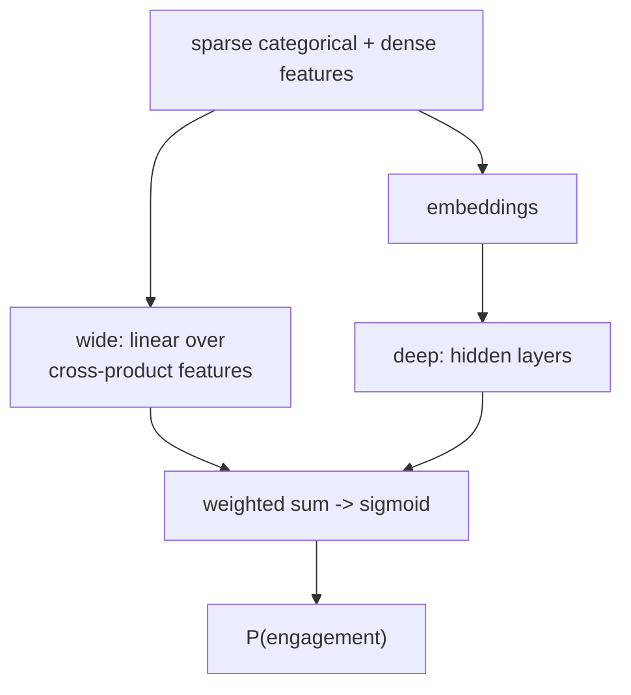

**Interview questions this design invites**
- What is memorization vs generalization here, and which arm supplies each?
- Why train the two arms jointly instead of ensembling two separately trained models?
- Which features go into the wide cross-product transform and which go into the deep embeddings?
- How do you pick cross-product feature templates for the wide side without exploding dimensionality?
- What breaks if you drop the wide arm entirely, and when does that actually happen?
- How does this compare to DCN V2, which learns crosses automatically?

**Tricks and gotchas**
- The wide arm needs hand-engineered cross features; that manual step is the cost of its precision.
- Joint training means gradients from both arms hit the shared output, so learning rates and optimizers may differ per arm (FTRL for wide, AdaGrad for deep in the paper).
- Wide memorization can overfit rare crosses; regularization on the linear arm matters.

**Common mistakes and how to fix them**
- Expecting the deep arm alone to recover exact-match precision; fix by keeping a wide arm for high-value crossed features.
- Feeding the same feature representation to both arms; fix by giving the wide arm sparse crosses and the deep arm dense embeddings.
- Comparing only offline AUC; fix by running the online experiment since the paper's gains showed up in live acquisitions, not offline metrics.

_Not reachable: none_

### Amazon: from structured search to learning-to-rank-and-retrieve with contextual bandits ([source](https://www.amazon.science/blog/from-structured-search-to-learning-to-rank-and-retrieve))

Amazon Music moved past static query-understanding plus structured search to a unified learning-to-rank-and-retrieve system, because a perfect ranker is useless if the right candidate never enters the set. A contextual multi-armed bandit chooses which retrieval strategies (lexical BM25, structured field matching, dense sentence-BERT, sparse SPLADE, and a query-to-entity memory index) to fire per query, balancing exploration and exploitation from logged engagement. The selected strategies' candidates are unioned and reranked by a neural LTR model on click, like, and playback signals. The feedback loop lets the system learn which retrieval strategy suits each query context instead of relying on handcrafted rules.

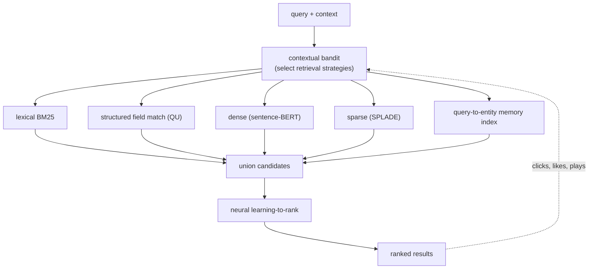

**Interview questions this design invites**
- Why unify retrieval and ranking rather than optimize the ranker alone?
- What does the contextual bandit's reward and regret look like, and where does the signal come from?
- How do you keep exploration from hurting live users while still learning propensities?
- Why keep five retrieval strategies instead of collapsing to one dense encoder?
- How does the query-to-entity memory index differ from the other retrieval arms?
- How do you evaluate a system where retrieval itself is being learned online?

**Tricks and gotchas**
- Bandit exploration must be bounded so it does not degrade head-query experience while probing tail strategies.
- The union step needs dedupe and score normalization across heterogeneous retrieval arms before the ranker sees them.
- Reward attribution is delayed (a play happens after the click), so credit assignment to the chosen strategy is noisy.

**Common mistakes and how to fix them**
- Optimizing the ranker while retrieval stays static; fix by making retrieval-strategy selection itself learnable, which is the whole point here.
- Treating all retrieval arms as interchangeable; fix by letting the bandit condition on query context (intent, language, entity type).
- Trusting raw engagement as unbiased reward; fix by debiasing and controlled exploration to estimate propensities.

_Not reachable: none_

### LinkedIn: multi-stage retrieval plus learning-to-rank for member post search ([source](https://www.linkedin.com/blog/engineering/search/improving-post-search-at-linkedin))

LinkedIn rebuilt post search as a multi-stage funnel: an Interest Query Language layer translates the user query into index-specific Galene queries, then a three-tier ranking pipeline runs over the candidates. A lightweight gradient-boosted-tree first-pass ranker optimizes recall over many documents, a neural second-pass ranker in the federation layer applies deeper real-time intent and affinity signals for precision, and a diversity re-ranker adds variety and trending content. The first-pass ranker is multi-aspect, with independent models for relevance, quality, personalization, engagement, and recency whose scores are combined. Labels come from crowdsourced human annotations plus engagement, and the work reported a 10 percent CTR lift and a 21 percent increase in post-search messaging.

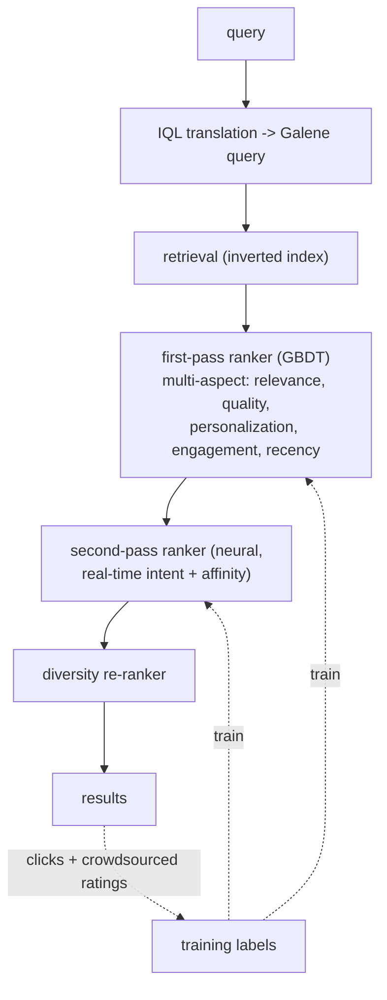

**Interview questions this design invites**
- Why split ranking into a cheap GBDT recall pass and an expensive neural precision pass?
- What is the multi-aspect first-pass ranker buying you versus one monolithic model?
- Why put the neural ranker in the federation layer, and what real-time signals does it need there?
- What role does the diversity re-ranker play, and how do you tune diversity vs relevance?
- How do crowdsourced ratings and click labels get fused without the clicks dominating?
- Why translate to an intermediate query language (IQL) instead of querying the index directly?

**Tricks and gotchas**
- The GBDT first pass must be cheap enough to score many candidates yet good enough not to prune relevant docs before the neural pass sees them.
- Real-time signals in the second pass mean feature freshness and point-in-time correctness matter, or the model leaks the future.
- The IQL translation layer is a maintenance cost; the team itself flagged plans to remove it by merging backends.

**Common mistakes and how to fix them**
- Running one heavy neural model over the whole corpus; fix with a cheap recall-oriented first pass, then a precise second pass.
- Optimizing only relevance and shipping a monotone result page; fix with an explicit diversity re-ranker at the end.
- Ranking on engagement alone; fix by anchoring with crowdsourced human ratings to catch clickbait the clicks reward.

_Not reachable: none_

### Pinterest: SearchSage, a DistilBERT query encoder for search retrieval and ranking ([source](https://medium.com/pinterest-engineering/searchsage-learning-search-query-representations-at-pinterest-654f2bb887fc))

SearchSage is a two-tower model that learns to embed search queries into the existing frozen PinSage Pin-embedding space, so semantic retrieval and relevance features come for free. The query tower is a small multilingual DistilBERT with a linear readout on the CLS token; the candidate tower is the frozen 256-dim fp16 PinSage embeddings indexed in HNSW for ANN retrieval. It trains with a softmax-over-batch-positives loss on (query, engaged Pin) pairs drawn from saves and long (35 second plus) click-throughs, with a 50/50 multitask blend across organic and shopping engagement. In production it drove an 11 percent increase in product long click-throughs and a 42 percent increase in related searches, and is reused across 15 plus systems.

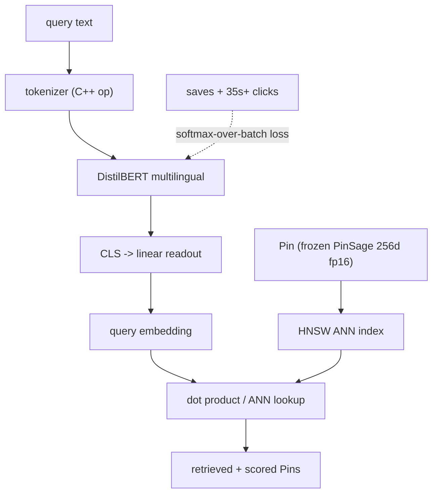

**Interview questions this design invites**
- Why freeze the Pin tower to PinSage instead of learning both towers jointly?
- What does freezing the candidate tower let you precompute, and how does that enable ANN serving?
- Why softmax over in-batch positives, and how does batch composition affect the learned embedding?
- How do saves and long click-throughs define a cleaner positive than a raw click?
- Why cap how often a popular Pin appears as a positive during training?
- How do you blend organic and shopping objectives in one embedding without one swamping the other?

**Tricks and gotchas**
- Freezing the Pin tower means the query tower must move to the fixed embedding space; the linear readout does that alignment.
- In-batch softmax makes batch size and sampling the implicit negative distribution, so outlier-popular Pins are capped to avoid bias.
- Serving needs dynamic batching (5ms windows) and a self-contained artifact bundling tokenization plus inference to hit latency.

**Common mistakes and how to fix them**
- Defining positives as any click; fix by requiring saves or long dwell so the label reflects real satisfaction.
- Letting a few viral Pins dominate positives; fix by capping per-Pin appearance N times per epoch.
- Retraining the whole two-tower when only queries changed; fix by freezing the document side and updating only the query encoder.

_Not reachable: none_

### Instacart: hybrid lexical plus embedding retrieval feeding two-stage ranking ([source](https://tech.instacart.com/optimizing-search-relevance-at-instacart-using-hybrid-retrieval-88cb579b959c))

Instacart searches 1.4B plus items across 1500 plus retailers by running text and semantic retrieval in parallel and merging the results. The lexical arm uses Postgres GIN indexes with a customized term-frequency score (ts_rank) to pull top Kt docs; the semantic arm embeds query and product with a MiniLM-L3-v2 bi-encoder and does FAISS ANN over dot-product scores for top Ke docs. An adaptive-recall mechanism computes query entropy (specificity) and dynamically resizes each arm's recall set per query and retailer. Merging (in development) uses reciprocal rank fusion or a convex combination of lexical and semantic scores before handing the union to downstream ranking; the change gave a 1.7 percent mean-converting-position lift and 1.5 percent lower latency.

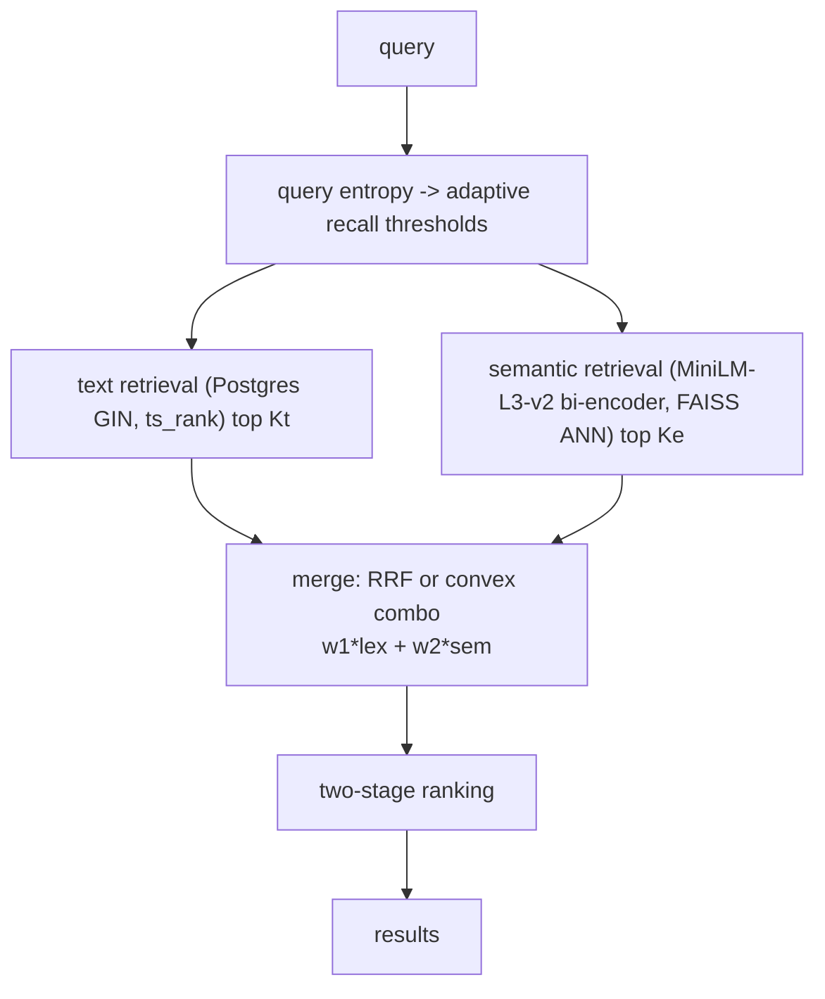

**Interview questions this design invites**
- Why fuse lexical and semantic retrieval instead of choosing one for grocery search?
- What does query entropy measure, and why resize recall sets per query specificity?
- How do reciprocal rank fusion and a convex score combination differ, and when do you prefer each?
- Why a small bi-encoder (MiniLM-L3-v2) rather than a large cross-encoder for retrieval?
- How does a 1500-retailer catalog change the retrieval and merge design?
- Where does conversion (not just click) enter the label and eval?

**Tricks and gotchas**
- Convex combination needs the two arms' scores normalized to a comparable range or one dominates the fused score.
- Adaptive recall on entropy prevents broad queries from over-fetching and tail queries from under-fetching, but the thresholds (M, L, Q) need tuning per retailer.
- Bi-encoder retrieval is fast because product vectors precompute; a cross-encoder would blow the latency budget at retrieval.

**Common mistakes and how to fix them**
- Fixing one recall-set size for all queries; fix with entropy-adaptive thresholds so specificity drives fan-out.
- Merging raw lexical and semantic scores directly; fix with rank-based fusion (RRF) or normalized convex weights.
- Optimizing clicks while conversion is the business goal; fix by putting conversion in labels and the mean-converting-position metric.

_Not reachable: none_

### Instacart: the Intent Engine, LLM-based query understanding for intent and category mapping ([source](https://company.instacart.com/tech-innovation/building-the-intent-engine-how-instacart-is-revamping-query-understanding-with-llms))

Instacart replaced several specialized query-understanding models with a unified LLM backbone that classifies intent, maps queries to the product taxonomy, and generates rewrites, injecting Instacart domain context to handle broad and long-tail queries. Query category classification retrieves top-K converted categories then has the LLM re-rank them with a semantic-similarity guardrail; query rewrites run substitute, broader, and synonym pipelines with chain-of-thought and few-shot prompts. Semantic role labeling uses a teacher-student split: an offline RAG teacher tags frequent head queries and produces training data, and a fine-tuned (LoRA) Llama-3-8B student serves long-tail queries under 300ms on H100s. The extracted concepts feed retrieval, ranking, ads, and filtering; it cut poor-tail-result complaints 50 percent and scroll depth 6 percent.

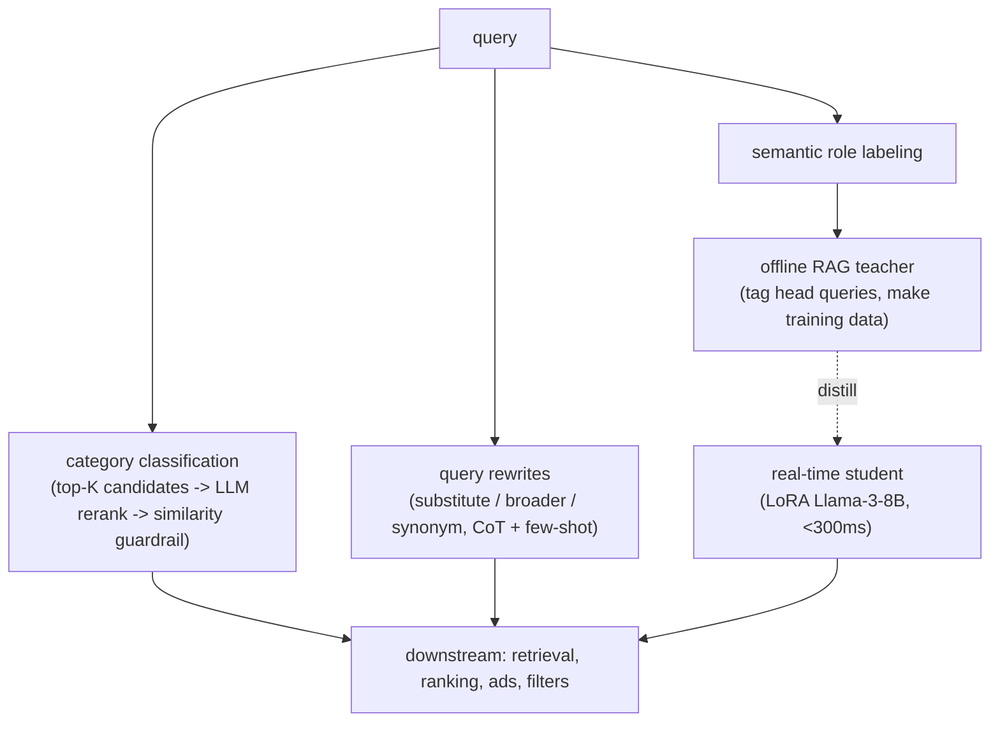

**Interview questions this design invites**
- Why replace many specialized QU models with one LLM backbone, and what do you lose?
- How does the teacher-student split reconcile LLM quality with a sub-300ms tail-query budget?
- Why retrieve top-K categories first and have the LLM only re-rank, rather than generate categories free-form?
- What does the semantic-similarity guardrail protect against in LLM category output?
- How do you build training labels for the student from the offline teacher without amplifying teacher errors?
- Why serve only long-tail queries with the student and cache head queries offline?

**Tricks and gotchas**
- The context-engineering hierarchy (fine-tuning beats RAG beats prompting) means head queries can be cached cheaply while only the tail needs the live fine-tuned model.
- LoRA adapter merging plus H100 batching is what makes an 8B model viable at 300ms; naive serving would miss the budget.
- LLM rewrites can drift semantically, so every pipeline has a post-processing precision filter (95 percent plus coverage, 90 percent plus precision).

**Common mistakes and how to fix them**
- Letting the LLM hallucinate categories or synonyms; fix with retrieval-constrained candidates plus a similarity guardrail.
- Serving one big LLM for every query; fix with a teacher-student split, caching head queries and distilling to a small student.
- Prompting alone for a domain task; fix by climbing the hierarchy to RAG then fine-tuning where accuracy demands it.

_Not reachable: none_

### Yelp: moving business matching from hand-tuned scoring to learning-to-rank ([source](https://engineeringblog.yelp.com/2014/12/learning-to-rank-for-business-matching.html))

Yelp needed to match a semi-structured business description (name, location, phone) to the right database entry and had been hand-tuning weights (how much for address match, is phone a good signal) by trial and error. They reframed it as a pointwise learning-to-rank regression: Elasticsearch retrieves candidate businesses and emits component scores (name TF-IDF, distance, phone match) plus its own ranking signals, and a regression model predicts a relevance score per candidate from those features. Training used a manually labeled gold dataset of past matching requests. F1 rose from 91 to 95 percent, and the learned model stayed stable as the database changed and generalized to new uses like deduplication.

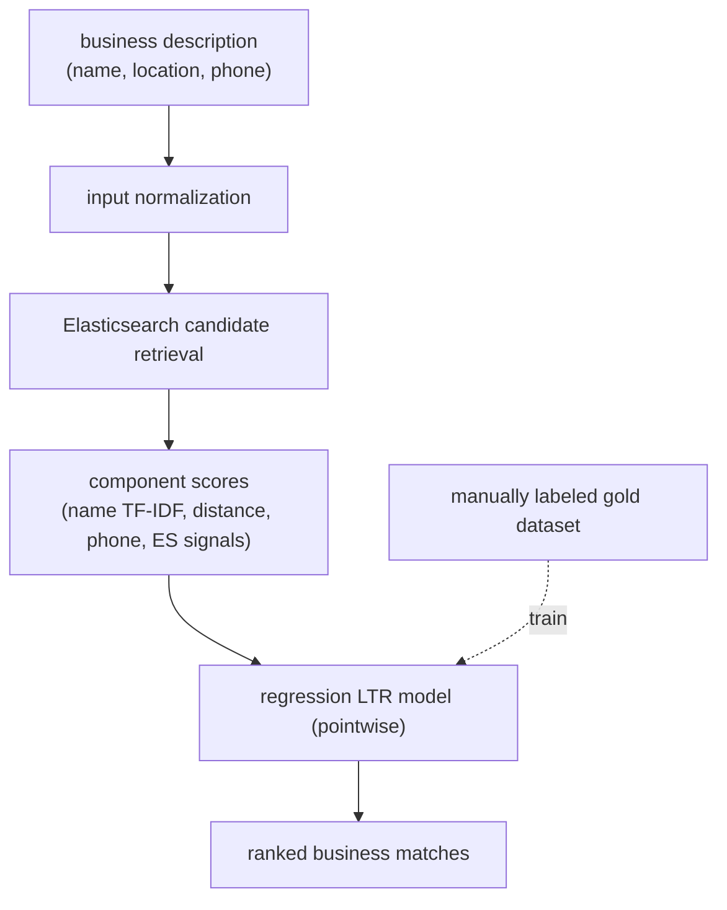

**Interview questions this design invites**
- Why is pointwise regression acceptable here when ranking usually favors pairwise or listwise?
- What features distinguish business matching from generic document ranking?
- How do you build a gold dataset for matching, and what defines a correct match?
- Why keep Elasticsearch's own ranking signals as features rather than replacing them?
- How does a learned model give stability that hand-tuned weights lacked when the database changes?
- How would you extend this matching model to deduplication?

**Tricks and gotchas**
- Pointwise works because the task is essentially match-or-not per candidate, closer to classification than open-ended list ranking.
- The features are the product: name TF-IDF, geo distance, and phone match carry the signal, so feature quality dominates model choice.
- Reusing Elasticsearch component scores as features avoids re-implementing retrieval scoring inside the ranker.

**Common mistakes and how to fix them**
- Hand-tuning score weights forever; fix by learning them from a labeled gold set, which is exactly the migration here.
- Judging matching only by recall; fix by tracking precision, recall, and F1 together against the gold dataset.
- Overfitting to the current database snapshot; fix by using stable structural features so the model survives DB churn.

_Not reachable: none_

### Wayfair: WANDS, a public human-judged e-commerce product-search relevance dataset ([source](https://www.aboutwayfair.com/careers/tech-blog/wayfair-releases-wands-the-largest-and-richest-publicly-available-dataset-for-e-commerce-product-search-relevance))

WANDS is a discriminative, reusable, human-labeled dataset for evaluating e-commerce search relevance, built because live catalogs of millions of products make ad-hoc relevance eval unreliable. It contains 480 queries sampled from real search logs, 42,994 products, and roughly 233,000 query-product relevance labels, each judged by three independent annotators with agreement measured by Cohen's Kappa and overlap-percentage-agreement. Products carry rich metadata (title, description, classes, category hierarchy, attributes like size and color, ratings, review counts). The intended use is discriminating between search models with position-aware metrics like NDCG, and its construction deliberately mines candidates from multiple algorithms to reduce unjudged-but-relevant products.

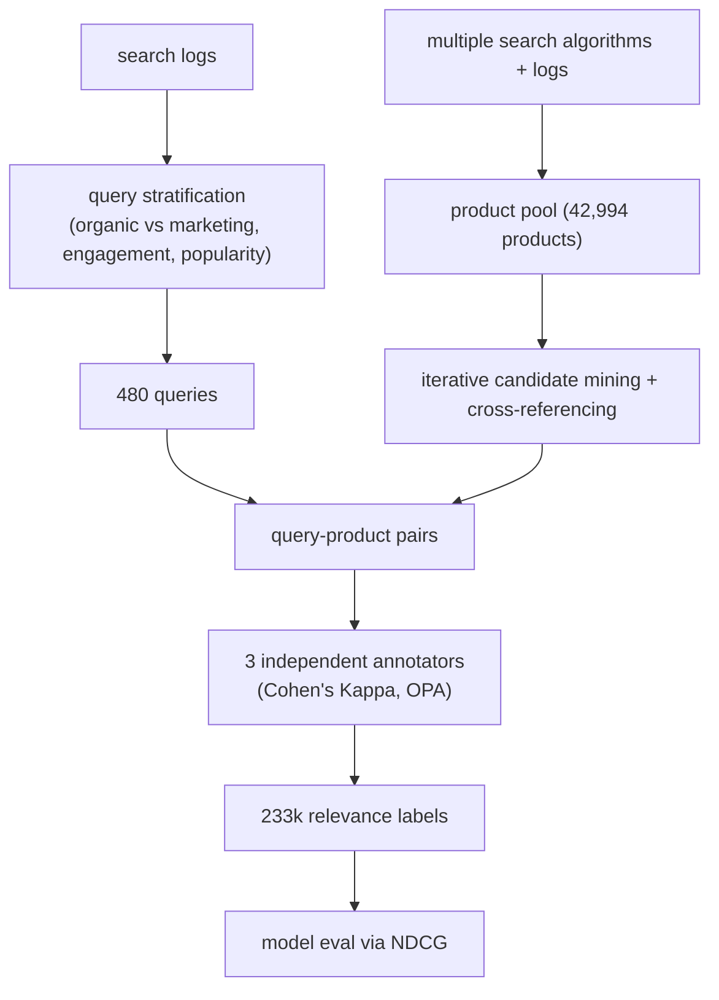

**Interview questions this design invites**
- Why is a fixed human-judged dataset needed when you already log millions of clicks?
- How do three annotators plus Cohen's Kappa give you trustworthy graded labels?
- Why stratify query sampling across organic vs marketing and engagement levels?
- What is the unjudged-relevant-product problem, and how does candidate mining reduce it?
- Why evaluate with NDCG rather than precision at K on this dataset?
- How would you use WANDS as an offline pre-gate alongside an online A/B test?

**Tricks and gotchas**
- Mining candidates from multiple algorithms matters, or the label pool is biased toward whatever system generated it and misses relevant products.
- Three-way annotation with Kappa surfaces borderline query-product pairs that a single rater would silently mislabel.
- Rich product metadata lets the dataset test models that use attributes, not just title text matching.

**Common mistakes and how to fix them**
- Evaluating relevance on click logs alone; fix by anchoring to a human-judged set like WANDS that is not position-biased.
- Pooling candidates from one retrieval system; fix by mining from several so relevant docs are not left unjudged and scored as irrelevant.
- Using a flat precision metric; fix by using graded NDCG that rewards putting the most relevant products at the top.

_Not reachable: none_

_Not reachable: none_
