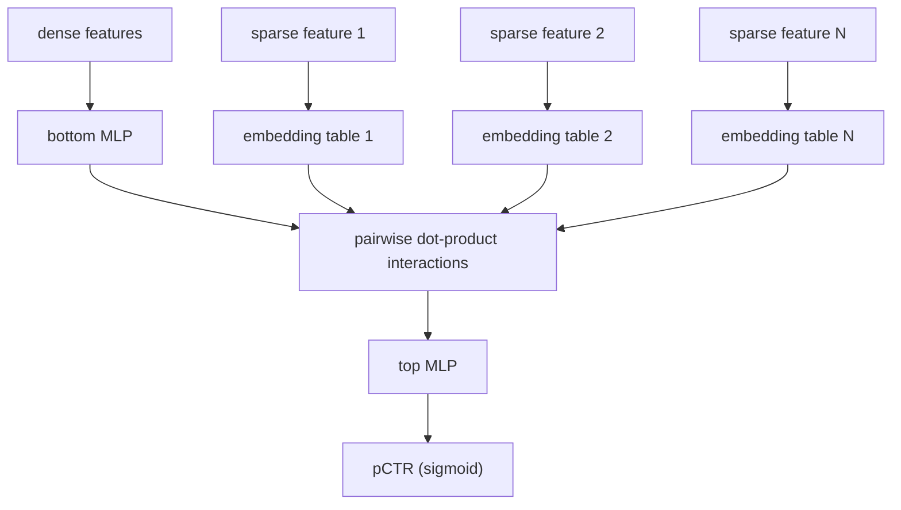
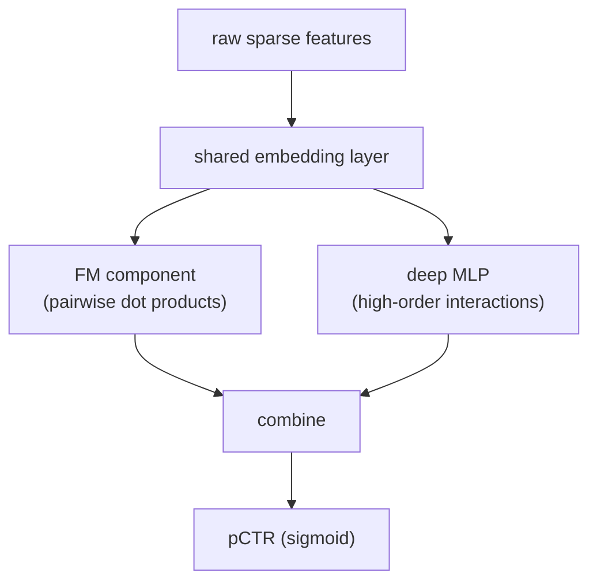
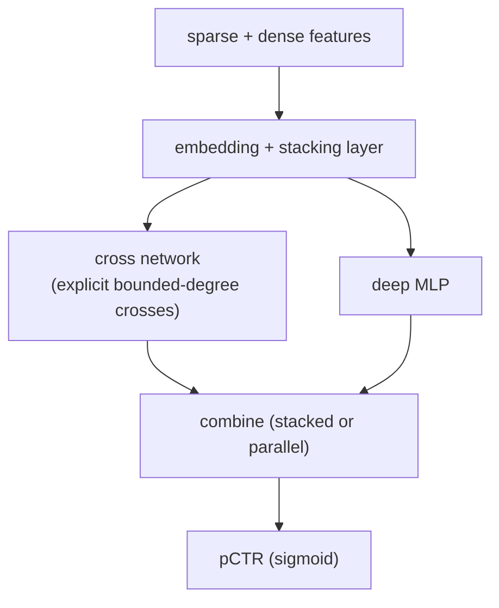
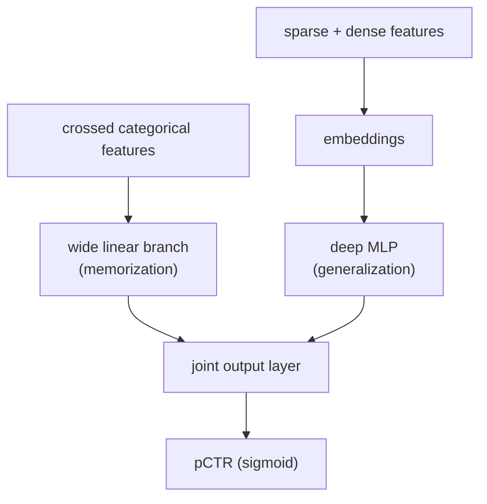
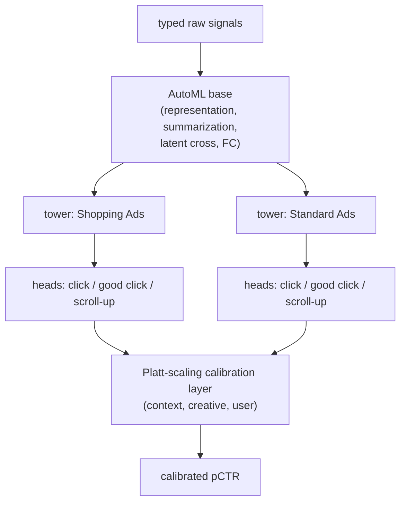
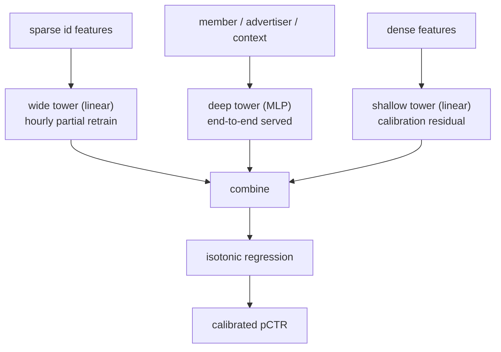
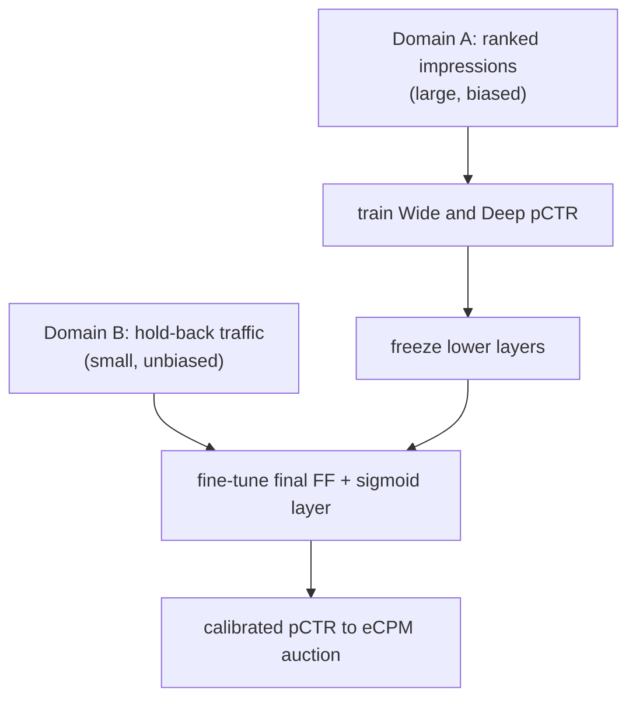
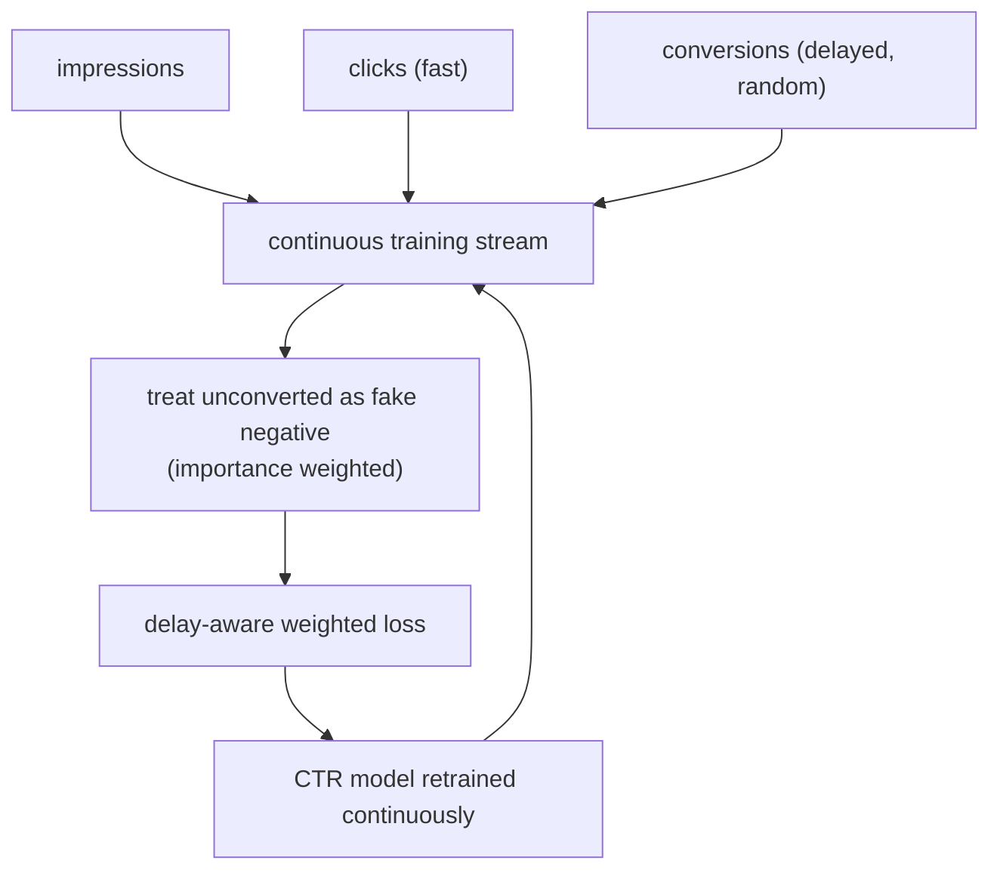
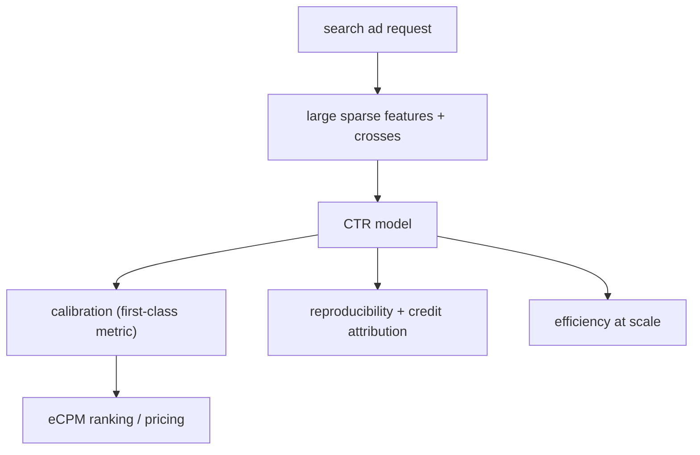

## Ads CTR prediction

### Meta: DLRM, the canonical CTR architecture with explicit dot-product interactions ([source](https://arxiv.org/abs/1906.00091))

DLRM handles the mix of categorical and continuous inputs that recommendation and CTR tasks demand: sparse categorical features each get their own embedding table, dense features pass through a bottom MLP, and the two are combined through explicit pairwise dot-product interactions before a top MLP produces the score. The design's headline systems contribution is a parallelization scheme that puts model parallelism on the embedding tables (to survive their memory footprint) and data parallelism on the fully connected layers (to scale compute). Meta released it in PyTorch and Caffe2 as a benchmark for algorithm and system co-design, tested on the Big Basin AI platform. It is the reference structure to be able to draw: embed the sparse stuff, interact explicitly, then MLP.

**Interview questions this design invites**
- Why compute explicit pairwise dot products instead of concatenating embeddings into an MLP and hoping it learns interactions?
- Where do the parameters actually live, and why does that force model parallelism on the embedding tables?
- How do you bound embedding table size when new ad and user ids appear constantly?
- Why is the bottom MLP applied only to dense features and not the sparse embeddings?
- How would you keep the dot-product interaction stage inside a tens-of-milliseconds auction budget?
- What loss trains this, and does it give you a calibrated probability out of the box?

**Tricks and gotchas**
- The MLPs are small; the embedding tables run to billions of parameters, so memory and sharding dominate the systems design, not FLOPs.
- The interaction must sit after the embedding lookups and before the top MLP; wiring it earlier or later changes what the model can express.
- Dense and sparse paths are only merged at the interaction stage, so the bottom MLP output is treated as one more vector to interact.
- Feature hashing into fixed-size tables trades controlled collisions for a bounded footprint and graceful handling of unseen ids.

**Common mistakes and how to fix them**
- Assuming the MLP is where the model capacity lives: it is the embeddings, so profile and shard those first.
- Concatenating all embeddings into one MLP and calling it DLRM: the defining feature is the explicit pairwise dot product, keep it.
- Pre-allocating a row per id: the id space is open-ended, so hash into a fixed table and accept collisions.
- Treating raw log-loss output as trustworthy for pricing without checking calibration under negative sampling and class imbalance.

### Guo et al.: DeepFM, factorization machine and deep MLP in parallel over shared embeddings ([source](https://arxiv.org/abs/1703.04247))

DeepFM couples a factorization-machine component that captures low-order (pairwise) feature interactions with a deep MLP that captures high-order interactions, and crucially both branches read the same embedding layer. That shared input is the pitch against Wide and Deep: there is no need for hand-crafted feature engineering on a separate wide side, the model learns low- and high-order interactions jointly from raw features. Experiments on benchmark and real commercial data show it outperforming prior CTR models. It is the conceptual bridge from factorization machines to embedding-based deep CTR models.

**Interview questions this design invites**
- Why share embeddings between the FM and deep branches instead of learning two separate sets?
- What does the FM component capture that a plain MLP over concatenated embeddings struggles with on sparse data?
- How does DeepFM remove the manual feature-engineering step that Wide and Deep requires?
- What is the difference between low-order and high-order feature interactions, and why do you want both?
- How would you extend DeepFM to also predict conversion, not just click?
- Where does calibration enter, given the FM plus deep output is trained with log loss?

**Tricks and gotchas**
- The shared embedding is the whole point; giving each branch its own tables loses the parameter efficiency and the joint signal.
- FM gives you all pairwise interactions cheaply via latent vectors, which is exactly what sparse crosses need and a linear model cannot do.
- The deep branch generalizes to unseen crosses; the FM branch nails the explicit pairwise ones, so they are complementary, not redundant.
- Raw features go straight in, so a lot of the value is in not needing a feature-cross pipeline to maintain.

**Common mistakes and how to fix them**
- Duplicating embeddings per branch: share one table to cut parameters and align gradients.
- Expecting the MLP alone to recover pairwise crosses on very sparse data: keep the FM branch to model them explicitly.
- Confusing DeepFM with Wide and Deep: the wide side here is an FM over shared embeddings, not a linear model over hand-made crosses.
- Ignoring calibration because AUC looks good: log loss and reliability curves still matter before the score prices an auction.

### Wang et al.: DCN V2, explicit bounded-degree feature crosses at web scale ([source](https://arxiv.org/abs/2008.13535))

DCN V2 rebuilds the Deep and Cross Network to be expressive enough for web-scale ranking over billions of examples while staying cost efficient. The cross network stacks cross layers that produce explicit bounded-degree feature interactions, run either stacked with or in parallel to a deep MLP, and a mixture-of-low-rank variant cuts the cross-layer parameter cost without losing predictive power. Google reports it beating state-of-the-art baselines on public benchmarks and delivering offline accuracy and online business gains across many web-scale learning-to-rank systems. It is modular by design, meant to drop in as a building block in production recommenders.

**Interview questions this design invites**
- What does a cross layer compute, and what does bounded-degree mean for the interactions it can represent?
- When would you stack the cross network before the MLP versus run them in parallel?
- How does the mixture-of-low-rank trick reduce cost, and what does it trade away?
- Why are explicit crosses worth the complexity when a deep MLP can approximate interactions?
- How do you keep a stack of cross layers inside a tight serving latency budget?
- How does DCN V2 compare to DeepFM and DLRM in how interactions are modeled?

**Tricks and gotchas**
- The cross layer's degree grows with depth, so you control interaction order by how many cross layers you stack.
- Stacked and parallel arrangements give different capacity; pick based on offline eval, not aesthetics.
- Low-rank decomposition of the cross weight is what makes web-scale deployment affordable; it is an efficiency lever, not free accuracy.
- It is designed as reusable blocks, so you can mix cross layers into an existing embedding-plus-MLP stack incrementally.

**Common mistakes and how to fix them**
- Adding more cross layers blindly to chase higher-order crosses: watch latency and parameter cost, and consider the low-rank variant.
- Treating cross layers and MLP as interchangeable: they capture different interaction structure, keep both.
- Skipping the low-rank option at scale and then hitting a cost wall: budget for it up front.
- Benchmarking only offline AUC: the paper's real signal is online business metrics, so gate on an A/B test.

### Cheng et al.: Wide and Deep, memorization plus generalization for Google Play ([source](https://arxiv.org/abs/1606.07792))

Wide and Deep jointly trains a wide linear branch and a deep embedding-plus-MLP branch so one model both memorizes and generalizes. The wide side uses cross-product feature transformations over sparse categorical features to memorize frequent specific combinations; the deep side embeds sparse features into low-dimensional dense vectors and generalizes to unseen crosses with less feature engineering. On Google Play, serving over a billion users and a million apps, the joint model significantly increased app acquisitions versus wide-only or deep-only, because the wide side alone over-memorizes and the deep side alone over-generalizes on sparse interactions. The authors open-sourced a TensorFlow implementation, and it became the CTR baseline the later deep models are measured against.

**Interview questions this design invites**
- What does the wide branch memorize that the deep branch cannot, and vice versa?
- Why train the two branches jointly instead of ensembling two separately trained models?
- Which features belong in the wide cross-product transformations and which belong in the deep embeddings?
- How does the deep branch help with cold-start crosses the wide branch has never seen?
- What is the failure mode of a deep-only model on sparse user-item interactions?
- How would you keep this model calibrated enough to feed an auction?

**Tricks and gotchas**
- The wide branch still needs hand-crafted cross-product features; that engineering is what DeepFM later removes.
- Joint training lets the two branches specialize, so the wide side can stay small and targeted at memorization.
- Deep embeddings generalize but can recommend irrelevant items when interactions are sparse; the wide side reins that in.
- It is a strong, cheap baseline, so reach for it before a heavier DLRM or DCN unless the eval justifies the jump.

**Common mistakes and how to fix them**
- Dumping every feature into both branches: put memorization-worthy crosses in the wide side, generalizable ids in the deep side.
- Replacing joint training with a post-hoc ensemble: you lose the shared optimization that balances the two behaviors.
- Assuming deep alone dominates: on sparse crosses it over-generalizes, so keep the wide memorization path.
- Forgetting feature engineering on the wide side and then blaming the model for missing obvious crosses.

### Pinterest: AutoML shared-bottom multi-tower multi-task ads models with a Platt-scaling calibration layer ([source](https://medium.com/pinterest-engineering/how-we-use-automl-multi-task-learning-and-multi-tower-models-for-pinterest-ads-db966c3dc99e))

Pinterest's AutoML framework automates feature transforms by typing every raw signal (continuous, one-hot, indexed, hashed, dense vector) and applying rules, then runs a four-layer stack: representation, summarization into learned embeddings, a latent-cross multiplicative interaction layer, and fully connected layers. To serve both Shopping and Standard Ads without one distribution degrading the other, they use a shared-bottom multi-tower design: a common AutoML base feeds separate per-ad-type MLP towers, with examples masked to the tower that owns them. Multiple engagement objectives (click, good click, scroll-up) are separate heads on the shared base. The calibration win came from replacing a wide-and-deep LR calibrator with a lightweight Platt-scaling layer over contextual, creative, and user signals, cutting day-to-day calibration error by as much as 80 percent and enabling hourly recalibration on top of daily DNN retraining.

**Interview questions this design invites**
- Why did merging Shopping and Standard datasets into one tower degrade performance, and how does multi-tower fix it?
- How does masking route each example to the right tower while still sharing the base?
- Why put calibration in a separate lightweight layer instead of retraining the DNN more often?
- How can a Platt-scaling layer recalibrate hourly when the DNN only retrains daily?
- What are the multi-task heads sharing, and when does multi-task help versus hurt?
- How would you monitor calibration per ad type and per placement rather than globally?

**Tricks and gotchas**
- The lightweight calibrator decouples calibration cadence from model cadence: recalibrate hourly, retrain the heavy net daily.
- Shared-bottom multi-tower isolates distinct ad-type distributions while still sharing learned representations.
- The latent-cross layer is where AutoML injects multiplicative feature interactions, not the FC layers.
- Training the calibrator on self-generated examples helps mitigate selection bias in the calibration data.

**Common mistakes and how to fix them**
- Forcing heterogeneous ad types through a single tower: split into towers with a shared base when distributions clash.
- Tying calibration to the slow retrain cadence: separate it so drift can be corrected between retrains.
- Reporting one global calibration number: slice by ad, placement, and segment, since the auction reads the slices.
- Skipping automated feature typing and hand-building transforms that AutoML can derive from signal statistics.

### LinkedIn: three-tower DNN replacing GLMix, with a shallow calibration tower for exposure bias ([source](https://www.linkedin.com/blog/engineering/machine-learning/challenges-and-practical-lessons-from-building-a-deep-learning-b))

LinkedIn replaced its GLMix CTR baseline with a three-tower DNN: a deep tower (MLP over member, advertiser, and context features as dense embeddings, served end to end for full cross-feature interaction), a wide tower (linear over sparse id features, partially retrained hourly via GDMix and Lambda Learner to memorize fresh performance), and a shallow tower (linear over dense features acting like a residual block to fix calibration). The initial deep model over-predicted clicks by 40 percent; the shallow tower brought that to 10 percent, and isotonic regression alone could not close the gap because of exposure bias, offline data reflects the old model's scoring, not the deep model's distribution. Their fix was to ramp the deep model to production and train the calibration model only on its own generated data, eventually reaching zero over-prediction, for a reported plus 8.5 percent CTR.

**Interview questions this design invites**
- What does each of the three towers contribute, and why not fold them into one MLP?
- Why can the wide tower retrain hourly while the deep tower stays frozen between full retrains?
- What is exposure bias, and why does it break isotonic-regression calibration trained on old-model logs?
- How does a linear shallow tower act as a residual block that corrects over-prediction?
- How did they get calibration data from the new model's distribution before fully launching it?
- How would you monitor a 40 percent over-prediction in production before it burns budget?

**Tricks and gotchas**
- Isotonic regression on offline logs fails here because the logs come from the baseline policy, not the deep model.
- The cure for exposure bias was operational: ramp the model and calibrate on its own served traffic.
- Hourly partial retraining of just the wide tower keeps id-level freshness without retraining the whole net.
- Serving the deep tower end to end (not offline embeddings) is what enables full member-ad-context interaction.

**Common mistakes and how to fix them**
- Calibrating with a model trained only on the previous policy's logs: gather calibration data from the new model's own exposures.
- Assuming a strong AUC deep model is priced-ready: check for systematic over-prediction and add a calibration path.
- Retraining the entire network to refresh id features: partially retrain only the wide tower on a tight cadence.
- Relying on isotonic regression alone against distribution shift: pair it with a learned calibration tower.

### Instacart: calibrating a Wide and Deep CTR model with transfer learning to unbiased hold-back traffic ([source](https://tech.instacart.com/calibrating-ctr-prediction-with-transfer-learning-in-instacart-ads-3ec88fa97525))

Instacart's sponsored-products pCTR uses a Wide and Deep model whose probability feeds eCPM in a generalized second-price auction, so calibration matters directly, and a high-AUC net is not automatically well calibrated. Their two-stage transfer-learning fix trains first on ranked-impression data (large but biased by the prior model's selection and popularity effects), then fine-tunes on a smaller unbiased hold-back-traffic dataset by freezing the lower layers and retraining only the final feed-forward and sigmoid output layers. This aligned predicted CTR with observed click frequency better than Platt scaling or isotonic regression: best calibration score near 1.0, lowest expected calibration error, and preserved AUC, with gains from as little as one to two days of hold-back data. Reusing the same model instead of a separate calibrator cut operational complexity.

**Interview questions this design invites**
- Why is a small unbiased hold-back set better for calibration than the large biased impression log?
- Why freeze the lower layers and fine-tune only the output layers instead of retraining end to end?
- How does transfer-learning calibration beat Platt scaling and isotonic regression on ECE while keeping AUC?
- What selection and popularity biases live in ranked-impression data, and where do they come from?
- How little hold-back data can you get away with, and what limits that?
- Why does reusing one model reduce operational complexity versus a separate calibrator?

**Tricks and gotchas**
- The hold-back traffic is a randomized slice, so it carries the unbiased label distribution the biased logs lack.
- Freezing lower layers preserves learned representations while letting the output head re-fit to true rates.
- Reusing the same network for calibration avoids maintaining and syncing a second calibration model.
- Even one to two days of hold-back data moved calibration, so the unbiased slice is high value per example.

**Common mistakes and how to fix them**
- Calibrating on the biased ranked-impression log: fine-tune on unbiased hold-back traffic instead.
- Fine-tuning the whole network on the small set and overfitting: freeze lower layers, retrain only the head.
- Judging calibration by AUC: track calibration score and expected calibration error explicitly.
- Bolting on a separate Platt or isotonic model when reusing the same net is simpler and calibrated better here.

### Twitter: fake-negative weighted loss for delayed feedback in continuous CTR training ([source](https://arxiv.org/abs/1907.06558))

Twitter's setting is continuous training where feature and CTR distributions shift over time, so models must retrain on fresh data, but positive labels (clicks or conversions) arrive with random delay. Treating not-yet-labeled samples as negatives underestimates CTR and hurts user experience, so they study loss functions that account for label delay rather than baking in false negatives. The paper evaluates five losses (three new to this application) across shallow and deep nets on public and proprietary data, weighing production engineering cost. On 668 million proprietary examples they report a 3 percent relative cross-entropy gain, and online a 55 percent lift in revenue per thousand requests versus naive log loss, validating delay-aware losses under real continuous training.

**Interview questions this design invites**
- Why does labeling a not-yet-converted click as negative bias CTR downward?
- What is a fake negative, and how does importance weighting correct for it?
- Why does continuous training make delayed feedback worse than a static batch setup?
- How would you pick among several delay-aware losses given production engineering cost?
- Why report both offline relative cross-entropy and online revenue per thousand requests?
- How does delay-aware training interact with keeping the probability calibrated?

**Tricks and gotchas**
- A sample can enter as a negative and later flip positive when its delayed label lands, so the loss must anticipate that.
- Importance weighting rebalances toward what an unbiased label distribution would look like.
- The choice of loss is partly an engineering-cost decision, not only an accuracy one, at production scale.
- Offline cross-entropy gains and online revenue gains can differ in magnitude, so measure both.

**Common mistakes and how to fix them**
- Counting every unlabeled impression as a confirmed negative: use a fake-negative weighted or delay-aware loss.
- Waiting for all labels before training and going stale: train continuously and correct for the missing tail.
- Optimizing only offline log loss: validate the revenue impact online, where the 55 percent RPMq gain showed up.
- Ignoring that fast recalibration is needed as delay-corrected labels shift the score distribution.

### Google: On the Factory Floor, ML engineering for industrial-scale ads CTR ([source](https://arxiv.org/abs/2209.05310))

Google frames ad CTR prediction as a central problem in its search-ads system and presents a case study of the engineering that surrounds the model, not just its accuracy. The paper argues that industrial deployment forces attention to efficiency, reproducibility, calibration, and credit attribution alongside raw predictive quality, and shows how new ML methods are actually evaluated and made useful in a large-scale setting. Calibration is treated as a first-class metric, consistent with the auction reading the absolute probability. It reads as the practitioner's checklist for what an interview answer skips: reproducibility, calibration discipline, and cost at scale on a large sparse CTR model.

**Interview questions this design invites**
- Beyond accuracy, which engineering properties does industrial CTR deployment force you to design for?
- Why is calibration a first-class metric in a search-ads CTR system rather than an afterthought?
- What does reproducibility mean for a continuously retrained large sparse model, and why is it hard?
- What is credit attribution in ads, and how does it shape the training labels?
- How do you evaluate whether a new ML method is worth deploying at this scale?
- Where do efficiency constraints trade off against accuracy in a large sparse model?

**Tricks and gotchas**
- The hard problems at scale are often efficiency, reproducibility, and calibration, not the last point of AUC.
- Calibration is monitored as a primary production metric because the auction prices off the absolute value.
- New research methods have to justify their engineering and serving cost, not just offline wins.
- Reproducibility on a continuously updated sparse model is a genuine engineering challenge, not a given.

**Common mistakes and how to fix them**
- Optimizing accuracy in isolation: budget equally for efficiency, calibration, and reproducibility.
- Treating calibration as a one-time post-processing step: monitor it continuously as a first-class metric.
- Adopting a new method on offline gains alone: weigh its serving cost and reproducibility before shipping.
- Ignoring credit attribution and letting mislabeled outcomes quietly corrupt training.

_Not reachable: Criteo (Modeling delayed feedback in display advertising, bibliographic metadata only); Facebook (Practical Lessons from Predicting Clicks on Ads, no direct URL in the source)_
