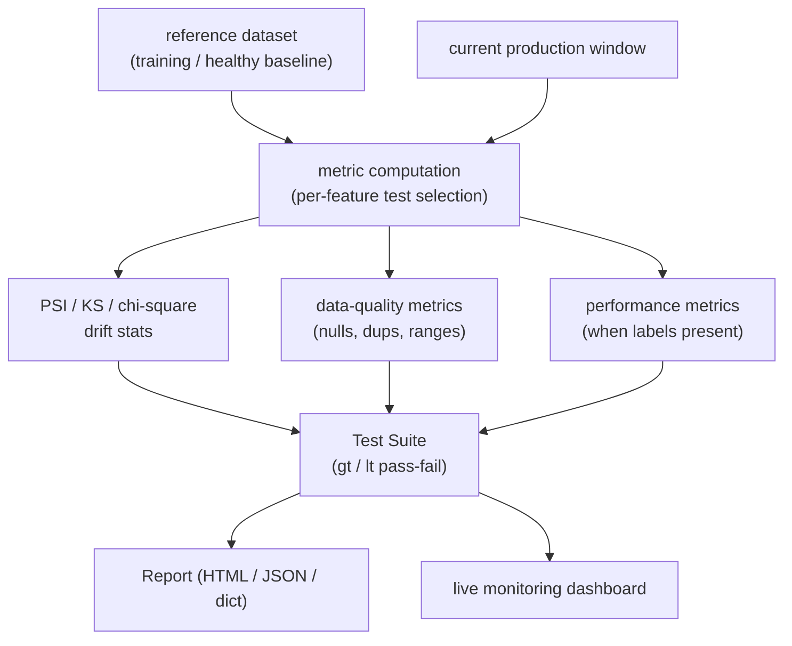
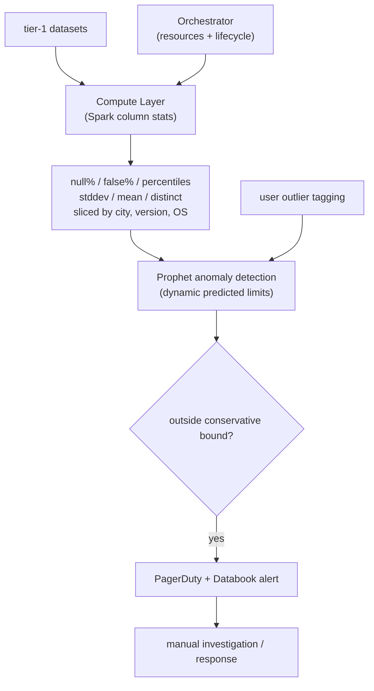
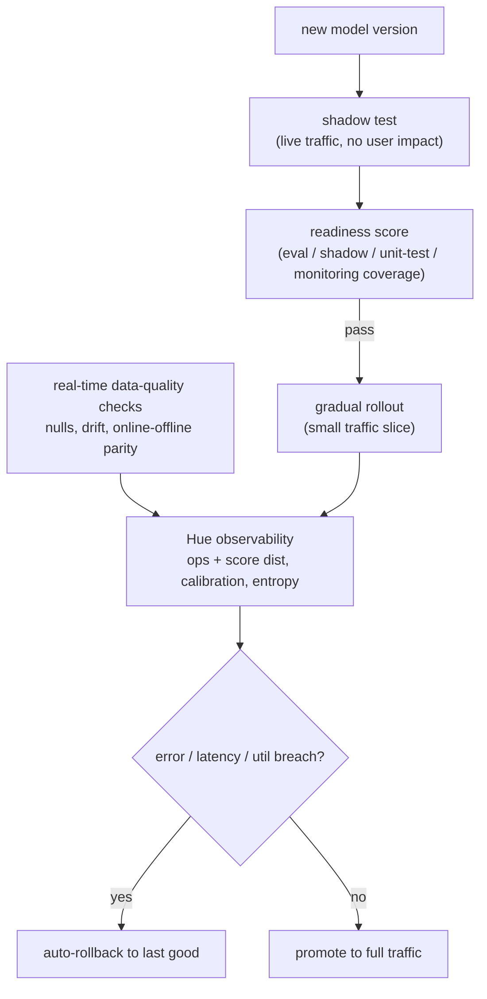
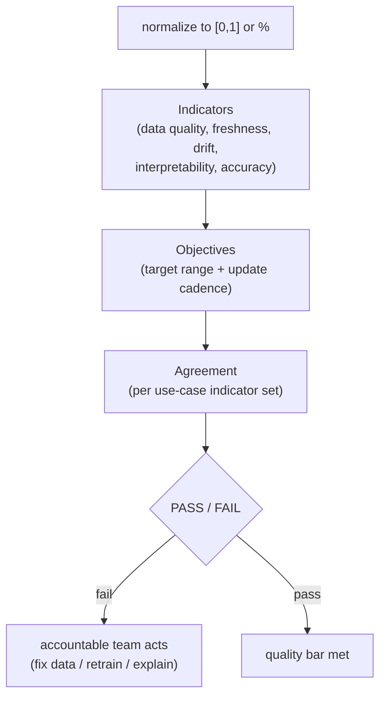
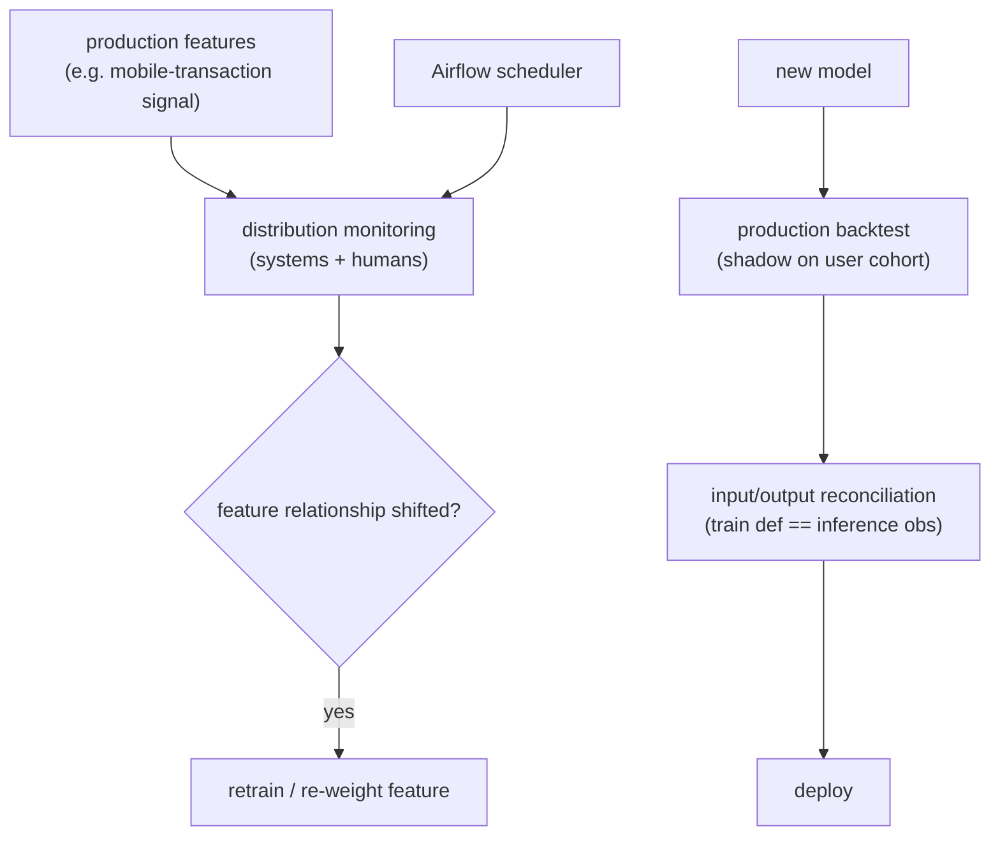
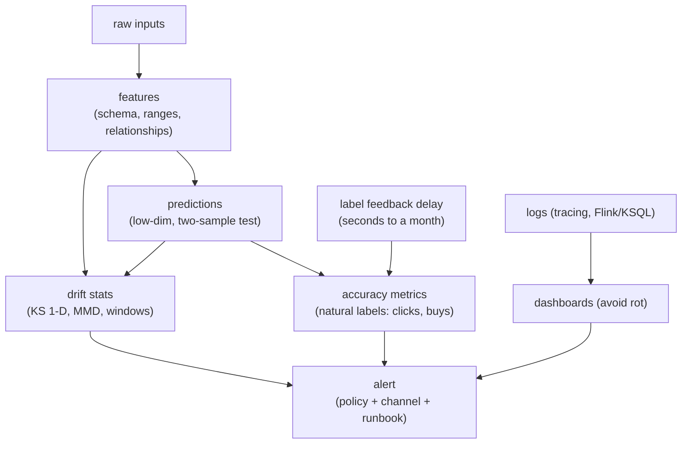

## ML monitoring and drift

### Evidently AI: open-source ML and LLM observability framework ([source](https://github.com/evidentlyai/evidently))

Evidently is an open-source library that evaluates, tests, and monitors ML and LLM systems on tabular and generative tasks. Its drift detection compares a current window against a reference using PSI, the Kolmogorov-Smirnov test, chi-square, and 20+ other distance and statistical tests, picking the method per feature type. Results surface as Reports (100+ built-in metrics for data quality, classification and regression performance, and text descriptors) or Test Suites that add explicit pass/fail conditions. The same metrics run offline for experiments and feed a live self-hosted or cloud monitoring dashboard, and custom metrics plug in via a Python interface.

**Interview questions this design invites**
- How do you choose between PSI, KS, and chi-square for a given feature?
- Where does the reference distribution come from, and when do you refresh it?
- How do Reports differ from Test Suites, and when would you gate a pipeline on a Test Suite?
- How do you turn a per-run Report into continuous monitoring over a stream of windows?
- What thresholds make a drift test pass or fail, and how do you set them from history?
- How would you extend the 100+ metrics with a domain-specific custom metric?

**Tricks and gotchas**
- Per-feature test selection matters: KS suits continuous features, chi-square suits categorical; a one-size test misfires.
- Reports are point-in-time; naive daily runs against a stale reference will flag benign seasonal movement.
- Drift stats are label-free, so a green data-quality run plus drift can still precede a real performance drop.
- PSI and KS answer "did it move," not "does it matter"; a drifted feature the model barely uses is noise.

**Common mistakes and how to fix them**
- Treating any detected drift as actionable: add pass/fail thresholds calibrated from historical variation, not defaults.
- Comparing against the original training set forever: periodically re-anchor the reference to a recent healthy window.
- Monitoring aggregate only: run the tests per segment so a single-cohort regression is not averaged away.
- Skipping data-quality checks: run nulls/schema/range first so a pipeline bug is not misread as distribution drift.

### Uber: D3, an automated data-drift detection system ([source](https://www.uber.com/blog/d3-an-automated-system-to-detect-data-drifts/))

D3 (Dataset Drift Detector) watches over 1,000 tier-1 datasets with 100,000+ monitors. A Spark-based Compute Layer generates column-level statistics (null percentage, false percentage, P50/P75/P99 percentiles, standard deviation, mean, distinct count), sliced by dimensions like city_id, app version, and device OS, on the columns that offline usage shows are important. A Prophet time-series model predicts the expected range for each monitor and flags values outside conservative bounds, with user outlier-tagging feedback to cut false positives. Alerts route through PagerDuty and Databook; query optimization dropped from 200+ to 8 queries per dataset (a 100x resource cut, $1.50 to $0.01), and time-to-detect improved 20x, from 45 days to 2, at 95.23% accuracy.

**Interview questions this design invites**
- Why Prophet for thresholds instead of static bounds or a moving average?
- How does D3 decide which columns of a wide dataset are worth monitoring?
- Why slice by city_id, app version, and device OS rather than monitor aggregates?
- How does the user outlier-tagging feedback loop reduce false positives over time?
- How did they cut 200+ queries per dataset to 8 without losing coverage?
- What is time-to-detect and why is a 45-day to 2-day change so valuable?

**Tricks and gotchas**
- Prophet handles trend and seasonality, so it will not flag a normal weekly cycle the way a flat threshold would.
- Conservative bounds layered on the prediction trade a slower fire for far fewer false pages.
- Naturally noisy time series need a diagnosis job to filter, or they generate junk alerts.
- Cost scales with monitors times datasets; without query batching, 100,000 monitors is unaffordable.

**Common mistakes and how to fix them**
- Monitoring every column: rank by offline usage and monitor only the important ones to bound cost.
- Static thresholds on seasonal data: use a forecast model (Prophet) that learns the expected range.
- Ignoring localized failures: add dimensional slices so a per-city or per-OS break is caught early.
- One naive query per stat: batch statistics into few queries to keep per-dataset cost near a cent.

### Uber: raising the bar on ML model deployment safety ([source](https://www.uber.com/us/en/blog/raising-the-bar-on-ml-model-deployment-safety/))

Uber's Michelangelo enforces platform-default safeguards plus team-owned validation across deployment. Shadow testing (endpoint shadowing for custom logic, deployment shadow by default) runs new models on live traffic without affecting user predictions and covers 75%+ of critical online use cases. Gradual rollouts start on a small traffic slice; if error rate, latency, or CPU/GPU utilization breach thresholds, auto-rollback reverts to the last known good version. Real-time data-quality checks scan prediction logs for anomalies and drift, track null rates, detect distribution shifts, and verify online-offline feature parity within minutes, while the Hue observability stack tracks operational metrics plus prediction-level score distributions, calibration, and entropy. A four-metric readiness score (offline-eval, shadow, unit-test, and performance-monitoring coverage) gates control-plane safety.

**Interview questions this design invites**
- What does shadow testing catch that offline evaluation cannot?
- What signals should trigger an automatic rollback versus a human page?
- How do you verify online-offline feature parity in near real time?
- Why monitor score distribution, calibration, and entropy instead of just accuracy?
- What belongs in a deployment readiness score, and why gate promotion on it?
- How do platform-default safeguards coexist with team-owned custom validation?

**Tricks and gotchas**
- Deployment shadow on by default means teams get safety without opting in, but it doubles inference cost during the shadow window.
- Auto-rollback needs a reliable "last known good" pointer, or a bad revert compounds the incident.
- Online-offline skew looks like drift but is a serving bug; parity checks separate the two.
- Prediction-level entropy and calibration move before accuracy does, giving a label-free early warning.

**Common mistakes and how to fix them**
- Promoting straight to 100%: use gradual rollout with breach-triggered auto-rollback to limit blast radius.
- Watching only ops metrics: add score-distribution, calibration, and entropy so prediction quality is visible pre-label.
- Manual rollback only: wire thresholds to a one-step automatic revert so response is minutes not hours.
- No promotion gate: require a coverage-based readiness score so untested models cannot ship.

### Uber: Model Excellence Scores, SLA-style quality at scale ([source](https://www.uber.com/en-GB/blog/enhancing-the-quality-of-machine-learning-systems-at-scale/))

Model Excellence Scores (MES) adapt SLA concepts from infrastructure reliability to ML, measuring and enforcing quality across prototyping, training, deployment, and prediction rather than only offline AUC or RMSE. The structure has three layers: Indicators (quantifiable quality measures), Objectives (target ranges with update frequencies), and Agreements (collections of indicators that yield a per-use-case PASS/FAIL). Indicators include a composite data-quality score (nulls, cross-region consistency, missing partitions, duplicates), dataset freshness, feature and concept drift, model interpretability (presence and confidence of feature explanations), and production prediction accuracy. Everything normalizes to [0,1] or a percentage for cross-model comparison, and rollout drove a reported 60% improvement in overall prediction performance.

**Interview questions this design invites**
- How do you translate an SLA from service reliability into an ML quality contract?
- What are the right indicators for each lifecycle phase (prototype vs prediction)?
- Why normalize every indicator to a common scale, and what does that enable?
- How do you set objective target ranges without triggering constant failures?
- Who owns a failing Agreement, and what action does a FAIL drive?
- How does an MES-style score prevent teams from optimizing offline AUC alone?

**Tricks and gotchas**
- Composite scores can hide a single bad indicator; keep the sub-scores inspectable, not just the roll-up.
- Objectives need update frequencies, or a freshness indicator silently goes stale itself.
- Normalizing to [0,1] lets you compare models, but a naive average lets one strong dimension mask a weak one.
- Interpretability as an indicator is only useful if explanation confidence, not just presence, is scored.

**Common mistakes and how to fix them**
- Scoring offline metrics only: extend indicators across all four lifecycle phases including production prediction.
- No accountability: attach each Agreement to an owning team so a FAIL has a responder.
- Un-actionable metrics: design each indicator to point at a fix (retrain, backfill, add explanations).
- Static objectives: give objectives update cadences so targets track a moving production baseline.

### Shopify: monitoring and feature drift in the scaling playbook ([source](https://shopify.engineering/shopify-playbook-scaling-machine-learning))

Shopify's playbook moves through Starting From Zero, Zero to One, and One to One Hundred, and in the scaling phase stresses that the conditions that once made a feature true can change over time. Its canonical example: early on, mobile transactions correlated strongly with fraud, but once mobile became the primary way to shop the correlation reversed and the feature lost its signal. The defense is systems or humans monitoring feature behavior and distributions, production backtesting by running a model in shadow for a cohort of users, and input/output reconciliation to confirm training-time feature definitions match inference-time observations (where many bugs surface). The fraud pipeline uses Apache Airflow to schedule continuous monitoring across merchant data.

**Interview questions this design invites**
- Why can a strong feature (mobile == fraud) reverse into a useless one, and is that data or concept drift?
- How would you detect that a feature's relationship to the label has flipped, not just its distribution?
- What does shadow backtesting on a user cohort catch before full deployment?
- Why does input/output reconciliation surface so many bugs, and how do you automate it?
- How does Airflow scheduling fit a continuous monitoring loop for fraud?
- When a feature loses signal, do you drop it, re-weight it, or retrain the whole model?

**Tricks and gotchas**
- The mobile-fraud reversal is concept drift, not covariate shift; retraining on fresh data fixes it, re-scaling inputs will not.
- Distribution monitoring alone misses a relationship flip where the marginal barely moves; watch label correlation too.
- Shadowing on a cohort limits risk but only covers behavior that cohort exercises.
- Reconciliation bugs (train vs inference definitions) masquerade as drift; check parity before blaming the world.

**Common mistakes and how to fix them**
- Trusting a launch-time feature forever: monitor feature-to-label relationships, not just presence, over time.
- Full deploy with no backtest: run in shadow for a cohort and compare before promoting.
- Assuming training and serving compute features identically: reconcile input/output definitions explicitly.
- Manual ad-hoc checks: schedule monitoring (Airflow) so it runs continuously across all merchants.

### Chip Huyen: data distribution shifts and monitoring ([source](https://huyenchip.com/2022/02/07/data-distribution-shifts-and-monitoring.html))

This article is the reference framing for the topic. It separates covariate shift (P(X) moves, P(Y|X) fixed), concept drift (P(Y|X) moves, P(X) fixed), and label shift (P(Y) moves), and centers the label-delay problem: recommender clicks arrive in seconds but fraud disputes take a month, and premature labeling (Twitter ads clicked hours later) underestimates true performance. It prescribes a four-layer monitoring hierarchy from accuracy down to raw inputs, drift statistics (summary stats, KS one-dimensional, MMD multivariate, sliding vs cumulative windows), and a toolbox of logs (distributed tracing, streaming SQL like Flink/KSQL), dashboards (avoiding "dashboard rot"), and alerts (policy plus channel plus runbook). A key production point: Google found 60 of 96 failures were not ML-specific but pipeline and deployment bugs.

**Interview questions this design invites**
- Define covariate shift, concept drift, and label shift, and give a fix for each.
- How does label-feedback delay change what you can monitor in fraud vs recommendations?
- Why monitor predictions and features when accuracy is the metric you actually care about?
- When is a KS test insufficient, and what does MMD buy you (and cost you)?
- Sliding versus cumulative windows: how does window length trade detection speed for false alarms?
- Given "60 of 96 failures were not ML," where do you invest monitoring first?

**Tricks and gotchas**
- Most feature-distribution changes are benign; alerting on every one desensitizes the on-call.
- Premature labeling biases accuracy low; wait out the feedback window or the metric lies.
- KS is one-dimensional; applied per feature it misses joint shifts that MMD would catch.
- Short windows detect fast but fire on seasonality; the window length is a real tuning knob.

**Common mistakes and how to fix them**
- Monitoring only accuracy: add prediction and feature layers as label-free leading indicators.
- Blaming "drift" for everything: most incidents are pipeline/deploy bugs, so check data health first.
- Dashboard rot from too many metrics: abstract low-level signals into task-specific KPIs.
- Alerts with no runbook: pair every alert with a policy, a channel, and an actionable description.

_Not reachable: Lyft (Full-Spectrum ML Model Monitoring), Netflix (ML Observability)_
