## Computer vision

### Airbnb: room-type photo categorization at listing scale ([source](https://medium.com/airbnb-engineering/categorizing-listing-photos-at-airbnb-f9483f3ab7e3))

Airbnb built a deep-learning classifier that tags each uploaded listing photo by room type (bedroom, kitchen, bathroom, exterior, and so on) so hundreds of millions of listing images can be organized into a coherent "home tour" and quality-checked at scale. The system fine-tunes a ResNet-50 backbone pretrained on ImageNet, swapping in a classification head over the room taxonomy. Because a random-accuracy headline hides the long tail, they track per-class precision and recall, and the model runs as an offline batch job rather than on the upload critical path. Human-facing goals were to help guests find informative images and to advise hosts on how to improve photo appeal.

**Interview questions this design invites**
- Why fine-tune ResNet-50 instead of training a room classifier from scratch?
- How do you set per-class thresholds when the room taxonomy is long-tailed?
- Why is per-class precision and recall the right metric here rather than top-1 accuracy?
- Batch vs real-time: why does room tagging not sit on the publish path?
- How would you bootstrap labels for a new room category with few examples?
- How do you detect train and serve preprocessing skew across 500M photos?

**Tricks and gotchas**
- EXIF orientation: sideways phone photos silently wreck accuracy unless corrected on ingest.
- One global confidence threshold is wrong for a multi-class taxonomy; calibrate per class.
- The head classes dominate loss, so a good aggregate number can hide near-zero recall on rare rooms.
- Batch serving lets you use cheaper throughput-optimized GPUs since latency is not user-visible.

**Common mistakes and how to fix them**
- Reporting plain accuracy: switch to macro precision and recall to expose the tail.
- Training from scratch: start from an ImageNet backbone and fine-tune, far fewer labels needed.
- Ignoring host and guest feedback: wire review corrections back as fresh labels for retraining.
- Mismatched decode-resize-normalize between train and serve: assert a byte-identical pipeline.

### Airbnb: amenity detection in listing photos ([source](https://medium.com/airbnb-engineering/amenity-detection-and-beyond-new-frontiers-of-computer-vision-at-airbnb-144a4441b72e))

Building on the earlier room classifier, Airbnb moved from "what room is this" to "what objects are in it and where" by adding an object-detection model that localizes amenities (fireplace, pool, gym equipment, kitchen appliances) inside listing photos. Detection is the right task because a bounding box supports both consumer features (surfacing verified amenities) and moderation of small in-image regions that a whole-image classifier would miss. The team leaned on transfer learning from pretrained detection backbones and treated labeling as the real budget line, since bounding boxes are far costlier to annotate than image-level tags. Quality is measured with mean average precision at IoU thresholds rather than accuracy, and inference runs as a batch job over the catalog.

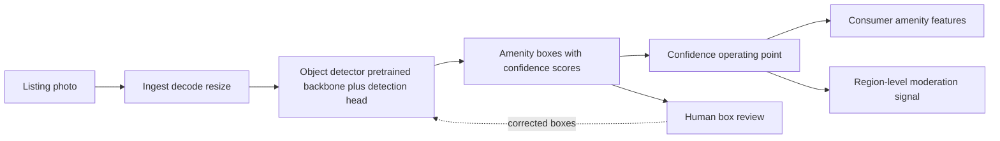

**Interview questions this design invites**
- When do you choose detection over classification for an amenity feature?
- Why is mAP at IoU thresholds the metric, and how do you pick the operating confidence?
- Bounding-box labels are expensive; how do you cut labeling cost with active learning?
- How does a detector help catch small-region moderation harms a classifier misses?
- How do you handle amenities that appear at wildly different scales in a photo?
- How would you share a backbone between the room classifier and the detector?

**Tricks and gotchas**
- Box labeling cost dominates; a small noisy label budget caps the achievable mAP.
- A single confidence threshold trades precision for recall differently per amenity class.
- Rare amenities have few boxes, so mAP can look fine while tail classes are near zero.
- Non-max suppression settings materially change precision on cluttered indoor scenes.

**Common mistakes and how to fix them**
- Using classification for a localization job: pick detection when position or small regions matter.
- Optimizing accuracy: report mAP at IoU and precision-recall at the chosen operating point.
- Random-sample labeling: prioritize uncertain and disagreed-on images via active learning.
- One model per task: share one backbone with multiple heads to cut serving cost.

### Meta FAIR: Mask R-CNN instance segmentation ([source](https://ai.meta.com/research/publications/mask-r-cnn/))

Mask R-CNN extends Faster R-CNN by adding a third branch that predicts a per-object binary mask in parallel with the existing box-classification and box-regression branches, turning a detector into an instance-segmentation framework. Its key fix is RoIAlign, which replaces the coarse RoIPool quantization with bilinear sampling so mask features stay pixel-aligned, the change that makes fine masks possible. The design is deliberately simple and generalizes: the same framework does detection, instance segmentation, and human-keypoint estimation, and it won all three tracks of the COCO 2016 challenge while running around 5 fps with little overhead over Faster R-CNN. Reported quality is COCO mask AP, the standard eval bar for instance segmentation.

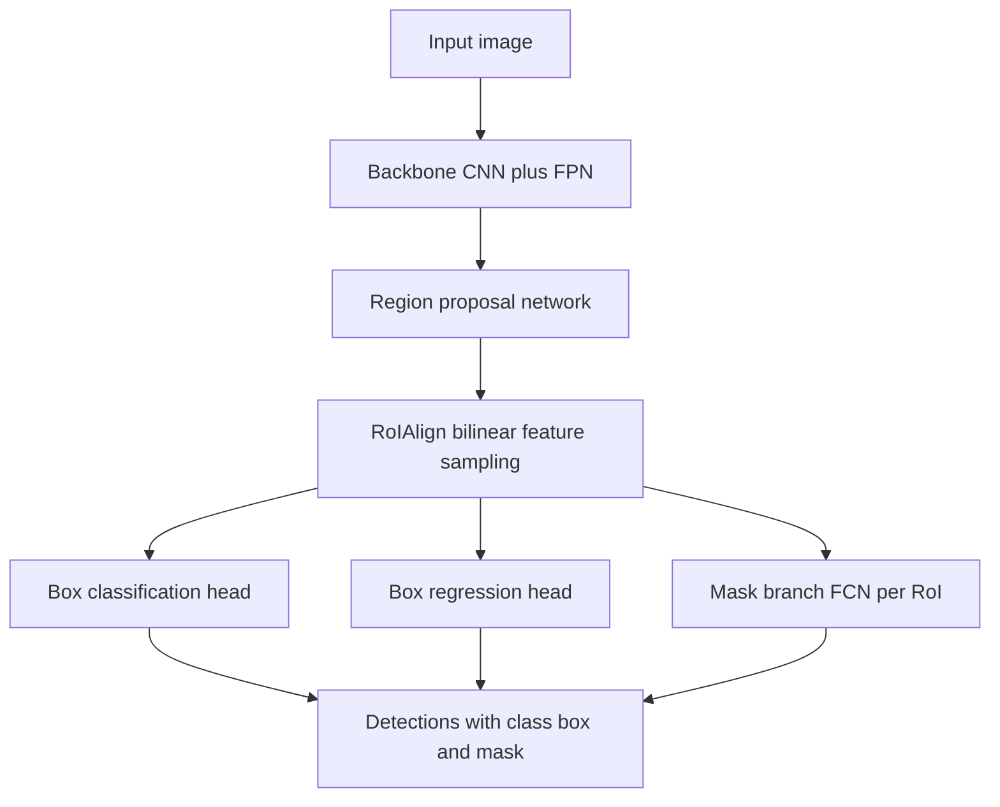

**Interview questions this design invites**
- Why does RoIPool hurt masks and how does RoIAlign fix the misalignment?
- Why predict the mask in a separate branch instead of coupling it to class scores?
- How is COCO mask AP computed and why is it stricter than box AP?
- When do you need instance segmentation over detection or semantic segmentation?
- How does adding the mask branch affect inference latency versus Faster R-CNN?
- How would you extend the same framework to keypoint or pose estimation?

**Tricks and gotchas**
- Decoupling mask and class prediction avoids inter-class competition in the mask branch.
- RoIAlign sampling points and pooling resolution directly control boundary quality.
- Masks are predicted per RoI at low resolution then upsampled; small objects suffer most.
- An FPN backbone is what lets one head handle objects across many scales.

**Common mistakes and how to fix them**
- Keeping RoIPool: switch to RoIAlign for any pixel-accurate output.
- Sharing mask logits across classes: predict a binary mask per class independently.
- Evaluating with box AP only: report mask AP since it reflects segmentation quality.
- Ignoring scale: add an FPN so small and large instances both get good features.

### Dropbox: indexing text from billions of images ([source](https://dropbox.tech/machine-learning/using-machine-learning-to-index-text-from-billions-of-images))

Dropbox built a multi-stage OCR pipeline to make text inside 20B+ stored images and PDFs searchable for Professional and Business users. The flow is a chain of models rather than one classifier: a lightweight document classifier (a linear head on pretrained ImageNet features) decides whether an image is OCR-able, a DenseNet-121 corner detector rectifies the page in a two-step coarse-then-refine pass, and an OCR engine extracts word tokens with bounding boxes for the index. It runs asynchronously on Dropbox's Cape event framework atop the existing PDFium preview infrastructure, processing only the first 10 pages per PDF (about 90 percent of documents fully covered). Engineering wins included swapping Inception-ResNet-v2 for DenseNet-121 for a 2x corner-detection speedup and disabling TensorFlow multicore to cut context-switching for roughly 3x throughput.

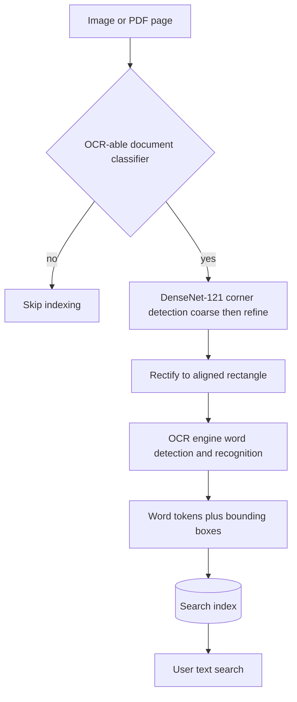

**Interview questions this design invites**
- Why split this into classify then corner-detect then OCR instead of one end-to-end model?
- Why gate with a cheap document classifier before running expensive OCR?
- How does the coarse-then-refine corner detector improve accuracy over a single pass?
- What is the throughput and cost tradeoff behind processing only the first 10 pages?
- How do you choose a backbone like DenseNet-121 on a latency and cost budget?
- How do you keep the search index fresh as new documents arrive?

**Tricks and gotchas**
- Only 9 percent of JPEGs and 28 percent of PDF pages carry indexable text, so the gate saves huge compute.
- Disabling TensorFlow multicore removed context-switch overhead for a 3x throughput gain.
- Corner detection and rectification matter because skewed pages destroy OCR recognition.
- Asynchronous event processing keeps this heavy pipeline off any user-facing latency path.

**Common mistakes and how to fix them**
- Running OCR on every image: add a cheap classifier gate first to skip non-documents.
- Feeding un-rectified skewed pages to OCR: detect corners and warp to a clean rectangle.
- Picking the heaviest backbone by default: benchmark lighter nets like DenseNet-121 for equal accuracy at 2x speed.
- Naive multicore config: profile it, since disabling threads can beat it under high concurrency.

### Pinterest: unified multi-task visual embeddings ([source](https://medium.com/pinterest-engineering/unifying-visual-embeddings-for-visual-search-at-pinterest-74ea7ea103f0))

Pinterest replaced three separate per-product visual-search models with one multi-task embedding that serves Lens (camera to Pin), Visual Cropper (Pin to Pin), and Shop the Look (exact product match). A shared SE-ResNeXt backbone branches into three task-specific heads, trained together with proxy-based metric learning where image embeddings are scored against learned label proxies in a classification loss, avoiding costly negative mining. The three application datasets are uniformly blended in each minibatch, and training uses PyTorch DistributedDataParallel with FP16 mixed precision. Embeddings are binarized for efficient large-scale serving into an offline index, and both offline retrieval and online A/B tests beat the specialized single-task models on relevance and engagement (repins, clickthroughs) while collapsing three systems into one to maintain.

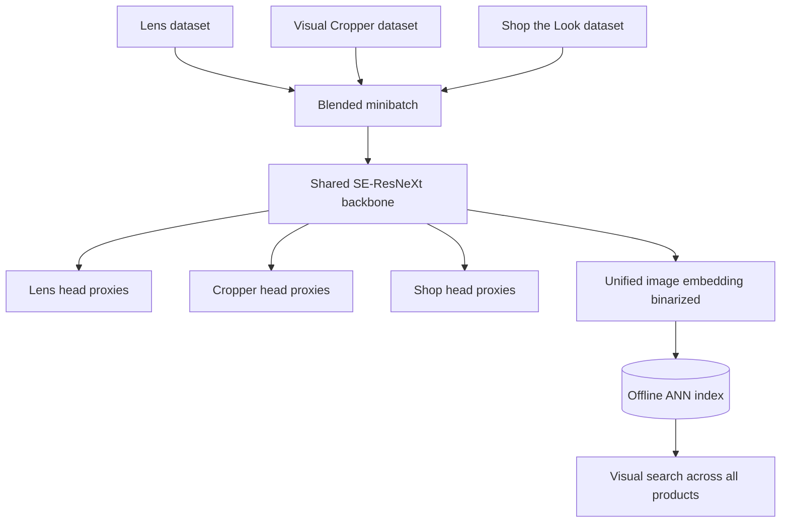

**Interview questions this design invites**
- Why does one shared multi-task embedding beat three specialized single-task models?
- What is proxy-based metric learning and why does it avoid negative sampling?
- How does blending datasets uniformly per minibatch affect the shared backbone?
- Why binarize embeddings, and what recall cost does that impose?
- How do you A/B test an embedding change when many surfaces depend on it?
- How do you re-index the whole catalog when you retrain the embedding?

**Tricks and gotchas**
- Sharing one trunk means a trunk improvement lifts every downstream surface at once.
- Proxy loss sidesteps hard-negative mining, which is expensive at catalog scale.
- Binarized embeddings cut memory and latency but must be validated for recall loss.
- Multi-task blending can let a dominant dataset skew the shared representation.

**Common mistakes and how to fix them**
- Maintaining a model per surface: unify into one multi-task embedding to cut cost and debt.
- Optimizing offline retrieval only: confirm the win with an online engagement A/B test.
- Forgetting re-embedding cost: budget the offline catalog rebuild when the model changes.
- Uneven dataset mixing: blend uniformly per minibatch so no task dominates the trunk.

### Zalando: Shop the Look visual product matching ([source](https://engineering.zalando.com/posts/2018/09/shop-look-deep-learning.html))

Zalando prototyped visual search that finds catalog articles from a query photo, because words alone poorly describe fashion. The clean-background model, Studio2Shop, is a ConvNet that matches a fashion image against products represented as FashionDNA feature vectors rather than raw images, covering eight garment categories and evaluated over 20,000 queries against 50,000 articles. For real-world snapshots they add a two-stage Street2Fashion2Shop pipeline: a U-Net segmentation model first removes the background by replacing it with white pixels, then the same matching architecture retrieves products from the cleaned image. Training mixed Zalando's annotated imagery with public datasets like Chictopia, and the system generalized to DeepFashion without fine-tuning, prioritizing stylistic similarity over exact-match precision.

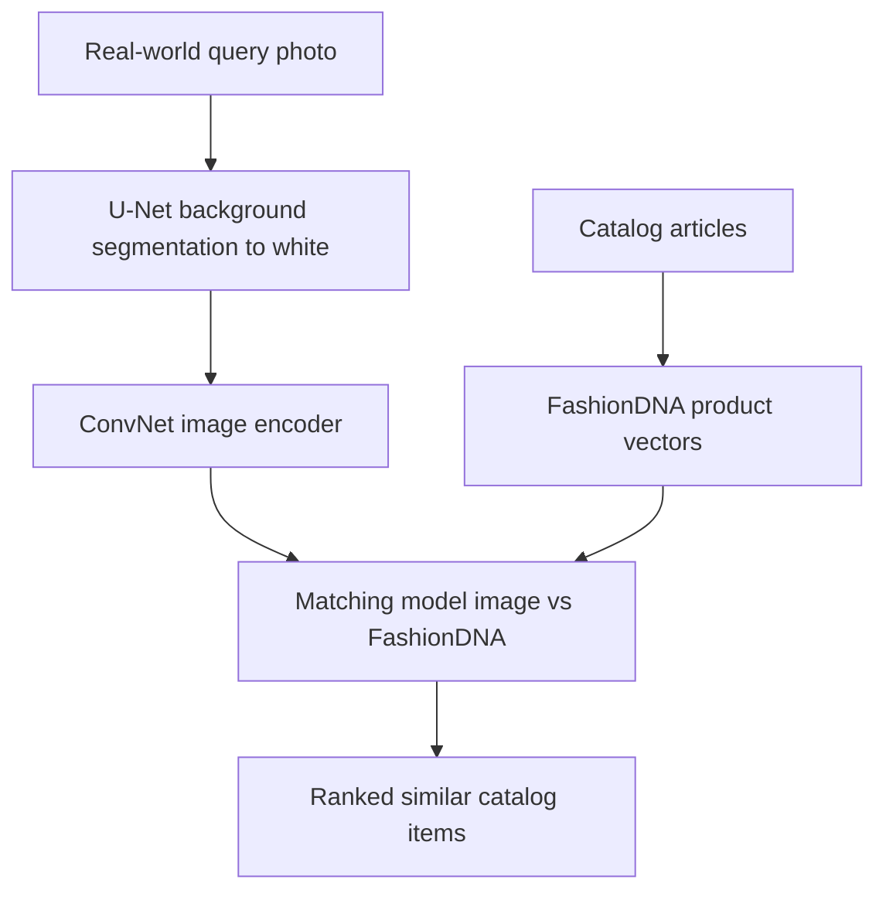

**Interview questions this design invites**
- Why segment out the background before matching real-world fashion photos?
- Why represent catalog products as FashionDNA vectors instead of images?
- How do you evaluate retrieval when customers accept stylistically similar, not exact, items?
- Why does the clean-background model reuse the same matching architecture after segmentation?
- How does the system generalize to an unseen dataset like DeepFashion without fine-tuning?
- What are the tradeoffs of a two-stage segment-then-match pipeline versus end-to-end?

**Tricks and gotchas**
- Backgrounds in street photos inject noise; whitening them aligns queries with clean catalog shots.
- Exact-match precision is the wrong bar when users prefer similar alternatives.
- The two-stage pipeline lets you reuse the clean-background matcher on segmented inputs.
- Product feature vectors decouple matching from raw catalog imagery and speed retrieval.

**Common mistakes and how to fix them**
- Matching raw street photos directly: segment the garment first to remove background noise.
- Chasing exact-match accuracy: measure qualitative similarity that reflects buyer intent.
- Training on clean images only: include real-world and public datasets for generalization.
- Coupling matching to raw images: encode products into stable feature vectors instead.

### Netflix: pixel error detection for video QC ([source](https://netflixtechblog.com/accelerating-video-quality-control-at-netflix-with-pixel-error-detection-47ef7af7ca2e))

Netflix automated the tedious hunt for pixel-level defects (bright hot pixels and dead pixels from sensor faults) that previously forced QC teams to eyeball every frame, cutting review from hours to minutes per shot. The model ingests five consecutive frames at full resolution, since downsampling would erase the single-pixel errors, and outputs a continuous pixel-error map at input resolution trained with a dense pixel-wise loss. The temporal window lets it separate real sensor glitches from naturally bright objects like reflections. Because real errors are rare, Netflix trained on a synthetic error generator that superimposes symmetric and curvilinear artifacts onto dark still regions of catalog frames, then iteratively fine-tuned by removing false positives on real footage. At inference the map is thresholded and connected-component labeling reports error cluster centroids, running in real time on a single GPU with high recall as the priority.

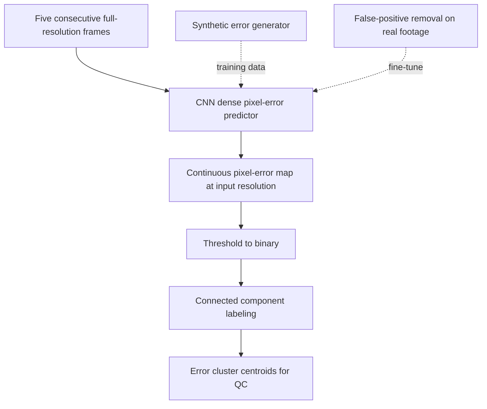

**Interview questions this design invites**
- Why feed five frames at full resolution instead of a single downsampled frame?
- How does temporal context distinguish a hot pixel from a bright reflection?
- Why synthesize training errors, and how do you keep them realistic?
- Why prioritize recall over precision in a QC gate feeding human reviewers?
- How does connected-component post-processing turn a pixel map into actionable defects?
- How do you keep a full-resolution model real-time on one GPU?

**Tricks and gotchas**
- Downsampling destroys the very single-pixel signal you are trying to detect.
- Rare positives force synthetic data generation rather than natural collection.
- Superimposing artifacts on dark still regions mimics where real sensor errors appear.
- Iterative false-positive removal on real footage is what closes the synthetic-to-real gap.

**Common mistakes and how to fix them**
- Resizing inputs for speed: keep full resolution so pixel-level defects survive.
- Single-frame models: use a temporal window to reject bright-but-valid content.
- Training on scarce real errors only: augment with a synthetic error generator.
- Stopping at a raw heatmap: add thresholding and connected components for usable outputs.

### Netflix: in-video search with image-text embeddings ([source](https://netflixtechblog.com/building-in-video-search-936766f0017c))

Netflix built an internal tool that lets editors search the entire catalog for visual moments (an exploding car, a specific expression, seasonal scenery) using natural-language queries. It uses contrastive image-text learning in the CLIP family, training on video-clip and text-description pairs with a symmetric cross-entropy loss that pulls matching pairs together and pushes mismatches apart; extending from frame-level to video-level embeddings gave a 15 to 25 percent retrieval improvement. Serving is precompute-heavy: CPU-bound shot segmentation feeds distributed GPU embedding via Ray Train, embeddings land in Netflix's media feature store and are replicated to Elasticsearch, and at query time the text tower encodes the query for a nearest-neighbor lookup. It supports catalog-wide or per-show search, text-to-video and video-to-video retrieval, and re-embeds automatically as new content lands.

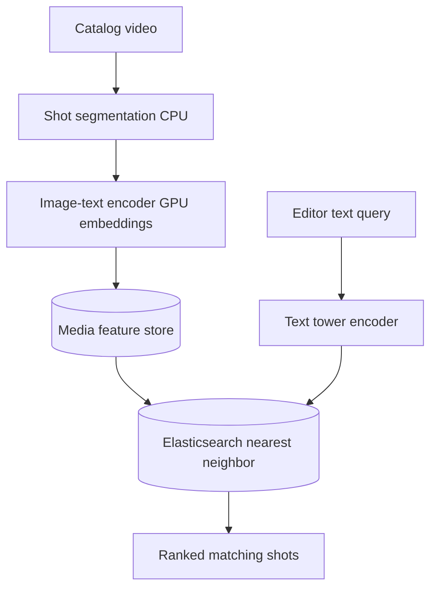

**Interview questions this design invites**
- Why does contrastive image-text training enable text-to-video search?
- Why precompute clip embeddings offline instead of embedding at query time?
- What does moving from frame-level to video-level embeddings buy you?
- Why serve nearest-neighbor lookups through Elasticsearch here?
- How do you measure recall on text queries against a labeled relevance set?
- How do you keep the index current as new titles are added?

**Tricks and gotchas**
- Shot segmentation is CPU-heavy and can starve the GPU embedding stage if not pipelined.
- A shared image-text space lets one index answer both text and image queries.
- Video-level pooling captures motion cues that single frames miss, worth 15 to 25 percent.
- Streaming shots from S3 during inference keeps the GPU fed for throughput.

**Common mistakes and how to fix them**
- Embedding at query time: precompute and index so query latency is one text pass plus ANN.
- Frame-only embeddings: aggregate to video level to capture temporal content.
- Separate text and image pipelines: train one joint space so both query modes share an index.
- Ignoring re-embedding: automate re-indexing when new content arrives.

### Google Research: mapping Africa's buildings from satellite imagery ([source](https://research.google/blog/mapping-africas-buildings-with-satellite-imagery/))

Google trained a U-Net semantic segmentation model to detect building footprints across Africa, chosen because its compact architecture keeps the compute burden manageable over billions of tiles. The pipeline first classifies each pixel as building or non-building, then groups connected components into individual structures with simplified polygon footprints and Plus Codes. Training used 1.75M manually annotated buildings across 100,000 images, with labeling policies for hard cases like round thatched huts versus trees and dense compounds. Three techniques drove quality: distance-weighted edge loss to stop adjacent buildings merging (the largest ablation effect at -0.33 mAP), mixup regularization, and Noisy Student self-training on 8.7M unlabeled images to cut false positives. Evaluated with precision-recall at 0.5 IoU across terrain types, the system mapped 516M structures over 8.6B tiles and 19.4M square km.

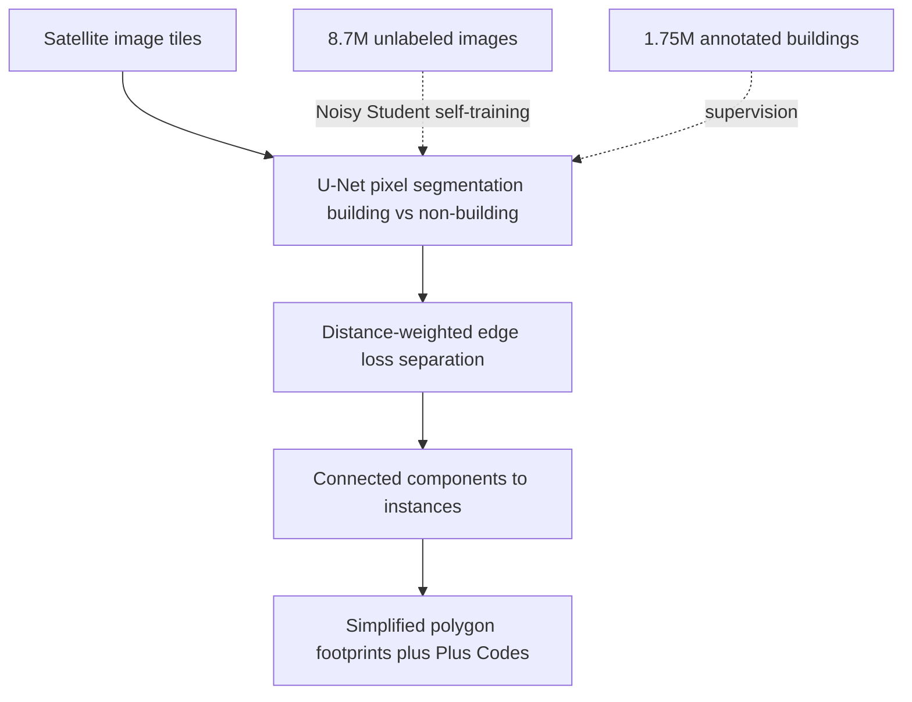

**Interview questions this design invites**
- Why pick the compact U-Net over a heavier segmentation model at continental scale?
- What is distance-weighted edge loss and why is it the biggest quality lever here?
- How does Noisy Student self-training on unlabeled tiles reduce false positives?
- Why report precision-recall at 0.5 IoU sliced by terrain rather than one aggregate?
- How do you set labeling policy for ambiguous cases like huts versus trees?
- How do you turn a pixel mask into discrete building instances with footprints?

**Tricks and gotchas**
- Without edge weighting the model merges adjacent buildings into blobs.
- Sparse rural labeling errors and desert backgrounds drive most residual error.
- Large urban buildings tend to fragment, hurting instance separation.
- Confidence scores per detection let downstream users pick their precision-recall point.

**Common mistakes and how to fix them**
- Reporting one aggregate metric: slice precision-recall by terrain to expose weak regions.
- Standard cross-entropy that merges neighbors: add distance-weighted edge loss.
- Relying only on scarce labels: exploit unlabeled tiles via self-training.
- Loose labeling policy: define explicit rules for compounds, huts, and dense clusters.

### Google Research: diabetic retinopathy detection from retinal photos ([source](https://research.google/blog/deep-learning-for-detection-of-diabetic-eye-disease/))

Google trained a deep convolutional network to detect referable diabetic retinopathy (moderate-or-worse disease plus macular edema) from 2D retinal fundus photographs, targeting regions where specialists to read them are scarce among the 415M people with diabetes. The model learned from 128,000 images, each graded by three to seven ophthalmologists drawn from a 54-specialist panel, with consensus across multiple independent graders forming the ground truth rather than a single reader. On a 9,963-image validation set it reached an F-score of 0.95, slightly above the 0.91 median of eight board-certified validators, and was checked on two cohorts totaling roughly 12,000 images against high-consistency reference graders. The team emphasized ongoing FDA and clinical-partner work to integrate screening into real workflows.

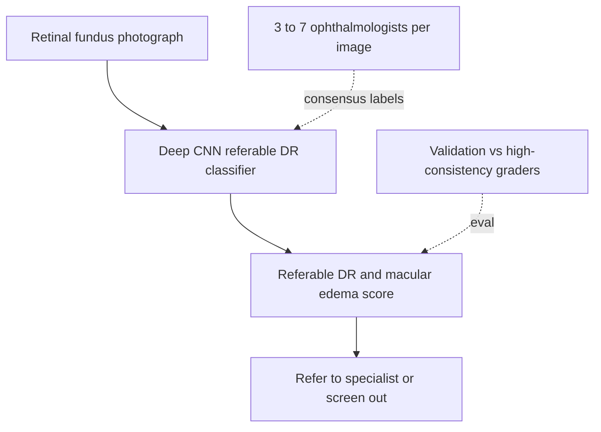

**Interview questions this design invites**
- Why use multi-grader consensus instead of single-ophthalmologist labels?
- Why is F-score the headline metric and how does it compare to human graders?
- What defines the referable threshold and what is the cost of a miss in screening?
- How do you validate a clinical model across multiple independent cohorts?
- How do you handle inter-grader disagreement when building ground truth?
- What deployment and regulatory steps gate a model like this before real use?

**Tricks and gotchas**
- Ground-truth quality is bounded by grader agreement, so consensus is essential.
- A model matching median-grader F-score still needs cohort validation before trust.
- Referral screening favors recall, since missing referable disease is the costly error.
- High-consistency reference graders define a stricter benchmark than average readers.

**Common mistakes and how to fix them**
- Single-grader labels: use multi-grader consensus to stabilize noisy ground truth.
- Reporting accuracy on imbalanced disease data: use F-score against expert graders.
- Validating on one dataset: test across separate cohorts and reference standards.
- Treating high offline metrics as launch-ready: pursue clinical and regulatory validation first.

### Bumble: Private Detector for unsolicited lewd images ([source](https://medium.com/bumble-tech/bumble-inc-open-sources-private-detector-and-makes-another-step-towards-a-safer-internet-for-women-8e6cdb111d81))

Bumble built Private Detector to fight cyberflashing by automatically detecting and blurring unsolicited lewd images before a user sees them, a real-time moderation gate on the message path. The classifier is an EfficientNetV2-based binary CNN whose MBConv and FusedMBConv blocks give faster training and better parameter efficiency, letting it run as a low-latency gate. Training curated both lewd and non-lewd images, deliberately selecting hard negatives such as legs and arms so ordinary body parts are not flagged, and reached over 98 percent accuracy in both offline and production settings with no apparent precision-recall tradeoff. In October 2022 Bumble open-sourced the code, a ready-to-serve TensorFlow SavedModel, and training checkpoints under Apache license.

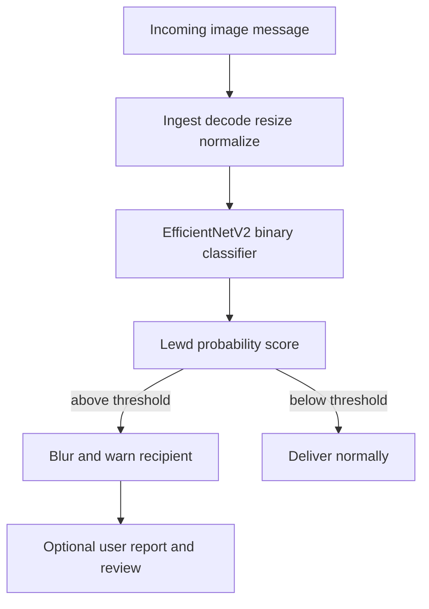

**Interview questions this design invites**
- Why does a real-time moderation gate need an efficient backbone like EfficientNetV2?
- Why report accuracy at a fixed precision and recall rather than accuracy alone?
- How do hard negatives like arms and legs prevent false positives on ordinary photos?
- What is the fail-open versus fail-closed policy if the classifier times out?
- How would adversarial cropping or overlays evade a whole-image classifier here?
- What does open-sourcing a moderation model with checkpoints change for defenders and attackers?

**Tricks and gotchas**
- Curating hard negatives (non-lewd body parts) is what keeps false-positive rate low.
- MBConv and FusedMBConv blocks trade a little accuracy for the speed a gate needs.
- A single accuracy number hides the operating point; state precision and recall.
- A real-time gate must define behavior on timeout rather than silently pass content.

**Common mistakes and how to fix them**
- Random negatives: mine hard negatives like limbs so benign images are not flagged.
- Heavy backbone on the gate: pick an efficient net so latency stays within budget.
- Reporting accuracy only: publish recall at a fixed precision floor for a harm class.
- Trusting the model as the sole line: pair it with user reporting and human review.

### Company: Cars24 blur classifier for used-car listing photos ([source](https://medium.com/cars24-data-science-blog/blur-classifier-image-quality-detector-7c1de5ff8e59))

Cars24 gates used-car inspection and listing photos on sharpness before they flow into downstream defect and damage models, since a blurry frame silently degrades those models rather than announcing itself. Notably the production choice was not a deep CNN but a lightweight signal-processing pipeline: convert to YUV, take the Y (luminance) channel, split it into 8x8 non-overlapping blocks, run a Discrete Cosine Transform per block, and summarize the low, medium, and high frequency bands with statistics like mean, variance, kurtosis, skewness, entropy, and energy. That yields 18 features per image fed to a traditional binary classifier (sharp vs blurry). The intuition: a sharp image carries real energy in medium and high DCT frequencies, while blur collapses that energy into the low band. It hits about 91 percent test accuracy and scores a 1080x1920 image in roughly 12 ms on a single CPU core, cheap enough to sit inline before any GPU model runs.

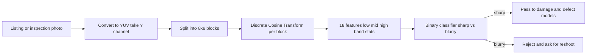

**Interview questions this design invites**
- Why gate downstream defect models on image quality instead of letting them absorb blur?
- Why does DCT band energy separate sharp from blurred images?
- When is a hand-crafted DCT feature pipeline preferable to a CNN blur detector?
- Why operate on the Y luminance channel rather than full RGB?
- How do you pick the blur threshold given the cost of a false reject versus a false pass?
- How would you keep this robust to motion blur versus out-of-focus blur?

**Tricks and gotchas**
- Blur pushes image energy into the low DCT band, so high-frequency energy is the discriminating signal.
- A 12 ms single-core cost is what lets the gate run inline ahead of expensive GPU models.
- Using only the Y channel drops chroma noise and cuts compute with little accuracy loss.
- A single global threshold trades false rejects (annoyed sellers) against false passes (bad data downstream); tune per the downstream cost.

**Common mistakes and how to fix them**
- Reaching for a heavy CNN first: a DCT plus classical classifier can hit target accuracy at a fraction of the latency.
- Running defect models on unfiltered photos: add a cheap quality gate so garbage frames never reach them.
- Scoring on full RGB: convert to YUV and use luminance to reduce noise and cost.
- Reporting only aggregate accuracy: state the false-reject rate too, since it directly annoys sellers.

### Company: Shopify multimodal product categorization at scale ([source](https://shopify.engineering/using-rich-image-text-data-categorize-products))

Shopify auto-classifies millions of merchant products into the Google Product Taxonomy, a 7-level hierarchy with 5,500-plus categories, to power search, discovery, and merchant insight. Because a product carries both words (title, description, vendor, tags, collections) and a photo, the model is multimodal: Multilingual BERT encodes the text, MobileNet-V2 encodes the image, the two embeddings are concatenated and pushed through shared hidden layers, then split into seven separate softmax heads, one per taxonomy level. Training treats each level as its own classification problem and deliberately imposes no hard hierarchy constraint, so a confident child prediction can back-propagate and correct a shaky parent. At serve time the opposite holds: predictions are constrained top-down (a child must live under the chosen parent) and each level gets smart thresholding to drop low-confidence guesses. The 250M-parameter model, trained distributed on GCP with class weighting for imbalance, delivered an 8 percent leaf-precision lift while doubling coverage.

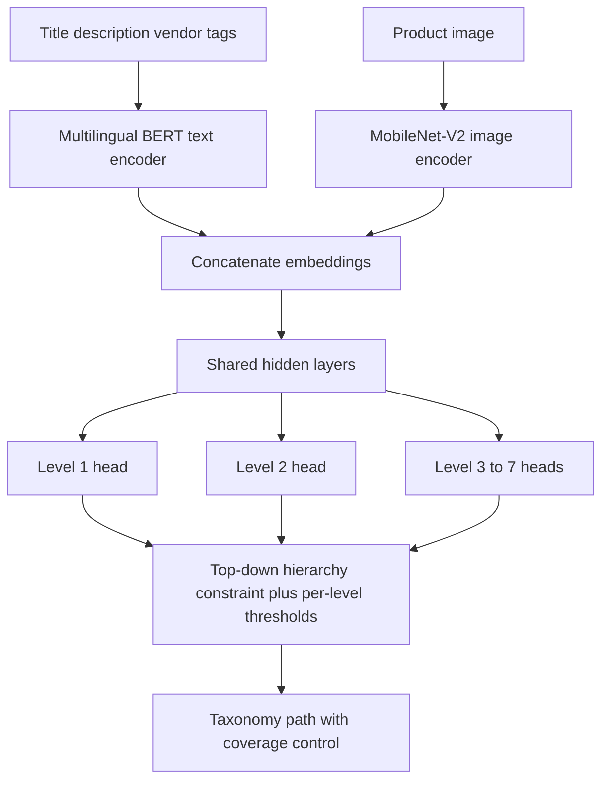

**Interview questions this design invites**
- Why fuse image and text instead of classifying on either modality alone?
- Why train with soft (unconstrained) hierarchy but serve with hard top-down constraints?
- How do seven per-level heads compare to one flat 5,500-way classifier?
- What is coverage here and why report it alongside precision and recall?
- How does class weighting address severe imbalance across taxonomy leaves?
- Why MobileNet-V2 for images and BERT for text rather than a single heavier joint model?

**Tricks and gotchas**
- Letting child predictions correct parents during training exploits stronger signal at deeper levels.
- Per-level thresholding is what lets you trade coverage for leaf precision cleanly.
- Concatenation fusion is simple but a dominant modality can drown the weaker one; class weighting and balanced data help.
- A flat classifier over 5,500 leaves is brittle; per-level heads localize the errors.

**Common mistakes and how to fix them**
- Text-only categorization: add an image encoder so ambiguous titles get visual disambiguation.
- Forcing hard hierarchy during training: leave it soft so deeper heads can fix parent mistakes.
- Optimizing precision while ignoring coverage: report both, since a precise model that predicts nothing is useless.
- Uniform class treatment on a long-tailed taxonomy: apply class weighting to rescue rare leaves.

### Company: Uber real-time document check for rider ID verification ([source](https://www.uber.com/en-GB/blog/ubers-real-time-document-check/))

Uber verifies rider identity from government documents in real time across 11-plus countries, splitting the work between an on-device quality model and server-side verification. On the phone, a quantized TensorFlow Lite multi-task CNN scores each camera frame for missing ID, truncation, blur, and glare through a shared feature extractor, driving an auto-capture that only fires when the frame is good enough, cutting user friction and bad uploads. After upload, the server runs document classification and fraud detection (a third-party vendor plus an in-house OCR-and-object-detection stack for Brazilian documents that reads character-level text and locates key fields), with a human-in-the-loop path for low-confidence cases resolved typically in under 90 seconds. The split matters: the on-device gate keeps latency low and privacy tighter, while heavier fraud and transcription logic stays server-side with encryption, access control, and region-based retention. Over a million IDs were verified, and the same stack extended to alcohol-delivery and moped-license checks.

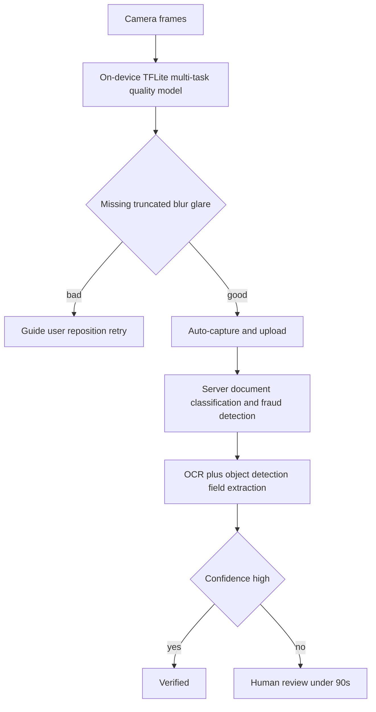

**Interview questions this design invites**
- Why put the image-quality model on-device but keep fraud detection server-side?
- Why use multi-task learning to detect blur, glare, truncation, and missing ID in one model?
- How does auto-capture on a quality threshold reduce downstream rejects?
- Why quantize the on-device model and what accuracy cost does that carry?
- How do you design a human-in-the-loop path that resolves in under 90 seconds?
- How do you handle multiple valid ID versions circulating in one country?

**Tricks and gotchas**
- A shared feature extractor lets one small model answer four quality questions at once.
- Auto-capture only on good frames pushes quality control to the edge and shrinks server load.
- Quantization is what makes the model fit real-time on mid-range phones.
- Region-based retention and encryption are non-optional for government ID data.

**Common mistakes and how to fix them**
- Uploading every frame to the server: gate on-device so only capture-worthy frames leave the phone.
- One model per quality defect: use multi-task learning with a shared trunk instead.
- Full automation on low-confidence documents: route them to fast human review.
- Ignoring document-version drift: maintain templates for every valid ID variant per country.

### Company: Canva Shape Assist for hand-drawn shape recognition ([source](https://www.canva.dev/blog/engineering/ship-shape/))

Canva's Draw tool turns rough hand-drawn scribbles into clean vector shapes using a tiny model that runs entirely in the browser. The key design choice is the input representation: instead of rasterizing the drawing to pixels and using a CNN, they keep the stroke as a sequence of (x, y) coordinates and feed it to a single LSTM layer (100 hidden units) plus one fully connected layer, only 64,109 parameters, about 250 KB. Each stroke is normalized with Ramer-Douglas-Peucker simplification (which preserves sharp corners while removing drawing-speed jitter) and resampled to 25 interpolated points, then augmented with point jittering and stroke reversal, cheap operations that a pixel representation could not do as cleanly. The output uses sigmoid activations over 9 shape classes rather than softmax, so a scribble that matches nothing well can be rejected instead of forced into a class. Inference finishes in under 10 ms client-side and works fully offline, and a template-matching pass with 15-degree rotation increments snaps the recognized shape to a clean vector.

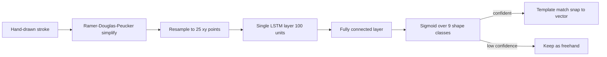

**Interview questions this design invites**
- Why represent the drawing as a coordinate sequence instead of a pixel image?
- Why choose an LSTM over a CNN for stroke recognition?
- Why sigmoid outputs rather than softmax over the 9 classes?
- How does Ramer-Douglas-Peucker simplification help before resampling to fixed length?
- How do you get inference under 10 ms fully in the browser?
- Why keep the model at 64K parameters when a bigger model would score higher?

**Tricks and gotchas**
- Stroke coordinates enable jitter and reversal augmentation that pixel images cannot do as cleanly.
- Sigmoid outputs let the model reject an ambiguous scribble instead of forcing a class.
- RDP preserves sharp corners while stripping drawing-speed jitter before fixed-length resampling.
- A 250 KB model is what makes fully offline, sub-10 ms in-browser inference possible.

**Common mistakes and how to fix them**
- Rasterizing strokes to pixels: keep the coordinate sequence to shrink the model and enable geometric augmentation.
- Softmax that forces every scribble into a class: use per-class sigmoids so low-confidence input is rejected.
- Feeding raw variable-length strokes: simplify with RDP then resample to a fixed point count.
- Shipping a server round-trip: run the tiny model client-side for offline, instant response.
_Not reachable: none_
